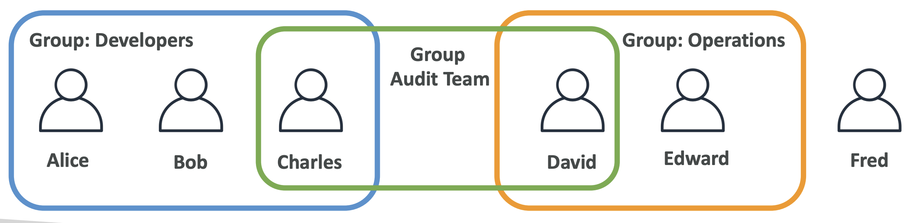
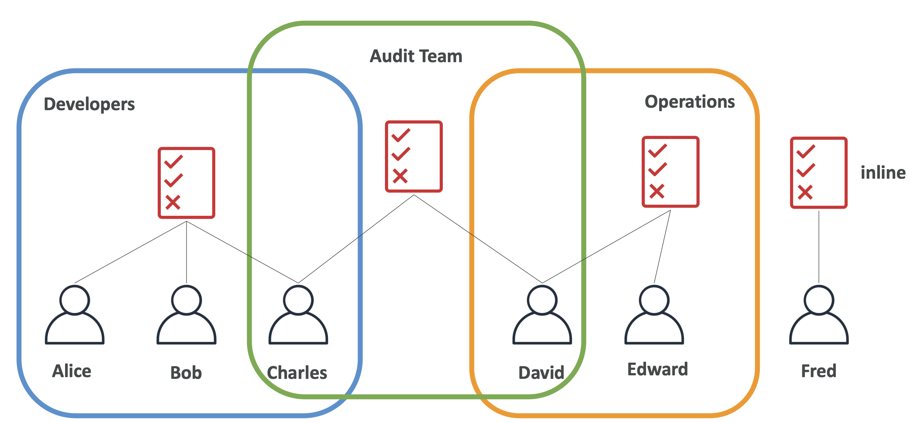
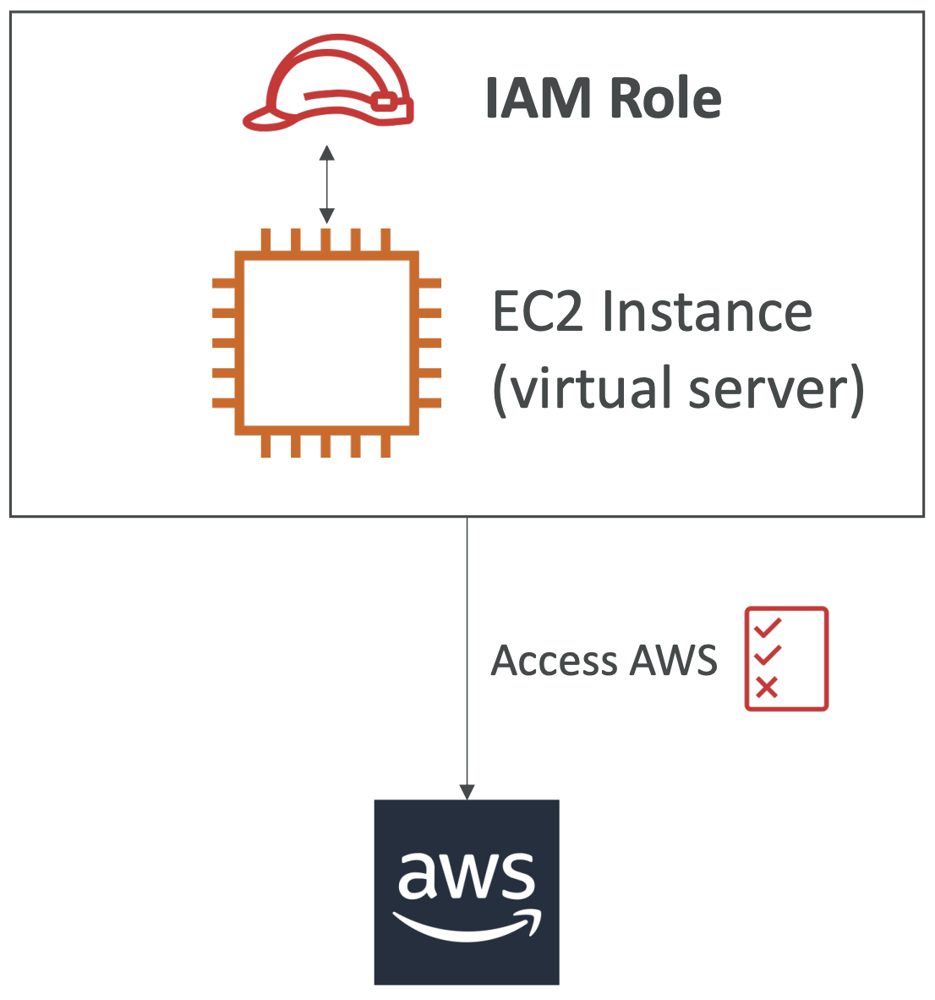

## IAM : Users & Groups

- Idendity and Access Management
- 글로벌 서비스이다.
- 루트 계정은 기본적으로 생성되며, 사용되거나 공유되지 않도록 해야한다
- 유저는 조직의 사람들이며, 그룹화될 수 있다
- 그룹은 사용자만 포함할 수 있으며 다른 그룹을 포함할 순 없다
- 유저는 그룹에 속해있지 않아도 되고, 여러개의 그룹에 속해있어도 된다.



---

---

### IAM : 권한

- 유저 및 그룹은 젗갱이라고 불리는 Json 문서를 할당받을 수 있다
  - 정책은 유저에게 권한을 정의한다
- AWS는 최소한의 권한만을 주는걸 권장한다
  - 유저에게 필요 이상의 권한을 주지 말라

**권한 정책 예시**
```json
{
  "Version": "2012-10-17",
  "Statement": [
    {
      "Effect": "Allow",
      "Action": "ec2:Describe*",
      "Resource": "*"
    },
    {
      "Effect": "Allow",
      "Action": "elasticloadbalancing:Describe*",
      "Resource": "*"
    },
    {
      "Effect": "Allow",
      "Action": [
        "cloudwatch:ListMetrics",
        "cloudwatch:GetMetricStatistics",
        "cloudwatch:Describe*"
      ],
      "Resource": "*"
    }
  ]
}
```

> IAM 정책 상속 예시
> 
> 


---

### IAM - 비밀번호 정책

- 강한 비밀번호 = 강한 보안
- AWS에서는 다음과 같은 비밀번호 정책을 설정할 수 있다
  - 최소 비밀번호 길이
  - 특정 문자 타입 요구
    - 대문자
    - 소문자
    - 숫자
    - 특수문자
  - 모든 IAM 유저에게 비밀번호 변경 허락
  - 비밀번호 만료기간을 설정하여 유저에게 비밀번호 변경 요구
  - 동일한 비밀번호로 변경 금지

---

## MFA

- Multi Factor Authentication
- 유저는 계정에 접근할 수 있으며 AWS계정의 구성을 변경하거나 리소스를 삭제할 수 있다.
- 루트 계정과 IAM 유저를 보호하기 위해 MFA를 사용할 수 있다
- MFA = 비밀번호 + 보안장비
- MFA를 사용하면 해커가 비밀번호를 알아내도 계정에 접근할 수 없다

---

### MFA 장비

- 휴대폰 OTP, USB 등 여러 장비를 설정할 수 있다.

---

### 유저가 AWS에 접근하는 방법

- AWS에 접근하기 위해 세가지 옵션이 있다
  - AWS Management console. (비밀번호 + MFA로 보호됨)
  - AWS Command Line Interface. (Access Key로 보호됨)
  - AWS SDK. (코드에서 사용. Access Key로 보호됨)
- Access Key는 AWS 콘솔로 만들 수 있다
- 유저는 각각 자신의 Access Key를 관리하게 된다
- **Access Key는 비밀번호 마찬가지로 공유돼서는 안된다**
  - Access Key ID ~= ID
  - Secret Access Key != Password

---

## AWS CLI

- CLI로 AWS서비스에 접근할 수 있는 도구
- AWS 서비스의 공개 API에 직접 접근이 가능하다
- AWS CLI를 이용하여 자원을 관리하기 위한 스크립트를 만들 수도 있다.
- AWS 웹 관리 서비스 (AWS Management Console)을 대체 가능하다

---

## AWS SDK

- AWS Software Development Kit
- 언어에 특화된 API를 제공한다 (라이브러리)
- 프로그래밍 방식으로  AWS 서비스에 접근 및 관리가 가능하다
- 어플리케이션에 내장되어 있다
- 지원항목
  - SDKs (JavaScript, Python, PHP, .NET, Ruby, Java, Go, Node.js, C++)
  - 모바일 SDKs (Android, iOS, ...)
  - IoT 장비 SDKs (Embeddes C, Arduino, ...)

---

## IAM Roles for Services

 - 일부 AWS 서비스는 사용자를 대싱하여 작업을 수행해야 한다
 - 이를 위해 IAM Role이 있는 AWS 서비스에 권한을 할당한다
 - 공통 Role
   - EC2 Instance Roles
   - Lambda Function Role
   - Roles for CloudFormation



---

## IAM 보안 도구

- IAM 자격증명 보고서 (account-level)
  - 계정에 속해있는 모든 유저와 그들의 다양한 상태에 대한 보고서

- IAM Access Advisor (user-level)
  - Access Advisor는 유저에 부여된 관한과 그들이 마지막으로 언제 이 서비스에 접근했는지를 보여준다
  - 이 정보는 정책을 수정할때 유용하게 사용된다.

---

## IAM 가이드라인 & Best Practice

- AWS 계정을 설정할 때 이외에 루트 계정을 사용하지 말라
- 한 사람당 하나의 유저 사용하고, 한 사람이 여러개의 유저 사용하지 말라
- 개개인에게 권한을 할당하기보다, **유저를 그룹에 할당**하고 그룹에 권한을 할당하라
- **강한 비밀번호 규칙**을 적용해라
- 보안을 강화하기 위해 MFA를 사용하라
- AWS 서비스에 권한을 부여하기 위해 **Roles**를 생성 및 사용하라
- 프로그래밍적 접근을 위해 Access Key를 사용하라 (CLI / SDK)
- IAM 자격증명 보고서로 계정 권한을 감시하라
- **IAM 유저 그리고 Access키를 절대로 공유하지 마라**

---

## 요약

- 유저 (Users) : 실제 사용자에 매핑되고, AWS 콘솔에 대한 암호를 가지고 있음
- 그룹 (Groups) : 유저만을 포함
- 정책 (Policies) : 유저와 그룹에 권한을 설명하는 JSON 문서
- 역할 (Roles) : EC2 인스턴스나 AWS 서비스에서 사용
- 보안 (Security) : MFA + 비밀번호 정책
- 액세스 키 (Access Keys) : CLI나 SDK를 사용하여 AWS에 접속
- 심사 (Audit) : IAM 자격증명 보고서 및 IAM Access Advisor