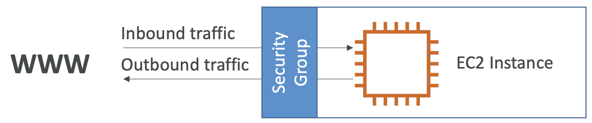

## EC2

- Elastic Compute Cloud
- AWS 에서 가장 인기있는 서비스 중 하나
- 주요 기능 구성
  - 가상 머신 대여 (EC2)
  - 가상 드라이브에 데이터 저장 (EBS)
  - 부하분산 (ELB)
  - auto-sclaing group을 이용한 크기조정 (ASG)
- EC2를 이해하는것은 클라우드가 작동방식을 이해하는 기초

---

### EC2 크기 조정 & 구성 옵션

- Operating System (OS) : 리눅스, 윈도우, Mac OS
- 컴퓨터 파워 및 코어 수 (CPU)
- Ram 크기
- 저장 공간
  - 네트워크 저장공간 (EBS & EFS)
  - 하드웨어 저장공간 (EC2 Instance Store)
- 네트워크 카드 : 속도 및 공개 IP
- 방화벽 규칙 : 보안 그룹
- 부트스트랩 스크립트 (첫 실행 시 구성) : EC2 User Data

---

### EC2 User Data

- EC2 User Data 스크립트를 사용하여 인스턴스를 부트스트랩할 수 있다
- 부트스트랩 : 가상머신 실행 시 수행되는 커맨드
- 스크립트는 **인스턴스 기동시 한번만 수행**된다
- EC2 유저 데이터는 다음과 같은 부팅 작업을 자동화한다.
  - 업데이트 설치
  - 소프트웨어 설치
  - 인터넷에서 공통 파일 다운로드
  - 그 외에 생각할 수 있는 모든 작업
- EC2 유저 데이터 스크립트는 root 유저로 실행된다.

---

### EC2 인스턴스 타입

- AWS는 다양한 EC2 인스턴스를 제공하므로, 사용 환경에 맞게 EC2 성능과 가격을 비교하여 골라 사용할 수 있다.
  - 범용
  - 컴퓨팅 최적화
  - 메모리 최적화
  - 가속화된 컴퓨팅
  - 스토리지 최적화
  - 인스턴스 기능
  - 인스턴스 성능 측정

> AWS 인스턴스 명명 규칙
> - m5.2xlarge
>   - m : 인스턴스 클래스
>   - 5 : 세대
>   - 2xlarge : 인스턴스 클래스 크기
> 

#### EC2 인스턴스 타입 - 범용 (General Purpose)

- 웹 서버 및 코드 저장소와 같은 다양한 워크로드에 적합한 인스턴스 타입
- 균형잡힌 기능
  - 컴퓨팅
  - 메모리
  - 네트워크

#### EC2 인스턴스 타입 - 컴퓨팅 최적화

- 고성능 프로세서가 필요한 컴퓨팅 집약접 작업에 적합한 인스턴스 타입
  - 일괄 처리 워크로드
  - 미디어 트랜스코딩
  - 고성능 웹 서버
  - 고성능 컴퓨팅 (HPC)
  - 과학 모델링 & 머신 러닝
  - 데디케이트 게임 서버

#### EC2 인스턴스 타입 - 메모리 최적화

- 메모리에서 대용량 데이터 세트를 처리하는 워크로드를 위한 빠른 성능 작업에 적합한 인스턴스 타입
  - 고성능 관계형/비관계형 데이터베이스
  - 분산 웹 스케일 캐시 스토리지
  - 비즈니스 인텔리전스(BI)에 최적화된 메모리 데이터베이스
  - 대용량 비정형 데이터를 실시간으로 처리하는 어플리케이션

#### EC2 인스턴스 타입 - 스토리지 최적화

- 로컬 스토리지의 대용량 데이터에 대한 많은 읽기/쓰기 작업이 필요한 작업에 적합한 인스턴스 타입
  - 고빈도 온라인 거래처리 (Online transanctiop porcessing-OLTP) 시스템
  - 관계형 및 NoSQL 데이터베이스
  - 인-메모리 데이터베이스용 캐시 (ex. Redis)
  - 분산 파일 시스템

---

### EC2 인스턴스 구매 옵션

- 온디맨드 : 짧은 작업량, 예측 가능한 가격
- 예약 인스턴스
  - 표준 예약 인스턴스 : 긴 작업량에 적합
  - 컨버터블 예약 인스턴스 : 유연한 인스턴스가 있는 긴 작업량에 적합 
  - 스케줄 예약 인스턴스 : 특정 시간대 작업에 적합 (예시 : 매주 목요일 3~6시 사이에만 사용)
- 스팟 인스턴스 : 짧은 작업량, 싼 가격, 인스턴스가 사라질 수 있음 (낮은 신뢰성)
- 전용 호스트 : 물리 서버 전체를 예약하고, 인스턴스의 배치를 제어할 수 있음
- 전용 인스턴스 : 다른 사용자와 하드웨어를 공유하지 않음

#### EC2 온디맨드 인스턴스

- 이용한 만큼 비용 지불
  - 리눅스 or 윈도우 : 첫 1분 후 초당 요금 계산
  - 다른 OS : 시간당 요금 계산
- 가장 비싼 요금제이지만 사용량에 대해서만 후불로 결제
- 장기 약정 없음
- 단기 및 중단 없는 작업에 대해서 사용 권장된다
  - 어플리케이션의 동작의 예측이 어려울 때 사용 권장

#### EC2 예약 인스턴스

- 특정 인스턴스 타입을 예약하여 사용한다.
- 온디맨드 보다 최대 72%까지 할인된 가격
- 1년 약정, 3년 약정 중 선택 가능하다. (당연히 장기간 예약하면 더 싸다)
- 구매 옵션 : 선불, 부분선불, 후불
- 정상 상태를 유지해야하는 어플리케이션의 사용에 권장된다 (예: DB)
- 컨버터블 예약 인스턴스
  - EC2 인스턴스 타입을 바꿀 수 있다
  - 온디맨드보다 최대 66% 할인된 가격
- 스케쥴 예약 인스턴스
  - 예약된 기간 동안 내에 시작
  - 일/주/월 을 쪼개서 작업을 할때 사용된다
  - 1년 약정만 가능하다

#### EC2 스팟 인스턴스

- 온디맨드보다 최대 90% 할인된 가격 (가장 싼 가격)
- AWS에서 남는 서버 공간을 입찰받아 사용하는 방식
- 사전 약정없이 사용할 수 있으며, 
- 사용자가 제시가격(입찰가격)을 정해놓고 저렴할때 이용할 수 있다
  - 제시가격보다 인스턴스 시장 가격이 높아지면 인스턴스가 종료된다
  - 수요/공급에 따라 가격이 결정되기 때문에 종료되는 시점을 알 수는 없다.
  
- 짧은 워크로드같이 단기적으로 작업을 할 때 유리하다
  - 배치 작업
  - 데이터 분석
  - 이미지 프로세싱
  - 분산 처리
  - 유동적인 시작-종료 시간을 가진 작업
- 중요한 작업이나 데이터베이스에는 적합하지 않다

#### EC2 전용 호스트

- EC2 인스턴스 용량이 전적으로 사용자 전용인 물리 서버 - 비싸다
  - 기존 서버 바인딩 소프트웨어 라이선스를 사용할 수 있으므로 규정 준수 요구 사항을 해결하고 비용을 절감할 수 있다.
- 복잡한 라이선스 모델이 있는 소프트웨어에 유용 (BYOL - BringYour Own License)
- 엄격한 규제 또는 규정 준수 요구 사항이 있는 회사에 유용

#### EC2 전용 인스턴스

- 전용 하드웨어에서 실행되는 인스턴스
- 동일한 계정의 다른 인스턴스와 하드웨어 공유 가능
- 인스턴스 배치를 제어할 수 없음 (중지/시작 후 하드웨어를 이동할 수 있음)

---

## 보안 그룹

- 보안그룹은 AWS 네트워크 보안의 기본이다
- 보안그룹은 EC2 인스턴스에 오가는 트래픽을 제어한다.
- 보안그룹은 EC2 인스턴스에서 방화벽의 역할을 한다.
  
- 보안그룹 규칙은 IP 또는 보안그룹별로 참조할 수 있다.
- 보안그룹은 **허용규칙**만을 다룬다.
  - xxxx 의 IP는 허용한다 (가능)
  - xxxx 의 IP는 불허한다 (불가능)
- 보안그룹이 규제할 수 있는 내용은 다음과 같다
  - 접속 가능한 포트
  - 허용된 IP 범위 (CIDR) - IPv4 & IPv6
  - 인바운드 네트워크 제어
  - 아웃바운드 네트워크 제어

---

### 보안그룹의 특징

- 다수의 인스턴스에 적용 가능하다
- 리전/VPC 조합으로 묶여있다
- EC2의 외부에 존재한다. (트래픽이 차단되면 EC2인스턴스는 보안그룹을 볼 수 없다)
- SSH 액세스를 위해 하나의 별도 보안그룹을 유지하는게 좋다.
- 어플리케이션에 액세스 할 수 없다면 (Timeout) 보안그룹의 문제다.
  - 어플리케이션이 '연결 거부' 에러를 보낸다면, 보안그룹의 문제가 아닌 어플리케이션의 문제다.
- 기본적으로 모든 인바운드 규칙은 차단된다.
- 기본적으로 모든 아웃바운드 규칙은 허용된다.

#### 알아둬야할 포트

- 22 : SSH
- 21 : FTP
- 22 : SFTP
- 80 : HTTP
- 443 : HTTPS
- 3380 : RDP

