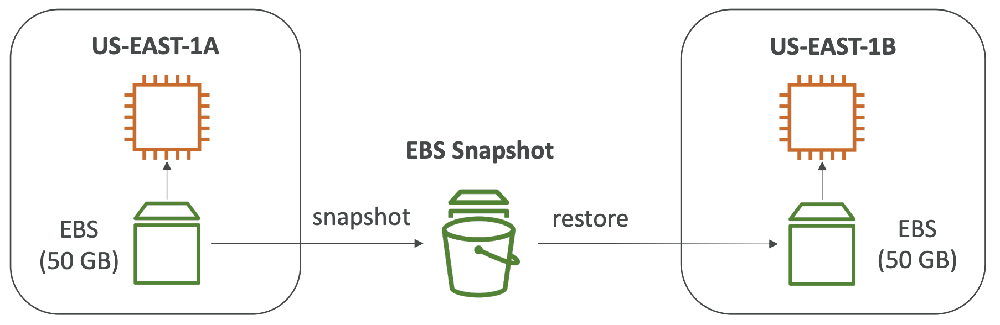
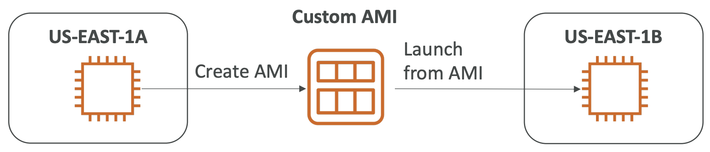
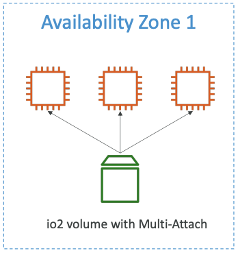
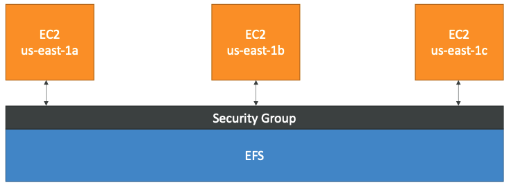
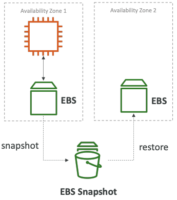
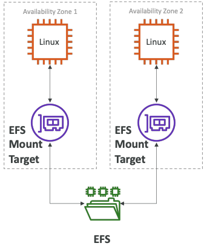

# EC2 인스턴스 스토리지 섹션

## EBS 볼륨이란

- Elastic Block Store
- 기동중인 인스턴스에 연결할 수 있는 네트워크 드라이버
- 인스턴스 종료 후에도 데이터를 유지할 수 있게 해준다
  - 인스턴스 속성으로 종료 시 데이터를 삭제하도록 변경 가능하다
- **EBS 볼륨은 한버너에 하나의 인스턴스에만 마운트 가능하다**
- 특정 가용영역에 바인딩된다

> EBS 볼륨 = 네트워크 USB 스틱같은 거라고 생각하면 이해하기 쉽다
> - 한번에 하나의 컴퓨터에만 연결 가능 = EBS 볼륨은 하나의 인스턴스에만 연결 가능
> - 한 컴퓨터에 여러개의 USB 스틱 연결 가능 = 하나의 인스턴스는 여러개의 EBS 볼륨에 연결 가능
> - 컴퓨터 종료 후에도 데이터 유지 = 인스턴스 종료 후에도 EBS 볼륨의 데이터 유지

---

## EBS 볼륨

- 네트워크 드라이브다 (물리적 드라이브가 아니다)
  - 네트워크를 통해 인스턴스와 통신하므로 약간의 지연시간이 있을 수 있다.
  - 빠르고 쉽게 EC2 인스턴스에서 분리하고 다른 인스턴스에 연결할 수 있다

- 가용영역에 묶여있다
  - 서로 다른 가용영역에서 EBS 볼륨에 접근이 불가능하다
  - 가용영역을 넘나들려면 스냅샷을 만들어 다른 가용영역으로 복사해야 한다

- 프로비저닝된 용량이 있다
  - 프로비저닝된 용량에 대해 요금이 청구된다
  - 추후 드라이브의 용량을 늘릴 수 있다

### EBS 종료 시 삭제 속성

- EC2 인스턴스 종료 시 EBS 볼륨의 동작을 컨트롤할 수 있다
  - 기본값 : root EBS 볼륨은 삭제되며, 연결된 다른 EBS 볼륨은 삭제되지 않음
- 인스턴스 생성 시 속성을 설정하거나, AWS 콘솔 / AWS CLI 로 컨트롤 할 수 있다

### EBS 스냅샷

- 특정 시점에 EBS 볼륨을 백업할 수 있다 (스냅샷 생성)
- 스냅샷을 만들기위해서 연결 해제할 필요는 없지만, 보통 연결 해제가 권장된다
- 가용영역/리전을 넘어 스냅샷을 만들 수 있다
  - EBS 볼륨은 기본적으로 가용영역/리전에 제한적으로 사용 가능하다
  

---

## AMI

### 개요

- Amazon Machine Image
- AMI = 커스텀 EC2 인스턴스
  - EC2 인스턴스에 소프트웨어, 설정값, OS, 모니터링 .. 등등 추가할 수 있다
  - 모든 소프트웨어가 이미 설치되어있기 때문에 빠르게 기동 및 구성이 가능하다
- AMI는 리전에 한정되어 있다 (다른 리전으로 복사하여 넘겨줄 수 있다)

### AMI Process

1. EC2인스턴스 시작 및 커스터마이즈
2. 인스턴스 중지 (데이터 무결성을 위해)
3. AMI 생성 - 이 과정은 EBS 스냅샷 생성 과정을 동반한다
4. AMI로 다른 인스턴스 생성

  

---

## EC2 인스턴스 스토어

- EBS 볼륨은 네트워크 드라이브이므로 성능에 한계가 있다
- **높은 성능의 하드웨어 디스크가 필요하다면, EC2 인스턴스 스토어를 사용해야 한다**

### EC2 인스턴스 스토어 특징

- EBS 볼륨보다 더 좋은 I/O 성능
- EC2 인스턴스 스토오는 중단될 시 스토리지가 손실된다 (휘발성)

### EBS 볼륨 타입

- 6가지 볼륨 타입
  - gp2 / gp3 (SSD) : 범용 SSD 볼륨. 가격과 성능의 균형. 다양한 워크로드에 적합
  - io1 / io2 (SSD) : 최고성능의 SSD 볼륨. 미션 크리티컬한 저지연, 많은 처리량의 워크로드에 적합
  - st1 (HDD) : 저렴한 HDD 볼륨. 자주 액세스하고 처리량이 많은 워크로드에 적합
  - sc1 (HDD) : 가장 저렴한 HDD 볼륨. 자주 액세스하지 않는 워크로드에 적합
- gp2/gp3, io1/io2 볼륨만이 부트 볼륨으로 사용될 수 있다

### EBS 볼륨 타입 사용 사례

**범용 SSD**
- 가성비 좋고 낮은 레이턴시의 스토리지
- 시스템 부트 볼륨, 가상 데스크톱, 개발 및 테스트 환경 등에서 사용
- 1GiB - 16 TiB
- gp3
  - 3,000 IOPS, 125 MiB/s의 처리량이 기준
  - 16,000 IOPS, 1000 Mib/s 까지 높일 수 있다
- gp2
  - 작은 gp2 볼륨은 3,000 IOPS까지 버스트 가능하다
  - 볼륨의 크기와 IOPS는 상관관계가 있으며, 최대 IOPS는 16,000이다
  - IOPS:GiB = 3:1. (5,334 GB에서 최대 IOPS를 가진다)

**프로비저닝된 IOPS (PIOPS) SSD**
- 중요한 비즈니스 어플리케이션과, 지속적인 IOPS 성능이 필요한 환경에서 사용
- 어플리케이션이 16,000 이상의 IOPS가 필요할 경우에도 사용
- 데이터베이스 워크로드에 적합
- io1/ io2 (4 Gib - 16 TiB)
  - 최대 PIOPS : 니트로 EC2 인스턴스에서는 64,000. 다른 인스턴스는 32,000
  - PIOPS는 저장공간의 크기와 상관관계가 없다
  - io2는 같은 가격의 io1과 보다 더 많은 내구성과 IOPS 성능을 가진다
- io2 블록 익스프레스 (4 GiB - 16 TiB)
  - 밀리초 미만의 지연시간
  - 최대 PIOPS : 256,000. IOPS:GiB = 1,000:1
- EBS 다중 연결을 허용한다
  > 다중 연결 (io1/io2)
  > - 하나의 EBS 볼륨에 여러 인스턴스의 연결 (같은 AZ)
  > - 각 인스턴스는 볼륨에 대해 모든 읽기/쓰기 권한을 가진다
  > - 사용 예제
  >   - 클러스터된 Linux 어플리케이션에서 더 높은 가용성을 위해 사용 (ex. Teradata)
  >   - 동시에 쓰기 작업이 필요한 어플리션
  > - 클러스터를 인식하는 파일 시스템을 사용해야 한다 (XFS, EX4 등은 사용 불가)
  > 

**하드디스크 드라이브(HDD)**

- 부트볼륨이 될 수 없다
- 126 MiB - 16 TiB
- st1
  - 처리량 최적화 HDD
  - 빅데이터, 데이터 웨어하우스, 로그 프로세싱
  - 최대 처리량 : 500MiB/s - 최대 IOPS 500
- sc1
  - 콜드 HDD
  - 자자주 액세스되지 않는 데이터에 적합
  - 비용을 최대한 줄여야할 때 사용
  - 최대 처리량 : 250 MiB/s - 최대 IOPS 250

---

## EFS

- Elastic File System
- 다수의 EC2에 탑재할 수 있는 관리형 NFS(Netowrk file system)
- EFS는 다중 AZ에 있는 EC2인스턴스에서 작업 가능하다
  
- 고가용성, 확장성, 비싼 가격(사용량에 비례한 가격)
- 사용 예제 : 컨텐츠 관리, 웹 서비스, 데이터 공유, 워드프레스
- NFSv4.1 프로토콜을 사용한다
- 보안그룹을 사용하여 EFS에 대한 액세스를 제어한다
- **Linux 기반 AMI와 호환**
- KMS를 사용한 저장 데이터 암호화
- 표준 파일 API가 있는 POSIC 파일시스템 (~Linux)
- 파일 시스템은 용량계획 없이 자동으로 확장되며 사용량에 따라 비용이 청구되고, 용량 계획이 없다

### EFS - 성능 및 스토리지 클래스

- EFS 스케일
  - 1000개의 동시 NFS 클라이언트, 10GB+/s 처리량
  - 페타바이트 규모의 네트워크 파일 시스템으로 자동 확장기능이 있다
- 퍼포먼스 모드 (EFS 생성시에 설정)
  - 범용 퍼포먼스 (기본값) : 지연시간에 민감한 경우 사용 (웹서버, CMS, 등)
  - 최대 I/O - 높은 지연시간, 높은 처리량, 고도의 병렬 행렬이 필요할 경우 사용 (빅데이터, 미디어 처리 둥)
- 처리량 모드
  - Bursting : (1TB = 50MiB/s + 최대 100MiB/s의 버스트)
  - Provisioned : 스토리지 크기에 관계없이 처리량을 설정(예: 1TB 스토리지의 경우 1GiB/s)
- 스토리지 티어 (수명주기 관리 기능 - N일 후 파일 이동)
  - Standard : 자주 액세스하는 파일용
  - Infrequent access(EFS-IA) : 자주 사용하지 않는 파일용. 파일 검색 비용, 저장 비용 절감

---

## EBS vs EFS

### EBS
- EBS 볼륨
  - 한번에 하나의 인스턴스에만 연결 가능
  - AZ 영역에 귀속됨
  - gp2 : 파일 디스크 사이즈에 비례하여 IO 증가
  - io1 : 파일 디스크 사이즈에 무관하게 IO 증가 가능
- AZ를 초월하여 EBS를 마이그레이션 하려면...
  1. 스냅샷 생성
  2. 스냅샷을 다른 AZ로 복원
  3. EBS 백업은 IO를 사용하므로 어플리케이션이 많은 트래픽을 처리하는동안 실행하면 안됨
- 인스턴스의 루트 EBS 볼륨은 기본적으로 EC2가 종료될때 같이 종료된다. (이 기능을 비활성화 할 수도 있다)

### EFS

- AZ를 초월하여 100개 이상의 인스턴스에 마운트 가능
- 웹사이트 파일을 공유 (WordPress)
- 리눅스 인스턴스에서만 사용가능 (POSIX)
- EBS보다 더 높은 비용
- EFS-IA를 활용하여 비용 절감 가능
