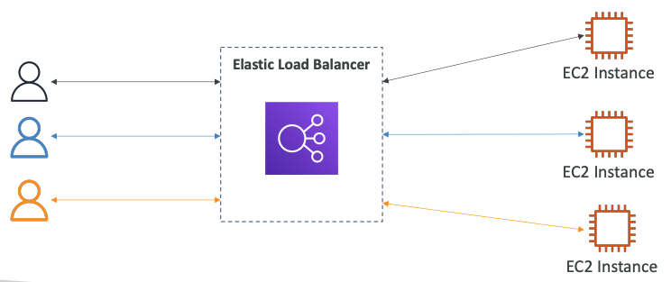
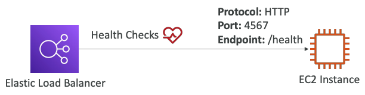
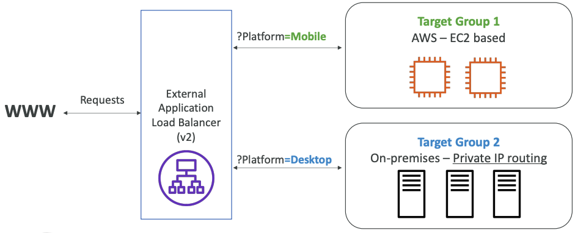
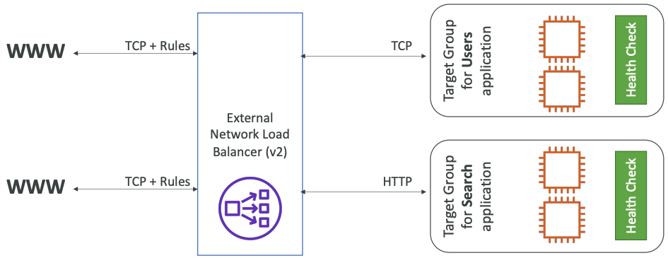
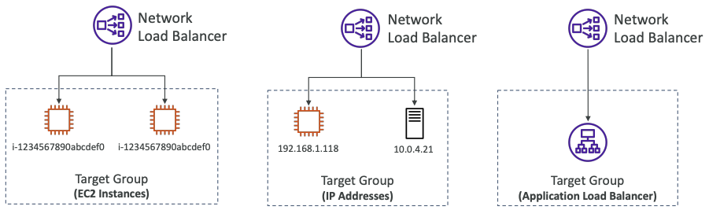
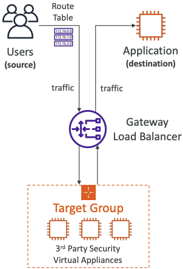
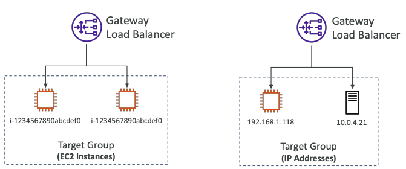
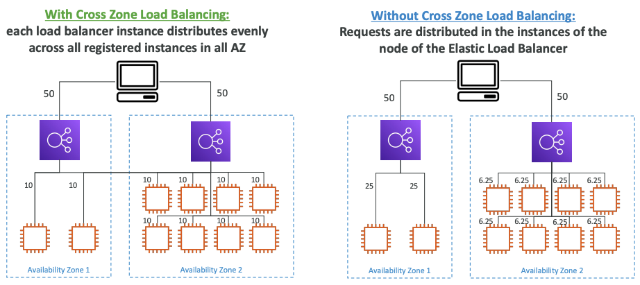
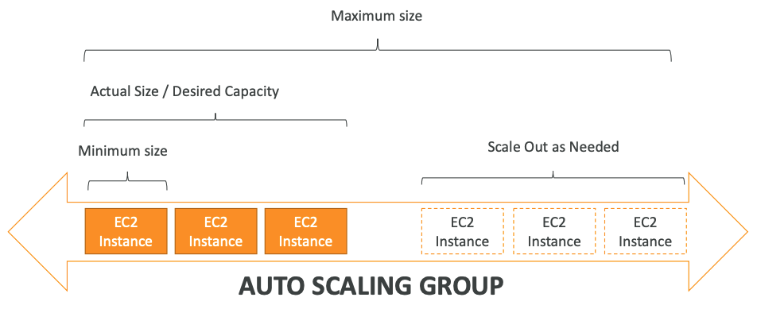
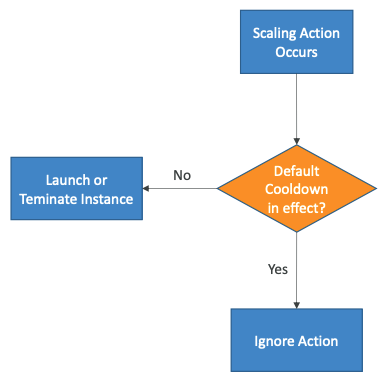

# AWS 기초 - 로드밸런싱, 오토 스케일링 그룹, EBS볼륨

## 확장성

- 확장성은 어플리케이션/시스템이 능동적으로 더 높은 처리량을 견딜 수 있게 해준다
- 확장성의 두 종류
  - 수직성 확장성
  - 수평적 확장성 (elastic)
- 확장성은 고가용성과 밀접한 연관성을 가지고 있지만 둘은 목적이 다르다

### 수직적 확장성

- 수직적 확장성은 인스턴스의 크기/성능을 키우는것을 의미한다
- RDS, ElasticCache는 수직적 확장이 가능한 서비스
- 수직적확장은 하드웨어의 제한이 동반되기 때문에 명확한 한계가 있다

### 수평적 확장성

- 수평적 확장은 인스턴스/시스템의 수를 늘리는 것을 의미 (분산 시스템)
- 웹 어플리케이션 / 현대의 어플리케이션에서는 굉장히 흔하다
- 아마존 EC2와 같은 클라우드 덕분에 수평적 확장이 굉장히 쉬워졌다

---

## 고가용성

- 고가용성은 보통 수평적 확장과 밀접한 연관이 있다
- 고가용성은 어플리케이션/시스템이 최소 2개의 데이터 센터(==가용영역)에서 실행되는 것을 의미한다
- 고가용성의 목표는 데이터 센터 장애 발생시에도 살아남는것
- 고가용성은 수동적일수도 있고 능동적일수도 있다
  - 수동적 고가용성의 예 : RDS 다중 AZ의 경우
  - 능동적 고가용성의 예 : 수평 확장의 경우

### EC2의 고가용성 & 확장성

- 수직적 확장 : 인스턴스 크기/성능 증가 (scale up/down)
- 수평적 확장 : 인스턴스 수 증가 (scale out/in)
- 고가용성 : 다중 AZ에서 동일한 애플리케이션에 대한 인스턴스 실행

---

## 로드밸런싱

- 트래픽을 여러 서버(ex. EC2)에 다운스트림으로 전달하는 서버

- 로드밸런싱을 사용하는 이유
  - 여러 다운스트림을 인스턴스에 부하분산
  - 어플리케이션에 대한 단일 액세스 지점(DNS) 노출
  - 다운스트림 인스턴스의 오류를 원활하게 처리
  - 인스턴스에 대한 정기적인 상태 확인 수행
  - 웹 사이트에 SSL 종료 (HTTPS) 제공
  - 영역 간 고가용성
  - 개인 트래픽과 공용 트래픽 분리

### Elastic load balancer

- Elastic Load Balancer : 관리형 로드 밸런서
  - AWS가 작동을 보장
  - AWS가 업그레이드, 유지관리, 고가용성 처리
  - AWS가 몇가지의 구성 노브만 제공
- 자체 로드밸런서를 설정하는데 비용이 적게 들지만, 결국 훨씬 더 많은 노력이 필요하다
- 많은 AWS가 제공하는 제품과 서비스들을 통합할 수 있다
  - EC2, EC2 Auto Scaling Groups, Amazon ECS
  - AWS Certificate Manager (ACM), CloudWatch
  - Route 53, AWS WAF, AWS Global Accelerator

#### 상태 확인 (Health Check)

- 로드 밸런서에 대한 상태 확인은 중요하다
- 로드 밸런서는 트래픽을 전달하는 인스턴스가 요청에 응답할 수 있는지 여부를 확인한다
- 상태 확인은 포트 및 경로에서 수행된다
- 응답이 200 ok가 아닌 경우 인스턴스가 비정상적이라고 판단한다

### AWS 로드 밸런서의 종류

1. Classic Load Balancer (CLB - v1 - 2009)
  - HTTP, HTTPS, TCP, SSL
2. Application Load Balancer (ALB - v2 - 2016)
  - HTTP, HTTPS, WebSocket
3. Network Load Balancer (NLB - v2 - 2017)
  - TCP, TLS, UDP
4. Gateway Load Balancer (GWLB - 2020)
  - IP Protocol, 네트워크 레이어

- 전반적으로 더 많은 기능을 제공하는 최신 세대 로드밸런서 사용 추천 (CLB보다 ALB사용 추천)
- 일부 로드 밸런서는 내부(프라이빗) 또는 외부 (퍼블릭) ELB로 설정 가능하다

#### Classic Load Balancer (v1)

- TCP, HTTP, HTTPS 지원
- TCP나 HTTP를 기반으로 상태 확인
- 고정 호스트 이름
  - XXX.region.elb.amazonaws.com

#### Application Load Balancer (v2)

- 7계층 (HTTP) 지원
- 여러 시스템 (대상 그룹)에 걸쳐 HTTP 어플리케이션에 대한 로드 밸런싱
- 동일한 시스템에 있는 여러 어플리케이션에 대한 로드 밸런싱 (ex. 컨테이너)
- 리다이렉트 지원 (ex. HTTP -> HTTPS)
- 다른 대상 그룹으로 라우팅 테이블
  - URL 경로 기반 라우팅 (ex. example.com/users & example.com/posts)
  - URL 호스트 이름 기반 라우팅 (ex. one.example.com & other.example.com)
  - 쿼리 문자열, 헤더 기반 라우팅 (example.com/users?id=123&order=false)
- ALB는 카이크로 서비스 & 컨테이너 기반 어플리케이션에 아주 적합하다. (ex. Docer, Amazon ECS)
- ECS의 동적 포트로 리다이렉션 하는 포트 매핑 기능이 있다
- 한개의 ALB로 구현할 수 있는 작업을, CLB로는 여러개가 필요할 수도 있다
- ALB는 여러 대상 그룹을 라우팅할 수 있다 (상태 확인은 대상 그룹 수준에서 이뤄진다)
- 대상 그룹
  - EC2 인스턴스 (오토 스케일 그룹으로 관리가능) - HTTP
  - EC2 작업 (ECS 자체 관리) - HTTP
  - Lambda 함수 - HTTP 요청이 JSON 이벤트로 변환됨
  - IP 주소 - Private IP여야 함

#### Network Load Balancer (v2)

- 4계층 지원
  - **TCP & UDP 트래픽을 인스턴스로 전달**
  - 초당 수백만의 요청 처리 가능
  - 100ms 이하의 반응속도 (ALB는 400ms)
- NBL는 AZ당 하나의 고정 IP를 가지며 탄력적 IP 할당을 지원한다
  - 특정 IP를 화이트리스트에 추가할때 유용하다
- NLB는 극한의 성능을 위해 TCP/UDP 트래픽에 사용된다
- AWS 프리티어에는 포함되지 않는다\

- 대상 그룹
  - EC2 인스턴스
  - IP Address - private IP Only
  - ALB

#### Gateway Load Balancer

- 3계층 지원 - IP 패킷
- AWS에서 타사의 가상 어플라이언스들을 쉽고 효율적으로 배포, 확장, 그리고 관리해주는 서비스
  - ex. 방화벽, 침입 탐지 및 방지 시스템, 심층 패킷 검사 시스템, 페이로드 조작 ...
- 다음 기능을 결합
  - 투명 네트워크 게이트웨이 : 모든 트래픽에 대한 단일 진입/출구
  - 로드 밸런서 - 트래픽을 가상 어플라이언스로 분산
- 포트 6081에서 GENEVE 프로토콜 사용 가능

- 대상 그룹
  - EC2 인스턴스
  - IP 주소 - private IP Only

---

## Sticky Sessions (Session Affinity)

- 동일한 클라이언트가 항상 로드밸런서 뒤의 동일한 인스턴스로 리다이렉션되도록 고정성을 구현하는것이 가능
- Classic Load Balancer 및 Applicaion Load Balancer에 작동
- 고정성에 사용되는 "쿠키"에는 사용자가 제어하는 만료 날짜가 있다
- 사용 사례 : 사용자가 세션 데이터를 잃지 않는지 확인
- 고정성을 활성화하면 백엔드 EC2 인스턴스에 대한 부하 불균형 발생 가능
- 쿠키 이름
  - 어플리케이션 기반 쿠키
    - 사용자 지정 쿠키
      - 대상애서 생성
      - 응용 프로그램에 필요한 모든 사용자 지정 속성을 포함할 수 있음
      - 쿠키 이름은 각 대상 그룹에 대해 개별적으로 지정해야 한다
      - 쿠키 이름으로 AWSALB, AWSALBAPP, AWSALBTG를 사용하면 단된다 (ELB에서 사용하는 쿠키이름)
    - 어플리케이션 쿠키
      - 로드밸런서에서 생성
      - 쿠키 이름 : AWSALBAPP
  - 기간 기반 쿠키
    - 로드 밸런서에서 생성된 쿠키
    - 쿠키 이름 : ALB의 경우 AWSALB, CLB의 경우 AWSELB

---

## Cross-Zone Load Balancing

- Cross Zone Load Balancing : 각각의 로드 밸런서 인스턴스는 모든 AZ에 등록된 모든 인스턴스에 고르게 분산

  

- Application Load Balancer
  - 항상 활성화 (비활성화 불가능)
  - AZ간 데이터에 대한 요금 없음
- Network Load Balancer
  - 기본적으로 비활성화
  - 활성화된 경우 AZ 내부 데이터에 대해 요금 지불
- Classic Load Balancer
  - 기본적으로 비활성화
  - 활성화된 경우 AZ 내부 데이터에 비용 지불하지 않음

---

## SSL/TLS - 기본

- SSL 인증서를 사용하면 클라이언트와 로드 밸런서 간의 트래픽을 전송 중에 암호화할 수 있다 (전송 중 암호화)
- SSL : Secure Socket Layer. 연결을 암호화하는데 사용.
- TLS : 최신 버전의 Transport Layer Security
- 요즘은 TLS인증서가 주로 사용되지만 여전히 SSL이라고 부른다
- 공용 SSL 인증서는 인증기관(CA)에서 발급한다
- Comodo, symantec, GoDaddy, GlobalSign, Digicert, GlobalSign, Digicert, Letsencrypt 등...
- SSL 인증서에는 만료날짜가 있으며, 갱신이 필요하다

### 로드 밸런서 - SSL 인증

- 로드밸런서는 X.509 인증을 사용한다 (SSL/TLS 서버 인증)
- ACM을 이용하여 인증서 관리가 가능하다
- 자신의 인증서를 대신 업로드 가능하다
- HTTPS listener
  - 기본 인증서를 지정해야 한다
  - 여러 도메인을 지원하기 위해 선택적 인증서 목록 추가가 가능하다
  - 클라이언트는 SNI(서버 이름 표시)를 사용하여 도달하는 호스트이름을 지정할 수 있다
  - 레거시 클라이언트를 위해 SSL/TLS의 이전 버전을 지원하는 보안 정책을 지정하는 기능이 있다

### SSL - Server Name Indication (SNI)

- SNI는 여러 SSL 인증서를 하나의 웹 서버에 로드하는 문제를 해결해준다
  - 여러 웹사이트를 제공하는 경우s
- 이 방식은 최신 프로토콜이며 클라이언트가 초기 SSL 핸드셰이크에서 대상 서버의 호스트 이름을 나타내도록 요구한다
  - 그러면 서버가 올바른 인증서 또는 기본 인증서를 반환한다
- ALB 및 NLB, CloudFront에서만 사용 가능하며, CLB에서는 사용 불가능하다

### Elastic Load Balancer - SSL 인증서

- Classic Load Balancer (v1)
  - 하나의 SSL 인증서만 지원
  - 여러 SSL 인증서가 있는 여러 호스트 이름에 대해 여러 CLB를 사용해야 한다
- Application Load Balancer (v2)
  - 여러 SSL 인증서가 있는 여러 수신기 지원
  - SNI(서버 이름 표시)를 사용하여 작동
- Network Load Balancer (v2)
  - 여러 SSL 인증서가 있는 여러 수신기 지원
  - SNI(서버 이름 표시)를 사용하여 작동

### Connection Draining

- Auto Scaling이 사용자의 요청을 처리 중인 EC2의 인스턴스를 바로 삭제하지 못하도록 방지하는 기능
  - 삭제하기 전에 요청을 처리할 수 있도록 지정한 시간만큼 기다린다
  - ex. 사용자가 인스턴스로부터 파일 다운로드 중 오토스케일링에 의해 인스턴스가 바로 삭제되면 파일 전송이 중단되므로, 일정 시간 후에 삭제되도록 설정
- CLB 에서는 Connection Draining이라는 이름으로, ALB & NLB에서는 Deregistration Delay 라는 이름으로 불린다

---

## ASG

- Auto Scaling Group
- 부하에 맞춰 서버를 유동적으로 생성하고 삭제하는 기능
  - 최소/최대 수 설정 가능하며, 새 인스턴스를 로드 밸런서에 자동으로 등록한다
  - 부하 증가 -> Scale out (EC2 인스턴스 추가)
  - 부하 감소 -> Scale in (EC2 인스턴스 제거)

### 속성

- 시작 설정값
  - AMI + 인스턴스 타입
  - EC2 유저 데이터
  - EBS 볼륨
  - 보안 그룹
  - SSH 키페어
- 최소 크기, 최대 크기, 초기 용량
- 네트워크, 서브넷 정보
- 로드 밸런서 정보
- 스케일링 정책

### Auto Scaling Alarm

- CloudWatch 경보를 기반으로 ASG 확장이 가능하다
- 알람은 지표(ex. 평균 CPU)를 모니터링하며, 지표는 전체 ASG 인스턴스에 대해 계산된다
- 알람을 기반으로 확장 정책을 생성할 수 있다

### 동적 확장 정책

- 대상 추정 조정
  - 가장 간단하고 설정하기 쉽다
  - ex. 평균 ASG CPU를 약 40%로 유지하고 싶다
- 단순/단계 조정
  - CloudWatch 경보가 트리거될때 유닛 추가/제거
  - ex. CloudWatch에 CPU > 70% 경보가 트리거되면 2개 추가, CPU < 30% 경보가 트리거되면 1개 제거
- 예약 작업
  - 잘 알려진 사용 패턴을 기반으로 조정을 예상한다
  - ex. 금요일 오후 5시에 최소 용량을 10으로 증가

### 특성 및 기능

**Predictive Scaling**

- Predictive Scaling : 지속적으로 부하를 예측하고 미리 확장일정을 잡는다

**Scaling Cooldowns (조정 휴지)**

- Scaling Cooldown : 스케일링 작업이 발생한 후에 일정시간 동안 휴지(cooldown) (default : 300초)
- 휴지기간 동안 ASG는 추가 인스턴스를 시작하거나 종료하지 않음 (안정화를 위해)
- 준비된 요청을 더 빨리 처리하고 휴지기간을 줄이기 위해 AMI 사용 권장

