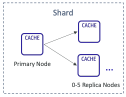

# AWS 기초 - RDS, Aurora & ElasticCache

## AWS RDS

### 개요

- Relational Database Service
- SQL 쿼리 언어를 사용하는 DB 서비스
- AWS에서 관리하는 클아우드에서 데이터베이스 생성 가능
  - Postgres
  - MySQL
  - MariaDB
  - Oracle
  - Microsoft SQL Server
  - Aurora (AWS 독점 DB)

> EC2에 DB를 올리는것보다 RDB를 사용했을 때의 장점
>
> - RDB는 AWS에서 관리되는 서비스이므로 다음과 같은 기능을 제공해준다
>   - 자동 프로비저닝, OS 패치
>   - 지속적인 백업 및 특정 타임스탬프로 복원 기능
>   - 대시보드 모니터링
>   - 읽기 성능 향상을 위한 read only 복제본 생성
>   - 재해 복구를 위한 다중 AZ 설정
>   - 확장 기능 (수직/수평 확장)
>   - EBS 지원 스토리지 (gp2 or io1)
>
> 하지만, SSH로 인스턴스에 접속할 수 없다는 단점도 있다

### 백업

- RDS 백업은 자동으로 활성화된다
- 자동 백업
  - 매일 DB 전체 백업
  - 5분마다 RDS 트랜잭션 로그 백업
    - 특정 시간대로 복원할 수 있도록 해준다
  - 7일 유지 (35일까지 연장 가능)
- DB 스냅샷
  - 사용자가 만들 수 있다
  - 원하는 기간만큼 백업 보존이 가능하다

### Storage Auto Scaling

- RDS DB 인스턴스의 용량을 동적으로 늘릴 수 있게 해준다
- RDS의 저장공간이 없어지면 자동으로 용량이 확장된다
  - 수동으로 확장시키지 않아도 된다
- Maximum Storage Threshold(DB 스토리지의 최대 한도)를 설정해야 한다
- 다음과 같은 경우 자동으로 용량 변경
  - 여유 공간이 할당된 저장 공간의 10% 미만
  - 저장 공간 부족이 최소 5분동안 지속
  - 마지막 수정 이후 6시간 경과
- 예측하기 어려운 워크로드를 가진 어플리케이션에 유용하다
- 모든 RDS 데이터베이스 엔진을 지원한다 (MariaDB, MySQL, PostgreSQL, SQL Server, Oracle)

### 읽기 확장성을 위한 읽기 전용 복제본

- 최대 5개의 읽기 전용 복제본
- 동일 AZ, 서로 다른 AZ 어디서든 복제본 생성 가능
- 복제는 **비동기적**으로 진행되며, 읽기작업은 일관성을 가진다
- 복제본은 자체 DB로 승격 가능
- 어플리케이션은 읽기 전용 복제본을 활용하기 위해 연결을 업데이트해야한다

> RDS 복제 네트워크 비용
>
> - AZ간의 데이터 전송은 비용을 지불하지만, 동일한 AZ 내의 RDS 복제본의 경우 요금을 지불하지 않는다.
>
> 

### Multi AZ (재해 복구)

- **동기적**으로 복제
- 하나의 DNS 이름 사용 – 대기 모드로의 자동 앱 장애 조치
- 가용성 향상
- AZ 손실, 네트워크 손실, 인스턴스 또는 스토리지 장애 시 장애 조치
- 앱에 수동 개입 없음
- 확장에 사용되지 않음
- 다중 AZ 복제는 무료
- 참고: 읽기 전용 복제본은 재해 복구(DR)를 위한 다중 AZ로 설정된다

### 단일 AZ -> Multi-AZ

- DB를 멈출 필요가 없음
- DB 복제 과정
  1. 스냅샷 생성
  2. 다른 AZ에 새로운 DB복원
  3. 두 DB 사이에 동기화 설정

### 암호화

- At rest Encryption
  - 저장시 암호화
  - AWS KMS (AES-256) 암호화로 마스터 및 읽기 전용 복제본 암호화 가능
  - 시작 시 암호화를 정의해야 한다
  - 마스터가 함호화되지 않은 경우 읽기 전용 복제본 암호화가 불가능
  - Oracle 및 SQL서버에 투명한 데이터 암호화(TDE) 가능
- In-flight Ecryption
  - 데이터 전송 시 암호화
  - 전송 중인 RDS로 데이터를 암호화하는 SSL 인증서 사용
  - 데이터베이스에 연결할 때 신뢰 인증서와 함께 SSL 옵션 제공

### 암호화 작업

- RDS 백업 암호화
  - 암호화되지 않은 RDS 데이터베이스의 스냅샷은 암호화되지 않는다
  - 암호화된 RDS 데이터베이스의 스냅샷이 암호화된다
  - 스냅샷을 암호화된 스냅샷으로 복사 가능
- 암호화되지 않은 RDS 데이터베이스를 암호화하려면
  1. 암호화되지 않은 데이터베이스의 스냅샷 생성
  2. 스냅샷 복사 및 스냅샷 암호화 활성화
  3. 암호화된 스냅샷에서 데이터베이스 복원
  4. 애플리케이션을 새 데이터베이스로 마이그레이션하고 이전 데이터베이스 삭제

### 보안 - 네트워크 & IAM

- 네트워크 보안
  - RDS 데이터베이스는 일반적으로 퍼블릭 서브넷이 아닌 프라이빗 서브넷 내에 배포된다
  - RDS 보안은 보안 그룹을 활용하여 작동한다
    - RDS와 통신할 수 있는 IP/보안그룹을 제어
    - EC2 인스턴스와 동일한 개념
- IAM
  - IAM 정책은 누가 AWS RDS를 관리할 수 있는지 제어하도록 해준다
  - 기존 사용자 이름 및 암호를 사용하여 데이터베이스에 로그인이 가능하다
  - IAM 기반 인증을 사용하여 RDS MySQL 및 PostgreSQL에 로그인이 가능하다

### IAM 인증

- IAM 데이터베이스 인증은 MySQL 및 PostgreSQL에서 동작한다
- 암호가 필요 없고 IAM 및 RDS API 호출을 통해 얻은 인증 토큰만 있으면 된다
  - 인증 토큰의 수명은 15분이다
- 장점
  - 네트워크 입/출력은 SSL을 사용하여 암호화되어야 한다
  - DB 대신 사용자를 중앙에서 관리하는 IAM
  - 손쉬운 통합을 위해 IAM 역할 및 EC2 인스턴스 프로필 활용 가능

### RDS 보안 요약

- 저장시 암호화
  - DB 인스턴스를 처음 생성할 때만 수행된다
    - 사용중인 DB를 암호화하려면, DB를 스냅샷 생성후 암호화해서 다시 DB를 생성해야한다
- 사용자 책임
  - 포트/IP/DB의 SG 내부의 보안그룹 인바운드 규칙 확인
  - DB내 사용자 생성 및 권한 또는 IAM을 통한 관리
  - 공개 액세스 여부에 상관없이 DB 생성
  - 매개변수 그룹 또는 DB가 SSL 연결만 허용하도록 구성되었는지 확인
- AWS 책임
  - SSH 액세스 없음
  - OS 수동 패치 없음
  - DB 수동 패치 없음
  - 기본 인스턴스 검사할 방법 없음

---

## Amazon Aurora

- Aurora는 오픈소스가 아닌 AWS의 독점 기술이다
- Postgres와 MySQL은 모두 Aurora DB로 지원된다
  - 드라이버는 Aurora가, DB는 Postgres/MySQL 인것처럼 동작
- AWS 클라우드 최척화된 DB이며, 클라우드 환경에서 RDS의 Postgres와 MySQL보다 성능이 훨씬 향상된다고 주장한다
- Aurora의 용량은  자동으로 10GB단위로 64TB 까지 증가할 수 있다
- MySQL은 5개의 복제본을 만들 수 있는 반면, Aurora는 15개의 복제본이 있을 수 있고, 복제 속도도 더 빠르다
- 장애조치가 즉각적이고 HA가 기본이다
- RDS보다 비싸지만 더 효율적이다

### 고가용성 및 읽기 확장

- 하나의 Aurora 인스턴스에서 Write(마스터)
- 30초 이내에 마스터에 대한 자동 장애 조치
- 마스터 + 최대 15개의 Aurora 읽기 전용 복제본에서 읽기 기능 제공
- Across AZ 복제 지원

### 특징

- 자동 장애 조치
- 백업 및 복구
- 격리 및 보안
- 업계 규정 준수
- 푸시 버튼 스케일링
- 다운타임이 없는 자동화된 패치
- 고급 모니터링
- 일상적인 유지보수
- 역추적: 백업을 사용하지 않고 언제든지 데이터 복원

### 보안

- RDS와 동일한 엔진을 사용하기 때문에 RDS와 유사
- KMS를 사용한 저장 데이터 암호화
- 자동 백업, 스냅샷 및 복제본 암호화
- SSL을 사용한 데이터 전송 시 암호화 (MySQL/Postgres와 동일한 프로세스)
- IAM토큰을 사용하여 인증 가능 (RDS와 동일한 방식)
- 보안 그룹으로 인스턴스를 보호할 책임 있음
- SSH 사용 불가능

---

## Amazon ElastiCache

- 완전관리형 인 메모리 캐싱 서비스
- ElastiCache는 Redis 및 Memcached와 호환 가능하다
- RDS와 동일하게 관계형 DB이다
- 캐시는 성능이 매우 높고 지연시간이 짧은 인메모리 데이터베이스다
- 읽기 집약적인 워크로드에 대한 데이터베이스의 부하를 줄이는데 도움이 된다
- 어플리케이션을 Stateless하게 만드는데 도움이 된다
- AWS에서 OS 유지 관리/패치, 최적화 설정, 구성, 모니터링, 실패 복구 및 백업을 처리한다
- **ElastiCache를 사용하기 위해서 많은양의 어플리케이션 코드의 변경이 필요하다**

### ElastiCahce Solution Architecture

#### DB Cache

- 어플리케이션은 ElastiCache를 쿼리하며 사용할 수 없는 경우 RDS에서 가져와 ElastiCache에 저장한다
- RDS의 부하를 완화하는데 도움이 된다
- 캐시에는 최신 데이터만 사용 되도록 하는 무효화 전략이 있어야 한다

#### User Session Store

- 유저가 임이의 어플리케이션에 로그인한다
- 어플리케이션이 세션 데이터를 ElastiCache에 기록
- 유저가 어플리케이션의 다른 인스턴스 조회
- 인스턴스가 데이터를 검색하고 사용자가 이미 로그인 되어있음

### ElastiCache – Redis vs Memcached

**REDIS**

- 다중 AZ - 자동 장애 조치
- 읽기를 확장하고 고가용성을 유지하기 위한 읽기 전용 복제본
- AOF지속성을 사용한 데이터 내구성
- 백업 및 복원 기능

**MEMCACHED**

- 데이터 분할을 위한 다중 노드(sharding)
- 고가용성 없음 (복제 없음)
- 비영구적
- 백업 및 복원 없음
- 다중 스레드 아키텍쳐

### ElastiCache - Cache Security

- ElastiCache의 모든 캐시
  - IAM 인증을 지원하지 않음
  - ElastiCache의 IAM 정책은 AWS API 수준의 보안에만 사용됨
- Redis AUTH
  - Redis 클러스터를 생성할 때 "암호/토큰"을 설정할 수 있음
  - 캐시에 대한 보안 수준 (보안 그룹 위에 있음)
  - SSL 전송 암호화 지원
- Memcahced
  - SASL 기반 인증 지원

### ElastiCache Replication

#### 클러스터 모드 비활성화된 경우

- 기본 노드 1개, 복제본 최대 5개
- 비동기식 복제
- 기본 노드는 읽기/쓰기에 사용됨
- 다른 노드는 읽기 전용
- **하나의 샤드, 모든 노드에 모든 데이터가 있음**
- 노드 장애 시 데이터 손실 방지
- 장애 조치를 위해 기본적으로 다중 AZ 활성화
- 읽기 성능 확장에 유용

#### 클러스터 모드 활성화된 경우

- 데이터가 샤드에 분할됨 (쓰기 확장에 유용)
- 각 샤드에는 기본 노드와 최대 5개의 복제본 데이터가 존재
- 다중 AZ 기능
- 클러스터당 최대 500개의 노드
  - 1개의 마스터 : 500개의 shard
  - 1개의 마스터, 1개의 복제본 : 250개의 shard
  - ...
  - 1개의 마스터, 5개의 복제본 : 83개의 shard 

### 캐싱 디자인 패턴

#### Lazy Loading / Cache-Aside / Lazy Population

- 가장 널리 사용되는 캐싱 형태
- 기본 아이디어는 응용 프로그램에서 실제로 개체를 요청한 경우에만 캐시를 채우는 것
- 장점
  - 요청된 데이터만 캐시됨 (매시가 사용되지 않는 데이터로 채워지지 않음)
  - 노드 오류는 치명적이지 않음 (캐시를 워밍업하기 위해 대기 시가이 증가)
- 단점
  - 3번의 왕복을 초래하는 캐시 미스 패널티, 해당 요청에 대한 현저한 지연 발생
  - 데이터가 DB에서 업데이트되고 캐시에 있는 데이터가 오래된 데이터일 수 있음

#### Write-through

- DB 업데이트 시 캐시 추가 또는 업데이트하는 방식
- 장점
  - 캐시 만료를 단순화하고, 캐시는 항상 최신 상태다
  - 캐시의 데이터가 DB의 데이터와 달라지지 않고 읽기속도는 빨라진다
  - 쓰기 패널티 vs 읽기 패널티 (각 쓰기에는 2회의 호출이 필요)
- 단점
  - 캐시는 실제로 액세스되지 않는 불필요한 개체로 채워질 수 있다
  - 특정 레코드가 반복적으로 업데이트되면 캐시 변동이 많이 발생할 수 있다
  - DB에 추가되거나 업데이트될 때까지 캐시에 데이터가 없다
      - Lazy Loading과 Write-through 캐싱을 결합하는것이 권장됨

#### 캐시 제거 및 TTL (Time-to-Live)

- 캐시 제거되는 과정은 세개가 있다
  - 사용자가 캐시에서 항목을 명시적으로 삭제
  - 메모리가 가득 차 있고 최근에 사용되지 않은 캐시 삭제 (LRU)
  - TTL 만료로 인한 삭제
- TTL은 모든 종류의 데이터에 유용하다
- TTL은 초단위부터 일단위까지 기간을 설정 가능
- 메모리가 부족해서 너무 많은 삭제가 발생하는 경우 확장을 고려해야한다

- Lazy Loading/Cache aside는 구현하기 쉽기 때문에 많은 상황에서(특히 읽기 상황에서) 정석적으로 사용된다
- Write-through는 일반적으로 Lazy Loading과 같이 사용하는게 좋다
- TTL을 설정하는 것은 Write-through를 사용하는 경우를 제외하고는 일반적으로 좋다
  - 응용 프로그램에 적합한 값으로 설정이 권장된다
- 의미 있는 데이터만 캐시하는게 좋다 (사용자 프로필, 블로그 등...)