# Route 53

## Route 53 - Records

- 도메인에 대한 트래픽 라우팅 방법
- 각 레코드에 포함되는 정보
  - Domain/subdomain Name - ex. example.com
  - Record Type - ex. A or AAAA
  - Value - ex. 12.34.56.78
  - Routing Policy - Route 53이 쿼리에 응답하는 방식
  - TTL - 레코드가 DNS 확인
- Route 53은 다음 DNS 레코드 타입을 지원한다
  - 필수 : A / AAAA/ CNAME / NS
  - 고급 : CAA / DS / MX / NAPTR / PTR / SOA / TXT / SPF / SRV

> DNS 용어
>
> - Domain Registrar : 도메인 등록기관. Amazon Route 53, GoDaddy, ...
> - DNS Records : A, AAAA, CNAME, NS
> - Zone File : DNS 레코드 포함
> - Name Server : DNS 쿼리 확인
> - Top Level Domain(TLD) : 최상위 도메인. .com, .us, .in, .gov, .org, ...
> - Second Level Domain(SLD) : 2단계 도메인. amazin.com, google.com, ...
>
> 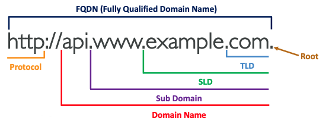
> 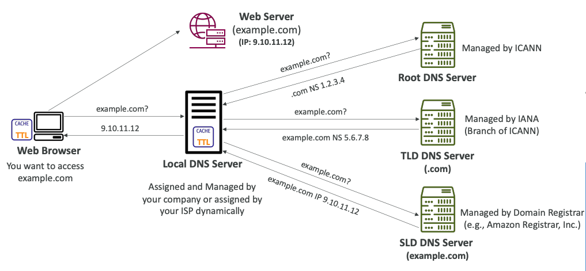

---

### Route 53 - Record Types

- A : 호스트네임을 IPv4에 매핑
  - IP주소와 도메인 주소를 매핑할 때 사용하는 레코드로써 하나의 도메인에 여러 개의 IP 주소를 등록할 수 있습니다.
  - ex. naver.com의 A레코드를 조회하였을 때 125.209.222.141, 125.209.222.142, ...
- AAAA : 호스트네임을 IPv6에 매핑
- CNAME : 호스트네임을 다른 호스트네임에 매핑
  - 대상은 A 도는 AAAA 레코드가 있어야 하는 도메인 이름
  - DNS 네임스페이스의 최상위 노드(Zone Apex)에 대한 CNAME 레코드는 생성할 수 없음
  - ex. example.com에 대해서는 생성할 수 없지만 www.example.com에 대해서는 생성할 수 있음
- NS : 호스팅 영역의 이름. (Name Server)
  - 도메인에 대한 트래픽 라우팅 방법 제어
  - ex. naver.com의 NS record = e-ns.naver.com, ns1.naver.com, ns2.naver.com
- SOA : 도메인 정보를 가지고 있는 레코드
  - ex. naver의 경우 ns1.naver.com webmaster.naver.com 2021012809 21600 1800 1209600 180

> Zone Apex
>
> Zone Apex는 루트 도메인, 네이키드 도메인(Naked Domain)이라고도 하며. 이름 그대로 서브 도메인이 붙지 않은 상태를 뜻한다. DNS RFC(RFC 1033)에 루트 도메인은 A 레코드만 지정할 수 있다고 정의되어 있다.

---

### Route 53 - Hosted Zones

- 트래픽을 도메인 및 해당 하위 도메인으로 라우팅하는 방법을 정의하는 레코드용 컨테이너
- **Public Hosted Zones** : 인터넷 (공개 도메인 이름)에서 트래픽을 라우팅 하는 방법을 지정하는 레코드를 포함
- **Private Hosted Zones** : 하나 이상의 VPC내에서 트래픽을 라우팅하는 방법을 지정하는 레코드를 포함
- Host Zone마다 요금을 지불해야한다 ($0.50 per month)

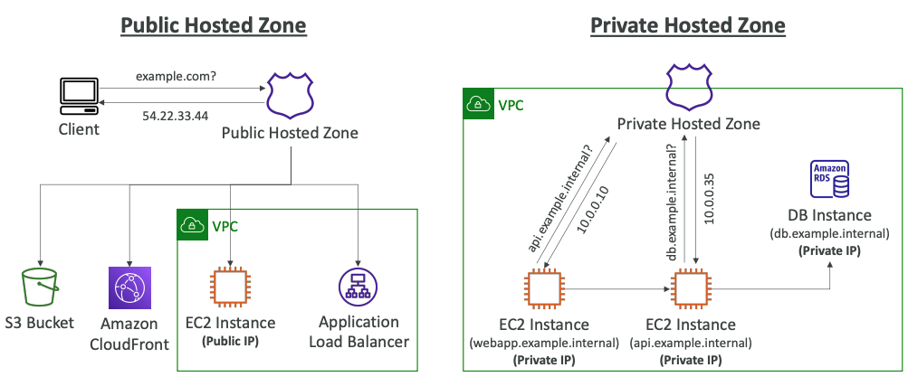

---

### Route 53 - Records TTL (Time To Live)

- **Alias 레코드를 제외하고 각 DNS 레코드에 대해 TTL은 필수적이다**
- High TTL - ex. 24 hr
  - Route 53에 부하가 적지만, 사용자가 오래된 record를 사용할 수 있다
- Low TTL - ex. 60 sec
  - Route 53에 부하가 많지만, 사용자가 비교적 최신의 record를 사용할 수 있다
  - record를 자주 변경할 수 있다

---

### CNAME vs Alias

- AWS 리소스는 AWS 호스트네임을 노출시킨다
  - lb1-1234.us-east-2.elb.amazonaws.com
  - myapp.mydomain.com

**CNAME**

- DNS 쿼리를 DNS 레코드로 리디렉션할 수 있다
- app.mydomain.com => blabla.anything.com
- **루트 도메인이 아는 경우에만 사용 가능**

**Alias**

- 별칭 레코드
- AWS 리소스로만 리디렉션할 수 있다
  - app.mydomain.com => blabla.amazonaws.com
- **루트 도메인이든 아니든  사용 가능**
- 무료
- 네이티브 health check

---

### Route 53 - Alias Records

- 호스트네임을 AWS 리소스에 매핑
- DNS 기능 확장
- 리소스의 IP 주소 변경을 자동으로 인식
- CNAME과 달리 DNS 네임스페이스의 최상위 노드(Zone Apex)에서 사용 가능
  - ex. example.com
- Alias Record는 AWS 리소스에 대해 항상 A/AAAA 유형이다 (IPv4/IPv6)
- **TTL 설정이 불가능하다**

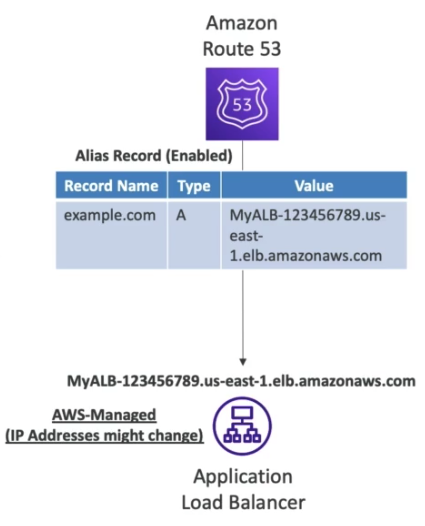

---

### Route 53 - Alias Record 대상

- Elastic Load Balanacer
- CloudFront Distributions
- API Gateway
- Elastic Beanstalk environment
- S3 Websites
- VPC Interface EndPoints
- Global Accelerator
- Route 53 record (같은 호스트 존에 있는 경우)
- **EC2 DNS 이름에는 Alias record 설정이 불가능하다**

---

### Route 53 - Routing 정책

- Route 53이 DNS 쿼리에 응답하는 방식 정의
- "Routing"이라는 단어때문에 헷갈리지 말것
  - 트래픽을 라우팅하는 로드 밸런서 라우팅과 동일하지 않다
  - DNS는 트래픽을 라우팅하지 않고 DNS 쿼리에만 응답한다
- Route 53은 다음 정책을 지원한다
  - Simple - 단순 라우팅 정책
    - 도메인에 대해 특정 기능을 수행하는 하나의 리소스만 있는 경우에 사용
  - Weighted - 가중치 기반 라우팅 정책
    - 사용자가 지정하는 비율에 따라 여러 리소스로 트래픽을 라우팅하려는 경우에 사용
  - Latency based - 지연 시간 라우팅 정책
    - 여러 AWS 리전에 리소스가 있고 왕복 시간이 적은 최상위 지연 시간을 제공하는 리전으로 트래픽을 라우팅할 때 사용
  - Failover - 장애 조치 라우팅 정책
    - 액티브-패시브 장애 조치를 구성하려는 경우에 사용
  - Geolocation - 지리 위치 라우팅 정책
    - 사용자의 위치에 기반하여 트래픽을 라우팅하려는 경우에 사용
  - Geoproximity - 지리 근접 라우팅 정책
    - 리소스의 위치를 기반으로 트래픽을 라우팅하고 필요에 따라 한 위치의 리소스에서 다른 위치의 리소스로 트래픽을 보낼 경우에 사용
    - 트래픽 흐름 전용
  - Multi-Value Answer - 다중 응답 라우팅 정책
    - Route 53이 DNS 쿼리에 무작위로 선택된 최대 8개의 정상 레코드로 응답하게 하려는 경우에 사용

---

### Routing 정책 - Simple

- 일반적으로 트래픽을 단일 리소스로 라우팅
- 동일한 레코드에 여러 값 지정 가능
- 여러 값이 반환되는 경우 클라이언트는 임의의 값을 선택
- Alias가 활성화된 경우 AWS 리소스를 하나만 지정
- 상태 확인과 연결 불가능하다

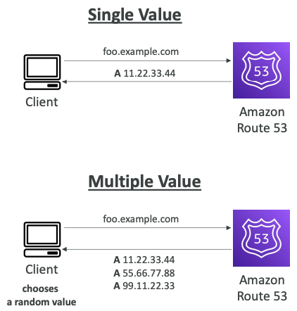

---

### Routing 정책 - Weighted

- 특정 리소스로 이동하는 요청의 비율을 제어
- 각 레코드에 상대적인 가중치를 기록한다
  - traffic(%) = 특정 레코드 가중치 / 모든 레코드 가중치의 합
  - 가중치의 합이 100이 될 필요는 없다
- DNS 레코드는 이름과 유형이 같아야 한다
- 상태 확인과 연결 가능하다
- ex. 리전간 로드 밸런싱, 새로운 어플리케이션 테스트, ...
- **리소스에 대한 트래픽 전송을 중지하려면 레코드에 가중치 0을 할당**
- **모든 레코드의 가중치가 0이라면 모든 레코드는 똑같이 받는다**

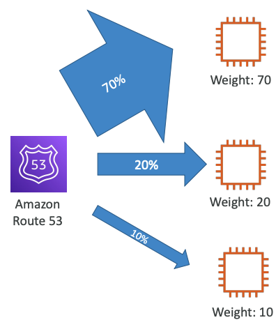

---

### Routing 정책 - Latency based

- 최소한의 지연을 위해 가장 가까운 곳으로 리다이렉션
- 낮은 지연시간이 필요할 때 유용하다
- **지연은 사용자와 AWS 리전 간의 트래픽을 기반으로 한다**
- 상태 확인과 연결 가능 (장애조치 있음)

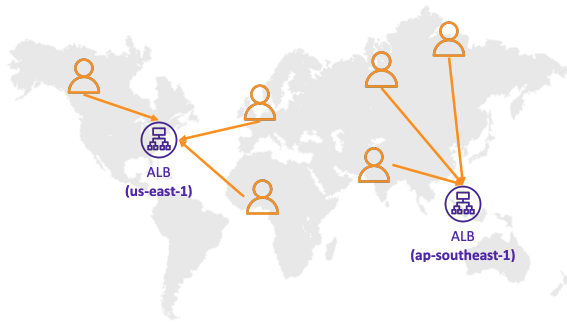

---

### Route 53 - 상태 확인

- HTTP 상태 확인은 public 리소스 전용이다
- 상태확인 -> 자동 장애 조정
  1. 엔드포인트를 모니터링하는 상태 확인 (어플리케이션, 서버, 다른 AWS 리소스)
  2. 다른 상태 확인을 모니터링하는 상태 확인 (Calculated Health check : And, Or, Not을 사용해 상태 확인의 결과를 단일 값으로 결합할 수 있다)
  3. CloudWatch 경보를 모니터링하는 상태 확인 (DynamoDB의 스로틀, RDS에 대한 경보, 사용자 지정 지표 등 private 자원 사용시 유용)
- 상태 확인은 CW 지표와 통합된다 (CloudWatch로도 확인 가능)

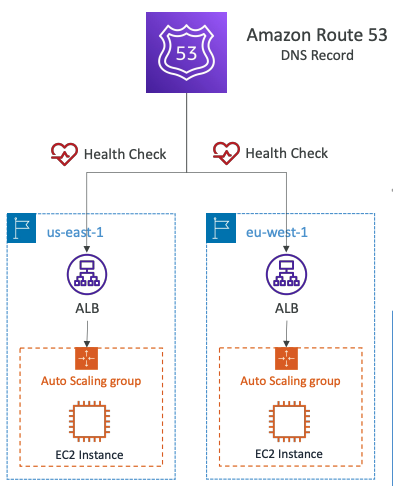

---

### 상태 검사 - 엔드포인트 모니터링

- 약 15개의 글로벌 상태 검사가 엔드포인트 상태를 확인한다
  - 정상/비정상 임계치 - 기본값 : 3
  - 상태 확인 간격 - 30초 (10초로 설정도 가능하지만 비용이 더 든다)
  - 지원되는 프로토콜 : HTTP, HTTPS, TCP
  - 18% 이상의 상태 검사기가 엔드포인트 상태가 정상이라 판단하면, Route 53이 해당 엔드포인트를 정상이라고 간주한다.
  - 사용할 Route 53의 위치 선택 가능
- 상태 검사는 엔드포인트가 2xx, 3xx 상태코드로 응답할경우에만 통과한다
- 상태 검사는 응답의 처음 **5120 바이트**에 있는 텍스트를 기반으로 통과/실패하도록 설정 가능하다
- Route 53 상태 검사기에서 들어오는 요청을 허용하도록 라우터/방화벽을 구성해야 한다

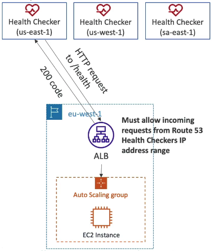

---

### Route 53 - Calculated Health Checks

- OR, AND, NOT을 사용하여 여러 상태 검사의 결과를 하나의 상태 검사 결과로 조합해준다
- 256개의 자식 상태 검사를 모니터링할 수 있다
- 상위 상태 검사르 통과하기 위해 통과해야하는 상태 검사의 수를 지정해야 한다
- ex. 모든 상태 확인이 실패하지 않도록 웹사이트 유지 관리 수행

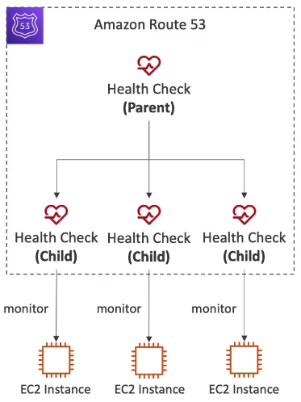

---

### Health Checks - Private Hosted Zones

- Route 53 상태 검사기는 VPC 외부에 있기 때문에 **private 엔드포인트로 접근이 불가능**하다
- CloudWatch 지표를 생성하고, CloudWatch 알람을 연결한 다음 경보 자체를 확인하여 상태 검사가 가능하다

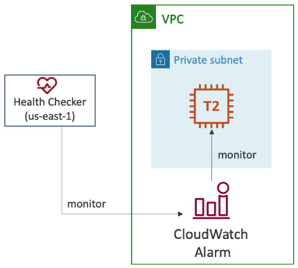

---

### Routing 정책 - FailOver

- Primary, Secondary 두 개의 레코드를 지정하며, Primary 레코드가 정상상태이면 Route 53은 Primary Record를 반환하고, 비정상상태라면 장애조치를 위해 Secondrary Record를 반환한다
  - 원한다면 Secondary도 상태 검사를 수행할 수 있다

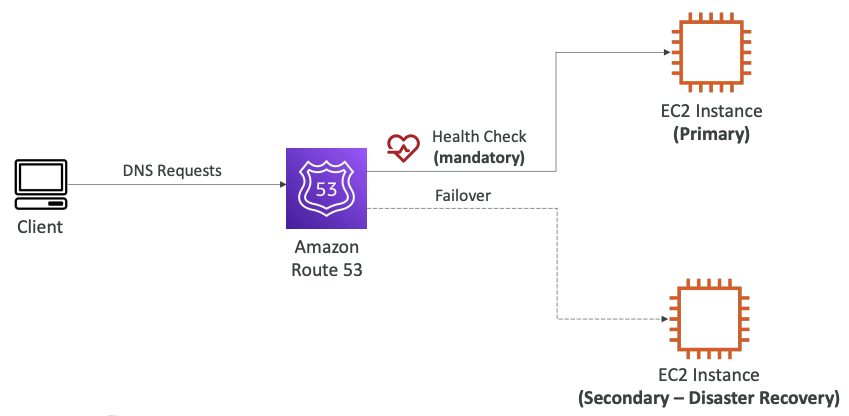

---

### Routing 정책 - Geolocation

- **사용자 위치를 기반으로 하는 라우팅**
- 대륙, 국가, 미국 주 별로 위치를 지정하여 사용 (중복되는 경우 가장 정확한 위치가 선택됨)
- 위치가 일치하는 항목이 없을 경우를 대비하여 '기본' 레코드를 생성해야 한다
- Latency-based와는 다르다!
- ex. 웹사이트 현지화, 콘텐츠 배포 제한, 로드 밸런싱, ...
- 상태 검사를 수행할 수 있다

---

### Routing 정책 - Geoproximity

- 트래픽 흐름 전용
- 사용자 및 리소스의 지리적 위치를 기반한 리소스로 트래픽을 라우팅한다
- **bias**라는 값을 정의하여 해당 리소스로 라우팅하는 지리적 리전의 크기를 조절할 수 있다
  - **bias**로 해당 리소스로 라우팅하는 트래픽 양을 조절할 수 있게 된다
  - bios는 -99 ~ 99 의 값에 비례하여 리전의 크기를 축소, 확장시킬 수 있다
- 리소스는 AWS리소스일 도 있고 그 외의 리소스일 수도 있다. AWS 리소스의 경우 AWS 리전을, AWS리소스가 아닌 경우 위도 및 경도를 지정한다
- 이 기능을 사용하려면 Route 53의 **흐름 제어(Traffix Flow)** 기능를 사용해야한다

|       bias 0 / 0       |       bias 0 / 50       |
| :-----------------------: | :-----------------------: |
| 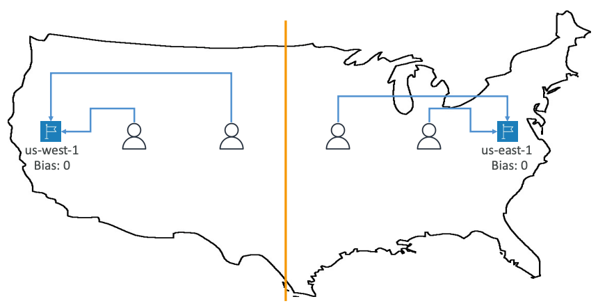 | 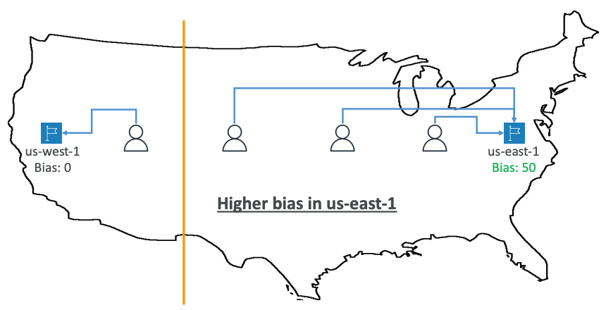 |

> **흐름 제어**
>
> - 크고 복잡한 구성에서 레코드 생성 및 유지 관리 프로세스를 단순화해준다
> - 복잡한 라우팅 결정 트리를 관리하는 GUI 편집기를 제공한다
> - 설정값을 조절하여 흐름 제어 정책을 저장할 수 있다
>   - 다른 Route 53 호스팅 영역(다른 도메인 이름)에서도 적용가능하다
>   - 버전 관리를 지원한다
> 
> 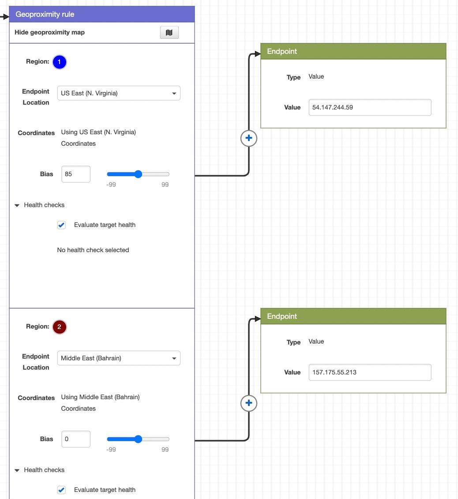

---

### Routing 정책 - Multi-Value

- 여러 리소스로 트래픽을 라우팅할 때 사용
- Route 53은 여러개 값/리소스를 반환한다
- 상태 확인과 연결하여 사용할 수 있다. (정상 리소스에 대한 값만 반환)
- 각 다중 값 쿼리에 대해 최대 8개의 정상 레코드가 반환된다
- **Multi-Value는 ELB를 대체할 수 없다**

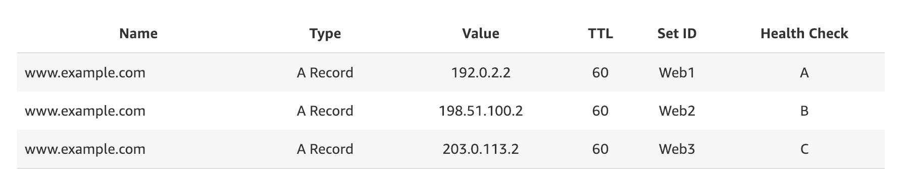

---

### Domain Registar vs Domain Service

- 연간 요금을 지불하여 도메인 등록 기관에 도메인 이름을 구입하거나 등록할 수 있다.
  - GoDaddy, Amazon Registrar, ...
- 도메인 등록 기관은 일반적으로 DNS 레코드를 관리하기 위한 DNS 서비스를 제공한다
- 하지만 DNS 레코드를 관리하기 위해 다른 DNS 서비스를 사용할 수는 없다
- ex. GoDaddy에서 도메인을 구입하고 Route 53을 사용하여 DNS 레코드를 관리

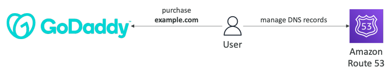

---

### Amazon Route 53 & 서드파티 등록 대행자

- 서드파티 Domain registrar를 사용해도 Route 53를 DNS 서비스 제공자로 사용할 수 있다
  1. Route 53에서 호스팅 영역 생성
  2. Route 52 NS 생성 후 타사 웹사이트에서 NS 레코드 업데이트
- **Domain Registrar != DNS Service**
  - 그렇지만 모든 도메인 등록 기관에는 일반적으로 일부 DNS 기능이 함께 제공된다

