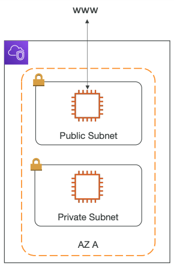
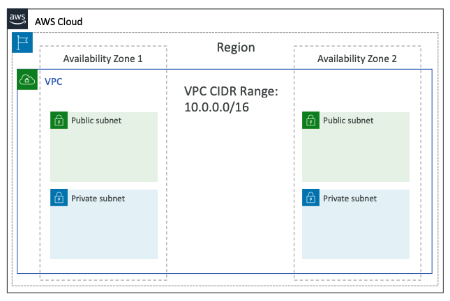
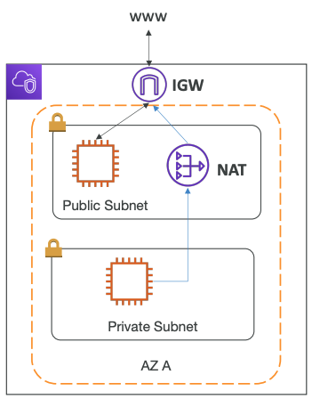
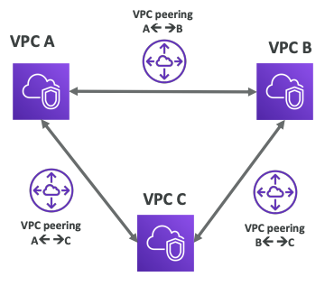
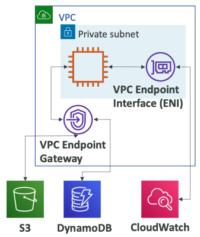
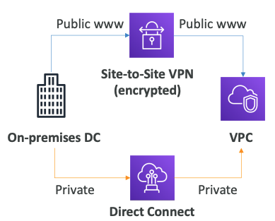
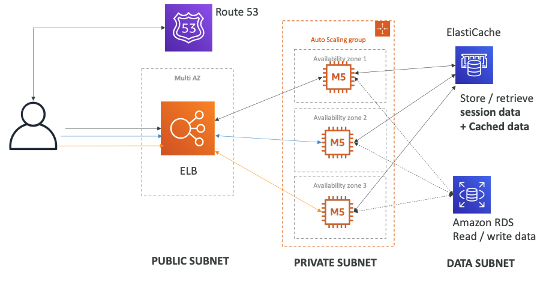
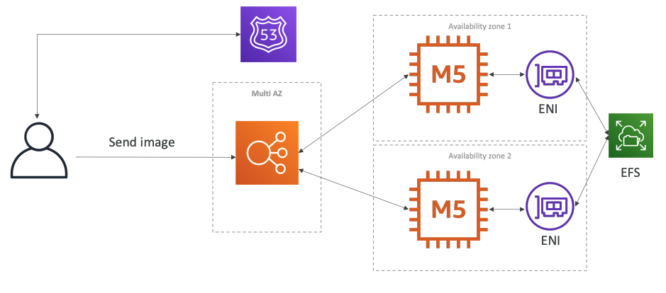
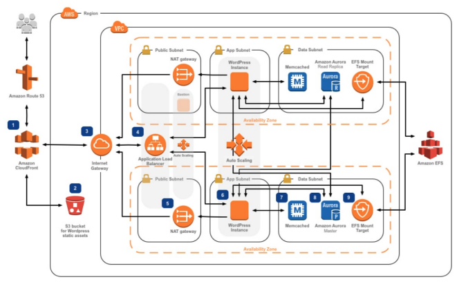

# VPC 입문

---

## VPC & Subnets

### 개요

- VPC : 리소스 배포를 위한 private 네트워크 (지역 리소스)
- Subnets : 서브넷을 사용하면 VPC(가용 영역 리소스) 내에서 네트워크를 분할할 수 있다
- Public Subnet : 인터넷 접속이 가능한 서브넷
- Private Subnet : 인터넷 접속이 불가능한 서브넷
- 인터넷 및 서브넷 간의 액세스를 정의하기 위해 **라우팅 테이블**을 사용한다

### Internet Gateway & NAT Gateway

- 인터넷 게이트웨이 : VPC 인스턴스가 인터넷에 연결할 수 있도록 해준다
  - public 서브넷은 인터넷 게이트웨이에 대한 경로가 있다
- NAT Gatewteway (AWS관리) & NAT Instances (개인관리) : private 서브넷의 인스턴스가 private 상태를 유지하면서 인터넷에 액세스 할 수 있게 해준다

### Network ACL & Security Group

- NACL (Network ACL)
  - 서브넷으로 오고가는 트래픽을 컨트롤하는 방화벽
  - 허용(ALLOW), 차단(DENY) 규칙을 설정할 수 있다
  - **서브넷 수준에서 동작**한다
  - IP 주소에 대해서만 규칙을 설정할 수 있다
  - stateless - 규칙에 예외가 없음
- 보안 그룹 (Security Group)
  - **ENI/EC2 인스턴스**로 오고가는 트래픽을 컨트롤하는 방화벽
  - 허용(ALLOW) 규칙만 설정할 수 있다
  - IP 주소와 다른 보안그룹에 대해서 규칙을 설정할 수 있다
  - stateful - 규칙에 예외가 있음. Outbound가 허용되지 않았더라도, 인바운드에 대한 Response를 전송할 수 있다

| 보안 그룹                              | NACL                                                                           |
| ---------------------------------------- | -------------------------------------------------------------------------------- |
| 인스턴스 레벨에서 동작                 | 서브넷 레벨에서 동작                                                           |
| 각각의 인스턴스에 보안그룹을 설정한다  | 서브넷의 모든 인스턴스에 적용된다                                              |
| 허용 규칙만 사용 가능                  | 허용, 차단 규칙 사용 가능                                                      |
| Stateful                               | Stateless                                                                      |
| 모든 규칙을 통과해야 트래픽이 허용된다 | 트래픽 허용/차단 규칙에 우선순위가 있으며 우선순위가 높은 규칙에 따라 처리한다 |

### VPC Flow Logs

- 인터페이스로 가는 IP 트래픽에 대한 정보를 캡쳐한다
  - VPC Flow Logs
  - Subnet Flow Logs
  - Elastic Network Interface(ENI) Flow Logs
- 연결성 문제를 모니터링하고 문제 해결하는데 도움이 된다
  - 서브넷 -> 인터넷
  - 인터넷 -> 서브넷
  - 서브넷 -> 서브넷
- AWS가 관리하는 인터페이스에서도 네트워크 인터페이스를 캡쳐할 수 있다
  - Elastic Load Balancer, ElastiCache, RDS, Aurora, ...
- VPC Flow logs 데이터는 S3/CloudWatch Log로 전달될 수 있다

### VPC Peering

- AWS 네트워크를 사용하여 2개의 VPC를 private하게 연결하는 방법
  - 2개의 VPC가 서로 같은 네트워크 안에서 동작하는것처럼 해준다
- CIDR 영역이 겹치면 안된다
- VPC Peering은 전이적이지 않기 때문에, 모든 VPC에 대해 Peering 하기 위해 N:N 연결을 해야한다

### VPC Endpoints

- Endpoints는 private 네트워크를 사용하고 있는 AWS 서비스에 연결할 수 있도록 해준다.
- AWS 서비스에 액세스 하기 위한 보안이 강화되고, 지연시간이 단축된다
- VPC Endpoint Gateway : S3 & DynamoDB
- VPC Endpoint Interface : S3 & DynamoDB 외 나머지
- **VPC내에서만 사용가능하다**

### Site to Site VPN & Direct Connect

- Site to Site VPN
  - 온프레미스 VPN을 AWS에 연결
  - 연결과정은 자동적으로 암호화될 것
  - 인터넷을 통해 데이터 전송
- Direct Connect (DX)
  - 온프레미스와 AWS 사이에 물리적인 연결 설정
  - 연결은 외부로 노출되지 않을것이기 때문에 안전하고, 빠르다
  - 사설망을 통해 데이터 정송
  - 연결까지의 최소 한달이상의 기간이 소요된다

- 방식에 차이가 있을 뿐 두 방식 모두 동일한 목적을 위해 수행된다

> VPC Endpoint로는 접근할 수 없다는걸 기억하자

---

## 정리

- VPC : Virtual Private Cloud. Region에 종속
- Subnets : VPC의 하위 네트워크. AZ에 종속
- Internet Gateway : . 인터넷 연결 기능 제공. VPC 레벨에서 사용.
- NAT Gateway / Instances : private 서브넷에 인터넷 연결 기능 제공.
- NACL : In/Outbound Subnet 방화벽. Stateless.
- Security Groups : Inbound 인스턴스 방화벽. Stateful.
- VPC Peering : 두 VPC를 같은 네트워크에 있는것처럼 만들어주는 기능 제공. IP범위는 중복되면 안됨. N:N 연결 필요
- VPC Endpoints : VPC 내부의 AWS 서비스가 private 서브넷에 연결할 수 있도록 기능 제공
- VPC Flow Logs : 네트워크 트래픽 로그
- Site to Site VPN : 온프레미스 DC와 AWS 사이에 인터넷을 사용한 VPN
- Direct Connect : AWS와의 직접적인 private 연결

### 전형적인 AWS 3계층 솔루션 아키텍쳐

### WordPress on AWS 아키텍쳐 예시

- 단순구조

---

- 상세구조

