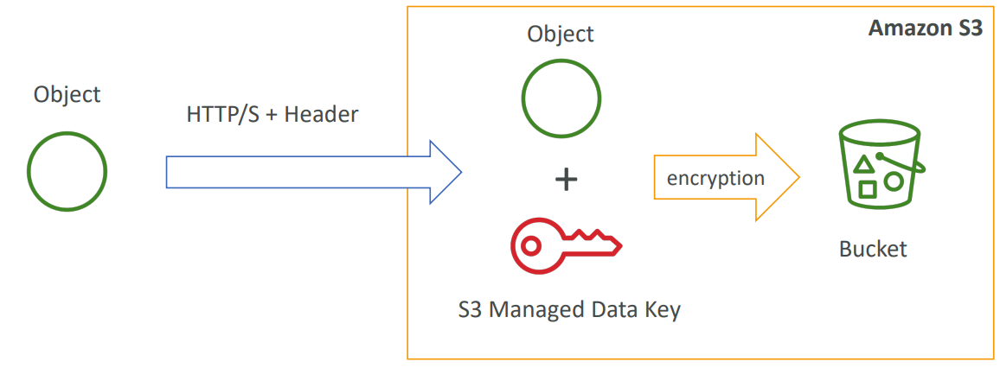
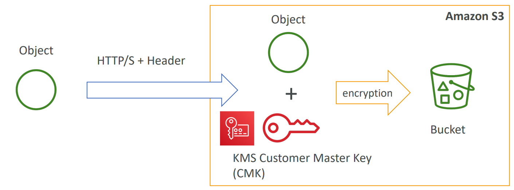
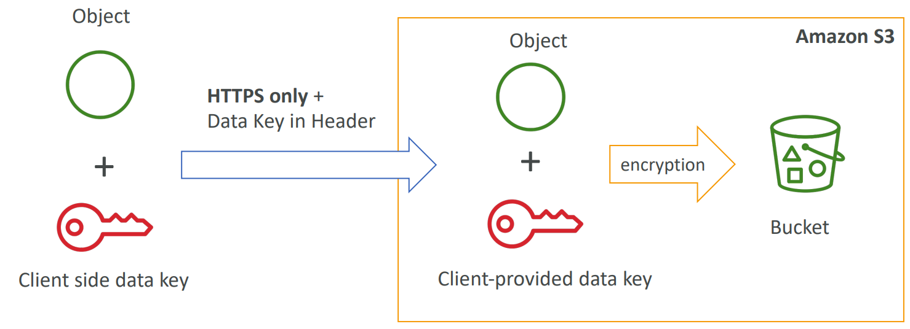
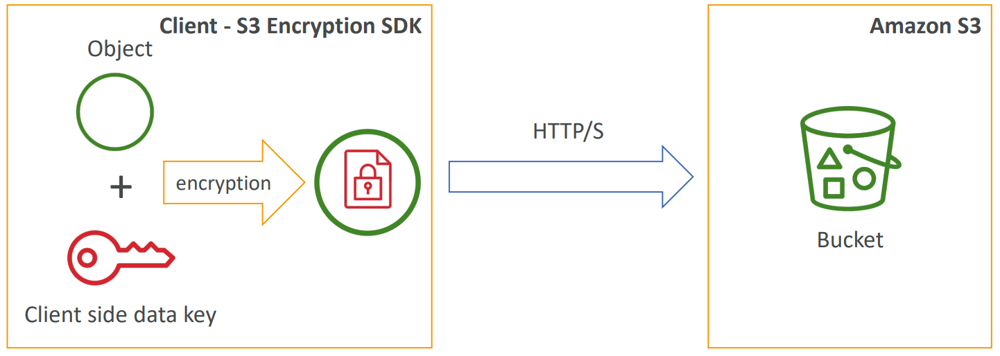
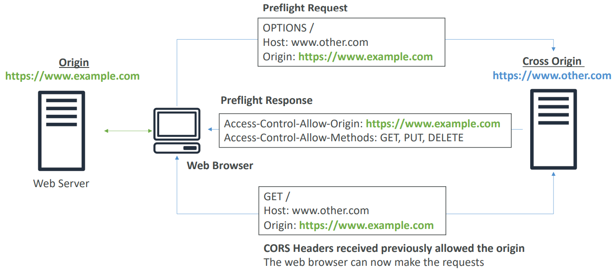
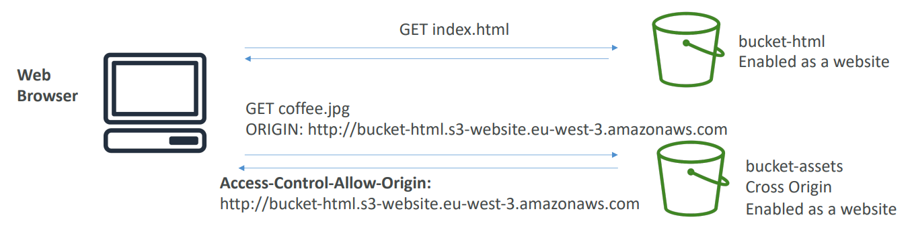

# Amazon S3

---

### Amazon S3 개요 - Bucket

- Amazon S3는 버킷(디렉토리)에 객체(파일)을 저장할 수 있게 해준다
- Bucket은 **전역적으로 고유한 이름**을 가져야 한다
- 버킷은 리전에 종속되어있다
- 버킷의 명명규칙은 다음과 같다
  - 대문자 금지
  - 밑줄(_) 금지
  - 3-36개의 문자 길이
  - IP 금지
  - 소문자 또는 숫자로 시작해야함

---

### Amazon S3 개요 - Objects

- Object(객체, 파일)는 키를 가지고 있다
- 키는 prefix + object 이름의 조합으로 만들어지며, 키 값은 전체 경로이다
  - ex. s3://my-bucket/my_file.txt
    - prefix : my-bucket
    - object 이름 : my_file.txt
  - ex. s3://my-bucket/my_folder1/another_folder/my_file.txt
    - prefix : my-bucket/my_folder1/another_folder
    - object 이름 : my_file.txt
- 버킷 안에는 디렉토리라는 개념이 없다
  - UI에 "/"가 있어 디렉토리가 있는것처럼 보이지만 실제로는 그렇지 않다. "/"가 포함된 매우 긴 키 이름일 뿐이다.
- Object 값은 내용물이다
  - 최대 object 크기는 5TB
  - 5GB이상의 크기를 업로드할 경우, "multi-part upload"기능을 사용해야한다
- Metata - 텍스트 키/값 쌍의 목록. 시스템이나 사용자 메타데이터
- Tags - 유니코드 키/값 페어. 최대 10개. 보안/수명주기 관리에 유용
- Version ID - 버전관리가 활성화된 경우 사용

---

### Amazon S3 - Versioning

- Amazon S3에 있는 파일에 버전을 부여할 수 있다
- 버전 부여 작업은 **Bucket level** 에서만 가능하다
- 같은 키로 덮어씌울 경우 버전이 1, 2, 3, ... 으로 순차적으로 증가한다
- 버킷의 버전 관리 모범 사례
  - 의도치않은 삭제로부터 보호 (버전을 저장하는 기능)
  - 이전 버전으로 롤백하기 쉽다
- 주의사항
  - 버전 관리를 활성화 하기 전에 버전이 지정되지 않은 모든 파일의 버전은 "null"이다
  - 버전 관리를 일시 중단해도 이전 버전은 삭제되지 않는다

---

### S3 Objects 암호화

- S3의 Object를 암호화하는 4가지 방법
  - SSE-S3 : AWS에서 처리 및 관리하는 키를 사용하여 S3 객체 암호화
  - SSE-KMS : AWS Key Management Service를 활용하여 암호화 키 관리
  - SSE-C : 자신의 암호화 키를 관리하려는 경우 사용
  - 클라이언트 측 암호화

---

### SSE-S3

- SSE-S3 : Amazon S3에서 처리 및 관리하는 키를 사용한 암호화
- Object가 서버 측에서 암호화됨
- AES-256암호화 유형
- 다음과 같은 헤더를 설정해야 한다. `"x-amz-server-side-encryption": "AES256"`



---

### SSE-KMS

- KMS : Key Managemnet Service
- SSE-KMS : KMS에 의해 관리되는 키를 사용한 암호화
- KMS의 장점 : 사용자 제어 + 감사 추적 가능
- Object가 서버 측에서 암호화됨
- 다음과 같은 헤더를 설정해야 한다. `"x-amz-server-side-encryption": "aws:kms"`



---

### SSE-C

- SSE-C : AWS외부에서 **고객이 완전히 관리**하는 데이터 키를 사용한 서버측 암호화
- Amazon S3는 사용자가 제공한 **암호화 키를 저장하지 않는다**
- 암호화 전송을 위해 **HTTPS를 사용해야 한다**
- 모든 HTTP 요청에 대해 HTTP 헤더에 암호화 키를 제공해야 한다



---

### 클라이언트 측 암호화

- Amazon S3 암호화 클라이언트와 같은 클라이언트 라이브러리
- 클라이언트는 데이터를 S3로 보내기 전에 데이터를 자체적으로 암호화 해야 한다
- 클라이언트는 S3에서 데이터를 검색한 뒤 자체적으로 해독해야 한다
- Consumer가 키와 암호화 주기를 완전히 관리해야 한다



---

### 전송 중 암호화 (SSL/TLS)

- Amazon S3의 노출 부분은 다음과 같다
  - HTTP Endpoint (암호화 되지 않음)
  - HTTPS Endpoint (SSL/TLS를 통한 전송 중 암호화)

- Endpoint의 선택은 자유지만 HTTPS 사용을 권장한다
- 대부부의 클라이언트는 기본적으로 HTTPS Endpoint를 사용한다

- HTTPS 는 SSE-C 사용이 필수적이다
- 전송 중 암호화는 SSL/TLS 라고 부른다

---

### S3 보안

- 사용자 기반
  - IAM 정책 - IAM 콘솔에서 특정 사용자에 대해 허용되어야 하는 API 호출
- 리소스 기반
  - 버킷 정책 - S3 콘솔의 버킷 전체 규칙 (교차 계정 허용)
  - Object Access Control List (ACL) - 더 세밀한 조작
  - Bucket Access Control List (ACL) - 덜 자주 사용

- IAM보안 주체는 다음의 경우 Object에 접근 가능하다
  - 사용자 IAM 권한이 허용하거나 리소스 정책이 이를 허용하는 경우
  - 명시적 DENY가 없는 경우

---

### S3 Bucket 정책

- Json 기반 정책
  - Resources : Bucket & Objects
  - Action : Allow/Deny API Set
  - Effect : Allow/Deny
  - Principal : 정책을 적용할 계정 또는 유저

> ```json
> {
>   "Version":"2012-10-17",
>   "Statement":[
>     {
>       "Sid":"PublicRead",
>       "Effect":"Allow",
>       "Principal":"*",
>       "Action":[
>         "s3:GetObject"
>       ],
>       "Resource":[
>         "arn:aws:s3:::examplebucket/*"
>       ]
>     }
>   ]
> }
> ```

- S3 Bucket 정책은 다음과 같은 상황에서 사용한다
  - Bucket에 대한 공개 액세스 권한 부여
  - 업로드시 Object에 대한 암호화 강제
  - 다른 계정에 대한 액세스 권한 부여 (Cross Account)

---

### 공개 액세스 차단을 위한 버킷 설정

- 다음의 경우 Buckets/Objects의 공개 액세스를 차단한다
  - 새로운 access control lists (ACLs)
  - 모든 access control lists (ACLs)
  - 새로운 공개 bucket이나 액세스 포인트 정책
- 공개 버킷 또는 액세스 포인트 정책을 통해 버킷 및 객체에 대한 공개 및 교차 계정 액세스를 차단한다

- **이 설정들은 회사 데이터 유출 방지를 위해 만들어졌다**
  - 만약 Bucket이 절대 공개되선 안되는 경우 위 설정을 활성화한다
- 계정 레벨에서 설정 가능하다

---

### S3 Security - 그 외

- 네트워킹
  - VPC Endpoint 지원 (외부 인터넷(www)이 없는 VPC 인스턴스에 사용)
- Logging / Audit
  - S3 액세스 로그는 다른 S3 버킷에 저장할 수 있다
  - API 호출은 AWS CloudTrail에 기록할 수 있다
- 유저 보안
  - MFA 삭제 : Objects를 삭제하려면 버전이 지정된 버킷에서 MFA가 필요할 수 있다
  - Pre-Signed URLs : 제한된 시간동안만 유효한 URL (ex. 로그인한 사용자를 위한 프리미엄 비디오 서비스)

---

### S3 웹사이트

- S3는 정적 웹사이트를 호스팅하고 www에서 액세스 할 수 있다
- 웹사이트 URL은 다음과 같은 형식을 가진다
  - `<bucket-name>.s3-website-<AWS-region>.amazonaws.com`
  - `<bucket-name>.s3-website.<AWS-region>.amazonaws.com`
- 403(Forbidden) 에러를 수신한다면, Bucket 정책 중 public reads가 허용되었는지 확인해볼 것

---

## CORS

- 교차 출처 리소스 공유(Cross-Origin Resource Sharing, CORS)
- **origin** : 스키마(프로토콜), 호스트(도메인), 포트
  - ex. https://www.example.com
    - `https://` : 스키마(프로토콜)
    - `www.example.com` : 호스트(도메인)
    - `:443` : 포트. HTTPS 프로토콜의 경우 암시적으로 443 포트 사용. HTTP의 경우 80 포트 사용

- 하나의 main origin에서 로드된 콘텐츠가 다른 origin의 서버에서 사용 가능한 선택된 리소스에 액세스할 수 있도록 하는 **웹 브라우저 기반 메커니즘**
- 동일한 origin: **http://example.com**/app1 & **http://example.com**/app2
- 다른 origins: **http://www.example.com** & **http://other.example.com**
- CORS 헤더(ex. Access-Control-Allow-Origin)를 사용하여 다른 orign에서 요청을 허용하지 않는 한 요청이 이행되지 않는다



---

### S3 CORS

- 클라이언트가 S3 버킷에 대해 교차 출처 요청을 수행하는 경우 올바른 CORS 헤더를 활성화해야 한다
- 특정 origin 또는 *(모든 origin)에 대해 허용할 수 있다



---

### Amazon S3 - 일관성 모델

- 2020년 12월 기준으로 강력한 일관성 제공

- 새로운 객체를 write하거나, overwrite하거나, 기존 object를 삭제한 뒤에
  - 모든 후속 읽기 요청은 최신 버전의 객체를 즉시 반영하며(쓰기 일관성 후 읽기)  모든 후속 목록 요청은 변경 사항을 즉시 반영한다. (목록 일관성)

- 성능에 미치는 영향 / 추가 비용 없이 사용가능하다