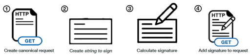

# Developing on AWS (CLI, SDK, IAM 정책)

### AWS CLI Dry Runs

- AWS CLI 사용시 Dry Run 옵션과 함께 명령을 수행하면, AWS에서 권한이 있는지 확인하며 실제로 명령이 수행되지는 않는다.
  - 권한이 있는지 여부를 확인만 할 경우 사용됨

- 일부 AWS CLI 명령은 성공할 경우 비용이 많이 들 수 있기 때문에 (ex. EC2 생성 명령 등..), 권한이 있는지만 확인해보고 싶을 때 Dry run을 사용하면 유용하다
- 일부 AWS CLI 명령에는 `--dry-run` 옵션이 포함되어 있기도 하다
  - 모든 명령어에 포함된건 아니다

---

### AWS CLI STS Decode Errors

- API 호출을 실행하고 실패할 경우 긴 오류 메시지가 표시될 수 있는데, 이 오류 메시지는 STS 명령줄을 사용하여 디코딩 할 수 있다
- sts decode-authorization-message

---

### AWS EC2 Instance Metadata

- AWS EC2 Instance Metatdata는 강력하지만 개발자에게 가장 알려지지 않은 기능 중 하나
- EC2 인스턴스가 IAM Role을 사용하지 않고, 자신에 대해 알 수 있게 해준다
- URL : `http://169.254.169.254/latest/meta-data`
  - 위 주소는 내부망 주소이며, EC2 인스턴스에서만 동작한다
  - ex. `curl http://169.254.169.254/latest/meta-data/`
    - ex. `curl http://169.254.169.254/latest/meta-data/instance-id`
    - ...
- 메타데이터에서 IAM 역할 이름을 검색할 순 있지만 IAM 정책을 검색할 수는 없다
- Metadata = EC2 인스턴스에 대한 정보
- Userdata = EC2 인스턴스의 시작 스크립트

---

### MFA with CLI

- CLI와 MFA를 같이 사용하려면 임시 세션을 생성해야하며, `STS GetSessionToken` API를 호출해야 한다
- ex. `aws sts get-session-token --serial-number arn-of-the-mfa-device --tokencode code-from-token --duration-seconds 3600`

---

### AWS SDK 개요

- 어플리케이션 코드에서 직접 AWS에서 작업을 수행할 경우 SDK를 사용하면 된다
  - CLI를 사용하지 않고 코드에서 직접 사용
- 공식 SDK는 다음과 같다
  - Java
  - .Net
  - Node.js
  - PHP
  - Python
  - Go
  - Ruby
  - C++
- DynamoDB와 같은 AWS 서비스에 대해 코딩할 때는 AWS SDK를 사용해야 한다

> 참고
> - 기본 리전을 지정하거나 구성하지 않으면 기본적으로 `us-east-1`이 선택된다
> - AWS CLI는 Python SDK(boto3)를 사용한다

---

### AWS Limits (Quotas)

- API Rate Limits
  - EC2의 **DescribeInstances** API는 초당 100회 호출로 제한된다
  - S3의 **GetObject**에는 접두사당 초당 5500개의 GET 요청이 제한된다
  - 간헐적 오류의 경우 Exponential Backoff 구현하여 해결
  - 지속적 오류의 경우 API 조절 제한 증가를 요청하여 해결

- Service Quotas (서비스 할당량) 
  - Service Limits
  - 온디맨드 표준 인스턴스 실행 : 1152 vCPU
  - 티켓을 열어 서비스 한도 증가 요청 가능
  - **Service Quotas API**를 사용해 서비스 할당량 증가 요청 가능

---

### Exponential Backoff

- `ThrottlingException`이 간헐적으로 발생하는 경우 지수 백오프 사용
- AWS SDK API 호출이 이미 재시도 매커니즘이 포함되어 있다
- AWS API를 있는 그대로 사용하거나 특정 경우에 직접 구현해야 함
  - **5xx 서버 오류 및 조절에 대한 재시도만 구현해야 한다**
    - 5xx error : Throttling error
  - 4xx 클라이언트 오류에 대해선 구현하면 안됨

---

### AWS CLI 자격 증명 공급자 체인

- CLI가 자격증명을 찾는 순서
  1. CLI 옵션 : `--region`, `--output`, `--profile`
  2. 환경 변수 : `AWS_ACCESS_KEY_ID`, `AWS_SECRET_ACCESS_KEY`, `AWS_SESSION_TOKEN`
  3. CLI 자격증명 파일 : `~/.aws/credentails`, `C:\Users\user\.aws\credentials`
  4. CLI Config 파일 : `~/.aws/config`, `C:\Users\USERNAME\.aws\config`
  5. 컨테이너 자격증명 : ECS 작업용
  6. 인스턴스 프로필 자격증명 : EC2 인스턴스 프로필용

---

### AWS SDK 기본 작격 증명 공급자 체인

- Java SDK가 자격증명을 찾는 순서
1. Java 시스템 속성 : `aws.accessKeyId`, `aws.secretKey`
2. 환경 변수 : `AWS_ACCESS_KEY_ID`, `AWS_SECRET_ACCESS_KEY`
3. 기본 자격 증명 프로필 파일 : ex. `~/.aws/credentails`
4. 아마존 ECS 컨테이너 자격증명 : ECS용 컨테이너용
5. 인스턴스 프로필 자격증명 : EC2 인스턴스에서 사용

> AWS 자격증명 시나리오
> 
> EC2 인스턴스의 환경변수에 설정된 자격증명과, 인스턴스 프로필 자격증명이 동시에 설정될 경우 우선순위가 더 높은 환경변수의 자격증명이 적용된다.

---

### AWS 자격증명 Best Practice

- Best Practice : 작격 증명 체인에서 자격 증명을 상속
- **절대로 AWS 자격증명을 코드에 심지 마라**
- **AWS내에서 작업을 하는 경우 IAM 역할을 사용하라**
- AWS외부에서 작업을 하는 경우 환경변수, 명명된 프로파일 (named profile)을 사용하라

---

## Signing AWS

- AWS HTTP API를 호출할 때 AWS 자격 증명(액세스 키 및 비밀 키)을 사용하여 AWS가 사용자를 식별할 수 있도록 요청에 서명한다
  > Amazon S3에 대한 일부 요청은 서명할 필요가 없다
- SDK, CLI 를 사용하는 경우 HTTP 요청이 자동으로 서명된다
- Signature v4(SigV4)를 사용하여 AWS HTTP 요청에 서명해야 한다

---