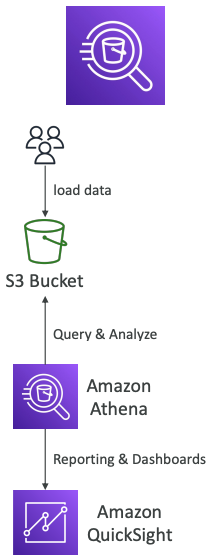

# Advanced S3 & Athena

### S3 MFA-Delete

- MFA는 사용자가 S3에서 중요한 작업을 수행하기 전에 디바이스에서 코드를 생성하도록 한다
- MFA-Delete를 사용하려면 S3 버킷에서 버전 관리를 활성화해야 한다
- 다음과 같은 작업시에는 MFA가 필요하다
  - object 버전 영구 삭제
  - bucket에서 versioning 사용 중지
- 다음과 같은 작업시에는 MFA가 필요하지 않다
  - versioning 활성화
  - 삭제된 버전 리스트화
- **버킷 소유자 (루트 계정)만 MFA-Delete를 활성화/비활성화 할 수 있다**
- MFA-Delete는 현재 CLI를 통해서만 활성화할 수 있다

---

### S3 Default Encryption vs Bucket Policies

- "암호화를 강제"하는 한 가지 방법은 버킷 정책을 사용하고 암호화 헤더 없이 S3 객체를 PUT하는 API 호출을 거부하는 것이다
- 또 다른 방법은 S3의 "기본 암호화" 옵션을 사용하는 것이다
  > "기본 암호화" 활성화 시, 이미 업로드 된 object에 대해서는 암호화 하지 않는다
  > 
  > 버킷 정책은 "기본 암호화"옵션 사용 전에 평가된다

---

### S3 Access Logs

- 감시 목적으로 S3 버킷에 대한 모든 액세스를 기록할 수 있다
- 승인 또는 거부된 모든 계정에서 S3에 대한 모든 요청은 다른 S3 버킷에 기록된다
- 해당 데이터는 데이터 분석 도구를 사용하여 분석할 수 있다
- 포맷 형식은 여기서 확인해볼 수 있다. : https://docs.aws.amazon.com/AmazonS3/latest/dev/LogFormat.html

> **주의사항**
> 
> 로깅 루프가 생성되고 버킷의 크기가 기하급수적으로 증가하기 때문에, 모니터링 버킷으로 로깅 버킷을 사용하면 안된다
> 
> 

---

### S3 Replication (CRR & SRR)

- 소스 및 대상에서 버전 관리를 활성화해야 한다
- 버킷은 다른 계정에 있을 수 있다
- 복사는 비동기식이다
- S3에 적절한 IAM 권한을 부여해야 한다

- CRR : Cross Region Replication. 리전이 다른 버킷의 복제.
  - 규정 준수, 짧은 지연 시간 액세스, 계정 간 복제
- SRR : Same Region Replcation. 리전이 같은 버킷의 복제
  - 로그 집계, 프로덕션 계정과 테스트 계정 간의 라이브 복제

> 참고사항
> 
> 복제를 활성화 할 경우 새로운 object에 대해서만 복사가된다
> - DELETE 과정에서
>   - 소스에서 타겟으로 삭제 마커를 복제할 수 있다 (옵션 설정)
>   - 버전 ID가 있는 삭제는 복제되지 않는다 (악의적인 삭제 방지)
> - "연쇄"복제 기능은 없다
>   - A-Bucket 에 대한 복제본 B-Bucket이 있고, B-Bucket 에 대한 복제본 C-Bucket이 있을 때, A-Bucket에서 생성된 Object는 C-Bucket으로 복제되지 않는다

---

### S3 Pre-Signed URLS

- SDK 또는 CLI를 사용하여 pre-signed URL 생성 가능
  - 다운로드용 : 쉬움. CLI사용 가능
  - 업로드용 : 어려움. SDK 사용해야함
- 기본적으로 3600초 동안 유효하며, `--expires-in [TIME_BY_SECONDS]` 옵션을 통해 만료 시간 변경이 가능하다
- pre-signed URL이 제공된 사용자는 GET/PUT에 대한 URL을 생성한 사람의 권한을 상속한다

- example
  - 로그인한 사용자만 S3 버킷에 프리미엄 비디오를 다운로드할 수 있도록 허용
  - URL을 동적으로 생성하여 끊임없이 변화하는 사용자 목록이 파일을 다운로드하도록 허용
  - 일시적으로 사용자가 버킷의 정확한 위치에 파일을 업로드할 수 있도록 허용

---

## S3 스토리지 클래스

- Amazon S3 Standard - General Purpose
- Amazon S3 Standard - Infrequent Access (IA)
- Amazon S3 One Zone = infrequent Access
- Amazon S3 Intelligent Tiering
- Amazon Glacier
- Amazon Glacier Deep Archive
- Amzaon S3 Reduced Redundancy Storage (deprecated-omitted)

---

### S3 Standard - General Purpose

- 멀티 AZ에서 Object의 높은 내구성 (99.999999999%)
- Amazon S3에 10,000,000 개의 object를 저장하는 경우 평균적으로 10,000년마다 한 번 단일 object 손실이 발생할 것으로 예상할 수 있다
- 주어진 해에 99.99%의 가용성
- 2개의 동시 시설 장애 유지
- 사용 사례 : 빅데이터 분석, 모바일 및 게임 어플리케이션, 콘텐츠 배포

---

### S3 Standard - Infrequent Access (IA)

- 액세스 빈도가 낮지만 필요할 때 신속하게 액세스해야 하는 데이터에 적합
- 멀티 AZ에서 object의 높은 내구성 (99.999999999%)
- 99.9% 가용성
- Amazon S3 Standard에 비해 저렴한 비용
- 2개의 동시 시설 장애 유지
- 사용 사례 : 재해 복구, 백업을 위한 데이터 저장소 ...

---

### S3 One Zone - Infrequent Access (IA)

- IA와 동일하지만 데이터가 단일 AZ에 저장된다
- 단일 AZ에서 object의 높은 내구성 (99.999999999%)
- 99.5% 가용성
- 짧은 지연 시간 및 높은 처리량 성능
- 전송 데이터 및 저장 데이터 암호화에 대해 SSL 지원
- IA에 비해 저렴한 비용 (20%)
- 사용 사례 : 온프레미스의 보조 백업 복사본 저장, 재생성 가능한 데이터의 저장

---

### S3 Intelligent Tiering

- S3 Standard와 동일한 짧은 대기 시간 및 높은 처리량 성능
- 적은 월간 모니터링 및 자동 계층화 요금
- 액세스 패턴 변경에 따라 두 액세스 계층 간 object를 자동으로 이동
- 멀티 AZ에서 object의 높은 내구성 (99.999999999%)을 위해 설계됨
- 전체 가용 영역에 영향을 미치는 이벤트에 대해 탄력적이다
- 주어진 연도 동안 99.9%의 가용성을 위해 설계됨

---

### Amazon Glacier

- 아카이빙/백업을 위한 저비용 object 스토리지
- 데이터는 장기간(10년)동안 보관됨
- 온프레미스 자기 테이브 스토리지의 대안책
- 평균 연간 내구도는 99.999999999%
- 월별 스토리지당 비용($0.004/GB) + 검색 비용
- Glacier의 각 항목은 "**Archive**"(최대 40TB)라고 한다
- 아카이브는 "**Vaults**"에 저장된다

---

### Amazon Glacier & Glacier Deep Archive

- Amazon Glacier
  - 최소 보관 기간 90일
  - 3가지 검색 옵션
    - Expedited (1~5분)
    - Standard (3~5시간)
    - Bulk (5~12시간)

- Amazon Glacier Deep Archive
  - 장기 보관용 (더 저렴)
  - 최소 보관 기간 180일
  - Standard (12시간)
  - Bulk (48시간)

---

### S3 Storage Class 비교

||S3 Standard|S3 Intelligent Tiering|S3 Standard-IA|S3 One Zone-IA|S3 Glacier|S3 Glacier Deep archive|
|---|---|---|---|---|---|---|
|내구성을 고려한 설계|99.999999999%  (11 9’s)|99.999999999%  (11 9’s)|99.999999999%  (11 9’s)|99.999999999%  (11 9’s)|99.999999999%  (11 9’s)|99.999999999%  (11 9’s)|
|가용성을 위한 설계|99.99%|99.9%|99.9%|99.5%|99.99%|99.99%|
|가용성 SLA|99.9%|99%|99%|99%|99.9%|99.9%|
|가용 영역|≥3|≥3|≥3|1|≥3|≥3|
|개체당 최소 용량 요금|||128KB|128KB|40KB|40KB|
|최소 보관 기간 요금||30일|30일|30일|90일|180일|
|검색 수수료|||GB검색 당|GB검색 당|GB검색 당|GB검색 당|
|스토리지 비용(월별 GB당)|$0.023|$0.0125~$0.023|$0.0125|$0.01|$0.004 최소 90일|$0.00099 최소 180일|
|최소 180일 검색 비용(요청 1000건당)|GET $0.0004|GET $0.0004|GET $0.001|GET $0.001|GET $0.0004 +  Expedited:$10.00 Standard:$0.05 Bulk:$0.025|GET $0.0004 + Standard:$0.10 Bulk:$0.025|
|검색 시간|즉시|즉시|즉시|즉시|Expedited(1-5분) Standard(3-5시간) Bulk(5-12시간)|Standard(12시간) Bulk(48시간)|
|모니터링 비용(object 1000개당)||$0.0025|||||

---

### S3 - Storage Class간 이동

- 스토리지 클래스 간에 object를 전환할 수 있다
- 접근 빈도가 낮은 object는 STANDARD_IA로 이동한다
- 실시간으로 필요하지 않은 아카이브 object의 경우, GLACIER 또는 DEEP_ARCHIVE로 이동한다
- **수명 주기 구성**을 사용하여 object 이동을 자동화할 수 있다

---

### S3 LifeCycle 규칙

- 전환 동작 : object가 다른 스토리지 클래스로 전환되는 시기를 정의
  - object를 생성한 후 60일 후에 Standard IA 클래스로 이동
  - 6개월 후 보관을 위해 Glacier로 이동
- 만료 작업: 일정 시간 후에 만료(삭제)되도록 개체를 구성
  - 접속 로그 파일은 365일 후에 삭제되도록 설정할 수 있다
  - 이전 버전의 파일을 삭제하는 데 사용할 수 있다(버전 관리가 활성화된 경우)
  - 불완전한 멀티파트 업로드를 삭제하는 데 사용할 수 있다
- 특정 접두사(ex. s3://mybucket/mp3/*)에 대한 규칙을 생성할 수 있다
- 특정 개체 태그(ex. 부서: 재무)에 대한 규칙을 생성할 수 있다

---

### S3 - Baseline Performance

- Amazon S3 요청량에 따라 자동으로 확장하며, 지연시간은 100-200ms 이다
- 어플리케이션은 초당 최소 3500개의 PUT/COPY/POST/DELETE요청을, 5500개의 GET/HEAD 요청을 수행할 수 있다 (bucket의 prefix당)
- 버킷의 접두사 수에는 제한이 없다

---

### S3 - KMS 제한

- SSE-KMS 사용 시 KMS 제한의 영향을 받을 수 있다
- 업로드시 **GenerateDataKey** KMS 업로드를 호출한다
- 다운로드시, **Decrypt** KMS API를 호출한다
- 초당 KMS 할당량은 초당 5500, 10000, 30000 req다. (리전에 따라 다르다) 
- Service Quotas Console을 사용하여 할당량 증가를 요청할 수 있다

---

### S3 성능

- 멀티 파트 업로드
  - 100MB 이상의 파일의 경우 권장되며, 5GB이상의 파일에는 필수사항이다
  - 병렬 업로드를 지원하기 때문에 전송 속도의 향상이 있다

- S3 전송 가속
  - 목표 리전에 있는 S3 버킷으로 데이터를 전달할 AWS 에지 로케이션으로 파일을 전송하여 전송속도를 향상시킨다
  - 멀티 파트 업로드와 호환 가능하다

#### S3 Byte Range Fetches

- 특정 바이트의 범위를 GET요청하여 병렬화하는 작업
- 실패시 복원력을 향상시킬 수 있다

> 다운로드 속도 향상을 위해 사용할 수 있다
> 
> 

> 데이터의 일부분만 검색할 경우 사용할 수 있다 (ex. 헤더파일 검색)
> 
> 

---

### S3 Select & Glacier Select

- 서버 측 필터링을 수행하여 SQL검색 시 더 적은 데이터 검색
- 행/열로 필터링 할 수 있다 (단순 SQL 문)
- 효과 : 더 적은 네트워크 전송량, 클라이언트의 더 적은 CPU비용

---

### S3 이벤트 알림

- S3:ObjectCreated, S3:ObjectRemoved, S3:ObjectRestore, S3:Replication ...
- object의 이름 필터링 가능하다 (ex. *.jpg)
- 사용 사례 : S3에 업로드된 이미지의 썸네일 생성
- **원하는 만큼 "S3 이벤트" 생성 가능**

- S3 이벤트 알림은 일반적으로 몇초 안에 전달되지만 몇 분 이상 걸릴 수도 있다
- 두개의 쓰기 작업이 단일 non-versioned object에서 동시에 발생할 경우, 하나의 이벤트 알림만 발생할 수 있다
  - 모든 이벤트 알림이 오길 원한다면, versioning을 활성화하면 된다

---

### Amazon Athena

- **S3 object에 대해 분석을 수행하는 서버리스 쿼리 서비스**
- 표준 SQL 언어를 사용하여 쿼리한다
- CSV, JSON, ORC, Avro, Parquet(Presto)을 지원한다

- 비용 : 검색된 데이터 TB당 $5.00
- 압축된 데이터 또는 열 기반 데이터를 사용하면, 더 적은 비용 (적은 검색)이 든다

- 사용 사례 : Business intelligence / analytics / reporting, analyze & query VPC Flow Logs, ELB Logs, CloudTrail trails, ...

