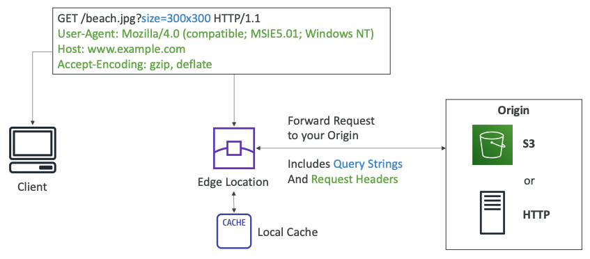
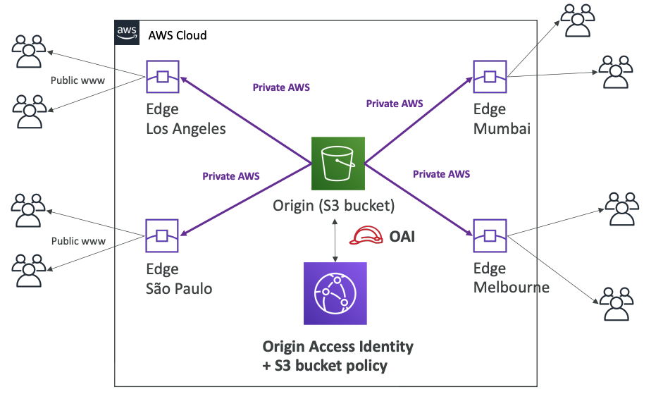
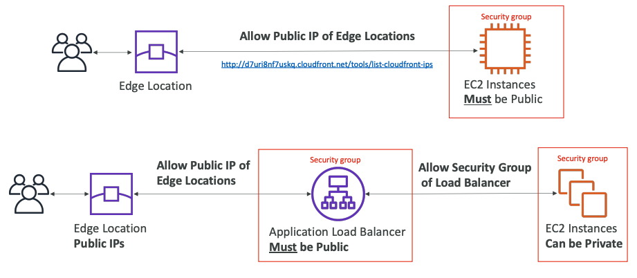
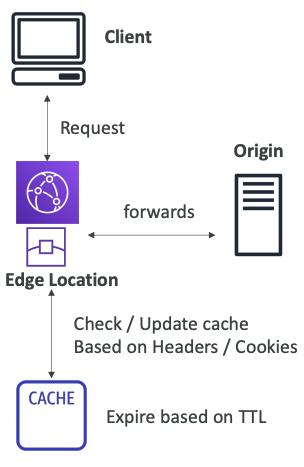
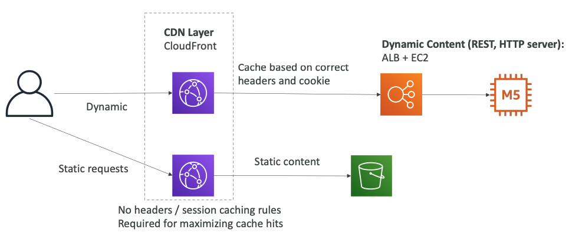
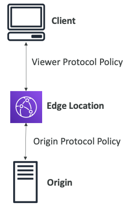
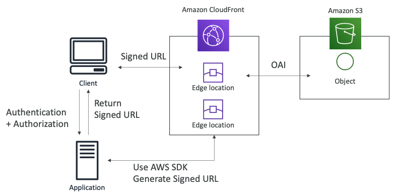
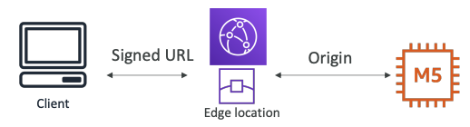
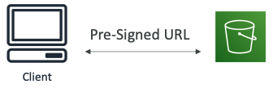

# CloudFront

---

### AWS CloudFront

- Content Delevery Network (CDN)
- 읽기 성능 향상시키고 콘텐츠가 엣지에서 캐시되도록 해준다
- 전 세계적으로 216개의 엣지 로케이션이 있다
- DDos 보호, shield 및 웹 애플리케이션 방화벽과의 통합을 제공
- 외부 HTTPS를 노출하고 내부 HTTPS 백엔드와 통신할 수 있다

---

### CloudFront - Origins

- S3 Bucket
  - 파일을 분산하고, 엣지로 캐시화하기 위해
  - CloudFront의 Origin Access Identity(OAI)로 강화된 보안
  - CloudFront는 입구로서 사용될 수 있다

- Custom Origin (HTTP)
  - Application Load Balancer
  - EC2 instance
  - S3 Website (먼저 버킷을 정적 S3 웹사이트로 활성화시켜야 한다)
  - 원하는 모든 HTTP 포트

---

> **CloudFront at high level**
> 
> 

---

> **CloudFront - S3 as an Origin**
> 
> 

---

> **CloudFront - ALB or EC2 as an origin**
>
> 

---

### CloudFront 지역 제한

- 액세스할 수 있는 사람을 제한할 수 있다
  - 화이트리스트 : 사용자가 승인된 국가 목록에 있는 경우에만 콘텐츠에 액세스 할 수 있다
  - 블랙리스트 : 사용자가 금지된 국가의 블랙리스트 중 하나에 있는 경우 콘텐츠에 액세스를 할 수 없다

- "국가"는 서드파티의 Geo-IP 데이터베이스를 사용하여 결정한다
- 사용 사례 : 콘텐츠에 대한 접근 통제를 위한 저작권법

---

### CloudFront vs S3 Cross Region Replication

- CloundFront
  - 글로벌 엣지 네트워크
  - TTL에 대해 캐시된다 (보통 하루)
  - **어디서나 사용할 수 있어야 하는 컨텐츠에 적합**

- S3 Cross Region Replication
  - 복제는 각 리전에 대해 설정 필요
  - 파일은 거의 실시간으로 업데이트
  - 읽기 전용이다
  - **일부 지역에서 빠르게 제공되어야 하는 콘텐츠에 적합**

---

### CloudFront Caching

- Cache 체크 기준
  - 헤더
  - 세션 쿠키
  - 쿼리 문자열 매개변수
- 캐시는 각 CloudFront의 **엣지 로케이션에 저장**된다
- 캐시 적중률을 최대화하여 origin에 대한 요청을 최소화 가능
- TTL 설정가능하다 (0초 ~ 1년). Cache-Control헤더, Expires 헤더를 사용하여 origin 에서 설정 가능
- CreateInvalidation API를 사용하여 캐시의 일부 무효화 가능

> **정적/동적 배포를 분리하여 캐시 히트 최대화**
> 
> 

---

### CloudFront Geo Restriction

- 접근자를 제한 기능
  - Whitelist : 승인된 국가 목록 중에 속해있는 유저만 허용
  - BlackList : 금지된 국가 목록 중에 속해있는 유저는 차단

- 국가는 서드파티ㅡ Geo-IP 데이터베이스를 사용하여 결정
- 사용사례 : 콘텐츠에 대한 액세스를 제어하는 저작권법

---

### CloudFront and HTTPS

- Viewer Protocol Policy
  - HTTP -> HTTPS로 리다이렉션
  - HTTPS만 허용
- Origin Protocol Poliicy (HTTP or S3)
  - HTTPS만 허용
  - Match Viewer
    - 클라이언트가 HTTP 요청하면 HTTP로, HTTPS로 요청하면 HTTPS를 사용

> S3 bucket "웹사이트"는 HTTPS를 지원하지 않는다

---

### CloudFront Signed URL / Signed Cookies

- 유료 공유 컨텐츠를 전 세계의 프리미엄 사용자에게 배포할 경우, **뷰어의 액세스를 제한**하기 위해 CloudFront Signed URL / Cookies를 생성할 수 있다
- URL의 유효기간
  - 공유콘텐츠 (영화, 음악) : 짧게 설정 권장 (몇 분)
  - 개인 콘텐츠 : 몇년동안 유지되게끔 설정 권장

- Signed URL : 개별 파일 접근
- Signed Cookies : 여러 파일 접근

---

### CloudFront Signed URL Diagram

---

### CloudFront Signed URL vs S3 Pre-Signed URL

- CloudFront Signed URL
  - origin에 관계 없이 경로에 대한 액세스 허용
  - 계정 전체의 key-pair를 이용하거나 루트 관리자만 관리할 수 있음
  - IP, 경로, 날짜, 만료기간에 따라 필터링 가능
  - 캐싱 기능 활용 가능

- S3 Pre-Signed URL
   - pre-signed된 유저로 요청 발행
   - IAM 보안 서명의 IAM 키 사용
   - 제한된 수명

---
