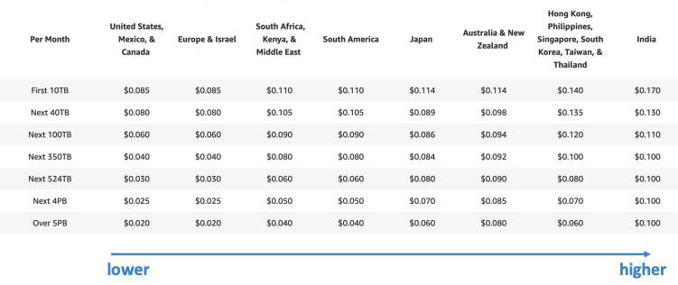
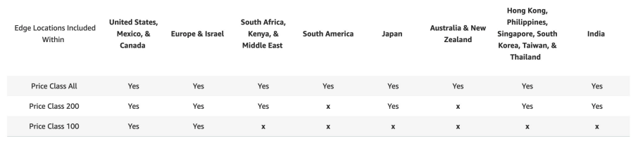
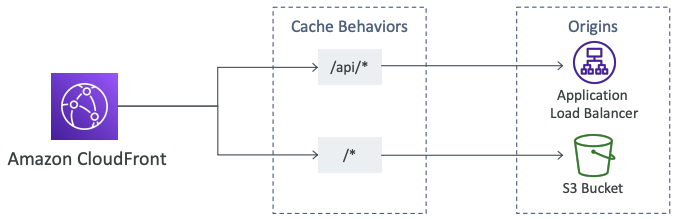
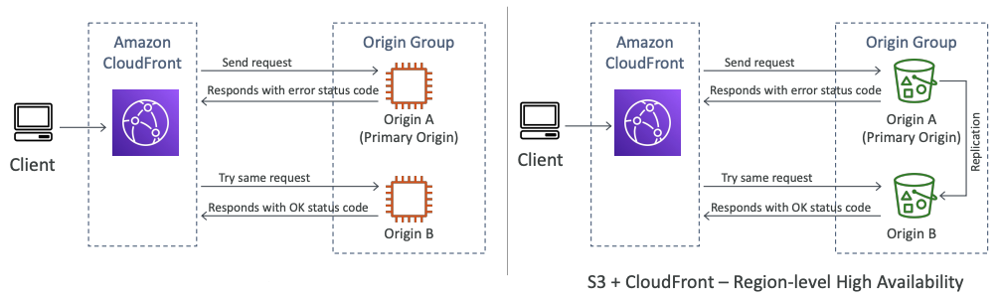
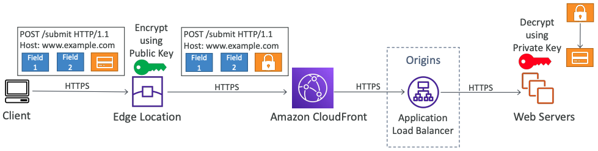

# CloudFront

---

### AWS CloudFront

- Content Delevery Network (CDN)
- 읽기 성능 향상시키고 콘텐츠가 엣지에서 캐시되도록 해준다
- 전 세계적으로 216개의 엣지 로케이션이 있다
- DDos 보호, shield 및 웹 애플리케이션 방화벽과의 통합을 제공
- 외부 HTTPS를 노출하고 내부 HTTPS 백엔드와 통신할 수 있다

---

### CloudFront - Origins

- S3 Bucket
  - 파일을 분산하고, 엣지로 캐시화하기 위해 CloudFront 사용하는 것이 일반적
  - CloudFront의 Origin Access Identity(OAI)로 강화된 보안 사용 가능
  - CloudFront는 입구로서 사용될 수 있다

- Custom Origin (HTTP)
  - Application Load Balancer
  - EC2 instance
  - S3 Website (먼저 버킷을 정적 S3 웹사이트로 활성화시켜야 한다)
  - 원하는 모든 HTTP 포트

---

> **CloudFront at high level**
> 
> 

---

> **CloudFront - S3 as an Origin**
> 
> 

---

> **CloudFront - ALB or EC2 as an origin**
>
> 

---

### CloudFront 지역 제한

- 액세스할 수 있는 사람을 제한할 수 있다
  - 화이트리스트 : 사용자가 승인된 국가 목록에 있는 경우에만 콘텐츠에 액세스 할 수 있다
  - 블랙리스트 : 사용자가 금지된 국가의 블랙리스트 중 하나에 있는 경우 콘텐츠에 액세스를 할 수 없다

- "국가"는 서드파티의 Geo-IP 데이터베이스를 사용하여 결정한다
- 사용 사례 : 콘텐츠에 대한 접근 통제를 위한 저작권법

---

### CloudFront vs S3 Cross Region Replication

- CloundFront
  - 글로벌 엣지 네트워크
  - TTL에 대해 캐시된다 (보통 하루)
  - **어디서나 사용할 수 있어야 하는 컨텐츠에 적합**

- S3 Cross Region Replication
  - 복제는 각 리전에 대해 설정 필요
  - 파일은 거의 실시간으로 업데이트
  - 읽기 전용이다
  - **일부 지역에서 빠르게 제공되어야 하는 콘텐츠에 적합**

---

### CloudFront Caching

- Cache 체크 기준
  - 헤더
  - 세션 쿠키
  - 쿼리 문자열 매개변수
- 캐시는 각 CloudFront의 **엣지 로케이션에 저장**된다
- 캐시 적중률을 최대화하여 origin에 대한 요청을 최소화 가능
- TTL 설정가능하다 (0초 ~ 1년). Cache-Control헤더, Expires 헤더를 사용하여 origin 에서 설정 가능
- CreateInvalidation API를 사용하여 캐시의 일부 무효화 가능

> **정적/동적 배포를 분리하여 캐시 히트 최대화**
> 
> 

---

### CloudFront Geo Restriction

- 접근자를 제한 기능
  - Whitelist : 승인된 국가 목록 중에 속해있는 유저만 허용
  - BlackList : 금지된 국가 목록 중에 속해있는 유저는 차단

- 국가는 서드파티ㅡ Geo-IP 데이터베이스를 사용하여 결정
- 사용사례 : 콘텐츠에 대한 액세스를 제어하는 저작권법

---

### CloudFront and HTTPS

- Viewer Protocol Policy
  - HTTP -> HTTPS로 리다이렉션
  - HTTPS만 허용
- Origin Protocol Poliicy (HTTP or S3)
  - HTTPS만 허용
  - Match Viewer
    - 클라이언트가 HTTP 요청하면 HTTP로, HTTPS로 요청하면 HTTPS를 사용

> S3 bucket "웹사이트"는 HTTPS를 지원하지 않는다

---

### CloudFront Signed URL / Signed Cookies

- 유료 공유 컨텐츠를 전 세계의 프리미엄 사용자에게 배포할 경우, **뷰어의 액세스를 제한**하기 위해 CloudFront Signed URL / Cookies를 생성할 수 있다
- URL의 유효기간
  - 공유콘텐츠 (영화, 음악) : 짧게 설정 권장 (몇 분)
  - 개인 콘텐츠 : 몇년동안 유지되게끔 설정 권장

- Signed URL : 개별 파일 접근
- Signed Cookies : 여러 파일 접근

---

### CloudFront Signed URL Diagram

---

### CloudFront Signed URL vs S3 Pre-Signed URL

- CloudFront Signed URL
  - origin에 관계 없이 경로에 대한 액세스 허용
  - 계정 전체의 key-pair를 사용하므로, root만 관리가 가능
  - IP, 경로, 날짜, 만료기간에 따라 필터링 가능
  - 캐싱 기능 활용 가능

- S3 Pre-Signed URL
   - pre-signed된 유저로 요청 발행
   - IAM 보안 서명의 IAM 키 사용
     - 내가 IAM 보안 주체로 URL에 서명하고, 다른사람이 IAM 키를 사용하여 서명하면, 해당 URL을 가진 사람이 나와 동일한 권한을 갖게 된다
   - 제한된 수명을 가지고 있음

> 사람들이 CloudFront 배포에 액세스할 수 있도록 하고 S3 앞에 있는 경우 S3 버킷을 OAI로 제한하는 버킷 정책에 의해 S3 버킷에 액세스할 수 없기 때문에 Signed URL을 사용해야 한다
>
> S3에 대해 직접 사용하고 CloudFront를 사용하지 않고 직접 파일을 배포하려는 경우 Pre-Signed URL을 사용하면 좋다

---

### CloudFront Signed URL Process

- 두 가지 유형의 서명자
  - 신뢰할 수 있는 키 그룹 (권장)
    - API를 활용하여 키 (그리고 API보안을 위한 IAM) 생성 및 교체 가능
  - CloudFront 키페어가 포함된 AWS 계정
    - 루트 계정과 AWS 콘솔을 사용하여 키를 관리
    - 이 작업에 루트 계정을 사용하면 안 되므로 권장하지 않음

- CloudFront 배포에서 하나 이상의 **신뢰할 수 있는 키 그룹 생성**
- 자신의 public/private key 생성
  - private key는 어플리케이션에서 URL에 서명하는데 사용
  - public key는 CloudFront에서 URL을 확인하는데 사용

---

### CloudFront - 가격

- CloudFront 엣지 로케이션은 전 세계에 분포되어 있고, 엣지 로케이션당 비용은 다양하다

- 비용 절감을 위해 엣지 로케이션 수를 줄일 수 있고, 이를 위한 세가지 가격 등급이 있다.
  1. Price Class All : 모든 리전에서 사용 (최고 성능)
  2. Price Class 200 : 대부분 리전에서 사용 (가장 비싼 리전 제외)
  3. Price Class 100 : 가장 저렴한 리전만 사용

---

### CloudFront - Multiple Origin

**Multiple Origin**
- 콘텐츠 유형에 따라 다른 종류의 origin으로 라우팅할 때 사용
- 경로 패턴을 기반으로 사용
  - /images/*
  - /api/*
  - /*
  - ...

---

### CloudFront - Origin Groups

**Origin Groups**
- Origin Group : 하나의 기본 오리진과 보조 오리진을 가지고 있는 그룹
  - 기본 오리진이 실패하면 보조 오리진이 사용된다
- 고가용성, 장애복구를 위해 사용

---

### CloudFront - Field Level Encryption

**Field Level Encryption**
- 어플리케이션 스택을 통한 사용자 민감 정보 보호
- HTTPS와 함께 추가적인 보안 계층 추가
- 민감한 정보는 사용자와 가까운 엣지에서 암호화
- 비대칭 암호화 사용
- 사용법
  - 암호화하려는 POST 요청의 필드 세트 지정 (최대 10개 필드)
  - 암호화할 공개 키 지정

