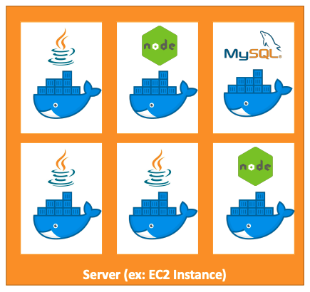
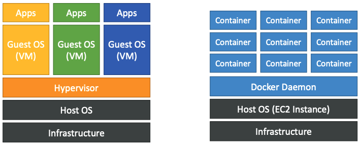
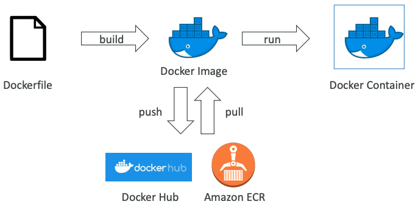
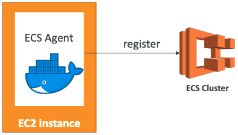
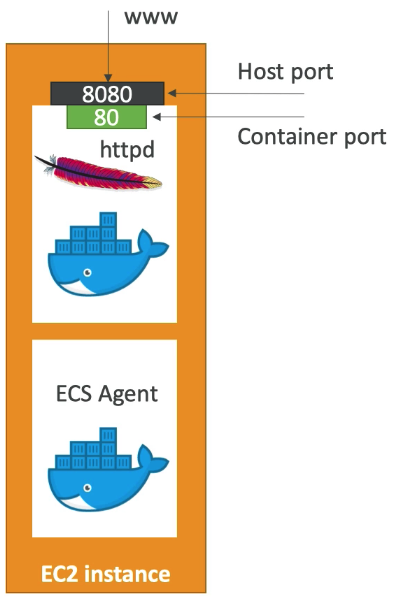
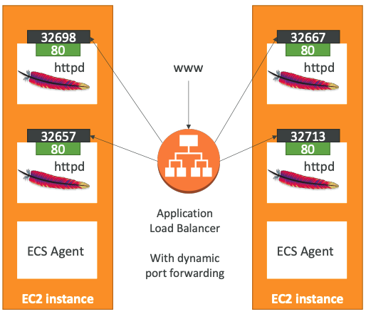
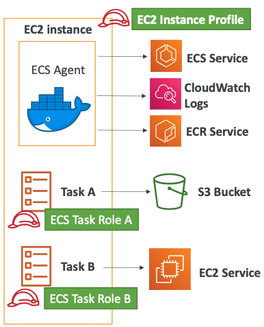
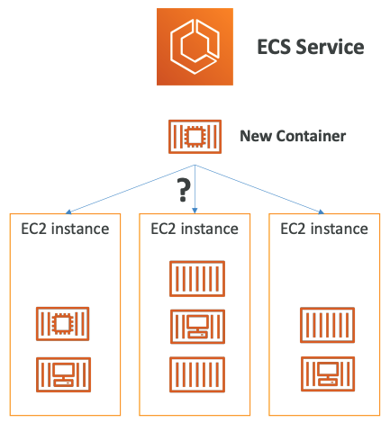
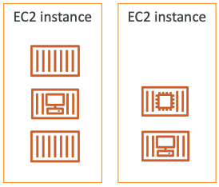
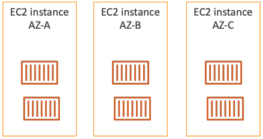

## AWS ECS - Essentials
- Docker contianers in AWS


## Docker

### 개요

- 어플리케이션을 배포하기위한 소프트웨어 개발 플랫폼
- 어플리케이션은 모든 OS에서 실행할 수 있는 **컨테이너에 패키징**된다
- 어플리케이션은 실행 위치에 관계없이 동일하게 실행된다
  - 모든 장치에서 동작
  - 호환성 문제 없음
  - 예측 가능한 행동
  - 작업량 감소
  - 유지 관리 및 배포 용이
  - 모든 언어, 모든 OS, 모든 기술에서 동작



### Docker 이미지 저장 위치

- Docker 이미지는 Docker Repository에 저장된다
- Public : Docker Hub (https://hub.docker.com/)
- Private : Amazon ECR (Elastic Container Registry)

### Docer vs 가상 머신

- Docker는 일종의 가상화 기술이다 (가상화 기술과 똑같지는 않다)
- 리소스는 호스트와 공유 -> 하나의 서버에 있는 많은 컨테이너



>  Docker 시작하기
>
> 

### Docker Contianers Management

- 컨테이너를 관리하기 위해, 컨테이너 관리 플랫폼이 필요하며, 세가지 선택사항이 있다
  - ECS : 아마존 자체 플랫폼
  - Fargate : 아마존 자체 서버리스 플랫폼
  - EKS : 아마존의 관리형 Kubernetes (오픈소스)

---

## ECS

### ECS - Cluster

- ECS 클러스터는 EC2 인스턴스의 논리적 그룹이다
- EC2 인스턴스는 ECS 에이전트 (Docker 컨테이너)를 실행한다
- ECS 에이전트는 ECS 클러스터에 인스턴스를 등록한다
- EC2 인스턴스는 ECS를 위해 특별히 제작된 특수 AMI를 실행한다



### ECS - Task Definitions (작업 정의)

- 작업 정의는 ECS에 Docker 컨테이너를 실행하는 방법을 알려주는 **JSON 형식의 메타 데이터**다
- 다음과 같은 중요 정보가 포함되어 있다
  - 이미지 이름
  - 컨테이너 및 호스트에 대한 포트 바인딩
  - 메모리 및 CPU 필요
  - 환경 변수
  - 네트워킹 정보
  - IAM 역할
  - 로깅 구성 (ex. CloudWatch)



### ECS - 서비스

- 실행해야 하는 작업 수와 실행방법을 정의하는걸 도와준다
- EC2 인스턴스 집합에서 원하는 작업 수가 실행되고 있는지 확인한다
- 필요시 ELB/NLB/ALB 연동이 가능하다
  > 

---

## ECR

### 개요

- Elastic Contianer Registry
- private Docker 이미지 저장소
- IAM을 통해 액세스 제어
- AWS CLI v1 로그인 명령 : `$(aws ecr get-login --no-include-email --region eu-west-1)`
- AWS CLI v2 로그인 명령 : `aws ecr get-login-password --region eu-west-1 | docker login --username AWS --password-stdin 1234567890.dkr.ecr.eu-west-1.amazonaws.com`
- Docker Push & Pull
  - `docker push 1234567890.dkr.ecr.eu-west-1.amazonaws.com/demo:latest`
  - `docker pull 1234567890.dkr.ecr.eu-west-1.amazonaws.com/demo:latest`

---

## Fargate

### 개요

- 기본 인프라를 관리할 필요 없이 컨테이너를 배포하고 관리할 수 있는 컴퓨팅 엔진
  - 컨테이너에 적합한 서버리스 엔진
- ECS 및 EKS와 연동

### 장점

- EC2 인스턴스를 프로비저닝하지 않는다
- 작업 정의를 생성하기만 하면 AWS에서 컨테이너를 실행한다
- 확장하려면 작업 번호를 늘리면 되며 이 과정은 단순하고 쉽다. 더 이상 EC2가 필요없다

## ECS

### IAM Roles Deep Dive

- EC2 Instance 프로필
  - ECS 에이전트에서 사용
  - ECS 서비스에 대한 API 호출
  - CloutWatch Logs에 컨테이너 로그 보내기
  - ECR에서 Docker 이미지 가져오기

- ECS 작업 역할
  - 각 작업이 다른 특정 역할을 갖도록 허용
  - 실행하려는 다양한 ECS 서비스에 대해 다른 역할을 사용
  - 작업 역할은 **작업 정의**에 정의되어 있다



### ECS 작업 영역

- **개요**
  - EC2 유형의 작업이 시작되면 ECS는 CPU, 메모리 및 사용가능한 포트의 제약으로 작업을 배치할 위치를 결정해야 한다
  - 마찬가지로 서비스가 축소되면 ECS는 종료할 작업을 결정해야한다
  - 이를 지원하기 위해 **작업 배치 전략** 및 **작업 배치 제약**을 정의할 수 있다
    - 이는 Fargate가 아닌 EC2가 있는 ECS만 해당한다

- **처리 과정**
  1. 작업 정의에서 CPU, 메모리 및 포트 요구 사항을 충족하는 인스턴스 식별
  2. 작업 배치 제약 조건을 충족하는 인스턴스 식별
  3. 작업 배치 전략을 충족하는 인스턴스 식별
  4. 작업 배치를 위한 인스턴스 선택



#### 작업 배치 전략

- **Binpack**
  - 사용 가능한 최소 CPU 또는 메모리 양을 기준으로 작업 배치
  - 사용중인 인스턴스 수 최소화 (비용 절감)
  - ```json 
    "placementStrategy": [
      {
        "field": "memory",
        "type": "binpack"
      }
    ]
    ```
  - 

- **Random**
  - 랜덤하게 작업 배치
  - ```json 
    "placementStrategy": [
      {
        "type": "random"
      }
    ]
    ```
  - 

- **Spread**
  - 지정된 값에 다라 균등하게 작업 배치
  - 예 : `instancId`, `attribute:ecs.availability-zone`
  - ```json 
    "placementStrategy": [
      {
        "field": "attribute:ecs.availability-zone",
        "type": "spread"
      }
    ]
    ```
  - 

#### 작업 배치 제약

- distinctInstance : 각 작업을 다른 컨테이너 인스턴스에 배치
  - ```json
    "placementConstraints": [
      {
        "type": "distinctInstance"
      }
    ]
    ```

- memberOf : 표현식을 만족하는 인스턴스에 작업 배치
  - 클러스터 쿼리 언어 사용
  - ```json
    "placementConstraints": [
      {
        "expression": "attribute:ecs.instance-type =~ t2.*",
        "type": "memberOf"
      }
    ]
    ```

#### ECS - Service Auto Scaling

- ECS 서비스 레벨에서 CloudhWatch로 CPU와 RAM 상태가 추적된다
- 대상 추적 : 특정 평균 CloudWatch 지표를 대상으로 한다
- 단계 조정 : CloudWatch 경보를 기반으로 조정한다
- 예정된 조정 : 예측 가능한 변경 사항을 기반으로 한다

- ECS Service Scaling != EC2 Auto Scaling
  - ECS Service Scaling : Task 레벨
  - EC2 Auto Scaling : Instance 레벨
- Fargate Auto Scaling은 설정이 훨씬 더 쉽다
  - 서버가 없기 때문에..