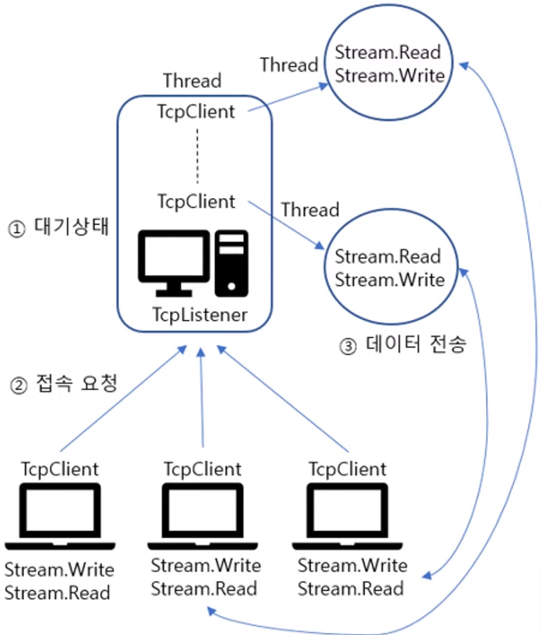
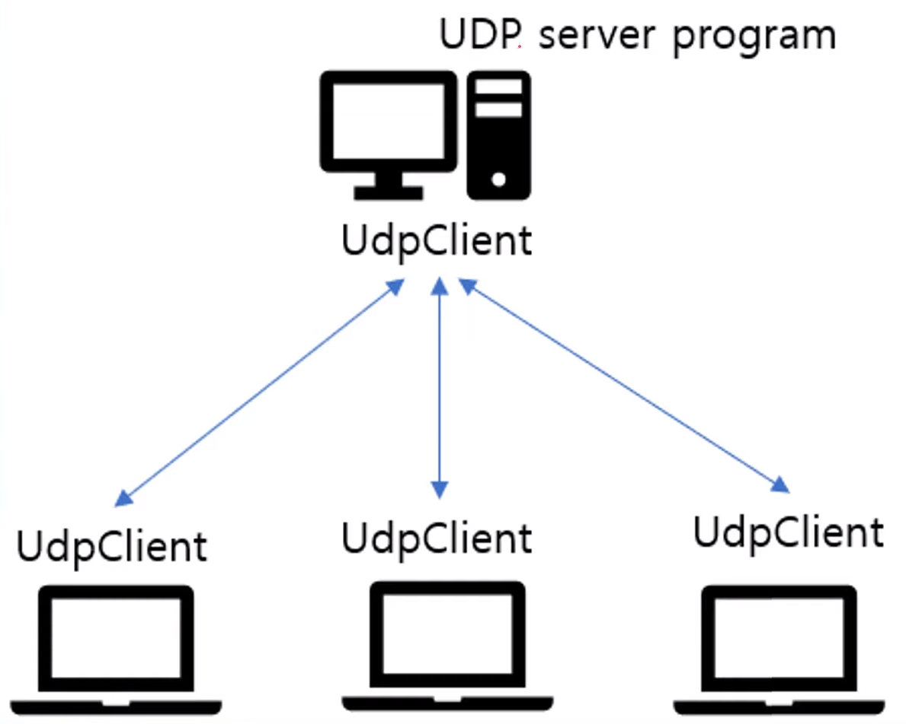

# INDEX

* 서버와 클라이언트를 바로 알자

* TCP/IP 서버와 클라이언트
  * TCP 서버와 클라이언트
  * UDP 서버와 클라이언트

## 서버와 클라이언트를 바로 알자

#### 네트워크 기본 개념

* 프로토콜

  > 인터넷 상에서 컴퓨터간의 데이터를 주고 받기 위한 약속된 형식 -> 통신규약

* OSI 7계층

  > 컴퓨터 네트워크 프로토콜 디자인과 통닛을 계층으로 구분하여 규정 -> 프로토콜을 기능별로 구분

  > | 계층               |
  > | ------------------ |
  > | 응용 프로그램 계층 |
  > | 프리젠테이션 계층  |
  > | 세션 계층          |
  > | 네트워크 계층      |
  > | 네트워크 계층      |
  > | 데이터 링크 계층   |
  > | 물리 계층          |

* 서버

  > 클라이언트에게 네트워크를 통해 정보나 서비스를 제공하는 컴퓨터 또는 프로그램

* 클라이언트

  > 네트워크를 통해 서버라는 다른 컴퓨터 시스템 상의 원격 서비스에 접속할 수 있는 응용 프로그램 또는 사용자 컴퓨터

  

## TCP/IP 서버와 클라이언트

#### TCP/IP

* 전송계층
* 운영체제의 일부로 구현되어 있음
  * 우리가 굳이 구현할 필요는 없다~
* 전송 방식
  * TCP : 에러 검출, 재전송 등 데이터 신뢰성
    * 거의 대부분 이 방식을 사용함
  * UDP : 빠른 전송

* 포트번호

  * 접속된 다수의 응용프로그램을 구분하기 위한 번호

* 포트 번호의 범위

  * 0~65535
  * 예약된 번호 : 0~1023
  * 1024~49151중 하나 선택

  * 예약번호의 예시

    > | 포트번호 | 항목        |
    > | -------- | ----------- |
    > | 7        | 에코(echo)  |
    > | 13       | DayTime     |
    > | 21, 23   | FTP, Telnet |
    > | 25       | SMTP        |
    > | 80       | HTTP        |

    

## TCP 서버와 클라이언트

#### TCP서버와 클래스

* `TcpListner` - 연결과 tcpClient객체 생성
* `TcpClient` - 데이터 전송
  * NetworkStream

#### TCP서버와 다수의 클래스

> 

## UDP 서버와 클라이언트

#### UDP서버와 클래스

* TCP와의 차이점 : 비연결형
  * ip 주소와 port번호를 알면 데이터 전송 가능

* `UdpClient` : 서버와 클라이언트 모두 사용
* 그룹 처리
  * `UdpClient.JoinMulticast()` 사용

#### UDP서버와 다수의 클라이언트

> 
>
> 서버와 클라이언트 모두 `UdpClient`를 사용한다.

