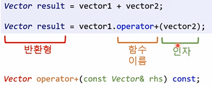

# INDEX

1. 복사생성자
2. 함수 오버로딩
3. 연산자 오버로딩
4. 연산자 오버로딩과 const
5. 연산자 오버로딩을 남용하지 말것!
6. 암시적 함수들을 제거하는 법


## 복사생성자

* 얕은 복사
  * 값만 복사하는 형태
  * **포인터 등을 복사** 시 같은 주소를 참조하기 때문에, 값 변경, 동적 해제 등에서 **문제가 발생**한다.
* 깊은 복사
  * 주소가 가리키는 값, 즉 그 메모리의 값을 복사하는 형태
  * 포인터 등을 복사 시 한 주소를 참조하지 않고 새로 주소를 할당받은 후 참조하기 때문에 문제가 발생하지 않는다.

- 복사생성자
  - 같은 클래스에 속한 다른 개체를 이용하여 새로운 개채를 초기화
    - 같은 크기, 같은 데이터
    - `<class-name> (const <class-name>&);`

- 암시적 복사 생성자
  - 코드에 복사 생성자가 없는 경우, 컴파일러가 암시적 복사 생성자를 자동 생성
  - 암시적 복사 생성자는 **얕은복사**를 수행
    - 멤버 별 복사
    - 각 멤버의 값을 복사
    - 개체인 멤버변수는 그 개체의 복사 생성자가 호출됨

- 깊은 복사 생성자?
  - 클래스 안에서 **동적으로** **메모리를** **할당**하고 있다면? 얕은 복사가 위험할 가능성이 매우 높음!!
  - So, 사용자가 만든 복사 생성자 사용
  - 직접 복사 생성자를 만들어서 깊은 복사를 할것
    - 포인터 변수가 가리키는 실제 데이터까지 복사

* 포인터를 가지고 있는 클래스

  **얕은 복사 생성자**

  ```c++
  // 앝은 복사 생성자
  ClassRecord::ClassRecord(const ClassRecord& other)
  	:mCount(other.mCount)
  	, mScores(other.mScores)
  {
  }
  ```

  **깊은 복사 생성자**

  ```c++
  // 깊은 복사 생성자
  ClassRecord::ClassRecord(const ClassRecord& other)
  	: mCount(other.mCount)
  {
  	mScores = new int[mCount];
  	memcpy(mScores, other.mScores, mCount*sizeof(int));
  }
  ```


## 함수 오버로딩

- 함수 오버로딩
  - 매개변수 목록을 제외하고는 모든게 동일

  - 반환형은 상관 없음

    ```c++
    void Print(int score); //OK
    void Print(const char* name); //OK
    void Print(float gpa, const char* name); //OK
    int Print(int score); //컴파일에러
    int Print(float gpa); //OK
    ```

- 함수 오버로딩 매칭하기
  - 오버로딩 함수 중에 어떤 함수를 호출해야 하는지 판단하는 과정
  - 함수 매칭 결과는 3개가 있음
    1. 매칭되는 함수를 찾을 수 없음 -> 컴파일에러
    2. 매칭되는 함수를 여러 개 찾음 -> 컴파일 에러
    3. 가장 적합한 함수를 하나 찾음 -> OK

- 모호한 호출?

  ```c++
  int Max(int, int); // 정확한 매치 : 1, 표준 변환 : 1
  int Max(double, double); // 정확한 매치 : 1, 표준 변환 : 1
  Max(1,3.14);
  ```

  - 컴파일에러


## 연산자 오버로딩

​	**연산자**

- 함수처럼 작동하는 부호

- C++에서는 프로그래머가 연산자를 오버로딩 할 수 있음

- - C와 Java는 연산자 오버로딩을 지원하지 않음

- 연산자 오버리동 하는 방법은 두 가지

- - 멤버 함수

  - 멤버 아닌 함수

  - 특정 연산자들은 멤버 함수를 이용해서만 오버로딩 가능

  - - =, (), [], ->


​	**멤버 연산자 작성법**

​	

  ```c++
<return-type> <class-name>::operator<operator-symbol>(<argument-list>)
{
}

Vector Vector::operator-(const Vector& rhs) const;
Vector Vector::operator*(const Vector& rhs) const;
Vector Vector::operator/(const Vector& rhs) const;
  ```


​	**멤버 아닌 연산자 오버로딩 작성법**

  ```c++
//header
friend <return-type> operator<operator-symbol>(<argument-list);

//cpp
<return-type> operator<operator-symbol>(<argument-list>)
{
}

friend void operator<<(std::ostream& os, const Vector& rhs);
friend Vector operator*(int scalar, const Vector* lhs);
  ```


​	**멤버 함수를 이용한 연산자 오버로딩**

```c++
class Vector
{
public:
	Vector operator+(const Vector& rhs) const;
private:
	int mX;
	int mY;
};
```

```c++
Vector Vector::operator+(const Vecotr& rhs) const
{
	Vector sum;
	sum.mX = mX + rhs.mX;
	sum.mY = mY + rhs.mY;
	return sum;
}
```

```c++
Vector v1(10,20);
Vector v2(3,17);
Vector Sum = v1 + v2;
```


## 연산자 오버로딩과 const


## 연산자 오버로딩을 남용하지 말것!


## 암시적 함수들을 제거하는 법


