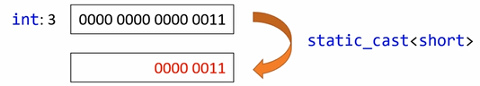
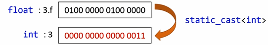

# INDEX

1. C 스타일 캐스팅
2. static_cast
3. reinterpret_cast
4. const_cast
5. dynamic_cast
6. staic_cast vs reinterpret_cast
7. static_cast vs dynamic_cast
8. 캐스팅 규칙
9. 정리


## C 스타일 캐스팅

#### 암시적 캐스팅

* 커파일러가 형을 변환해줌
  * 단 형변환이 허용 범위 내에 있어야 함
  * 프로그래머가 명시적으로 형 변환을 안할 경우

#### 명시적 캐스팅

* 프로그래머가 형 변환을 직접 하는 것

  * C++ 캐스팅

    > static_cast
    >
    > const_cast
    >
    > dynamic_cast
    >
    > reinterpret_cast

#### C 스타일 캐스팅

* `int score = (int)someVariable;`
  * 문제점 : 위의 코드는 대체 무엇을 할까?
    * C++의 4개의 캐스팅 중 하나를 함
      * 즉 4개중 뭘 하는지 모름
    * 명백한 실수를 컴파일러가 캐치하지 못함
      * C++캐스팅이 이러한 문제를 해결


#### 정적 캐스팅

* 컴파일 도중에 결정됨

> C
>
> ```C
> float number1 = 3.f;
> int number2 = (int)number1;
> Animal* myPet = new Cat(2, "Coco");
> Cat* myCat = (Cat*)myPet;
> ```

> C++
>
> ```cpp
> float number1 = 3.f;
> int number2 = static_cast<int>(number1);
> Animal* myPet = new Cat(2,"Coco");
> Cat* myCat = static_cast<Cat*>(myPet);
> ```


#### 리인터프리트(reinterpret) 캐스팅

>C
>
>```c
>Animal* myPet = new Cat(2,"Coco");
>unsigned int myPetAddr = (unsigned int)myPet;
>cout<<"address:"<<hex<<myPet;
>```

> C++
>
> ```cpp
> Animal* myPet = new Cat(2,"Coco");
> unsigned int myPetAddr = reinterpret_cast<unsigned int>(myPet);
> cout<<"address:"<<hex<<myPet;
> ```


#### 컨스트(const) 캐스팅

>C
>
>```c
>void Foo(const Animal* ptr)
>{
>	//Bad code
>	Animal* animal = (Animal*)ptr;
>	animal->SetAge(5);
>}
>```

> C++
>
> ```cpp
> void Foo(const Animal* ptr)
> {
> 	//Bad code
> 	Animal* animal = const_cast<Animal*>ptr;
> 	animal->SetAge(5);
> }
> ```


#### 동적(dynamic) 캐스팅

* 실행 중에 캐스팅

>C
>
>```c
>Cat* myCat = (Cat*)myPet;
>
>```

> C++
>
> ```cpp
> Cat* myCat = dynamic_cast<Cat*>(myPet);
> ```


## static_cast

#### 정적 캐스팅

> C의 경우
>
> ```c
> //1.값
> int number2 = (int)number1;
> 
> //2.개채포인터
> Cat* myCat = (Cat*)myPet;
> ```

> C++의 경우
>
> ```cpp
> //1.값
> int number2 = static_cast<int>(number1);
> 
> //2.개채포인터
> Cat* myCat = static_cast<Cat*>(myPet);
> ```


1. 값

   * 두 숫자 형 간의 변환

   * 값을 유지 (단 반올림 오차는 제외)

   * 이진수 표기는 달라질 수 있음

     >예시1
     >
     >```cpp
     >int number1 = 3;
     >short number2 = static_cast<short>(number1);
     >```
     >
     >
     >
     >비트값과 값 둘 다 바뀌지 않음

     > 예시2
     >
     > ```cpp
     > int number1 = 3;
     > short number2 = static_cast<short>(number1);
     > ```
     >
     > 
     >
     > 비트값은 달라지지만, 사람이 느끼는 값은 달리지지 않음

   2.개체 포인터

   * 변수형 체크 후 베이스 클래스를 파생 클래스로 변환

   * 컴파일 시에만 형 체크 가능

   * 실행 도중 여전히 크래시가 날 수 있음

     > 예시1
     >
     > ```cpp
     > Ainmal* myPet = new Cat(2, "Coco");
     > Cat* myCat = static_cast<Cat*>(myPet); //OK
     > Dog* myDog = static_cast<Dog*>(myPet); //컴파일은 됨. 그러나 위험(크래시가 날 수 있다)
     > myDog->GetDogHouseName();
     > ```

     > 예시2
     >
     > ```cpp
     > Animal* myPet = new Cat(2, "Coco");
     > 
     > House* myHouse = static_cast<House*>(myPet); // 컴파일 에러
     > myHouse->GetAddress();
     > ```


#### static_cast 사용법

> `static_cast<<type>> (<variable-name>)`
>
> > 예시
> >
> > `int number2 = static_cast<int>(number1);`
> >
> > `Dog* myDog = static_cast<Dog*>(myPet);`


## reinterpret_cast


## const_cast


## dynamic_cast


## staic_cast vs reinterpret_cast


## static_cast vs dynamic_cast


## 캐스팅 규칙


## 정리


