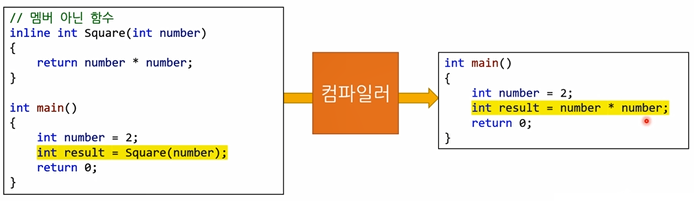
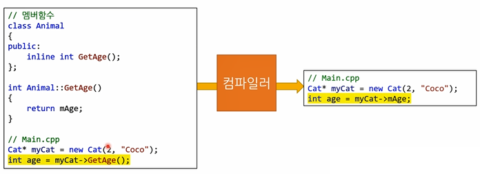

# INDEX

1. 인라인 함수
2. static 키워드
3. 정적 멤버 함수
4. 예외
5. 예외 - 범위 이탈, 0으로 나누기
6. 예외 생성자
7. 예외 - C의 에러코드
8. 예외 에러 코드보다 예외가 더 낫다
9. 적절한 예외처리


## 인라인 함수

#### 인라인 함수

* 복붙과 비슷

* 코드의 가독성과 성능을 둘 다 잡은 토끼

  > 인라인 미사용
  >
  > ```cpp
  > Cat* myCat = new Cat(2, "Coco");
  > int age = myCat->GetAge();
  > ```

  > 인라인 사용
  >
  > ```cpp
  > Cat* myCat = new Cat(2, "Coco");
  > int age = myCat->mAge;
  > ```

* 매크로와 매우 비슷한 개념

  > 매크로 예시
  >
  > ```cpp
  > #define SQUARE(x) (x)*(x)
  > 
  > SQUARE(3); // = (3)*(3)
  > ```

  * 단 매크로는 컴파일러가 아닌 전처리기가 해줌
  * 매크로는 디버깅이 힘들다
    * 콜스택에 함수이름이 안보임
    * 중단점 설정도 불가능
  * 매크로는 범위(scope)를 준수하지 않음
  * 정말정말 매크로르 쓸 이유가 있지 않는 한 인라인 함수를 쓰자!


#### 함수 호출할 때

* 함수는 메모리 안에 "할당"되어있음

* 함수를 호출하기 위해 필요한 단계들

  >1. 변수들을 스택에 푸쉬(push)
  >2. 함수 주소로 점프
  >3. 함수를 실행
  >4. 호출자 함수로 다시 점프
  >5. 1번 단계에서 넣어뒀던 변수들을 팝(pop)

  * 호출 단계가 좀 많다
    * 그래서 좀 느림
    * CPU 캐시에 최적이 아닐 수도 있다
    * 모던 cPU 아키텍쳐에서는 더 느림
    * 그런데 아직도 "모든걸 함수로 만들라!" 라는 잘못된 조안이 떠돌아다닌다.


#### 인라인 함수의 동작 원리






#### 인라인 함수를 쓸 때 주의점

* inline키워드는 힌트일 뿐
  * 따라서 인라인 안될 수도 있음..
  * 컴파일러가 자기 맘대로 아무 함수나 인라인 할 수도 있음
* 인라인 함수 구현이 헤더 파일에 위치해야 함
  * 복붙을 하려면 컴파일러가 그 구현체를 볼 수 있어야 하기 때문에
  * 각 cpp파일은 따로 컴파일됨
  * 따라서 b.h를 인클루드하는 a.cpp파일을 컴파일할때 컴파일러는 b.cpp에 뭐가 들어있는지 모름
* 간단한 함수에 해야함
  * 특히 getter나 setter에
* 실행파일의 크기가 증가하기 쉬움
  * 동일 코드를 여러번 복붙하니까
  * 남용하지 말것
  * 실행파일이 작을수록 CPU캐시하고 잘 작동 -> 속도가 빨라질 수 있음


#### 인라인 함수 사용법

> 멤버 아닌 인라인 함수 사용법
>
> ```cpp
> inline <return-type> <function-name> (<argument-list>)
> {
>     //...
> };
> ```

> 인라인 멤버 함수
>
> ```cpp
> inline <return-type> <class-name>::<function-name> (<argument-list>)
> {
>     //...
> };
> ```


## static 키워드


## 정적 멤버 함수


## 예외


## 예외 - 범위 이탈, 0으로 나누기


## 예외 생성자


## 예외 - C의 에러코드


## 예외 에러 코드보다 예외가 더 낫다


## 적절한 예외처리


