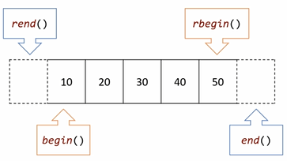

# INDEX

1. STL
2. 반복자(iterator)
3. 벡터
4. 맵
5. 셋
6. 큐
7. 스택
8. 리스트
9. 기타


## STL

#### STL

* 표준 템플릿 라이브러리 컨테이너

* 목록

  > 벡터
  >
  > 맵
  >
  > 셋
  >
  > 스택
  >
  > 큐
  >
  > 리스트
  >
  > 디큐
  >
  > ....

* 목적

  > 템플릿 기반
  >
  > 모든 컨테이너에 적용되는 표준 인터페이스
  >
  > 메모리 자동 관리


#### 반복자

* STL컨테이너를 순회할 때는 반복자(iterator)를 쓰는게 표준 방식


## 반복자(iterator)

#### 반복자

* 컨테이너의 요소들을 순회하는 데 사용됨
* 사실상 포인터
* `begin()`
  * 컨테이너의 첫 번째 요소를 가리키는 반복자를 반환
* `end()`
  * 컨테이너의 마지막 요소 바로 뒤의 요소를 가리키는 반복자를 반환


#### const_iterator

* 매개변수가 바뀌지 않는 순환자

* 예시

  > `vector<int>::const_iterator iter = scores.begin();`


#### 역방향 반복자

* end()에서 시작하여 begin()까지 반복하고 싶을 때 사용

* `rbegin()`, `rend():`

* 예시

  >`vector::reverse_iterator iter = scores.rbegin();`


#### 그림예시

>


## 벡터

#### 벡터

* 어떤 자료형도 넣을 수 있는 **동적 배열**
  * 기본 데이터
  * 클래스
  * 포인터
* 그 안에 저장된 모든 요소들이 **연속된 메모리 공간**에 위치
* 요소 수가 증가함에 따라 자동으로 메모리를 관리해 줌
* 어떤 요소에도 임의로 접근 가능


#### x라는 vector와 같은 크기 및 데이터를 갖는 vector 생성법(복사생성자)

> `std::vector<<type>><name>(const vector& x);`
>
> `std::vector<int> scores1(scores); //scores의 사본`


#### 벡터의 크기 변경하기

* 새 크기가 vector의 기존 크기보다 작으면 초과분이 제거됨

* 새 크기가 vector의 용량보다 크면 재할당이 일어남

* `resize(size_t n);`

  > ```c++
  > std::vecotr<int> scores;
  > 
  > scores.reserve(3);
  > 
  > scores.push_back(30);		//30
  > scores.push_back(100);		//30, 100
  > scores.push_back(70);		//30, 100, 70
  > 
  > scores.resize(2);			//30, 100
  > 
  > for(auto k : scores)
  > {
  >     std::cout<< k <<" ";	//"30 100"
  > }
  > ```


#### 특정 위치에 요소 삽입하기

* 데이터 복사 (느림)

* 재할당 할 수도 있음

* `insert(iterator, value);`

  > ```c++
  > std::vecotr<int> scores;
  > 
  > scores.reserve(4);
  > scores.push_back(10);		//10
  > scores.push_back(50);		//10, 50
  > scores.push_back(38);		//10, 50, 38
  > scores.push_back(100);		//10, 50, 38, 100
  > 
  > std::vector<int>::iterator it = scores.begin();
  > 
  > it = scores.insert(it, 80);	//80, 10, 50, 38, 100
  > ```


#### 특정 위치에 요소 삽제하기

* 데이터 복사 (느림)

* `erase(it);`

  >```c++
  >std::vecotr<int> scores;
  >
  >scores.reserve(4);
  >scores.push_back(10);		//10
  >scores.push_back(50);		//10, 50
  >scores.push_back(38);		//10, 50, 38
  >scores.push_back(100);		//10, 50, 38, 100
  >
  >std::vector<int>::iterator it;
  >it = scores.begin();
  >
  >it = scores.erase(it);		//50, 38, 100
  >```


#### 요소 대입하기

* `assign(size_t n, <data>);`

  * n개의 \<data\>값을 벡터에 넣는다

    > ```c++
    > vector<int> anotherScores;
    > anotherScores.assign(7, 100); //100, 100, 100, 100, 100, 100, 100
  > ```


#### 두 벡터 교환하기

* `swap(vector& other);`

* 같은 자료형의 두 벡터를 맞바꾼다

  > ```c++
  > vector<int> scores;			//10, 20, 30
  > vector<int> anotherScores;	//40 ,50, 60
  > 
  > socres.swap(anotherScores); //scores : 40, 50, 60
  > 							//anotherScores : 10, 20, 30
  > ```


#### 벡터의 모든 요소 제거하기

* `clear();`
* vector의 크기는 0이 되고 용량은 변하지 않음


#### 개체를 직접 보관하는 벡터의 문제점

* 개체가 크면 메모리 재할당이 일어날 가능성이 높아진다!

* 그래서 대신 포인터를 저장하면 된다!

  * 단, 모든 요소에 delete를 꼭 호출할 것

    * 또한 지운 후 이 포인터들을 계속 사용하면 안됨!!

    > 예시
    >
    > ```c++
    > int main()
    > {
    >     vector<Score*> scores;
    >     scores.push_back(new Score(30, "C++"));
    >     scores.push_back(new Score(87, "Java"));
    > 
    >     for(vector<Score*>::iterator iter = scores.begin(); iter != scores.end(); ++iter)
    >     {
    >         delete *iter;
    >     }
    > 
    >     scores.clear();
    > }
    > ```


#### 벡터의 장점

* 순서에 상관없이 요소에 임의적으로 접근 가능
* 제일 마지막 위치에 요소를 빠르게 삽입 및 삭제


#### 벡터의 단점

* 중간 요소 삽입 및 삭제는 느림
* 재할당 및 요소 복사에 드는 비용


## 맵


## 셋


## 큐


## 스택


## 리스트


## 기타


