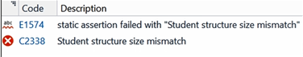

# INDEX

1. auto
2. static_assert
3. default/delete
4. final
5. override
6. offsetof
7. 새로운 자료형
8. nullptr
9. 고정 폭 소수형
10. enum class
11. 헤더에서 초기화하기
12. 정리


## auto

#### 새로운 키워드들

* auto
* static_assert
* default/delete
* final/override


#### auto

* 자료형을 추론
* JavaScript등의 언어에 있는 동적인 형과는 다름
* 실제 자료형은 컴파일하는 동안 결정됨
* 반드시 auto변수를 초기화해야됨


#### auto로 포인터와 참조 받기

* auto를 사용하여 포인터와 참조를 받을 수 있음
  * 포인터를 바을 때 : auto 또는 auto*
  * 참조를 받을 때 : aut&


#### 예시 : auto로 포인터 받기

> ```cpp
> Cat* myCat = new Cat("Coco", 2);
> auto myCatPtr = myCat;
> //myCat과 동일한 포인터일까요??
> //네
> ```


#### 왜 포인터와 값 둘 다 auto로 받을까?

* 컴파일러가 어느 형인지 알아낼 수 있음

  > ```cpp
  > auto a = 3;
  > auto b = ptr; //ptr은 char*
  > ```

* 그러나 이건 포인터가 아닐까?

  > ```cpp
  > auto name = object.GetName();
  > ```
  >
  > * 가독싱이 좋지 않음 -> 나쁜생각

* 포인터형을 받을 때는 auto*를 쓰자

  > ```cpp
  > auto* name = object.GetName();
  > ```

* 즉 가독성을 위해 auto*를 쓰자!


#### 예시 : auto로 참조 받기

> ```cpp
> Cat myCat("Coco", 2);
> Cat& myCatRef = myCat;
> auto anotherMyCatRef = myCatRef;
> //myCat에 대한 참조일까요??
> //아니요
> ```
>
> ```cpp
> Cat myCat("Coco", 2);
> Cat& myCatRef = myCat;
> auto& anotherMyCatRef = myCatRef;
> //myCat에 대한 참조일까요??
> //예
> ```

* auto& 여야 참조로 받는다
  * 컴파일러는 구분을 못한다


#### 예시 : auto로 const받기

> ```cpp
> const int b = 1;
> auto& a = b;
> //const를 이어받을까요?
> //예
> ```


#### 왜 const와 비 const모두 auto로 받을 까?

* 다시 말하지만, 컴파일러가 알아낼 수 있기 때문

  > ```cpp
  > auto& a = constInt; //constInt는 const int
  > auto& b = nonconstInt; //nonConstInt는 int
  > ```

* 하지만 이건 const일까 아닐까?

  > ```cpp
  > auto& name = object.GetName();
  > ```
  >
  > * 위 코드는 가독성이 좋지 않음 0> 나쁘고 게으른 생각

* 가독성을 위해 const를 참조로 받을 때는 `const auto&`를 쓰자

  > ```cpp
  > conat auto& name = obejct.GetName();
  > ```


#### auto와 함수 반환형

* auto 키워드는 함수가 반환하는걸 저장하는데 때론 유용
* 함수 반환형이 변해도 atuo는 그대로
* 허나 이런 일이 자주 발생할까?


#### auto는 엄청나게 좋다

* auto 키워드가 타이핑을 좀 줄여줌
* 허나 가독성을 떨어뜨림
* 아직 auto에 관해 모두가 동의하는 코딩 표준이 없음


#### auto와 반복자

* 반복자에는 auto키워드가 매우 유용

  > auto 사용 X
  >
  > ```cpp
  > for(std::vector<int>::const_iterator it = v.begin()l it != v.end(); ++it)
  > {
  > 	//...
  > }
  > ```
  >
  > auto 사용 O
  >
  > ```cpp
  > for(auto it = v.begin(); i!= v.end(); ++it)
  > {
  > 	//...
  > }
  > ```


#### auto로 템플릿 형 받기

* 일부 템플릿의 경우에도 마찬가지

  > auto 사용 X
  >
  > ```cpp
  > MyArray<int>* a = new MyArray<int>(10);
  > ```
  >
  > auto 사용 O
  >
  > ```cpp
  > auto* a = new MyArray<int>(10);
  > ```


#### 베스트 프랙티스

* 명시적이어야 함
  1. auto보다 실제 자료형 사용을 권장
  2. 예외 : 템플릿 매개변수와 반복자에는 auto사용
  3. auto보다 auto*를 사용
  4. auto&보다 const auto&를 사용
* 전부 가독성과 관련된 것
* 런타임 성능은 동일


## static_assert

#### static_assert

* 컴파일 도중에 assert가능
* 컴파일 도중에 어떤 조건을 확인 할 수 있으면 assert


#### assert

* 실행 중에 가정(assertion)이 맞는지 평가

* 오직 디버그 빌드에서만 작동

* 실패한 assert를 보려면 반드시 프로그램을 실행해야 함

  * 모든 코드 경로가 실행되었다고 어떻게 장담할까?
  * 일부 assertion은 프로그램을 실행하기도 전에 알 수 있음
    * static_assert의 탄생 계기

* 모든 곳에 assert를 쓰자

  * 여전히 유효한 조언

  > ```cpp
  > #include<cassert>
  > const Student* Class:GetStudentInfo(const char* name)
  > {
  >     assert(name != NULL);//조건이 false면 실행을 멈춤
  >     //이하 코드 생략
  > }
  > ```


#### static_assert

* 컴파일 중에 assertion 평가
* 컴파일러가 assert 조건이 참이니 아닌지 앎
* 실패하면 컴파일러는 컴파일 에러를 뱉음
* 많은 경우에 유용함


#### 예시 : 구조체의 크기

> Class.h
>
> ```cpp
> struct Student
> {
> 	char name[64];
> 	char id[10];
> 	int currentSemester;
> };
> 
> class class
> {
> public:
> 	//...
> 	const Student* GetStudentInfo(const char* name);
> };
> ```
>
> Class.cpp
>
> ```cpp
> const Student* Class::GetStudentInfo(const char* name)
> {
> 	static_assertion(sizeof(Student) == 74, "Student struction size mismatch");
> 	//이하 코드 생략
> }
> ```
>
> Result
>
> 


#### 예시 : version확인하기

> Class.h
>
> ```cpp
> class Class
> {
> public:
> 	const static int Version = 1;
> 	// ...
> }
> ```
>
> Main.cpp
>
> ```cpp
> #include"Class.h"
> static_assert(Class::Version>1, "You need higher version than 1.");
> ```
>
> Result
>
> 


#### 예시 : 배열의 길이

> Student.h
>
> ```cpp
> class Student
> {
> public:
> 	static const int MAX_SCORES = 10;
> 	int GetScores(int index);
> 	// ...
> private:
> int mScor	es[MAX_SCORES];
> };
> ```
>
> Student.cpp
>
> ```cpp
> int Student::GetScores(int index)
> {
> 	static_assert(sizeof(mScores)/sizeof(mScores[0])==MAX_SCORES,
> 	"The Size of scores vector is not 10");
> }
> ```
>
> Result
>
> 


#### 베스트 프랙티스

* 최대한 많은 곳에 static_assert를 사용
  * 첫째 모든 곳에 static assert를 쓰자
  * 그러고 나면 모든 곳에 assert를 쓰자
* assert를 여전히 사용한다면
  * 여전히 프로그램을 실행시켜야됨
  * 실행중인 assertion을 포착, 그것도 오직 디버그 빌드에서만
* static_assert를 사용한다면
  * 컴파일 중에 모든 문제를 즉시 알아챔
  * 또한 컴파일러처럼 생각하는데도 도움이 됨


## default/delete


## final


## override


## offsetof


## 새로운 자료형


## nullptr


## 고정 폭 소수형


## enum class


## 헤더에서 초기화하기


## 정리


