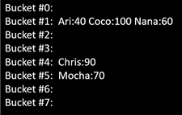

# INDEX

1. 정렬안된 맵
2. 정렬안된 셋
3. 어레이(array)
4. 범위 기반 for 반복문


## 정렬안된 맵

#### 맵의 문제점

* stl::map은 자동으로 정렬되는 컨테이너
  * 그래서 요소 삽입/제거가 빈번할 경우 성능이 저하됨
* 이진트리 기반
  * O(logN)


#### 정렬안된 맵(unordered map)

* 키와 값의 쌍들을 저장
* 키는 중복 불가
* 자동으로 **정렬되지 않는** 컨테이너
  * 요소는 해쉬 함수가 생성하는 색인 기반의 **버킷(bucket)**들로 구성됨
  * 해쉬맵이라고도 함
    * O(1)


#### 예시 : 버킷 내용 보여주기

> ```cpp
> #include <iostream>
> #include <string>
> #include <unordered_map>
> int main()
> {
> 	std::unordered_map<std::string, int> scores;
> 	
> 	scores["Nana"] = 60;
> 	scores["MoCha"] = 70;
> 	scores["Coco"] = 100;
> 	scores["Ari"] = 400;
> 	scores["Chris"] = 90;
> 	
> 	for(size_t i =0; i<scores.bucket_count();++i)
> 	{
> 		std::cout << "Bucket #" << i << ": ";
> 		for(auto it = scores.begin(i); it != scores.end(i); ++it)
> 		{
> 			std::cout << " " << it->first << ":" <<it->second; 
> 		}
> 		std::cout << std::endl;
> 	}
> 	return 0;
> }
> ```
>
> Result
>
> 


#### map vs unordered_map

| stl::map                    | stl::unordered_map              |
| --------------------------- | ------------------------------- |
| 자동으로 정렬되는 컨테이너  | 자동으로 정렬되지 않는 컨테이너 |
| 키-값 쌍들을 저장           | 키-값 쌍들을 저장               |
| 이진 탐색 트리              | 해쉬 테이블                     |
| 탐색 시간 : O(logN)         | 탐색시간 : O(1) ~ O(n)          |
| 상빙과 제거가 빈번하면 느림 | 버킷 때문에 메모리 사용량 증가  |


## 정렬안된 셋

#### 이것도 map과 unordered_map의 차이와 같다..


## 어레이(array)

#### std::array

* 전에 만들었던 FixedVector 템플릿 클래스와 비슷함
* **요소 수를 기억하지 않음**
  * 그래서 이게 필요한 이유에 대해서 의문 ...
    * 아마도 std::algorithm을 쓸 수 있어서??
    * 반복자를 쓸 수 있어서??
      * 근데 이건 더 나은 방법이 있는데 말이지
* 단순히 C 스타일 배열을 추상화한 것


#### FixedVector vs std::array


> FixedVector (FixedVector는 임의로 만든 것)
>
> ```cpp
> FixedVector<int, 3> numbers;
> 
> number.Add(1);
> std::cout << numbers.GetSize() << std::endl; // 1
> std::cout << numbers.GetCapacity() << std::endl; // 3
> ```

> std::array
>
> ```cpp
> #include<array>
> //...
> std::array<int, 3> numbers;
> 
> numbers[0] = 1;
> std::cout << numbers.size() << std::endl; // 3
> std::cout << numbers.max_size() << stdd::endl; // 3
> ```


## 범위 기반 for 반복문

#### 일반적인 반복문

> ```cpp
> for(int i =0; i<3; ++i)
> for(auto it = scoreMap.begin(); it != socreMap.end(); ++it)
> ```


#### 범위 기반 for 반복문

> ``` cpp
> for(int score : scores)
> for(auto& score : scoreMap)
> ```


#### 범위 기반 for 반복

* for반복문을 더 간단하게 쓸 수 있음
* 이전의 for반복보다 가독싱이 더 높음
* STL 컨테이너와 C 스타일 배열 모두에서 작동함
* auto 키워드를 범위 기반 for 반복에 쓸 수 있음
* 컨테이너/배열을 역순회할 수 없음


#### for_each()

* C++03
* 컨테이너의 각 요소마다 함수를 실행하는 알고리즘
* 범위 기반 for만큼 가독성이 높지 ㅇ낳음
* 좀 이상함...
  * 다른 언어들은 알고리즘 말고 언어 문법으로 지원하는데 말이지...
* 그러니 범위 기반 for를 쓰자