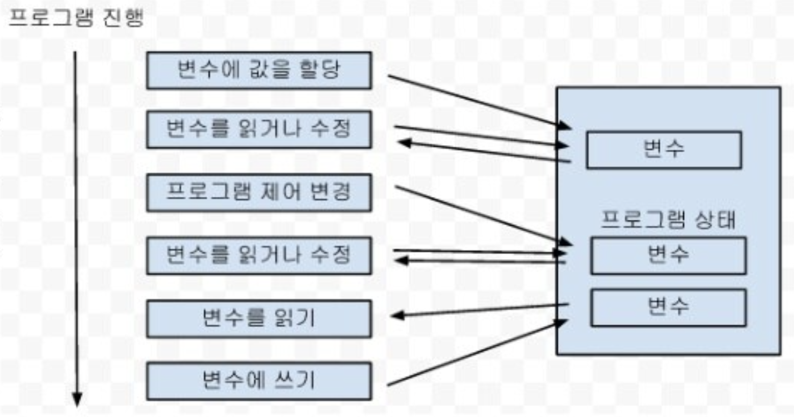
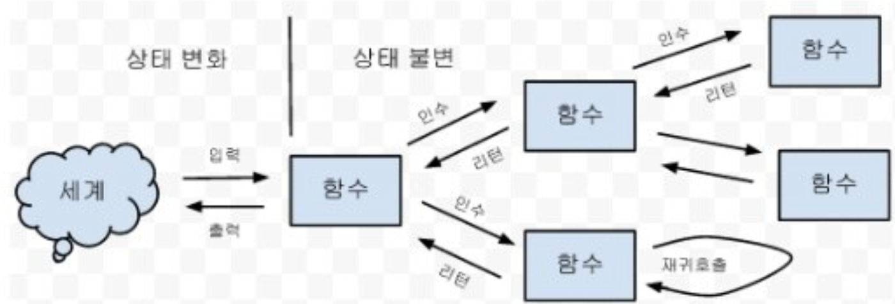

## 함수형 프로그래밍

### 함수형 프로그래밍이 주목받는 이유

컴퓨팅 환경의 변화로 인한 멀티스레딩 프로그래밍이 필요해 졌다. 그러나 멀티스레딩 프로그래밍은 어렵다는 큰 단점이 있고, 구성가능하지 않기도 하다.

반면 함수형 프로그래밍은 데이터가 불변인 특징과 사용하는 함수가 순수하다면 스레드가 아무리 많아도 문제가 되지 않는다는 특징이 있기 때문에 멀티 스레딩 환경에서 큰 이점을 가진다.

### 함수형 프로그래밍의 특징

- 순수 함수를 조합하고 소프트웨어를 만드는 방식의 언어이다
  - 명령형 프로그래밍 : 어떻게 할 건지를 설명하는 프로그래밍 (절차지향, 객체지향 프로그래밍)
  - 선언형 프로그래밍 : 무엇을 할 건지 설명하는 프로그래밍 (함수형 프로그래밍)

- **1급 함수**
  - 함수가 런타임 중에서 생성될 수 있다
  - 함수가 다른 함수의 인자로 전달될 수 있다
  - 함수의 결과로써 함수가 리턴될 수 있다.
  - 함수가 변수에 할당 될 수 있다.
  - 함수도 데이터처럼 구성이 가능해진다
- 순수함수
  - 참조 투명성 : 같은 입력에 대해 항상 같은 출력을 낸다. 함수의 결과는 오직 입력된 팔라미터에만 의존하며, 함수 외부의 어떤 값에도 의존하지 않는다.
  - No Side effect : 함수의 실행이 부수 효과를 내지 않는다. 즉 프로그램의 어떠한 상태도 변경하지 않는다. (함수 외부의 변수를 변경하거나 파일이나 네트웍으로 데이터를 내보내지 않는다. 예외도 부수효과이다)
- 불변 데이터
  - 데이터가 불변하여 스레드가 안전하고, 부수효과를 제거하고, 테스트를 쉽게 만든다
  - 불변 데이터는 다른 언어에서도 권장된다

### 객제지향의 문제점

- 객체는 구성가능하지 않다
- 인간의 사고는 객체로 되어 있지 않다
  - 객체보다 값이 더 단순하고 근본적임
- 패턴은 질병

### 객체지향의 장점

- 다형성 : 함수나 메서드가 객체즤 타입에 따라 다르게 행동

  - 다형성은 OOP의 전유물이 아니다

    - ex) 유닉스 파일 디스크립터는 다향성의 고전

      file, device driver, socket, pipe 등이 open/read/write/close 동작

- 캡슐화

  - 구현을 인터페이스에 숨기는 것
  - 그러나 객체는 상태를 지니기 때문에 완전한 캡슐화 불가능
  - 입력과 출력만을 다루는 함수는 그 자체로 블랙박스가 될 수 있기 때문에 오히려 더 완벽한 캡슐화 기능

- 모듈화

  - 자바와 클래스와 패키지가 하는 모듈화

### 프로그램의 구조

**절차형 프로그램의 구조**

- 개개의 코드가 프로그램의 상태를 바꾼다
- 한 코드가 상태를 프로그램의 상태를 바꾸면 프로그램 전체 코드가 영향을 받는다

**함수형 프로그램의 구조**

- 함수들을 유기적으로 조립하여 구성
- 함수는 인자에 따른 결과만 리턴
- 외부와의 인터페이스는 최상위 함수만 담당

