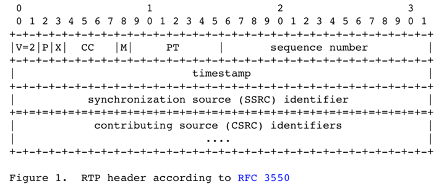
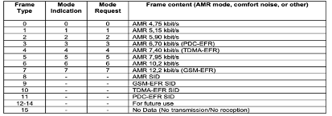
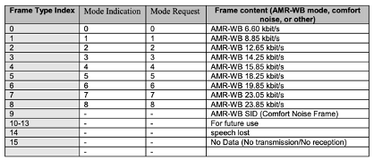
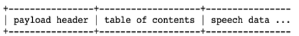
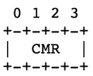
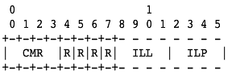
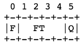
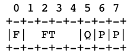
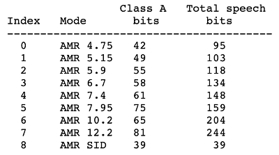
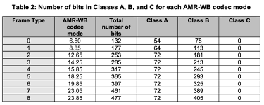

## AMR

Adaptive Multi-Rate Narrowband. 1999년 3GPP가 개발한 코덱으로, AMR이라고도 한다. 음성/영상통화용으로 사용되고 있다.

음성부호화에 최적화된 특허가 있는 오디오 데이터 압축 코덱

AMR음성 코덱은 7.4kbps에서 시작하는 시외전화 품질 음성으로 4.75에서 12.2 kbps의 가변 비트레이트의 협대역 신호(200 - 3400 HZ)를 인코딩하는 다중 속도 협대역 음성 코덱으로 이루어진 음성 코덱이다.

AMR은 12.2, 10.2, 7.95, 7.40, 6.70, 5.90, 5.15, 4.75 kbit/s 비트레이트의 8가지 소스 코덱을 사용한다

- 샘플링 레이트 : 8 kHz
- 대역폭 : 300 ~ 3400 Hz
- 비트 레이트 : 4.72 ~ 12.2 kbps
- 채널 : 모노(1채널)

## AMR-WB

Adaptive Multi-Rate Wideband.

300-3400 Hz만 전달하는 AMR-NB 코덱에 비해 더 넓은(50-7000 Hz) 음성 대역폭을 통해 향상된 음성 품질을 제공한다. 같은 대역폭에서도 음성품질이 좋으며, 더 높은 비트레이트를 지원한다. 대표적으로 VoLTE용으로 사용되고 있다.

AMR-WB는  6.60, 8.85, 12.65, 14.25, 15.85, 18.25, 19.85, 23.05, 23.85 kbps 비트레이트의 9가지 소스 코덱을 사용한다

- 샘플 레이트 : 16 kHz
- 대역폭 : 50 ~ 7000 Hz
- 비트 레이트 : 6.6 ~ 23.85 kbps
- 채널 : 모노(1채널)

## RTP Payload Format

- Version (V) : 2bits. RTP Version으로 2로 고정
- Padding (P) : 1bit. 설정된 경우 1개 이상의 추가 padding octests가 끝에 포함됨을 의미한다
- Extension (X) : 1bit. 설정된 경우 한 개의 header extension이 포함된다.
- CSRC count (CC) : 4bits. CSRC identifier의 개수
- Maker bit (M): 1bit.
  - 1 : talkspurt의 첫번째 sppech frame을 표시 (다시말해, 첫 번째 SID 이 후의 음성의 시작을 의미)
  - 0 : 그 외의 모든  packet
- Payload type (PT) : 7bits. 96 ~ 127 사이의 Dynamic Range를 사용한다. (Nego 과정에서 값이 결정된다).

- Sequence number (SN) : 16bits. RFC3550(RTP)에 따르며, decoding 순서를 결정한다

- Timestamp : 32bits. Frame당 samples 단위로 증가한다. (AMR은 160, AMR-WB는 320 samples)
- SSRC : 32bits. Synchrosization Source Identifier (RTP session에서 source를 구분하는 고유 식별자)
- CSRC list : 0 to 15 items, 32bits each. 다수의 음원이 mixer로 통합될 때 원음의 식별자 리스트

## AMR In SDP

### 주요 Parameter

m=audio 10048 RTP/AVP 100 98

> "m=" attribute에 Media Type name과 payload type(PT)을 정의한다
>
> Media type : audio
>
> PT = AMR-WB:100, AMR:98 (96 ~ 127 의 Dynamic range에서 nego된다)

a=rtpmap:100 AMR-WB/16000/1

> "a=rtpmap:{PT}" attribute에 해당 payload type에 대한 Media subtype name, RTP clock rate, channels를 정의한다
>
> Media subtype name은 AMR or AMR-WB로 표기한다
>
> RTP clock rate는 AMR=8000, AMR-WB=16000이다
>
> Channles는 audio channel 개수로 1 ~6의 range를 갖는다 (default = 1)

a=ptime:20

a=maxptime:120

> option parameter중 ptime과 maxptime은 "a=" attribute로 별도 지정한다
>
> ptime: packet당 media가 나타내는 시간으로 20으로 고정되며, audio에서는 해석이 무의미하다
>
> maxptime: 하나의 packet에 포함할 수 있는 최대 media 시간 (ms). frame size의 정수 배로(SHOULD) 없는 경우 임의의 개수를 포함 가능하다.

a=fmtp:100 mode-set=8; octet-align=1

> "a=fmtp:{PT}" attribute에 해당 payload type에 대한 기타 optional parameter를 정의한다
>
> 각 parameter는 parameter=value 쌍으로 열거하며, semicolon으로 구분한다
>
> octet-align: operation mode로 각각의 방식에 따른 packet field 및 지원 기능이 달라진다
>
> - 0: badwidth-efficient mode
> - 1: octet-aligned mode
>
> mode-set: 허용하는 modeindication의 열거형으로 comma로 구분한다.
>
> ​	Mode-set이 없는 경우 모두 허용한다. Mode-indication 이 외의 Frame Type의 경우 SID, Speech lost, No Data만 사용할 수 있다 그 외 모든 패킷 수신 시 폐기한다

### AMR-NB

| Frame Type | Mode Indication | Mode Request | Frame Content (AMR mode, comfort noise, or other) |
| ---------- | --------------- | ------------ | ------------------------------------------------- |
| 0          | 0               | 0            | AMR 4.75 kbit/s                                   |
| 1          | 1               | 1            | AMR 5.15 kbit/s                                   |
| 2          | 2               | 2            | AMR 5.90 kbit/s                                   |
| 3          | 3               | 3            | AMR 6.79 kbit/s (PDC-EFR)                         |
| 4          | 4               | 4            | AMR 7.40 kbit/s (TDMA-EFR)                        |
| 5          | 5               | 5            | AMR 7.95 kbit/s                                   |
| 6          | 6               | 6            | AMR 10.2 kbit/s                                   |
| 7          | 7               | 7            | AMR 12.2 kbit/s (GSM-EFR)                         |
| 8          | -               | -            | AMR SID                                           |
| 9          | -               | -            | GSM-EFR SID                                       |
| 10         | -               | -            | TDMA-EFR SID                                      |
| 11         | -               | -            | PDC-EFR SID                                       |
| 12 - 14    | -               | -            | For Future use                                    |
| 15         | -               | -            | No Data (No Transmission/ No reception)           |

### AMR-WB

| Frame Type | Mode Indication | Mode Request | Frame Content (AMR-WB mode, Comfort noise, or other) |
| ---------- | --------------- | ------------ | ---------------------------------------------------- |
| 0          | 0               | 0            | AMR-WB 6.60 kbit/s                                   |
| 1          | 1               | 1            | AMR-WB 8.85 kbit/s                                   |
| 2          | 2               | 2            | AMR-WB 12.65 kbit/s                                  |
| 3          | 3               | 3            | AMR-WB 14.25 kbit/s                                  |
| 4          | 4               | 4            | AMR-WB 15.85 kbit/s                                  |
| 5          | 5               | 5            | AMR-WB 18.25 kbit/s                                  |
| 6          | 6               | 6            | AMR-WB 19.85 kbit/s                                  |
| 7          | 7               | 7            | AMR-WB 23.05 kbit/s                                  |
| 8          | 8               | 8            | AMR-WB 23.85 kbit/s                                  |
| 9          | -               | -            | AMR-WB SID (Comfort Noise Frame)                     |
| 10 -13     | -               | -            | For Future use                                       |
| 14         | -               | -            | speech lost                                          |
| 15         | -               | -            | NO Data (No Transmission/ NO Reception)              |

- FT=14 (SPEECH_LOST, only available for AMR-WB): packet이 손실되었다
- FT=15 (No Data) 현재 Payload에 업쇼고, 이전 또는 이 후 패킷에 존재한다.
  - No Data로만 구성된 packet 또는 마지막 frame이 No Data 페킷인 경우는 interleaving의 경우에만 전달할 수 있다 (SHOULD)

- Interleaving : octet-aligned mode에서만 사용 가능. Interleaving group에서 사용되는 최대 frame-blocks 개수
- crc : octet-aligned mode에서만 사용가능
  - 0 : CRC 사용안함
  - 1 : CRC 사용
- mode-change-period : N frame blocks 주기로 codec-mode 변경이 허용된다
  - N 은 1 or 2로 default=1이다
- mode-change-capability
  - 1 : client가 mode 변경 주기를 제한할 수 있다 (default)
  - 2 : client가 mode 변경 주기를 2로 제한할 수 있다 (권장)
- mode-change-neighbor
  - 0 : neighboring modes 가 아닌 모드로 변경이 가능하다 (default)
  - 1 : neighboring modes로 만 변경이 가능하다. neighboring modes는 현재 mode보다 한 단계 높은 또는 낮은 레벨 (5인경우 4 or 6)
- robust-sorting: octet-aligned mode에서만 사용가능
  - 0 : simple payload sorting이 사용됨
  - 1 : robust payload sorting이 사용됨
- max-red : 중복 전송 사용 시 중복 packet의 최대 전송 지연시간 (msec). 0 - 65535로 default=0 (제약없음)

## Payload 구조

AMR과 AMR-WB모두 payload header + table of contents(TOC) + speech data로 구성된다

### Payload Header

> Bandwidth-Efficient Mode
>
> 

> Octet-Aligned Mode
>
> 

- Codec Mode Request (CMR) : 4bit

  - Optional Parameter로 지정된 Mode-set 범위 또는 No-Data로 설정된다. 해당 값을 벗어나는 모든 packet은 drop한다
  - CMR=15 (No-DATA)는 수신기의 선택사항으로 송신기에서 정하지 않는 경우이다

- Reversed (R) : 1bit *4

  - 예약 bit로 0으로 설정한다

- ILL (4bit, unsigned integer)

  - Optional parameter인 interlieaving이 정의된 경우에 존재한다
  - ILL = L 인 경우 interleaving length = L + 1

- ILP (4bit, unsigned integer)

  - Optional parameter인 interleaving이 정의된 경우에 존재한다
  - 0 ~ ILL값의 range로 index를 표시하며 범위 밖의 packet은 폐기한다
  - ex) speech frame-block (time-synchronized set of speech frames in a multi-channel) n에서 시작하는 interleaving group의 ILL=L이라고 한다면
    - s : first payload packet of the interleaving group
    - N : payload 내의 speech frame-blocks 개수

  

## The Payload Table of Contents (ToC)

> Bandwidth-Efficient Mode
>
> 

> Octet-Aligned Mode
>
> 

-  F (1 bit)
  - 0 : payload 내에 마지막 speech frame
  - 1 : payload 내에 추가적인 speech frame이 존재
- FT (4 bits)
  - Speech coding mode or comport noise (SID) mode 를 지정
- Q (1 bit)
  - 0 : 해당 frame이 심각하게 손상됨 (packet drop하는 것보다는 품질향상에 도움을 줌)
  - 1: 정상 packet
  - unequal error protection and detection (UEP and UED) 메커니즘에 따라 frame의 speech bit를 A, B, C 클래스로(민감도 순) 구분하여 class A 의 bit error가 감지된 경우에만 Q=1로 설정한다

- P bits : padding bits
  - 반드시 0으로 설정하며, 수신기에서는 무시된다.

N Channel의 K speech frame-block으로 구성된 packet은 N*K의 ToC가 존재하며 생성 시간 순으로 정렬한다.

List of frame CRCs는 optional parameter인 crc=1인 경우에만 존재한다

각 CRC는 8bit로 구성되며, AMR / AMR-WB codec의 Class A bit에 대해서만 계산된다

수신기는 CRC 검사를 통해 packet의 무결성을 검사해야 한다 (SHOULD)

CRC값이 틀린 경우 Q=0으로 설정해야 한다 (MUST)

## Speech Data

0개 이상의 speech frames or SID로 구성된다

FT=14 or 15인 경우 연관 speech frame이 존재한다

각 speech frame은 FT field로 encoded된 20ms speech를 나타낸다

speech frame length는 FT mode 기준으로 정해진다

octet-aligned mode 경우에는 각 speech frame은 octet-aligned되어야 한다 (zero-padding)

## Payload Example

