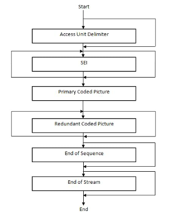

## 개요

H.264 video codec은 low bitreate Internet streaming applications부터 HDTV broadcast과 Digital Cinema applications까지 모든 형태의 digital 압축 video를 포관하는 거의 무손실 coding이 가능하다

**access unit**

primary coded picture를 포함하는 NAL units을 말하며, 1개 이상의 Redundant coded pictures를 포함할 수 있다. 즉, encoding이 완료되어 추출된 결과물의 단위를 말한다

**primary coded picture**

모든 macroblocks을 포함하는 picture로 하나의 primary coded picture를 decoding하여 하나의 frame을 만들 수 있다

**VCL NAL unit**

NAL unit은 1byte header와 payload bytes로 구성된 H.264의 RTP payload를 말하며, VCL NAL unit은 Video Coding Layer(VCL)를 통해 encoding된 payload로 구성된 NAL unit을 말한다.

Nal Access unit의 구성은 아래와 같다

