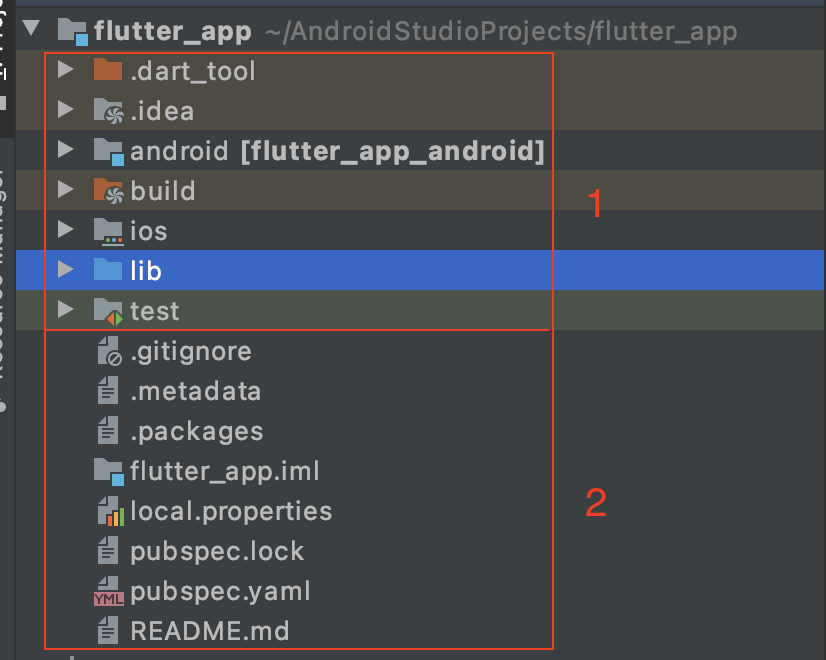
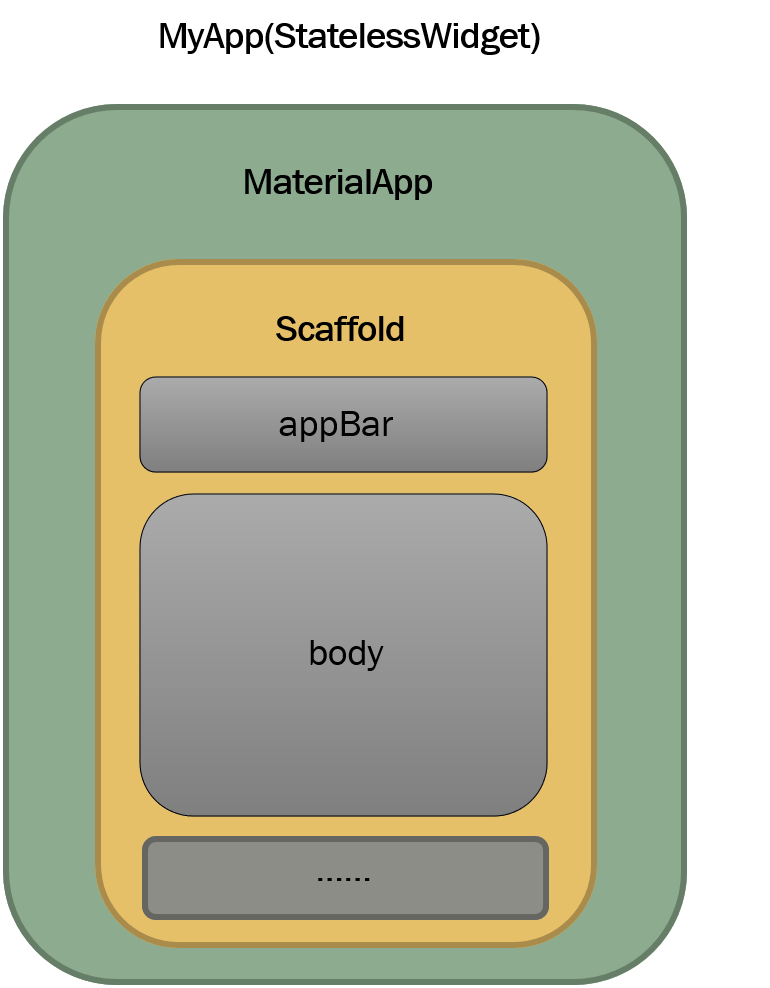

## vm로젝트 구조 이해

플러터 프로젝트를 구성하는 폴더와 파일의 역할을 간단히 살펴보면 크게 두개로 나눌 수 있다.

1. 프로젝트를 구성하는 폴더
2. 프로젝트를 구성하는 파일



### 프로젝트를 구성하는 폴더

프로젝트를 구성하는 폴더는 다음과 같다.

- `.idea` : 개발 도구에 필요한 설정
- `android` : 안드로이드 네이티브 코드를 작성하는 부분
- `build` : 빌드시 생성되는 파일
- `ios` : iOS 네이티브 코드를 작성하는 부분
- `lib` : 다트 코드를 작성하는 부분
- `test` : 테스트 코드를 작성하는 부분

### 프로젝트를 구성하는 파일

프로젝트를 구성하는 파일은 다음과 같다.

- `.gitignore` : Git 설정파일. 버전 관리시 무시할 파일 규칙 생성
- `.metadata` : 프로젝트가 관리하는 파일. 임의로 수정하지 않는다.
- `.packages` : 각종 패키지 정보. 임의로 수정하지 않는다.
- `flutter_app.iml` : 개발 도구에 필요한 설정 파일. 임의로 수정하지 않는다.
- `pubspec.lock` : 패키지 매니저가 이용하는 파일. 임의로 수정하지 않는다.
- `pubspec.yaml` : 패키지 매니저가 이용하는 파일
- `README.md` : 프로젝트를 설명하는 파일

`.gitignore`, `pubspec.yaml`, `README.md` 파일을 제외한 나머지 파일은 임의로 수정하면 안된다.

## 기본 앱 구조

샘플 앱인 카운터 앱의 main.dart파일을 분석해본다.

```dart
import 'package:flutter/material.dart';

// 앱 시작 부분
void main() {
  runApp(MyApp());
}

// 시작 클래스. 머티리얼 디자인 앱 생성
class MyApp extends StatelessWidget {
  // This widget is the root of your application.
  @override
  Widget build(BuildContext context) {
    return MaterialApp(
      title: 'Flutter Demo',
      theme: ThemeData(
        primarySwatch: Colors.blue,
        visualDensity: VisualDensity.adaptivePlatformDensity,
      ),
      home: MyHomePage(title: 'Flutter Demo Home Page'),
    );
  }
}

// 시작 클래스가 실제로 표시하는 클래스. 카운터 앱 화면
class MyHomePage extends StatefulWidget {
  MyHomePage({Key key, this.title}) : super(key: key);

  final String title;

  @override
  _MyHomePageState createState() => _MyHomePageState();
}

// 위 MyHomePage 클래스의 상태를 나타내는 State클래스
class _MyHomePageState extends State<MyHomePage> {
  int _counter = 0; // 화면에 표시할 상태값인 카운터 숫저

  // counter 변수를 1 증가시키고 화면을 다시 그리는 메서드
  void _incrementCounter() {
    setState(() { // 화면을 다시 그리는 메서
      _counter++;
    });
  }

  // 화면에 UI를 그리는 메서드. 그려질 위젯을 반환
  @override
  Widget build(BuildContext context) {
    return Scaffold(  // 머테리얼 디자인 기본 뼈대 위젯
      appBar: AppBar( // 상단 앱바
        title: Text(widget.title),
      ),
      body: Center( // 표시할 내용
        child: Column(
          mainAxisAlignment: MainAxisAlignment.center,
          children: <Widget>[
            Text(
              'You have pushed the button this many times:',
            ),
            Text(
              '$_counter', // _counter 변수를 표시
              style: Theme.of(context).textTheme.headline4,
            ),
          ],
        ),
      ),
      floatingActionButton: FloatingActionButton(
        onPressed: _incrementCounter, // 클릭 시 _incrementCounter() 메서드 실행
        tooltip: 'Increment',
        child: Icon(Icons.add), // 상단 앱바
      ),
    );
  }
}
```


```dart
import 'package:flutter/material.dart';

void main() => runApp(MyApp());

class MyApp extendsx StatelessWidget { ... 생략 ... }

class MyHomePage extends StatefulWidget { ... 생략 ... }

class _MyHomePageState extends State<MyHomePage> { ... 생략 ... }
```

위의 세 부분은 사실 거의 수정하지 않는 부분이다. 아래쪽 두 부분인 MyHomePage와 _MyHOmePageState는 샘플 앱의 화면을 나타내는 코드이다. 모든 코드는 사실상 마지막 덩어리인 _MyHomePage에 작성한다.


## 앱 실행 부분

먼저 import부분을 살펴보면, 플러터에서는 화면을 그리는 모든 디자인 요소를 위젯이라고 한다. `package:flutter/material.dart`패키지에서는 머티리얼 디자인 위젯들이 포함되어 있다. 머티리얼 디자인을 기본으로 하는 앱은 이 패키지를 임포트하여 머티리얼 디자인 위젯을 사용할 수 있다.

```dart
imp0ort 'package:flutter/material.dart';
```

`main()` 함수는 앱의 시작점이다. 여기서는 `runApp()` 함수에 `MyApp()` 인스턴스를 전달한다. 이 부분은 특별히 수정할 일이 없다.

```dart
void main() => runApp(MyApp());
```


## StatelessWidget 클래스

StatelessWidget 클래스는 상태가 없는 위젯을 정의하는데 사용된다. `runApp()` 함수에 전달된 `MyApp()` 클래스는 다음과 같이 정의되어 있다.

```dart
class MyApp extends StatelessWidget { // 1
  @override
  Widget build(Buildcontext cpontext){
    return MaterialApp( ... 생략 ... );  // 2
  }
}
```

`MyApp` 클래스는 `StatelessWidget` 클래스의 서브클래스이다. `StatelessWidget` 클래스는 상태를 가지지 않는 위젯을 구성하는 기본 클래스이다. 여기서 상태를 가지지 않는다는 것은 한 번 그려진 후 다시 그려지지 않는 경우이며, 이러한 클래스는 프로퍼티로 변수를 가지지 않는다. (상수는 가질 수 있다)

`StatelessWidget` 클래스는 `build()` 메서드를 가지고 있다. `build()` 메서드는 위젯을 생성할 때 호출되는데, 실제로 화면에 그릴 위젯을 작성해 반환한다.

따라서 StatelessWidget 클래스를 상속받은 MyApp 클래스는 MaterialApp클래스의 인스턴스를 작성해 반환한다.


## MaterialApp 클래스

`build()` 메서드가 반환하는 `MaterialApp()`ㅋㅡㄹ래스는 다음과 같다. 여기까지는 거의 모든 프로젝트에서 같다.

```dart
return MaterialApp(
  title: 'Flutter Demo',
  theme: ThemeData(
    primarySwatch: Colors.blue,
    visualDensity: VisualDensity.adaptivePlatformDensity,
  ),
  home: MyHomePage(title: 'Flutter Demo Home Page'),
);
```

여기서는 title, theme, home 세 가지 이름이 있는 인수를 설정한다. 이 프로퍼티들을 설정하여 위젯의 속성을 표현한다.

title은 말 그대로 제목을 나타낸다. theme은 테마를 지정한다. 여기서는 파랑 계열의 색상 테마가 기본으로 설정되어 있다. home에 작성하는 위젯이 실제 이 앱이 표시하는 위젯이 된다.

- 이름있는 변수

> 다트 언어에서는 이름 있는 인수와 이름 없는 인수 (일반 인수)가 있다. 위젯에 따라 각각 사용방법이 다르다.
>
> - 이름 있는 인수는 앞에 인수명을 쓴다.
>
>   예) MyHomePage ( title: 'hello')
>
> - 이름 없는 인수는 여타 언어와 같이 인수명을 쓰지 않는다.
>
>   예) Text('hello')
>
> 플러터에서 이름있는 인수는 클래스의 프로퍼티에 값을 할당하는 것이며, 그 모양새는 클래스의 속성을 의미한다.


## StatefulWidget 클래스

상태가 있는 위젯을 정의할 때는 `StatefulWidget` 클래스를 사용한. `StatefulWidget` 클래스는 `StatefulWidget` 을 상속받은 `MyHomePage` 클래스와 `State<MyHomePage>` 클래스를 상속받은 `_MyHomePageState`  클래스로 구성된다.

샘플 앱은 다음과 같은 형태로 작성되어 있다.

```dart
class MyHomePage extends StatefulWidget {
  MyHomePage({Key key, this.title}) : super(key: key); // (1)

  final String title;

  @override
  _MyHomePageState createState() => _MyHomePageState(); // (2)
}

// 위 MyHomePage 클래스의 상태를 나타내는 State클래스
class _MyHomePageState extends State<MyHomePage> {
  int _counter = 0; // (3) 변경 가능한 상태
  
  // ... 생략 ...

  // 화면에 UI를 그리는 메서드. 그려질 위젯을 반환
  @override
  Widget build(BuildContext context) { // (4)
    return Scaffold(  ... 생략 ... )
  }
}
```

1. `MyHomePage` 클래스의 생성자는 key와 title 프로퍼티를 옵션으로 받아서 super 키워드로 부모 클래스의 생성자에 key를 전달한다.
2. `MyHomePage` 클래스에는 상속받은 `createState()` 메서드를 재정의하여 `_MyHomePageState` 클래스의 인스턴스를 반환한다. 이 메서드는 `StatefulWidget` 이 생성될 때 한 번만 실행되는 메서드이다.
3. `State` 클래스를 상속받은 클래스를 상태 클래스라고 부른다. 상태 클래스는 변경 가능한 상태를 프로퍼티 변수로 표현한다. 나중에 이 변수의 값을 변경하면서 화면을 다시 그리게 된다.
4. `_MyHomePageState` 클래스의 상태에 따라 화면에 그려질 코드를 여기에 작성한다. 모양새는 `StatelessWidget` 클래스와 똑같다. `build()` 메서드를 가지고 있고 여기에 화면에 그려질 부분을 정의한다.


## 위젯에서 위젯으로 값 전달

위젯에서 위젯으로 값을 전달하는 과정을 살펴보면 `MaterialApp` 클래스에서 `home` 프로퍼티에 `MyHomePage` 인스턴스를 (생성하고) 인수로 전달하며, 그와 동시에 `MyHomePage` 의 `title` 인수값으로 'Flutter Demo Home Page'를 전달했다.

```dart
// ... 생략 ...
return MaterialApp(
  title: 'Flutter Demo',
  theme: ThemeData(
    primarySwatch: Colors.blue,
    visualDensity: VisualDensity.adaptivePlatformDensity,
  ),
  home: MyHomePage(title: 'Flutter Demo Home Page'),
);
// ... 생략 ...
```

이렇게 전달받은 `title` 인숫값은 `MyHomePage` 클래스의 생성자의 `this.title` 매개변수로 전달되어 필드 상수인 `String title`에 대입된다.

```dart
class MyHomePage extends StatefulWidget {
  MyHomePage({Key key, this.title}) : super(key: key);

  final String title;
  // ... 생략 ...
}
// 상태 클래스
class _MyHomePageState extends State<MyHomePage> {
  @override
  Widget build(BuildContext context) {
    return Scaffold(  // 머테리얼 디자인 기본 뼈대 위젯
      appBar: AppBar( // 상단 앱바
        title: Text(widget.title),  // (1)
      ),
    );
  }
}
```

이렇게 위젯 사이의 데이터 전달은 생성자를 활용한다. 상태 클레스에서 `StatefulWidget` 클래스에 접근하려면 (1) widget 프로퍼티를 사용한다.


## 상태 변경

`State` 클래스에는 주로 상태를 저장할 변수들과 그 변수를 조작할 메서드를 작성한다. 카운터 앱의 State 클래스는 다음과 같이 정의되어 있다.

```dart
class _MyHomePageState extends State<MyHomePage> {
  int _counter = 0; // 화면에 표시할 상태값인 카운터 숫저

  // counter 변수를 1 증가시키고 화면을 다시 그리는 메서드
  void _incrementCounter() {
    setState(() { // 화면을 다시 그리는 메서
      _counter++;
    });
  }

  @override
  Widget build(BuildContext context) {
    return Scaffold(  ... 생략 ... )
  }
}
```

정수형 `_counter` 는 0으로 초기화되어 있고, `_incrementCounter()` 메서드는 `setState()` 메서드를 실행한다. 여기서 `setState()`메서드가 중요하다. 이 메서드의 인수로 입력 인수가 없고 반환값이 없는 익명 함수를 작성했다. 익명 함수의 내용은 `_counter`를 1만큼 증가시키는 것이다.

`setState()` 메서드는 전달된 익명 함수를 실행한 후 화면을 다시 그리게 하는 역할을 한다. 화면은 `build()` 메서드가 실행되면서 그려진다고 배웠다. 즉 `setState()`메서드는 `build()` 메서드가 다시 실행되게 하는 역할을 한다. `setState()` 메서드는 `State` 클래스가 제공하는 메서드이다.

정리하면 `MyHOmePage`클래스는 `StatefulWidget`의 서브 클래스이며 상태를 가질 수 있다. 그리고 그 상태는 `State`클래스의 서브클래스로 정의한다. 여기서 변경 가능한 상태는 `_counter` 변수이다. 이 값이 변경될 때마다 화면을 다시 그리면 동적인 화면을 가진 앱이 된다.


## Scaffold 클래스와 AppBar 클래스

`_MyHomePageState` 클래스의 `build()` 메서드가 호출될 때 불리는 `Scaffold` 클래스를 보면, `Scaffold` 클래스는 머티리얼 디자인 앱을 만들 때 뼈대가 되는 위젯이다. 즉 머티리얼 디자인 앱을 만든다면 `MaterialApp` -> `Scaffold` 가 기본 형태이다.



만약 `Scaffold`를 작성하지 않는다면 상단 앱바가 없고 머티리얼 디자인이 적용 안 된 화면이 그려지므로 이 구조를 유지하는 것이 디자인 통일에 유익하다.

카운터 앱의 `Scaffold` 클래스는 다음과 같이 `appBar`, `Body`, `floatingActionButton`을 정의한다.

```dart
Scaffold(
  appBar: AppBar(  // (1)
    title: Text(widget.title), // (2)
  ),
  body: ... 생략 ...,
  floatingActionButton: ... 생략 ...
);
```

1. appBar에 AppBar 클래스의 인스턴스를 전달한다. `AppBar`는 머티리얼 디자인 앱에서 상단의 제목과 메뉴를 표시하는 영역을 나타낸다.
2. `AppBar`클래스는 `title` 프로퍼티에 `Text` 위젯을 정의했다. `Text` 위젯은 글자를 나타내는 위젯이며 인수로 `widget.title` 값을 넘겨받아 화면에 표시한다. `widget`은 `StatefulWidget` 클래스 (`MyHOmePage`) 의 프로퍼티를 참조할 때 사용된다.

```dart
int _counter = 0;  // (3)
// ... 생략 ...
body: Center(
  child: Column(
    mainAxisAlignment: MainAxisAlignment.center,
    children: <Widget>[
      Text(
        'You have pushed the button this many times:',
      ),
      Text(
        '$_counter', // (4)
        style: Theme.of(context).textTheme.headline4,
      ),
    ],
  ),
),
```

숫자가 표시되는 (4) `$_counter` 부분을 눈여겨 보자. `_counter`는 정수현 변수이다. 이것을 `Text`위젯에 표시하려면 문자열로 변경해야 한다. 변숫값을 문자열 형태로 변경하고자 할 때는 변수 앞에 `$` 기호를 붙인다. 이 코드는 애초에 (3)에서 0으로 초기화했기 때문에 0을 문자열로 표시한다.

이후 사용자가 (+) 버튼을 누르면 다음과 같은 `_incrementCountr()` 메서드가 호출된다.

```dart
void _incrementCounter(){
  setState((){ // (5)
    _counter++; // (6)
  });
}
```

그러면 (5) `setState()` 메서드에 의해 `_counter` 변수가 1증가한 후 `build()` 메서드가 다시 호출되고 화면이 다시 그려져 숫자가 갱신된다.

## FloatingActionButton 클래스

`Scaffold` 클래스는 머티리얼 디자인에 자주 사용되는 `FloatingActionButton` 클래스를 정의하는 프로퍼티를 제공한다. 코드를 살펴보자

```dart
floatingActionbutton: FloatingActionButton(
  onPressed: _incrementCounter,
  tooltip: 'Increment',
  child: Icon(Icons.add)
),
```

