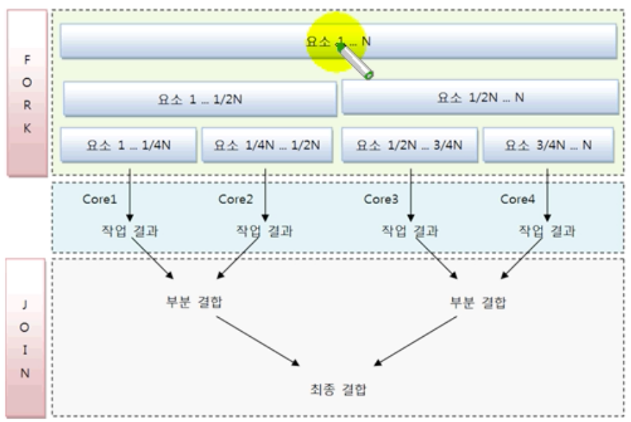

## 병렬처리

Java8부터 병렬 스트림을 제공하여 컬렉션의 전체 요소를 병렬로 처리할 수 있게 되었다

- 동시성 : 멀티 스레드 환경에서 스레드가 번갈아 가면서 실행하는 성질 (싱글코어 CPU)
- 병렬성 : 멀티 스레드 환경에서 코어들이 스레드를 병렬적으로 실행하는 성질 (멀티코어 CPU)

### 병렬성

- 데이터 병렬성
  - 데이터 병렬성은 한 작업 내에 있는 전체 데이터를 쪼개 서브 데이터로 만들고 서브 데이터를 병렬 처리해서 작업을 빨리 끝내는 것을 의미한다
- 작업 병렬성
  - 작업 병렬성은 서로 다른 작업을 병렬처리하는 것을 말한다
  - 작업 병렬성의 대표적인 예는 웹서버이다. 웹 서버는 각각의 브라우저에 요청한 내용을 개별 스레드에서 병렬로 처리한다

## 병렬 Stream

병렬 스트림은 데이터 병렬성을 구현하였다

- 멀티코어의 수만큼 대용량 요소를 서브 요소들로 나누고, 각각의 서븡 요소들을 분리된 스레드에서 병렬 처리시킨다.
- 예를 들면 쿼드 코어CPU의 경우 4개의 서브요소로 나누고 4개의 스레드가 각각의 서브 요소들을 병렬로 처리한다
- 병렬스트림은 내부적으로 포크조인 프레임워크를 사용한다

### 포크조인(ForkJoin) 프레임워크

- 포크단계
  - 데이터를 서브 데이터로 반복적으로 분리한다
  - 서브 데이터를 멀티코어에서 병렬로 처리한다
- 조인단계
  - 서브 결과를 결합해서 최종 결과를 만들어낸다

- 포크조인풀
  - 각각의 코어에서 서브 요소를 처리하는 것은 개별 스레드가 해야하므로 스레드 관리가 필요하다
  - 포크조인 프레임워크는 ExecutorService의 구현 객체인 ForkJoinPool을 사용해서 작업 스레드를 관리한다

