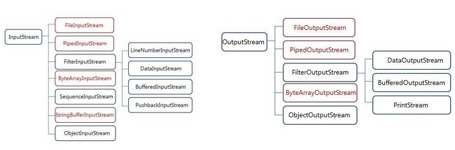
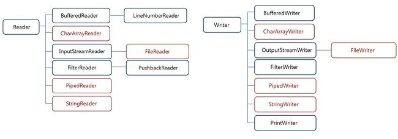

## I/O 입출력 클래스

Java의 I/O는 Java.io 패키지에 클래스가 정의되어 있는 경우가 대부분이다.

Java의 초기에는 입출력 클래스도 단순했 단순히 바이트 단위의 입출력만 지원했지만, 현재는 계속적으로 확장되며 문자 단위의 입출력 뿐만 아니라 다양한 기능을 지원하는 클래스들이 생겨났다.

### I/O 클래스의 이름과 의미

- Stream : 바이트 단위로 입출력 수행

- Reader / Writer : 캐릭터 단위로 입출력 수행

- File : 하드디스크의 파일을 사용

- Data : 자바의 원시 자료형을 출력하기 위한 클래스

- Buffered : 시스템의 버퍼를 사용

  

- 1차 스트림 : 입/출력 통로를 직접 만드는 클래스

- 2차 스트림 : 기존의 통로를 이용하여 새로운 기능을 더하는 클래스

### InputStream / OutputStream (바이트 입출력)

- InputSttream

  | 클래스                  | 설명                                              | Stream     |
  | ----------------------- | ------------------------------------------------- | ---------- |
  | InputStream             | 바이트 입력 스트림을 위한 추상 클래스             | 2차 스트림 |
  | FileInputStream         | 파일에서 바이트를 읽어들여 바이트 스트림으로 변환 | 1차 스트림 |
  | PipedInputStream        | PipedOutputStream에서 읽어들임                    | 1차 스트림 |
  | FilterInputStream       | 필터 적용 바이트 입력을 위한 추상 클래스          | 2차 스트림 |
  | LineNumberInputStream   | 바이트 입력시 라인 번호를 유지 **(비추천)**       | 2차 스트림 |
  | DataInputStream         | 기본 자료형 데이터를 바이트로 출력                | 2차 스트림 |
  | BufferedInputStream     | 바이트 버퍼 입력                                  | 2차 스트림 |
  | PushbackInputStream     | 읽어들인 바이트를 되돌림 (pushback)               | 2차 스트림 |
  | ByteArrayInputStream    | 바이트 배열에서 읽어들임                          | 1차 스트림 |
  | SequenceInputStream     | 서로 다른 InputStream을 입력받은 순서대로 이어줌  | 2차 스트림 |
  | StringBufferInputStream | 문자열에서 읽어들임 **(비추천)**                  | 1차 스트림 |
  | ObjectInputStream       | 객체로 직렬화된 데이터를 역직렬화하여 읽음        | 2차 스트림 |

- OutputStream

  | 클래스                | 설명                                     | Stream     |
  | --------------------- | ---------------------------------------- | ---------- |
  | OutputStream          | 바이트 출력 스트림을 위한 추상 클래스    | 2차 스트림 |
  | FileOutputStream      | 바이트 스트림을 바이트 파일로 변환       | 1차 스트림 |
  | pipedOutputStream     | PipedOutputStream에 출력                 | 1차 스트림 |
  | FilterOutputStream    | 필터 적용 바이트 출력을 위한 추상 클래스 | 2차 스트림 |
  | DataOutputStream      | 바이트를 기본 자료형으로 출력            | 2차 스트림 |
  | BufferedOutputStream  | 바이트 스트림에 버퍼 출력                | 2차 스트림 |
  | PrintStream           | Stream 값과 객체를 브린트                | 2차 스트림 |
  | ByteArrayOutputStream | 바이트 스트림에 바이트 배열 출력         | 1차 스트림 |
  | ObjectputStream       | 데이터를 객체로 직렬화하여 출력          | 2차 스트림 |

## Reader / Writer (문자 입출력)

> 문자 입출력에는 문자 Encoding이 관여된다

- Reader

  | 클래스            | 설명                                            | Stream     |
  | ----------------- | ----------------------------------------------- | ---------- |
  | Reader            | 바이트 입력 스트림을 위한 추상 클래스           | 2차 스트림 |
  | BufferedReader    | 문바 버퍼 입력, 라인 해석                       | 2차 스트림 |
  | LineNumberReader  | 문자 입력 시 라인 번호를 유지                   | 2차 스트림 |
  | CharArrayReader   | 문자 배열에서 읽어들임                          | 1차 스트림 |
  | InputStreamReader | 바이트 스트림을 문자 스트림으로 변환            | 2차 스트림 |
  | FileReader        | 파일에서 바이트를 읽어들여 문자 스트림으로 변환 | 1차 스트림 |
  | FilterReader      | 필터 적용 문자 이력을 위한 추상 클래스          | 2차 스트림 |
  | PushbackReader    | 읽어들인 문자를 되돌림                          | 2차 스트림 |
  | PipedReader       | PipedWriter에서 읽어들임                        | 1차 스트림 |
  | StringReader      | 문자열에서 읽어들임                             | 1차 스트림 |

- Writer

  | 클래스             | 설명                                   | Stream     |
  | ------------------ | -------------------------------------- | ---------- |
  | Writer             | 문자 출력 스트림을 위한 추상 클래스    | 2차 스트림 |
  | BufferdWriter      | 문자 스트림에 버퍼 출력, 줄바꿈 사용   | 1차 스트림 |
  | CharArrayWriter    | 문자 스트림에 문자배열 출력            | 1차 스트림 |
  | OutputStreamWriter | 문자 스트림을 바이트 스트림으로 변환   | 2차 스트림 |
  | FileWriter         | 문자 스트림을 바이트 파일로 변환       | 1차 스트림 |
  | FilterWriter       | 필터 적용 문자 출력을 위한 추상 클래스 | 2차 스트림 |
  | PipedWriter        | PipedReader에 출력                     | 1차 스트림 |
  | StringWriter       | 문자열 출력                            | 1차 스트림 |
  | PrintWriter        | Writer값과 객체를 프린트               | 2차 스트림 |

## 그 외의 java.io클래스

| 클래스                 | 설명                                                         |
| ---------------------- | ------------------------------------------------------------ |
| console                | 명령행에서 쉽게 입력받고 정형화된 출력을 명령행에 쉽게 출력 가능 |
| File                   | 파일 객체를 생성                                             |
| FileDescriptor         | 물리적 파일에 대한 현재의 연결을 나타내기 위한 클래스        |
| FilePermission         | 파일 및 디렉토리에 엑세스 권한을 관리하는 클래스             |
| RandomAccessFile       | 랜덤 액세스 파일로부터 읽기와 쓰기가 동시에 이뤄질 수 있다   |
| SerializablePermission | 직렬화 가능 액세스 권한을 위한 클래스                        |
| StreamTocknizer        | 입력 스트림을 인수에 취해, 그것을 토큰에 구문 분석해 한 번에 1개의 토큰을 읽음 |

