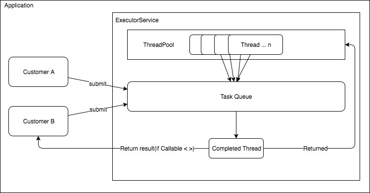

## ExecutorService

- 병렬 작업 시 여러개의 작업을 효율적으로 처리하기 위해 제공되는 JAVA 라이브러리
- 흔히 말하는 ThreadPool구현을 매우 용이하게 할 수 있으므로, Java에서 스레드 풀을 사용하고자 할 때 사용한다
- Runnable, Callable 중 하나를 상속하여 구현한 클래스를 인자로 받아서 처리할 수 있다.
  - Runnable : return 값이 없는 스레드
  - Callable : return 값이 있는 스레드


### ExecutorService의 종류

- `CachedThreadPool` : 스레드를 캐싱하는 스레드 풀. 필요할 때 필요한 만큼 스레드 풀을 생성한다. 이미 생성된 스레드를 재활용할 수 있기 때문에 성능상의 이점이 있을 수 있다 (여기서 쓰이는 캐싱의 의미는 일정시간동안 스레드를 검사한다는 뜻이다. 60초동안 작업이 없으면 Pool에서 제거한다)
- `ScheduledThreadPool` : 일정 시간 뒤에 실행되는 작업이나 주기적으로 수행되는 작업에 사용된다.
- `FixedThreadPool` : 고정된 개수를 가진 스레드풀
- `SingleThreadExecutor` : 한 개의 스레드로 작업을 처리하는 스레드풀. 스레드 풀이라기보단 TaskPool의 개념이 더 적합하다




- Customer은 Application에서 ExecutorService를 사용하는 클래스
- 해당 클래스에서 ExcutorService에 작업을 submit하게 되면 ExecutorService 내부에서 해당 작업을 내부적으로 스케쥴링 하면서 일을 처리한다
  - 이 때 Task를 가진 Queue에서 ThreadPool에 있는 스레드를이 각기 본인의 Task를 가지고 작업을 처리하기 때문에 개발자 입장에서는 해당 스레드들의 생명주기를 따로 관리할 필요가 없다


#### 메서드

- `submit()` : 작업을 추가할 땐 `submit` 메서드를 사용하면 된다

- `shutdown()` : 더 이상 쓰레드풀에 작업을 추가하지 못하도록 한다. 그리고 처리 중인 Task가 모두 완료되면 쓰레드풀을 종료시킨다.

- `awaitTermination()` : 이미 수행 중인 Task가 지정된 시간동안 끝나기를 기다리고 지정된 시간 내에 끝나지 않으면 false를 리턴하며, 이 때 `shutdownNow()`를 호출하면 실행 중인 Task를 모두 강제로 종료시킬 수 있다.

#### ExecutorService 예시

**객체 생성**

```java
ExecutorService executor = Executors.newFixedThreadPool(4);
```

**작업 추가**

```java
ExecutorService executor = Executors.newSingleThreadExecutor();

executor.submit(() -> {
  System.out.println("Do Something");
  return null;
});
```


**Sample 1**

- `submit( () -> {} )`은 멀티스레드로 처리할 작업을 예약한다. 인자로 람다식을 전달할 수 있다. (Runnable, Callable)

```java
public class ExecutorServiceTest {

  public static void main(String args[]) throws InterruptedException {
    ExecutorService executor = Executors.newFixedThreadPool(4);

    executor.submit(() -> {
      String threadName = Thread.currentThread().getName();
      System.out.println("Job1 " + threadName);
    });
    executor.submit(() -> {
      String threadName = Thread.currentThread().getName();
      System.out.println("Job2 " + threadName);
    });
    executor.submit(() -> {
      String threadName = Thread.currentThread().getName();
      System.out.println("Job3 " + threadName);
    });
    executor.submit(() -> {
      String threadName = Thread.currentThread().getName();
      System.out.println("Job4 " + threadName);
    });

    // 더이상 ExecutorService에 Task를 추가할 수 없습니다.
    // 작업이 모두 완료되면 쓰레드풀을 종료시킵니다.
    executor.shutdown();

    // shutdown() 호출 전에 등록된 Task 중에 아직 완료되지 않은 Task가 있을 수 있습니다.
    // Timeout을 20초 설정하고 완료되기를 기다립니다.
    // 20초 전에 완료되면 true를 리턴하며, 20초가 지나도 완료되지 않으면 false를 리턴합니다.
    if (executor.awaitTermination(20, TimeUnit.SECONDS)) {
      System.out.println(LocalTime.now() + " All jobs are terminated");
    } else {
      System.out.println(LocalTime.now() + " some jobs are not terminated");

      // 모든 Task를 강제 종료합니다.
      executor.shutdownNow();
    }

    System.out.println("end");
  }
}
```

```log
Job1 pool-1-thread-1
Job3 pool-1-thread-1
Job4 pool-1-thread-1
Job2 pool-1-thread-2
end
```


**Sample 2**

- `newSingleThreadExecutor` 를 사용하면 순차적으로 처리된다.

```java
public class ExecutorServiceTest2 {

  public static void main(String args[]) throws InterruptedException {
    ExecutorService executor = Executors.newSingleThreadExecutor();
    executor.submit(() -> {
      String threadName = Thread.currentThread().getName();
      System.out.println("Job1 " + threadName);
    });
    executor.submit(() -> {
      String threadName = Thread.currentThread().getName();
      System.out.println("Job2 " + threadName);
    });
    executor.submit(() -> {
      String threadName = Thread.currentThread().getName();
      System.out.println("Job3 " + threadName);
    });
    executor.submit(() -> {
      String threadName = Thread.currentThread().getName();
      System.out.println("Job4 " + threadName);
    });

    executor.shutdown();
    executor.awaitTermination(20, TimeUnit.SECONDS);
    System.out.println("end");
  }
}
```

```log
Job1 pool-1-thread-1
Job2 pool-1-thread-1
Job3 pool-1-thread-1
Job4 pool-1-thread-1
end
```