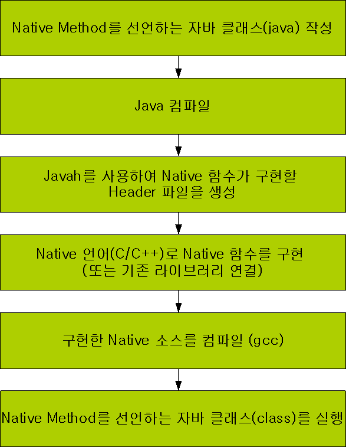
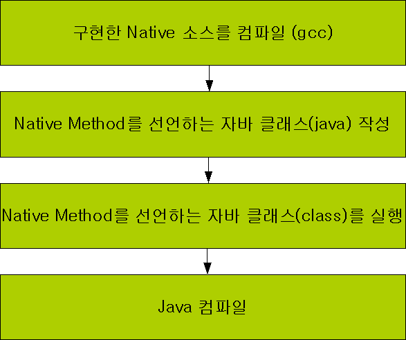

## 개요

- 자바의 특성상 수행할 수 없는 업무나 다른 네이티브 코드(C, C++)를 실행시켜야 할 때가 있는데, 이럴 때 JNI 또는 JNA를 사용하여 대처할 수 있다.
  - 대표적으로 shared memory의 구현은 자바만으로는 구현할 수 없다

## JNI / JNA

#### JNI

- Java Native Interface
- Java에서 Native영역으로 들어가 호출 또는 native에서 Java로 호출하는 interface
- C, C++ 언어로 만든 라이브러리, 솔루션을 java에서 사용가능 하다.

- JNI 개발 과정

  

#### JNA

- Java Native Access

- JNI 개발에서 번거로운 부분을 쉽게 해결해주는 API

  - Native언어로 만들어진 함수를 사용하기 위해서 Header파일 생성, Header파일을 구현한 C소스, compile과정이 없다

- JNA는 libffi (Foreign function interface library)라 불리는 native library를 사용하여 dynamic하게 쓸 수 있게 한다.

- JNA 개발과정

  

