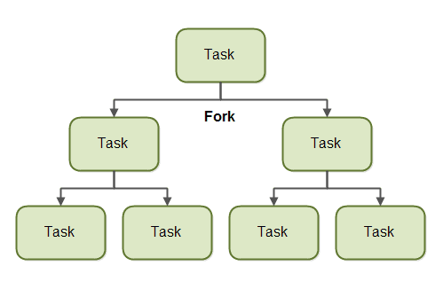
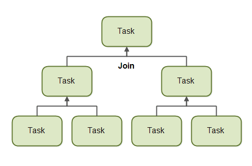

## ForkJoinPool

- ForkJoinPool은 ExecutorService와 비슷하게 Thread Pool을 생성하여 여러 작업을 병렬처리로 수행할 수 있다. 다른 부분은 Task의 크기에 따라 분할(Fork)하고 분할된 Task가 처리되면 그것을 합쳐(Join) 리턴해준다.
  - 분할정복법과 유사하게 동작한다


### Fork

- Task를 분할하여 다른 스레드에서 처리시킨다는 의미

  


### Join

- 다른 스레드에서 처리된 결과를 기다렸다가 합친다는 의미
  - Parent는 Child에서 처리되는 Task가 완료될때까지 기다린 후 결과를 합쳐 더상위의 Parent로 전달한다.




### RecursiveAction과 RecursiveTask

- RecursiveAction : 리턴값이 없는 Task. 리턴값이 필요하지 않는 Task라면 이 클래스로 Task를 정의하면 된다
- RecursiveTask : 리턴값이 있는 Task. Parent는 Child Task의 리턴값을 기다려 합친 후 상위 Parent로 전달한다


## ForkJoinPool 예제

### RecursiveAction

- 리턴값이 없는 Task 예제

```java
public class MyRecursiveAction extends RecursiveAction {

  private long workLoad = 0;

  public MyRecursiveAction(long workLoad) {
    this.workLoad = workLoad;
  }

  @Override
  protected void compute() {
    String threadName = Thread.currentThread().getName();

    //if work is above threshold, break tasks up into smaller tasks
    if(this.workLoad > 16) {
      System.out.println("[" + LocalTime.now() + "][" + threadName + "]"
                         + " Splitting workLoad : " + this.workLoad);
      sleep(1000);
      List<MyRecursiveAction> subtasks =
        new ArrayList<MyRecursiveAction>();

      subtasks.addAll(createSubtasks());

      for(RecursiveAction subtask : subtasks){
        subtask.fork();
      }

    } else {
      System.out.println("[" + LocalTime.now() + "][" + threadName + "]"
                         + " Doing workLoad myself: " + this.workLoad);
    }
  }

  private List<MyRecursiveAction> createSubtasks() {
    List<MyRecursiveAction> subtasks =
      new ArrayList<MyRecursiveAction>();

    MyRecursiveAction subtask1 = new MyRecursiveAction(this.workLoad / 2);
    MyRecursiveAction subtask2 = new MyRecursiveAction(this.workLoad / 2);

    subtasks.add(subtask1);
    subtasks.add(subtask2);

    return subtasks;
  }

  private void sleep(int millis) {
    try {
      Thread.sleep(millis);
    } catch (InterruptedException e) {
      e.printStackTrace();
    }
  }
}
```

- `compute()`에서는 workload가 16보다 클 때 Task를 나누고 16이하면 더 이상 나누지 않고 그 쓰레드에서 처리하도록 정의

```java
ForkJoinPool forkJoinPool = new ForkJoinPool(4);

MyRecursiveAction myRecursiveAction = new MyRecursiveAction(128);
forkJoinPool.invoke(myRecursiveAction);

// Just wait until all tasks done
forkJoinPool.awaitTermination(5, TimeUnit.SECONDS);
```

- `forkJoinPool.invoke()`으로 RecursiveAction을 인자로 전달하고 처리되도록 할 수 있다

```java
[19:45:23.430][ForkJoinPool-1-worker-1] Splitting workLoad : 128
[19:45:24.432][ForkJoinPool-1-worker-1] Splitting workLoad : 64
[19:45:24.432][ForkJoinPool-1-worker-2] Splitting workLoad : 64
[19:45:25.433][ForkJoinPool-1-worker-1] Splitting workLoad : 32
[19:45:25.433][ForkJoinPool-1-worker-3] Splitting workLoad : 32
[19:45:25.433][ForkJoinPool-1-worker-0] Splitting workLoad : 32
[19:45:25.433][ForkJoinPool-1-worker-2] Splitting workLoad : 32
[19:45:26.434][ForkJoinPool-1-worker-1] Doing workLoad myself: 16
[19:45:26.434][ForkJoinPool-1-worker-0] Doing workLoad myself: 16
[19:45:26.434][ForkJoinPool-1-worker-2] Doing workLoad myself: 16
[19:45:26.434][ForkJoinPool-1-worker-3] Doing workLoad myself: 16
[19:45:26.434][ForkJoinPool-1-worker-2] Doing workLoad myself: 16
[19:45:26.434][ForkJoinPool-1-worker-0] Doing workLoad myself: 16
[19:45:26.434][ForkJoinPool-1-worker-1] Doing workLoad myself: 16
[19:45:26.435][ForkJoinPool-1-worker-3] Doing workLoad myself: 16
```


### RecursiveTask

- 리턴값이 있는 Task
- RecursiveAction과 실행 방법은 동일하지만 처리된 결과를 리턴 받기 위해, Parent는 `join()`으로 Child의 Task가 완료될 때까지 기다린다

```java
public class MyRecursiveTask extends RecursiveTask<Long> {

  private long workLoad = 0;

  public MyRecursiveTask(long workLoad) {
    this.workLoad = workLoad;
  }

  protected Long compute() {
    String threadName = Thread.currentThread().getName();

    //if work is above threshold, break tasks up into smaller tasks
    if(this.workLoad > 16) {
      System.out.println("[" + LocalTime.now() + "][" + threadName + "]"
                         + " Splitting workLoad : " + this.workLoad);
      sleep(1000);
      List<MyRecursiveTask> subtasks =
        new ArrayList<MyRecursiveTask>();
      subtasks.addAll(createSubtasks());

      for(MyRecursiveTask subtask : subtasks){
        subtask.fork();
      }

      long result = 0;
      for(MyRecursiveTask subtask : subtasks) {
        result += subtask.join();
        System.out.println("[" + LocalTime.now() + "][" + threadName + "]"
                           + "Received result from subtask");
      }
      return result;

    } else {
      sleep(1000);
      System.out.println("[" + LocalTime.now() + "]["
                         + " Doing workLoad myself: " + this.workLoad);
      return workLoad * 3;
    }
  }

  private List<MyRecursiveTask> createSubtasks() {
    List<MyRecursiveTask> subtasks =
      new ArrayList<MyRecursiveTask>();

    MyRecursiveTask subtask1 = new MyRecursiveTask(this.workLoad / 2);
    MyRecursiveTask subtask2 = new MyRecursiveTask(this.workLoad / 2);

    subtasks.add(subtask1);
    subtasks.add(subtask2);

    return subtasks;
  }

  private void sleep(int millis) {
    try {
      Thread.sleep(millis);
    } catch (InterruptedException e) {
      e.printStackTrace();
    }
  }
}
```

```java
ForkJoinPool forkJoinPool = new ForkJoinPool(4);

MyRecursiveTask myRecursiveTask = new MyRecursiveTask(128);
long mergedResult = forkJoinPool.invoke(myRecursiveTask);
System.out.println("mergedResult = " + mergedResult);

// Just wait until all tasks done
forkJoinPool.awaitTermination(5, TimeUnit.SECONDS);
```

```java
[20:52:53.978][ForkJoinPool-1-worker-1] Splitting workLoad : 128
[20:52:54.981][ForkJoinPool-1-worker-3] Splitting workLoad : 64
[20:52:54.981][ForkJoinPool-1-worker-2] Splitting workLoad : 64
[20:52:55.983][ForkJoinPool-1-worker-0] Splitting workLoad : 32
[20:52:55.983][ForkJoinPool-1-worker-2] Splitting workLoad : 32
[20:52:55.984][ForkJoinPool-1-worker-4] Splitting workLoad : 32
[20:52:57.984][ Doing workLoad myself: 16
[20:52:57.984][ Doing workLoad myself: 16
[20:52:57.984][ForkJoinPool-1-worker-2]Received result from subtask
[20:52:57.984][ForkJoinPool-1-worker-0]Received result from subtask
[20:52:57.985][ Doing workLoad myself: 16
[20:52:57.985][ForkJoinPool-1-worker-4]Received result from subtask
[20:52:58.985][ Doing workLoad myself: 16
[20:52:58.986][ Doing workLoad myself: 16
[20:52:58.985][ Doing workLoad myself: 16
[20:52:58.986][ForkJoinPool-1-worker-4]Received result from subtask
[20:52:58.986][ForkJoinPool-1-worker-0]Received result from subtask
[20:52:58.987][ForkJoinPool-1-worker-4] Splitting workLoad : 32
[20:52:58.987][ForkJoinPool-1-worker-2]Received result from subtask
[20:52:58.988][ForkJoinPool-1-worker-3]Received result from subtask
[20:52:58.988][ForkJoinPool-1-worker-2]Received result from subtask
[20:52:58.988][ForkJoinPool-1-worker-2]Received result from subtask
[20:52:58.989][ForkJoinPool-1-worker-1]Received result from subtask
[20:53:00.989][ Doing workLoad myself: 16
[20:53:00.989][ Doing workLoad myself: 16
[20:53:00.989][ForkJoinPool-1-worker-4]Received result from subtask
[20:53:00.990][ForkJoinPool-1-worker-4]Received result from subtask
[20:53:00.990][ForkJoinPool-1-worker-3]Received result from subtask
[20:53:00.990][ForkJoinPool-1-worker-1]Received result from subtask
mergedResult = 384
```

