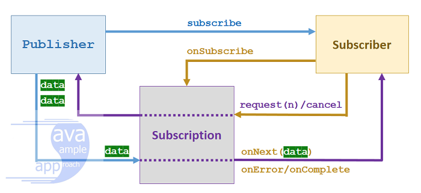
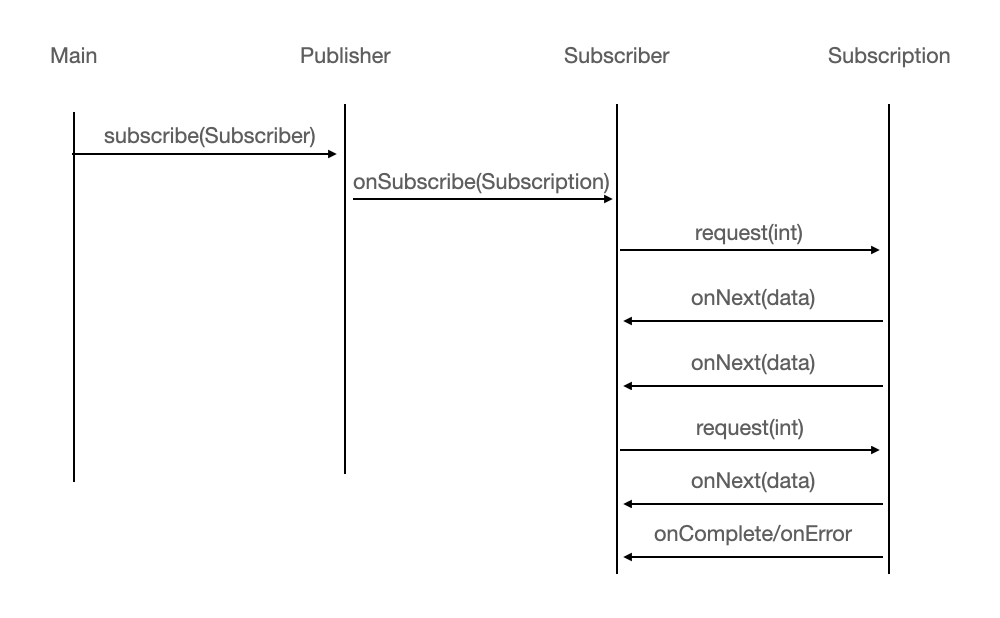

# Reactive Stream

## Reactive Stream이란

Reactive Stream 이란 non-blocking backPressure를 이용하여 비동기 서비스를 할 때 기본이 되는 스펙이다. Java의 RxJava, Spring5 Webflux의 Core에 있는 ProjectReactor 프로젝트 모두 해당 스펙을 따르고 있다. 또한 Java9에서 추가된 Flow역시 Reactive Stream 스펙을 채태가여 사용하고 있다. 따라서 비동기 플로젝트를 잘 이해하기 위해서는 기본 스펙이 되는 Reactive Stream에 대해서 이해가 필요하다.

### 명령형 프로그래밍 vs 반응형 프로그래밍

- **명령형 프로그래밍**
  - 작성된 코드가 순서대로 실행되는 방식의 프로그래밍
  - 코드가 순서대로 실행되는 것은 개발자가 작성한 조건문, 반복문 또는 함수 호출 등에 의해 컴파일러가 다른 코드로 이동하는 것을 의미
  - 데이터를 사용하는 곳에서 데이터를 직접 가져와 사용하는 pull방식 프로그래밍

- **반응형 프로그래밍**
  - 데이터의 흐름을 먼저 정의하고 데이터가 변경되었을 때 연관되는 함수가 알아서 처리하는 것
  - 프로그래머가 어떠한 기능을 직접 정해서 실행하는 것이 아닌, 시스템에 이벤트가 발생했을 때 알아서 처리되는 것
  - 데이터의 변화가 발생한 곳에서 새로운 데이터를 consumer에게 전달하는 push방식 프로그래밍

## Goals, Design and Scope

계속적으로 들어오는 스트림 데이터를 효율적으로 처리하기 위해서는 비동기 시스템이 효과적이다. **비동기 처리를 하면서 가장 중요한 문제는 데이터 처리가 목적지의 리소스 소비를 예측가능한 범위에서 신중하게 제어할 수 있어야 하는것** 이다.

Reactive Stream의 주된 목적인 비동기의 경계를 명화기하여 스트림 데이터의 교환을 효과적으로 관리하는것에 있다. 즉, 비동기로 데이터를 처리하는 시스템에 어느정도의 data가 들어올지 예측가능하도록 하는 것이다. Reactive Stream에서는 BackPressure가 이를 당럿ㅇ할 수 있게 해주는 중요한 부분이다.

요약하면, Reactive Stream은 다음과 같은 스트림 지향 라이브러리에 대한 표준 및 사양이다.

1. 잠재적으로 무한한 숫자의 데이터 처리
2. 순서대로 처리
3. 컴포넌트간에 데이터를 비동기적으로 전달
4. BackPressure를 이용한 데이터 흐름제어

## BackPressure (배압)

한 컴포넌트가 부하를 이겨내기 힘들 때, 시스템 전체가 합리적인 방법으로 대응해야 한다. 과부하 상태의 zjavhsjsxm트에서 치명적인 장애가 발생하거나 제어 없이 메시지를 유실해서는 안된다. **컴포넌트가 대처할 수 없고 발생해선 안되기 때문에 컴포넌트는 상류 컴포넌트들에 자신이 과부하 상태라는 것을 알려 부하를 줄이도록 해야 한다.** 이러한 배압은 시스템이 부하로 인해 무너지지 않고 정상적으로 응답할 수 있게 하는 중요한 피드백 방법이다. 배압은 사용자에게까지 전달되어 응답성이 떨어질 수 있지만, 이 메커니즘은 부하에 대한 시스템의 복원력을 보장하고 시스템 자체가 부하를 분산할 다른 자원을 제공할 수 있는지 정보를 제공할 것이다.

## API Component

- Reactive Stream API의 구성요소는 아래와 같다
  1. Publisher
  2. Subscriber
  3. Subscription
  4. Processor

Publisher는 무한한 Data를 제공한다. 제공된 data는 Subscriber가 구동하는 형식으로 처리된다. `Publisher.subscribe(Subscriber)` 의 형식으로 data 제공자와 구독자가 연결을 맺게 된다. 그리고 호출되는 순서는 아래와 같다.

`onSubscribe onNext* (onError | onComplete)?`

onSubscribe는 Publisher가 생산하는 data를 Subscriber가 항상 신호를 받을 준비가 되어있다는 의미이며, onNext로 데이터를 수신한다. 그리고 실패가 있는 경우에는 onError 신호를, 더 이상 사용할 수 있는 신호가 없을 경우 onComplete 신호를 호출한다. 이는 Subscription(구독)이 취소될때까지 지속된다.

```java
public interface Publisher<T> {
    public void subscribe(Subscriber<? super T> s);
}
```

Publisher(생산자)는 Subscriber(구독자)를 받아들이는 메서드를 가진다.

```java
public interface Subscriber<T> {
    public void onSubscribe(Subscription s);
    public void onNext(T t);
    public void onError(Throwable t);
    public void onComplete();
}
```

Subscriber(구독자)는 Subscription을 등록하고 Subscription에서 오는 신호에 따라서 동작한다. 구독자에게 오는 신호로는 `onNext`, `onError`, `onComplete`가 있다.

```java
public interface Subscription {
    public void request(long n);
    public void cancel();
}
```

Subscription은 Publisher와 Subscriber 사이에서 중계하는 역할을 한다. request 메서드는 Subscriber가 Publisher에게 데이터를 요청하는 갯수이며 cancel은 구독을 취소하겠다는 의미이다.

위 interface를 토대로 아래 와같은 flow를 만들 수 있다.




1. Publish에 본인이 소유할 Subscription을 구현하고 publishing할 data를 만든다
2. Publisher는 `subscribe()`메서드를 통해 Subscriber를 등록한다
3. Subscriber는 `onSubscribe()`메서드를 통해 Subscription을 등록하고 Publisher를 구독하기 시작한다. 이는 Publisher에 구현된 Subscription을 통해 이뤄진다. 이렇게 하면 Publisher와 Subscribr는 Subscription을 통해 연결된 상태가 된다. `onSubscribe()` 내부에 Subsciription의 `request()`를 요청하면 그때부터 data구독이 시작된다.
4. Subscription의 `request()`에는 조건에 따라 Subscriber의 `onNext()`, `onComplete()` 또는 `onError()`를 호출한다. 그러면 Subscriber의 해당 메서드의 로직에 따라 `request()` 또는 `cancel()`로 제어하게 된다.

# RxJava

- RxJava는 자바로 리액티브 어플리케이션을 구현하는데 사용하는 라이브러리
- RxJava는 넷플릭스의 Reactive Extension 프로젝트의 일부로 시작되었다
- RxJava2.0 버전 이상부터 Reactive Streams API와 자바9에 적용된 `java.util.concurrent.Flow`를 지원하도록 구현되었다