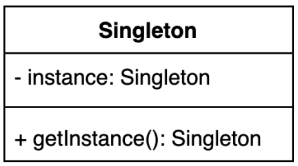
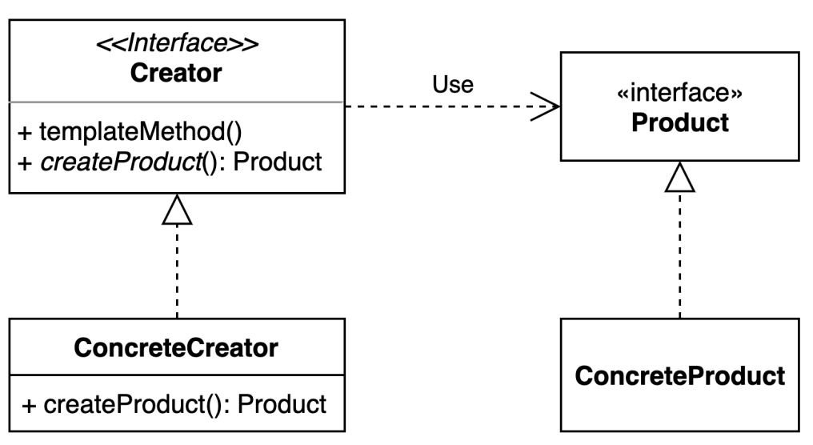
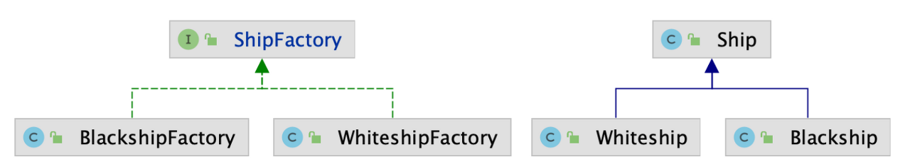
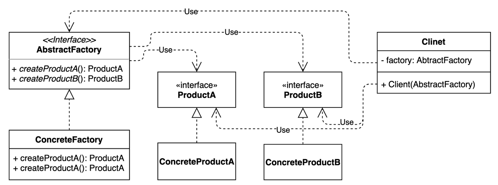
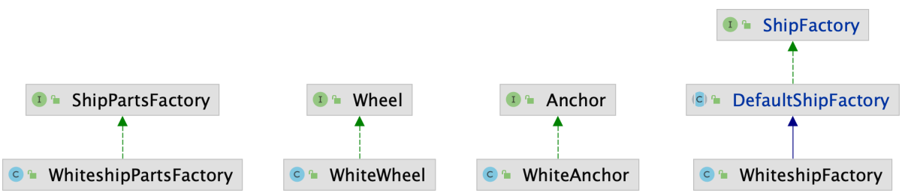
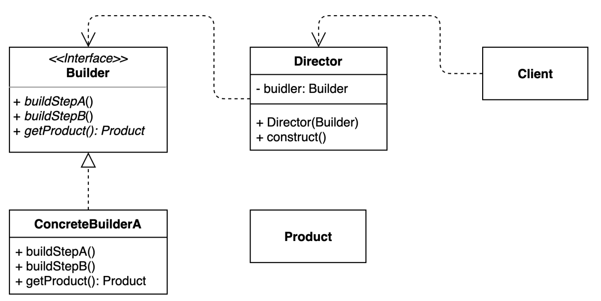
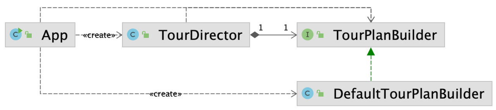
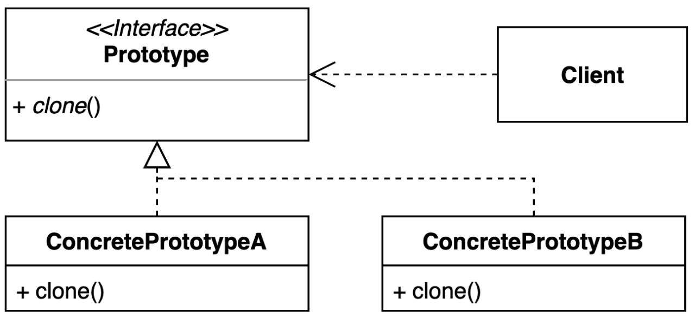
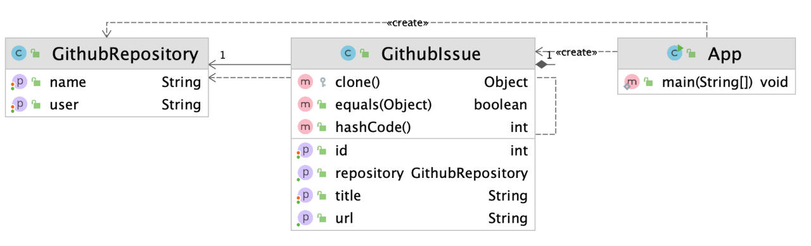

# 생성패턴

## 싱글톤(Singleton) 패턴

- 인터페이스를 오직 한개만 제공하는 클래스
- 시스템 런타임, 환경 세팅에 대한 정보 등, 인스턴스가 여러개일 때 문제가 생길 수 있는 경우에 인스턴스를 오직 한개만 만들어 제공하는 클래스가 필요할 때 사용



---
### 구현방법 1 : 일반적인 구현방법

- private 생성자에 static 메서드를 사용한다
  - priavte 생성자를 사용함으로써 다른 클래스에서 인스턴스 생성을 방지한다
  - 객체를 얻을 때는 `getInstance()` 메서드를 사용한다
- **이 싱글톤 구현방법은 멀티 스레드환경에서 안전하지 않다**

```java
public class Settings {
    private static Settings instance;

    private Settings() {}

    public static Settings getInstance() {
        if (instance == null) {
            instance = new Settings();
        }
        return instance;
    }
}
```

---

### 구현방법 2 : synchronized 사용방법

- 동기화(synchronized)를 사용해 멀티쓰레드 환경에 안전하게 만드는 방법
- 이 싱글톤 구현 방법은 getInstnace 메서드 호출시마다 동기화 과정이 추가되기 때문에 성능의 저하가 생긴다

```java
public class Settings {
    private static Settings instance;

    private Settings() {}

    public static synchronized Settings getInstance() {
        if (instance == null) {
            instance = new Settings();
        }
        return instance;
    }
}
```

---

### 구현방법 3 : 이른 초기화를 사용

- 사용하지 않을 수도 있는 인스턴스까지 미리 생성해버린다
  - 이 인스턴스를 만드는 비용이 클 경우 만약 이 인스턴스를 사용하지 않는다면 생성하는 것 자체가 낭비가 될 수 있다

```java
public class Settings {
    private static final Settings INSTANCE = new Settings();
    private Settings() {}
    public static Settings getInstance() {
        return INSTANCE;
    }
}
```

---

### 구현방법 4 : DCL(Double-Checking Locking), 이중 검사 사용

- 이중으로 검사하고 synchronized를 사용하여 늦은 초기화를 적용하면서 동시성 문제도 방어할 수 있다
- `volatile` 키워드를 사용해서 구현해야 하며 `volatile`이 필요한 이유를 알아야 하기 때문에 이해하기 복잡할 수 있다
  - `volatile` 키워드를 왜 사용하는지 이해하는 과정이 필요하다
- `volatile` 키워드를 사용하지 않는 자바 버전 (1.5 미만의 버전)에서는 사용할 수 없다
```java
public class Settings {
    private static volatile Settings INSTANCE = new Settings();
    private Settings() {}
    public static Settings getInstance() {
        if (INSTANCE == null) {
            synchronized (Settings.class) {
                if (INSTANCE == null) {
                    INSTANCE = new Settings();
                }
            }
        }
        return INSTANCE;
    }
}
```

---

### 구현방법 5 : static inner 클래스 활용

- 가장 권장하는 방법
- 늦은 초기화도 적용된다
- synchronized 키워드를 사용하지 않는다


```java
public class Settings {
    private static volatile Settings INSTANCE = new Settings();

    private Settings() { }

    private static class SettingsHolder {
        private static final Settings SETTINGS = new Settings();
    }

    public static Settings getInstance() {
        return SettingsHolder.SETTINGS;
    }
}
```

- INSTANCE가 `static final`로 선언되어 있지만 해당 변수가 선언된 `SettingHolder` 클래스는 `getInstance()` 함수가 호출될 때 로딩되기 때문에 지연 초기화로 볼 수 있다

> 구현방법 1~5의 공통적인 단점 : **특정 방법으로 싱글톤 구현을 깨뜨릴 수 있다**
> 1. 리플렉션을 사용하는 경우
> 2. 직렬화 & 역직렬화를 사용하는 경우
>   - 직렬화&역직렬화는 `readResolve`메서드를 재정의하는것을 통해 해결이 가능하다

---

### 구현방법 6 : Enum 클래스 활용

- enum은 새 인스턴스 생성이 불가능하다
- 리플렉션, 직렬화&역직렬화를 통한 싱글턴 우회방법을 막을 수 있다

```java
public enum Settings {
    INSTANCE;
}
```

- 이 싱글톤 구현 방법은 사용하지 않을 수도 있는 인스턴스까지 미리 생성해버린다
  - 이 인스턴스를 만드는 비용이 클 경우 만약 이 인스턴스를 사용하지 않는다면 생성하는 것 자체가 낭비가 될 수 있다
- enum을 사용하기 때문에 상속을 사용할 수 없다

---

## 팩토리 패턴

- 구체적으로 어떤 인스턴스를 만들지는 서브 클래스가 만들게 정하는 패턴
- 다양한 구현체(Producet)가 있고, 그중에서 특정한 구현체를 만들 수 있는 다양한 팩토리(Creator)를 제공할 수 있다
- 확장에 열려있고 변경에 닫혀있는 구조를 만들 수 있다
  - 기존 코드 변경 없이 인터페이스를 구현하는 새로운 클래스를 작성하여 새로운 기능 추가가 가능하다
- 장점 : if문이나 switch문으로 분기처리하던 로직을 작성했던 것을 클라이언트에서 원하는 방식을 선택하게 하여 분기처리 없이 로직 추가가 가능하다
- 단점 : 새로운 로직이 추가될 때마다 클래스를 추가해야 한다
- 




### 예시



```java
public interface ShipFactory {

    default Ship orderShip(String name, String email) {
        validate(name, email);
        prepareFor(name);
        Ship ship = createShip();
        sendEmailTo(email, ship);
        return ship;
    }

    void sendEmailTo(String email, Ship ship);

    Ship createShip();

    private void validate(String name, String email) {
        if (name == null || name.isBlank()) {
            throw new IllegalArgumentException("배 이름을 지어주세요.");
        }
        if (email == null || email.isBlank()) {
            throw new IllegalArgumentException("연락처를 남겨주세요.");
        }
    }

    private void prepareFor(String name) {
        System.out.println(name + " 만들 준비 중");
    }
}
```

```java
public abstract class DefaultShipFactory implements ShipFactory {
    @Override
    public void sendEmailTo(String email, Ship ship) {
        System.out.println(ship.getName() + " 다 만들었습니다.");
    }
}

public class BlackShipFactory extends DefaultShipFactory {
    @Override
    public Ship createShip() {
        return new Blackship();
    }
}

public class WhiteShipFactory extends DefaultShipFactory {
    @Override
    public Ship createShip() {
        return new Whiteship();
    }
}
```


## 추상 팩토리 패턴

- 서로 관련있는 여러 객체를 만들어주는 인터페이스
- 구체적으로 어떤 클래스의 인터페이스(concrete product)를 사용하는지 감출 수 있다
- 클라이언트 코드에서 구체적인 클래스의 의존성을 제거하여 구현 가능하다



### 예시


```java
public interface ShipPartsFactory {

    Anchor createAnchor();

    Wheel createWheel();

}

public interface Anchor {
}

public interface Wheel {
}
public class WhiteShipFactory extends DefaultShipFactory {

    private final ShipPartsFactory shipPartsFactory;

    public WhiteShipFactory(ShipPartsFactory shipPartsFactory) {
        this.shipPartsFactory = shipPartsFactory;
    }

    @Override
    public Ship createShip() {
        Ship ship = new Whiteship();
        ship.setAnchor(shipPartsFactory.createAnchor());
        ship.setWheel(shipPartsFactory.createWheel());
        return ship;
    }
}
```

```java
public class WhiteAnchorPro implements Anchor{
}

public class WhiteWheelPro implements Wheel {
}
```

```java
public class WhiteAnchor implements Anchor {
}

public class WhiteWheel implements Wheel {
}
public class ShipInventory {

    public static void main(String[] args) {
        ShipFactory shipFactory = new WhiteShipFactory(new WhiteShipPartsFactory());
        Ship ship = shipFactory.createShip();
        System.out.println(ship.getAnchor().getClass());
        System.out.println(ship.getWheel().getClass());
    }
}

```

> 팩토리 패턴 vs 추상 팩토리 패턴
> - 팩토리 패턴
>   - 팩토리를 구현하는 방법에 초점을 둔다 (상속)
>   - 구체적인 객체 생성 과정을 하위 또는 구체적인 클래스로 옮기는 것이 목적
> - 추상 팩토리 패턴
>   - 팩토리를 사용하는 방법에 초첨을 둔다 (컴포지션)
>   - 관련있는 여러 객체를 구체적인 클래스에 의존하지 않고 만들 수 있게 해주는 것이 목적

## 빌더 패턴 (Builder Pattern)

- 동일한 프로세스를 거쳐 다양한 구성의 인스턴스를 만드는 방법
  - 복잡한 객체를 만드는 프로세스를 독립적으로 분리할 수 있다
- 장점
  - 만들기 복잡한 객체를 순차적으로 만들 수 있다
  - 복잡한 객체를 만드는 구체적인 과정을 숨길 수 있다
  - 동일한 프로세스를 통해 각기 다르게 구성된 객체를 만들 수도 있다
  - 불완전한 객체를 사용하지 못하도록 방지할 수 있다
- 단점
  - 원하는 객체를 만드려면 빌더부터 만들어야 한다
  - 구조가 복잡해진다






### 예시

```java
public interface TourPlanBuilder {

    TourPlanBuilder nightsAndDays(int nights, int days);

    TourPlanBuilder title(String title);

    TourPlanBuilder startDate(LocalDate localDate);

    TourPlanBuilder whereToStay(String whereToStay);

    TourPlanBuilder addPlan(int day, String plan);

    TourPlan getPlan();

}
```

```java
public class DefaultTourBuilder implements TourPlanBuilder {

    private String title;

    private int nights;

    private int days;

    private LocalDate startDate;

    private String whereToStay;

    private List<DetailPlan> plans;

    @Override
    public TourPlanBuilder nightsAndDays(int nights, int days) {
        this.nights = nights;
        this.days = days;
        return this;
    }

    @Override
    public TourPlanBuilder title(String title) {
        this.title = title;
        return this;
    }

    @Override
    public TourPlanBuilder startDate(LocalDate startDate) {
        this.startDate = startDate;
        return this;
    }

    @Override
    public TourPlanBuilder whereToStay(String whereToStay) {
        this.whereToStay = whereToStay;
        return this;
    }

    @Override
    public TourPlanBuilder addPlan(int day, String plan) {
        if (this.plans == null) {
            this.plans = new ArrayList<>();
        }

        this.plans.add(new DetailPlan(day, plan));
        return this;
    }

    @Override
    public TourPlan getPlan() {
        return new TourPlan(title, nights, days, startDate, whereToStay, plans);
    }
}
```

```java
public class TourDirector {

    private final TourPlanBuilder tourPlanBuilder;

    public TourDirector(TourPlanBuilder tourPlanBuilder) {
        this.tourPlanBuilder = tourPlanBuilder;
    }

    public TourPlan cancunTrip() {
        return tourPlanBuilder.title("칸쿤 여행")
                .nightsAndDays(2, 3)
                .startDate(LocalDate.of(2020, 12, 9))
                .whereToStay("리조트")
                .addPlan(0, "체크인하고 짐 풀기")
                .addPlan(0, "저녁 식사")
                .getPlan();
    }

    public TourPlan longBeachTrip() {
        return tourPlanBuilder.title("롱비치")
                .startDate(LocalDate.of(2021, 7, 15))
                .getPlan();
    }
}
```

## 프로토타입 패턴 (Prototype)

- 기존 인스턴스를 복제하여 새로운 인스턴스를 만드는 방법
  - 복제 기능을 갖추고 있는 기존 인스턴스를 프로토타입으로 사용해 새 인스턴스를 만들 수 있다
- 장점
  - 복잡한 객체를 만드는 과정을 숨길 수 있다
  - 기존 객체를 복제하는 과정이 새 인스턴스를 만드는 것보다 비용(시간 또는 메모리)적인 면에서 효율적일 수 있다
  - 추상적인 타입을 리턴할 수 있다
- 단점
  - 복제한 객체를 만드는 과정 자체가 복잡할 수 있다
    - 특히 순환 참조가 있는 경우





### 예시

- 프로토타입 패턴을 사용하기 위해 Cloneable을 상속하는것이 좋다
- 
```java
public class GithubIssue implements Cloneable {

    private int id;

    private String title;

    private GithubRepository repository;

    public GithubIssue(GithubRepository repository) {
        this.repository = repository;
    }

    public int getId() {
        return id;
    }

    public void setId(int id) {
        this.id = id;
    }

    public String getTitle() {
        return title;
    }

    public void setTitle(String title) {
        this.title = title;
    }

    public GithubRepository getRepository() {
        return repository;
    }

    public String getUrl() {
        return String.format("https://github.com/%s/%s/issues/%d",
                repository.getUser(),
                repository.getName(),
                this.getId());
    }

    @Override
    protected Object clone() throws CloneNotSupportedException {
        GithubRepository repository = new GithubRepository();
        repository.setUser(this.repository.getUser());
        repository.setName(this.repository.getName());

        GithubIssue githubIssue = new GithubIssue(repository);
        githubIssue.setId(this.id);
        githubIssue.setTitle(this.title);

        return githubIssue;
    }

    @Override
    public boolean equals(Object o) {
        if (this == o) return true;
        if (o == null || getClass() != o.getClass()) return false;
        GithubIssue that = (GithubIssue) o;
        return id == that.id && Objects.equals(title, that.title) && Objects.equals(repository, that.repository);
    }

    @Override
    public int hashCode() {
        return Objects.hash(id, title, repository);
    }
}
```

```java
public class GithubRepository {

    private String user;

    private String name;

    public String getUser() {
        return user;
    }

    public void setUser(String user) {
        this.user = user;
    }

    public String getName() {
        return name;
    }

    public void setName(String name) {
        this.name = name;
    }
}
public class App {

    public static void main(String[] args) throws CloneNotSupportedException {
        GithubRepository repository = new GithubRepository();
        repository.setUser("whiteship");
        repository.setName("live-study");

        GithubIssue githubIssue = new GithubIssue(repository);
        githubIssue.setId(1);
        githubIssue.setTitle("1주차 과제: JVM은 무엇이며 자바 코드는 어떻게 실행하는 것인가.");

        String url = githubIssue.getUrl();
        System.out.println(url);

        GithubIssue clone = (GithubIssue) githubIssue.clone();
        System.out.println(clone.getUrl());

        repository.setUser("Keesun");

        System.out.println(clone != githubIssue);
        System.out.println(clone.equals(githubIssue));
        System.out.println(clone.getClass() == githubIssue.getClass());
        System.out.println(clone.getRepository() == githubIssue.getRepository());

        System.out.println(clone.getUrl());
    }

}
```
