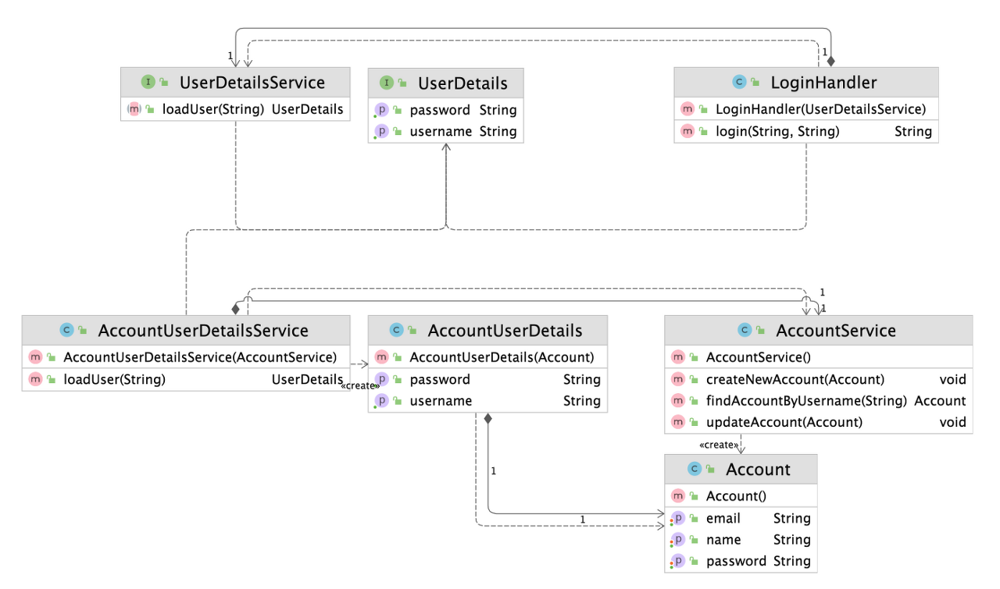

# 구조적인 패턴

## 어댑터 패턴 (Adapter Pattern)

- 기존 코드를 클라이언트가 사용하는 인터페이스의 구현체로 바꿔주는 패턴
  - 클라이언트가 사용하는 인터페이스를 따르지 않는 기존 코드를 재사용할 수 있게 해준다
- 장점
  - 관계가 없는 인터페이스간 같이 사용이 가능하다
  - 프로그램 검사에 용이하다
  - 기존 코드를 변경하지 않고 원하는 인터페이스 구현체를 만들어 재사용할 수 있어 클래스 재활용성이 증가한다
  - 기존 코드가 하던 일과 특정 인터페이스 구현체로 변환하는 작업을 각기 다른 클래스로 분리하여 관리할 수 있다
- 단점
  - 새 클래스가 생겨 복잡도가 증가할 수 있다
  - 경우에 따라서는 기존 코드가 해당 인터페이스를 구현하도록 수정하는 것이 좋은 선택이 될 수 있다




### 예시

```java
public class Volt {
 
    private int volts;
	
    public Volt(int v){
        this.volts=v;
    }
 
    public int getVolts() {
        return volts;
    }
 
    public void setVolts(int volts) {
        this.volts = volts;
    }
	
}
```

```java
public class Socket {
 
    public Volt getVolt(){
        return new Volt(120);
    }
}
```

```java
public interface SocketAdapter {
 
    public Volt get120Volt();
		
    public Volt get12Volt();
	
    public Volt get3Volt();
}
```


- Class Adapter 방식
  - 자바의 상속(Inheritance)을 이용한 방식
```java
//Using inheritance for adapter pattern
public class SocketClassAdapterImpl extends Socket implements SocketAdapter{
 
    @Override
    public Volt get120Volt() {
        return getVolt();
    }
 
    @Override
    public Volt get12Volt() {
        Volt v= getVolt();
        return convertVolt(v,10);
    }
 
    @Override
    public Volt get3Volt() {
        Volt v= getVolt();
        return convertVolt(v,40);
    }
	
    private Volt convertVolt(Volt v, int i) {
        return new Volt(v.getVolts()/i);
    }
 
}
```

- Object Adapter 방식
  - 자바의 합성(Composite)을 이용한 방식
```java
public class SocketObjectAdapterImpl implements SocketAdapter{
 
    //Using Composition for adapter pattern
    private Socket sock = new Socket();
	
    @Override
    public Volt get120Volt() {
        return sock.getVolt();
    }
 
    @Override
    public Volt get12Volt() {
        Volt v= sock.getVolt();
        return convertVolt(v,10);
    }
 
    @Override
    public Volt get3Volt() {
        Volt v= sock.getVolt();
        return convertVolt(v,40);
    }
	
    private Volt convertVolt(Volt v, int i) {
        return new Volt(v.getVolts()/i);
    }
}
```