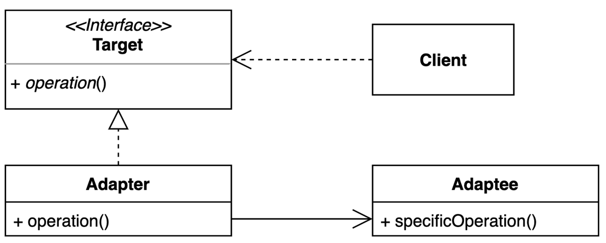
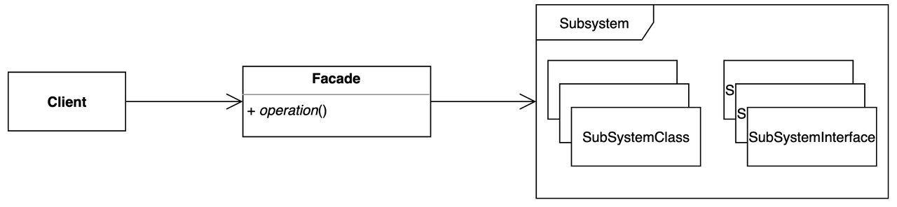
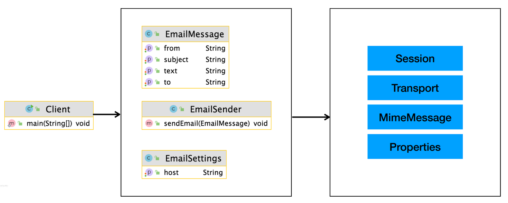

# 구조적인 패턴

## 어댑터 패턴 (Adapter Pattern)

- 기존 코드를 클라이언트가 사용하는 인터페이스의 구현체로 바꿔주는 패턴
  - 클라이언트가 사용하는 인터페이스를 따르지 않는 기존 코드를 재사용할 수 있게 해준다
- 장점
  - 관계가 없는 인터페이스간 같이 사용이 가능하다
  - 프로그램 검사에 용이하다
  - 기존 코드를 변경하지 않고 원하는 인터페이스 구현체를 만들어 재사용할 수 있어 클래스 재활용성이 증가한다
  - 기존 코드가 하던 일과 특정 인터페이스 구현체로 변환하는 작업을 각기 다른 클래스로 분리하여 관리할 수 있다
- 단점
  - 새 클래스가 생겨 복잡도가 증가할 수 있다
  - 경우에 따라서는 기존 코드가 해당 인터페이스를 구현하도록 수정하는 것이 좋은 선택이 될 수 있다




### 예시

```java
public class Volt {
 
    private int volts;
	
    public Volt(int v){
        this.volts=v;
    }
 
    public int getVolts() {
        return volts;
    }
 
    public void setVolts(int volts) {
        this.volts = volts;
    }
	
}
```

```java
public class Socket {
 
    public Volt getVolt(){
        return new Volt(120);
    }
}
```

```java
public interface SocketAdapter {
 
    public Volt get120Volt();
		
    public Volt get12Volt();
	
    public Volt get3Volt();
}
```


- Class Adapter 방식
  - 자바의 상속(Inheritance)을 이용한 방식
```java
//Using inheritance for adapter pattern
public class SocketClassAdapterImpl extends Socket implements SocketAdapter{
 
    @Override
    public Volt get120Volt() {
        return getVolt();
    }
 
    @Override
    public Volt get12Volt() {
        Volt v= getVolt();
        return convertVolt(v,10);
    }
 
    @Override
    public Volt get3Volt() {
        Volt v= getVolt();
        return convertVolt(v,40);
    }
	
    private Volt convertVolt(Volt v, int i) {
        return new Volt(v.getVolts()/i);
    }
 
}
```

- Object Adapter 방식
  - 자바의 합성(Composite)을 이용한 방식
```java
public class SocketObjectAdapterImpl implements SocketAdapter{
 
    //Using Composition for adapter pattern
    private Socket sock = new Socket();
	
    @Override
    public Volt get120Volt() {
        return sock.getVolt();
    }
 
    @Override
    public Volt get12Volt() {
        Volt v= sock.getVolt();
        return convertVolt(v,10);
    }
 
    @Override
    public Volt get3Volt() {
        Volt v= sock.getVolt();
        return convertVolt(v,40);
    }
	
    private Volt convertVolt(Volt v, int i) {
        return new Volt(v.getVolts()/i);
    }
}
```

## 브릿지 패턴 (Bridge Pattern)

- 추상적인 것과 구체적인 것을 분리하여 연결하는 패턴
  - 하나의 계층 구조일 때보다 각기 나누었을 때 독립적인 계층 구조로 발전시킬 수 있다
- 장점 
  - 추상적인 코드를 구체적인 코드 변경 없이도 독립적으로 확장할 수 있다
  - 추상적인 코드와 구체적인 코드를 분리할 수 있다
- 단점
  - 계층 구조가 늘어나 복잡도가 증가할 수 있다


> 어댑터 패턴과의 차이
> - 공통점 :  두 패턴 모두 인터페이스의 세부내용을 감추는것이 목적
> - 차이점
>   - 어댑터 : 어떤 클래스의 인터페이스가 다른 코드에서 기대하는 것과 다를 때 중간에 어댑터를 주어 맞추아주는 것으로 기존 코드 변경 없이 현재 코드에 적용하고 싶을 때 사용
>   - 브릿지 : 추상과 구현을 분리하는 것으로 확장성을 미리 고려할 때 사용

### 예시


```java
public abstract class Shape {
  private Drawing drawing;
  
  protected Shape(Drawing drawing) {
    this.drawing = drawing;
  }
  
  public abstract void draw();
  public void drawLine(int x, int y) {
    drawing.drawLine(x, y);
  }
  public void fill() {
    drawing.fill();
  }
}
```

```java
public class Rectangle extends Shape{
  protected Rectangle(Drawing drawing) {
    super(drawing);
  }

  @Override
  public void draw() {
    System.out.println("Rect draw extend");
  }
}
```

```java
public class Circle extends Shape{
  protected Circle(Drawing drawing) {
    super(drawing);
  }

  @Override
  public void draw() {
    System.out.println("Rect draw extend");
  }
}
```

---

```java
public interface Drawing {
  public void drawLine(int x, int y);
  public void fill();
}
```

```java
public class RectDrawing implements Drawing{
  @Override
  public void drawLine(int x, int y) {
    System.out.println("Rect Draw line from " + x + " to " + y);
  }
  
  @Override
  public void fill() {
    System.out.println("Rect Fill!");
  }
}
```


```java
public class CircleDrawing implements Drawing{
  @Override
  public void drawLine(int x, int y) {
    System.out.println("Circle Draw line from " + x + " to " + y);
  }
  
  @Override
  public void fill() {
    System.out.println("Circle Fill!");
  }
}
```

---

```java
public class BridgeMain {
  public static void main(String[] args) {
    Shape rectangle = new Rectangle(new RectDrawing());
    Shape circle = new Circle(new CircleDrawing());
    
    rectangle.drawLine(1, 2);
    rectangle.fill();
    rectangle.draw();
    
    System.out.println();
    
    circle.drawLine(3, 4);
    circle.fill();
    circle.draw();
  }
}
```

## 컴포짓 패턴 (Composite pattern)

- 그룹 전체와 개별 객체를 동일하게 처리할 수 있는 패턴
  - 클라이언트 입장에서는 '전체'나 '부분'이나 모두 동일한 컴포넌트로 인식할 수 있는 계층 구조를 만든다
- 장점
  - 복잡한 트리 구조를 편리하게 사용할 수 있다
  - 다형성과 재귀를 활용할 수 있다
  - 클라이언트 코드를 변경하지 않고 새로운 엘리먼트 타입을 추가할 수 있다
- 단점
  - 트리를 만들어야 하기 때문에 (공통된 인터페이스를 정의해야 하기 때문에) 지나치게 일반화 해야 하는 경우도 생길 수 있다


### 예시


```java
public interface Component {
    int getPrice();
}
```

```java
public class Item implements Component {

    private String name;

    private int price;

    public Item(String name, int price) {
        this.name = name;
        this.price = price;
    }

    @Override
    public int getPrice() {
        return this.price;
    }
}
```

```java
public class Bag implements Component {

    private final List<Component> components = new ArrayList<>();

    public void add(Component component) {
        components.add(component);
    }

    public List<Component> getComponents() {
        return components;
    }

    @Override
    public int getPrice() {
        return components.stream()
                .mapToInt(Component::getPrice)
                .sum();
    }
}
public class Character implements Component {

    private Bag bag;

    @Override
    public int getPrice() {
        return bag.getPrice();
    }

}
```

```java
public class Client {

    public static void main(String[] args) {
        Item doranBlade = new Item("도란검", 450);
        Item healPotion = new Item("체력 물약", 50);

        Bag bag = new Bag();
        bag.add(doranBlade);
        bag.add(healPotion);

        Client client = new Client();
        client.printPrice(doranBlade);
        client.printPrice(bag);
    }

    private void printPrice(Component component) {
        System.out.println(component.getPrice());
    }
}
```

## 데코레이터 패턴 (Decorator Pattern)

- 기존 코드를 변경하지 않고 부가 기능을 추가하는 패턴
- 상속이 아닌 위임을 사용해서 보다 유연하게(런타임에) 부가 기능을 추가하는 것이 가능하다
- 장점
  - 새로운 클래스를 만들지 않고 기존 기능을 조합할 수 있다
  - 컴파일 타임이 아닌 런타임에 동적으로 기능을 변경할 수 있다
- 단점
  - 데코레이터를 조합하는 코드가 복잡할 수 있다


### 예시

```java
public interface Component {
    String add(); //재료 추가
}
```

```java
public class BaseComponent implements Component {

    @Override
    public String add() {
        // TODO Auto-generated method stub
        return "에스프레소";
    }
}
```

```java
abstract public class Decorator implements Component {
    private Component coffeeComponent;
    
    public Decorator(Component coffeeComponent) {
        this.coffeeComponent = coffeeComponent;
    }
    
    public String add() {
        return coffeeComponent.add();
    }
}
```

```java
//물을 추가해주는 클래스
public class WaterDecorator extends Decorator {
    public WaterDecorator(Component coffeeComponent) {
        super(coffeeComponent);
    }
    
    @Override
    public String add() {
        // TODO Auto-generated method stub
        return super.add() + " + 물";
    }
}
```

```java
//우유를 추가해주는 클래스
public class MilkDecorator extends Decorator {
    public MilkDecorator(Component coffeeComponent) {
        super(coffeeComponent);
    }
    
    @Override
    public String add() {
        // TODO Auto-generated method stub
        return super.add() + " + 우유";
    }
}
```

```java
public class Main {

    public static void main(String[] args) {
        Component espresso = new BaseComponent();
        System.out.println("에스프레소 : " + espresso.add());
        
        Component americano = new WaterDecorator(new BaseComponent());
        System.out.println("아메리카노 : " + americano.add());
        
        Component latte = new MilkDecorator(new WaterDecorator(new BaseComponent()));
        System.out.println("라떼 : " + latte.add());
    }
}
```

```
에스프레소 : 에스프레소
아메리카노 : 에스프레소 + 물
라떼 : 에스프레소 + 물 + 우유
```

## 퍼사드 패턴 (Facade Pattern)

- 복잡한 서브 시스템의 의존성을 최소화하는 방법
- 클라이언트가 사용해야 하는 복잡한 서브 시스템의 의존성을 간단한 인터페이스로 추상화할 수 있다
- 장점
  - 서브 시스템에 대한 의존성을 한곳으로 모을 수 있다
- 단점
  - 퍼사드 클래스가 서브 시스템에 대한 모든 의존성을 가지게 된다



### 예시



```java
public class EmailSettings {

    private String host;

    public String getHost() {
        return host;
    }

    public void setHost(String host) {
        this.host = host;
    }
}
public class EmailSender {

    private EmailSettings emailSettings;

    public EmailSender(EmailSettings emailSettings) {
        this.emailSettings = emailSettings;
    }

    /**
     * 이메일 보내는 메소드
     * @param emailMessage
     */
    public void sendEmail(EmailMessage emailMessage) {
        Properties properties = System.getProperties();
        properties.setProperty("mail.smtp.host", emailSettings.getHost());

        Session session = Session.getDefaultInstance(properties);

        try {
            MimeMessage message = new MimeMessage(session);
            message.setFrom(new InternetAddress(emailMessage.getFrom()));
            message.addRecipient(Message.RecipientType.TO, new InternetAddress(emailMessage.getTo()));
            message.addRecipient(Message.RecipientType.CC, new InternetAddress(emailMessage.getCc()));
            message.setSubject(emailMessage.getSubject());
            message.setText(emailMessage.getText());

            Transport.send(message);
        } catch (MessagingException e) {
            e.printStackTrace();
        }
    }
}
public class Client {

    public static void main(String[] args) {
        EmailSettings emailSettings = new EmailSettings();
        emailSettings.setHost("127.0.0.1");

        EmailSender emailSender = new EmailSender(emailSettings);

        EmailMessage emailMessage = new EmailMessage();
        emailMessage.setFrom("keesun");
        emailMessage.setTo("whiteship");
        emailMessage.setCc("일남");
        emailMessage.setSubject("오징어게임");
        emailMessage.setText("밖은 더 지옥이더라고..");

        emailSender.sendEmail(emailMessage);
    }
}
```