# 디자인 패턴 (행동 패턴)

## 책임 연쇄 패턴 (Chain of Responsibility Pattern)

- 요청을 처리하는 동일 인터페이스 객체들을 체인 형태로 연결해놓은 패턴
  - 앞의 객체의 요처을 처리하지 못할 경우 같은 인터페이스의 다른 객체에게 해당 요청을 전달한다
- 요청을 보내는 쪽(Sender)과 요청을 처리하는 쪽(Receiver)을 분리하는 패턴
  - 핸들러 체임을 사용해서 요청을 처리한다
- 장점
  - 클라이언트 코드를 변경하지 않고 새로운 핸들러를 체인에 추가할 수 있다
  - 결합도를 낮추며, 요청의 발신자와 수신자를 분리시킬 수 있다
  - 집합 내의 처리 순서를 변경하거나 처리 객체를 추가 또는 삭제할 수 있어 유연성이 향상된다
  - 새로운 요청에 대환 처리 객체 생성이 편리해진다
- 단점
  - 충분한 디버깅을 거치지 않았을 경우 집합 내부에서 사이클이 발생할 수 있다
  - 디버깅 및 테스트가 어렵다

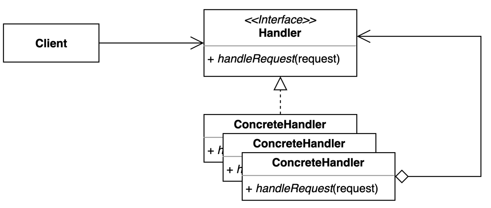

### 책임 연쇄 패턴 예시

- 연쇄책임패턴으로 100원, 10원, 1원짜리 동전으로 돈을 환전해주는 로직

```java
interface DispenseChain{
    void setNextChain(DispenseChain nextChain);
    void dispense(Currency cur);
}

class Currency{
    private int amount;

    public Currency(int amt) {
        this.amount=amt;
    }

    public int getAmount() {
        return this.amount;
    }
}

class Won100Dispenser implements DispenseChain{
    private DispenseChain chain;

    @Override
    public void setNextChain(DispenseChain nextChain) {
        this.chain=nextChain;
    }

    @Override
    public void dispense(Currency cur) {
        if(cur.getAmount()>=100){
            int num=cur.getAmount()/100;
            int remainder=cur.getAmount()%100;

            System.out.println("Dispensing " +num+" 100₩ note");

            if(remainder!=0) this.chain.dispense(new Currency(remainder));
        }
        else this.chain.dispense(cur);
    }
}

class Won10Dispenser implements DispenseChain{
private DispenseChain chain;

    @Override
    public void setNextChain(DispenseChain nextChain) {
        this.chain=nextChain;
    }

    @Override
    public void dispense(Currency cur) {
        if(cur.getAmount()>=10){
            int num=cur.getAmount()/10;
            int remainder=cur.getAmount()%10;

            System.out.println("Dispensing " +num+" 10₩ note");

            if(remainder!=0) this.chain.dispense(new Currency(remainder));
        }
        else this.chain.dispense(cur);
    }
}

class Won1Dispenser implements DispenseChain{
private DispenseChain chain;

    @Override
    public void setNextChain(DispenseChain nextChain) {
        this.chain=nextChain;
    }

    @Override
    public void dispense(Currency cur) {
        int num=cur.getAmount()/1;
        System.out.println("Dispensing " +num+" 1₩ note");
    }
}

public class ChainOfResponsibilityPattern {
    private DispenseChain c1;

    public ChainOfResponsibilityPattern(){
        this.c1=new Won100Dispenser();
        DispenseChain c2=new Won10Dispenser();
        DispenseChain c3=new Won1Dispenser();

        c1.setNextChain(c2);
        c2.setNextChain(c3);
    }

    public static void main(String[] args) {
        ChainOfResponsibilityPattern atmDispenser = new ChainOfResponsibilityPattern();
        atmDispenser.c1.dispense(new Currency(378));
    }
}
```

```plaintext
Dispensing 3 * 100₩ note
Dispensing 7 * 10₩ note
Dispensing 8 * 1₩ note
```

## 커맨드 패턴

- 요청을 캡슐화하여 호출자(Invoker)와 수신자(Receiver)를 분리하는 패턴
  - 요청을 처리하는 방법이 바뀌더라도 호출자의 코드는 변경되지 않는다
- 장점
  - 클라이언트와 Invoker 클래스 간의 의존성이 제거되어 기존 코드를 변경하지 않고 새로운 커맨드를 만들 수 있다
    - 시스템 결합도를 낮출 수 있으며 객체들이 수정되어도 다른 객체가 영향을 받지 않는다
  - 수신자의 코드가 변경되어도 호출자의 코드는 변경되지 않는다
  - 커맨드 객체를 로깅, DB에 저자어, 네트워크로 전송 하는 등 다양한 방법으로 활용할 수 있다
- 단점
  - 리시버 및 리시버의 동작이 추가되면 그 동작에 대한 클래스를 만들어야 한다
  - 전체적으로 이해가 필요하고 복잡한 설계구조를 가진다
- 사용 예시
  - 병렬 처리 : 병렬로 여러 스레드에서 실행이 되어야 하는 경우
  - 매크로 : 특정 명령에 따른 동일한 일련의 작업을 반복해야 하는 경우
  - 네트워킹 : 네트워크를 통해 일련의 작업을 보내야 하는 경우 (원격 조작 등)

### 커맨드 패턴 예시

```java
public interface Command {

    void execute();

    void undo();

}
public class GameStartCommand implements Command {

    private Game game;

    public GameStartCommand(Game game) {
        this.game = game;
    }

    @Override
    public void execute() {
        game.start();
    }

    @Override
    public void undo() {
        new GameEndCommand(this.game).execute();
    }
}
public class GameEndCommand implements Command {

    private Game game;

    public GameEndCommand(Game game) {
        this.game = game;
    }

    @Override
    public void execute() {
        game.end();
    }

    @Override
    public void undo() {
        new GameStartCommand(this.game).execute();
    }
}
public class LightOffCommand implements Command {

    private Light light;

    public LightOffCommand(Light light) {
        this.light = light;
    }

    @Override
    public void execute() {
        light.off();
    }

    @Override
    public void undo() {
        new LightOnCommand(this.light).execute();
    }
}
public class LightOnCommand implements Command {

    private Light light;

    public LightOnCommand(Light light) {
        this.light = light;
    }

    @Override
    public void execute() {
        light.on();
    }

    @Override
    public void undo() {
        new LightOffCommand(this.light).execute();
    }
}
public class Button {

    private Stack<Command> commands = new Stack<>();

    public void press(Command command) {
        command.execute();
        commands.push(command);
    }

    public void undo() {
        if (!commands.isEmpty()) {
            Command command = commands.pop();
            command.undo();
        }
    }

    public static void main(String[] args) {
        Button button = new Button();
        button.press(new GameStartCommand(new Game()));
        button.press(new LightOnCommand(new Light()));
        button.undo();
        button.undo();
    }

}
public class MyApp {

    private Command command;

    public MyApp(Command command) {
        this.command = command;
    }

    public void press() {
        command.execute();
    }

    public static void main(String[] args) {
        MyApp myApp = new MyApp(new GameStartCommand(new Game()));
    }
}
```

## 인터프리터 패턴 (Interpreter Pattern)

- 자주 등장하는 문제를 간단한 언어로 정의하고 재사용하는 패턴
  - 반복되는 문제 패턴을 언어 또는 문법으로 정의하고 확장할 수 있다
- 요청을 캡슐화하여 호출자(invoker)와 수신자(receiver)를 분리하는 패턴
- 장점
  - 자주 등장하는 문제 패턴을 언어와 문법으로 정의할 수 있다
  - 기존 코드를 변경하지 않고 새로운 Expressions을 추가할 수 있다
- 단점
  - 복잡한 문법을 표현하려면 Expression과 Parser가 복잡해진다
- 사용 예시
  - SQL 문
  - 정규표현식

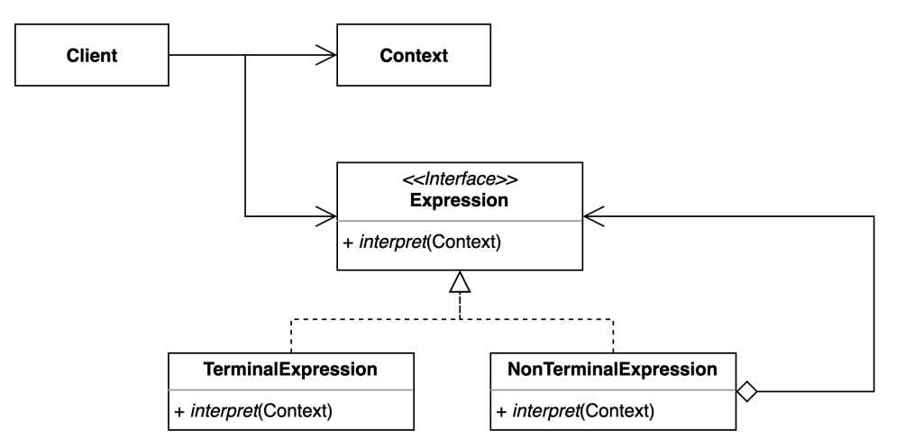

### 인터프리터 패턴 예시

```java
public class InterpreterContext {
    public String getBinaryFormat(int i) {
        return Integer.toBinaryString(i);
    }
    public String getHexadecimalFormat(int i) {
        return Integer.toHexString(i);
    }
}
```

```java
public interface Expression {
    String interpret(InterpreterContext ic);
}
```

```java
public class IntToBinaryExpression implements Expression {

    private int i;

    public IntToBinaryExpression(int i) {
        this.i = i;
    }

    @Override
    public String interpret(InterpreterContext ic) {
        return ic.getBinaryFormat(i);
    }
}
```

```java
public class IntToHexExpression implements Expression {
    private int i;

    public IntToHexExpression(int i) {
        this.i = i;
    }

    @Override
    public String interpret(InterpreterContext ic) {
        return ic.getHexadecimalFormat(i);
    }
}
```

```java
public class InterpreterClient {

    public InterpreterContext ic;

    public InterpreterClient(InterpreterContext ic) {
        this.ic = ic;
    }

    public String interpret(String str) {
        Expression exp = null;
        if(str.contains("16진수")) {
            exp = new IntToHexExpression(Integer.parseInt(str.substring(0,str.indexOf(" "))));
        } else if(str.contains("2진수")) {
            exp = new IntToBinaryExpression(Integer.parseInt(str.substring(0,str.indexOf(" "))));
        } else return str;

        return exp.interpret(ic);
    }

     public static void main(String[] args) {
         String str1 = "28 의 2진수 ";
         String str2 = "28 의 16진수 ";

         InterpreterClient ec = new InterpreterClient(new InterpreterContext());
         System.out.println(str1+"= "+ec.interpret(str1));
         System.out.println(str2+"= "+ec.interpret(str2));
      }
}
```

```plaintext
28 의 2진수 = 11100
28 의 16진수 = 1c
```

## 이터레이터 패턴 (Iterator Pattern)

- 집합 객체 내부 구조를 노출시키지 않고 순회하는 방법을 제공하는 패턴
  - 집합 객체를 순회하는 클라이언트 코드를 변경하지 않고 다양한 순회 방법을 제공할 수 있다
- 장점
  - 집합 객체가 가지고 있는 객체들에 손쉽게 접근할 수 있다
  - 일관된 인터페이스를 사용해 여러 형태의 집합 구조를 순회할 수 있다
- 단점
  - 클래스가 늘어나고 복잡도가 증가한다

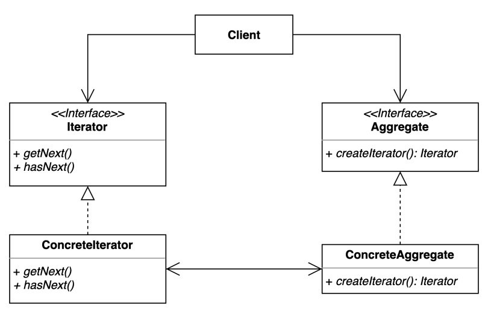

### 이터레이터 패턴 예시

```java
public interface Iterator {
    boolean hasNext();
    Object next();
}

public interface Aggregate {
    Iterator CreateIterator();
}

public class Book {
    private final String name;

    public Book(String name) {
        this.name = name;
    }

    public String getName() {
        return name;
    }
}

public class BookShelfIterator implements Iterator {
    private final BookShelfAggregate bookShelfAggregate;
    private int index;

    public BookShelfIterator(BookShelfAggregate bookShelfAggregate) {
        this.bookShelfAggregate = bookShelfAggregate;
        this.index = 0;
    }

    @Override
    public boolean hasNext() {
        return index < bookShelfAggregate.getLength();
    }

    @Override
    public Object next() {
        Book book = bookShelfAggregate.getBookAt(index);
        index++;
        return book;
    }
}

public class BookShelfAggregate implements Aggregate {
    private final Book[] books;
    private int last = 0;

    public BookShelfAggregate(int maxsize) {
        this.books = new Book[maxsize];
    }

    public Book getBookAt(int index) {
        return books[index];
    }

    public void appendBook(Book book) {
        this.books[last] = book;
        last++;
    }

    public int getLength() {

        return last;
    }

    @Override
    public Iterator CreateIterator() {
        return new BookShelfIterator(this);
    }
}

BookShelfAggregate bookShelfAggregate = new BookShelfAggregate(3);

bookShelfAggregate.appendBook(new Book("자바"));
bookShelfAggregate.appendBook(new Book("파이썬"));
bookShelfAggregate.appendBook(new Book("golang"));

System.out.println("개수 : "+bookShelfAggregate.getLength());

Iterator it = bookShelfAggregate.CreateIterator();

while(it.hasNext()){
    Book book = (Book) it.next();
    System.out.println(book.getName());
}

//개수 : 3
//자바
//파이썬
//golang
```

## 중재자 패턴 (Mediator Pattern)

- 여러 객체들이 소통하는 방법을 캡슐화하는 패턴
  - 객체들의 상호작용하는 부분을 한 군데서 관리한다
- 장점
  - 컴포넌트 코드를 변경하지 않고 새로운 중재자를 만들어 사용할 수 있다
  - 각각의 컴포넌트 코드를 보다 간결하게 유지할 수 있다
- 단점
  - 중재자 역할을 하는 클래스의 복잡도와 결합도가 증가한다
  - 중재자 객체가 많아지면 오히려 유지보수가 어려워진다

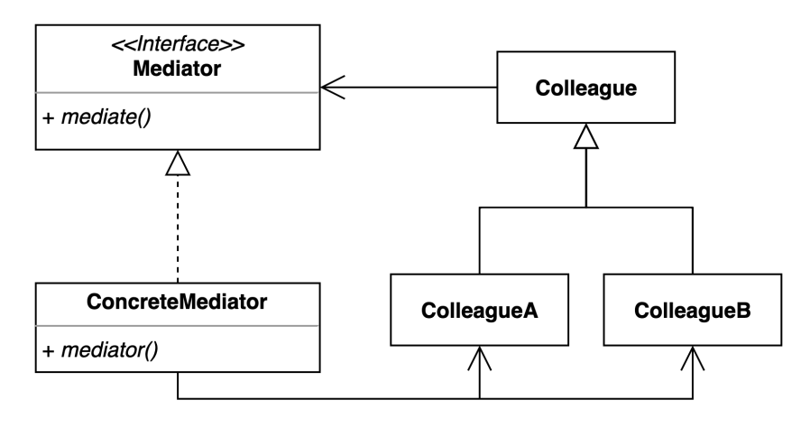

### 중재자 패턴 예시

```java
public interface Command {
    void land();
}
```

```java
public class Flight implements Command {
    private IATCMediator atcMediator;

    public Flight(IATCMediator atcMediator) {
        this.atcMediator = atcMediator;
    }

    @Override
    public void land() {
        if (atcMediator.isLandingOK()) {
            System.out.println("Successfylly Landed.");
            atcMediator.setLandingStatus(true);
        } else {
            System.out.println("Waiting for Landing.");
        }
    }

    public void getReady() {
        System.out.println("Ready for landing");
    }
}
```

```java
public class Runway implements Command{
    private IATCMediator atcMediator;

    public Runway(IATCMediator atcMediator) {
        this.atcMediator = atcMediator;
        atcMediator.setLandingStatus(true);
    }

    @Override
    public void land() {
        System.out.println("Lading permission granted.");
        atcMediator.setLandingStatus(true);
    }
}
```

```java
public interface IATCMediator {
    public void registerRunway(Runway runway);
    public void registerFilght(Flight flight);
    public boolean isLandingOK();
    public void setLandingStatus(boolean status);
}
```

```java
public class ATCMediator implements IATCMediator{
    private Flight flight;
    private Runway runway;
    public boolean land;

    @Override
    public void registerRunway(Runway runway) {
        this.runway = runway;
    }

    @Override
    public void registerFilght(Flight flight) {
        this.flight = flight;
    }

    @Override
    public boolean isLandingOK() {
        return land;
    }

    @Override
    public void setLandingStatus(boolean status) {
        land = status;
    }
}
```

```java
public class Main {
    public static void main(String[] args) {
        IATCMediator atcMediator = new ATCMediator();
        Flight cptJack = new Flight(atcMediator);
        Runway runnerWay = new Runway(atcMediator);
        atcMediator.registerFilght(cptJack);
        atcMediator.registerRunway(runnerWay);
        cptJack.getReady();
        runnerWay.land();
        cptJack.land();
    }
}
```

```plaintext
Ready for landing
Lading permission granted.
Successfylly Landed.
```

## 메멘토 패턴

- 캡슐화를 유지하면서 객체 내부 상태를 외부에 저장하는 방법
  - 객체 상태를 외부에 저장했다가 해당 상태로 다시 복구할 수 있다
- 장점
  - 캡슐화를 지키면서 상태 객체 상태 스냅샷을 만들 수 있다
  - 객체 상태가 저장하고 또는 복원하는 역할을 CareTaker에 위임할 수 있다
  - 객체 상태가 바뀌더라도 클라이언트 코드는 변경되지 않는다
- 단점
  - 많은 정보를 저장하는 Mementor를 자주 생성하는 경우 메모리 사용량에 많은 영향을 줄 수 있다

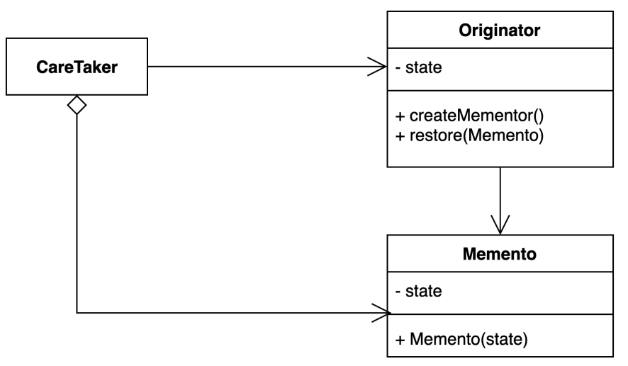

### 메멘토 패턴 예시

```java
public class Life {
    private String time;

    public void setTime(String time) {
        System.out.println("Setting Time : " + time);
        this.time = time;
    }

    public Memento saveToMemento() {
        System.out.println("Saving time to Memento");
        return new Memento(time);
    }

    public void restoreFromMemento(Memento memento) {
        time = memento.getSavedTime();
        System.out.println("Time restored from Memento : " + time);
    }

    public static class Memento {
        private final String time;

        public Memento(String timeToSave) {
            this.time = timeToSave;
        }

        public String getSavedTime() {
            return time;
        }
    }
}
```

```java
public class Design {
    public static void main(String[] args) {
        List<Life.Memento> savedTimes = new ArrayList<Life.Memento>();
        Life life = new Life();

        life.setTime("1000 B.C.");
        savedTimes.add(life.saveToMemento());
        life.setTime("1000 A.D.");
        savedTimes.add(life.saveToMemento());
        life.setTime("2000 A.D.");
        savedTimes.add(life.saveToMemento());
        life.setTime("4000 A.D.");
        savedTimes.add(life.saveToMemento());

        life.restoreFromMemento(savedTimes.get(0));
    }
}
```

## 옵저버 패턴

- 다수의 객체가 특정 객체 상태 변화를 감지하고 알림을 받는 패턴
  - 발행(publisher)-구독(subscribe) 패턴을 구현할 수 있다
- 장점
  - 상태를 변경하는 객체(Publisher)와 변경을 감지하는 객체(Subscriber)의 관계를 느슨하게 유지할 수 있다
  - Subject의 상태 변경을 주기적으로 조회하지 않고 자동으로 감지할 수 있다
  - 런타임에 옵저버를 추가하거나 제거할 수 있다
- 단점
  - 복잡도가 증가한다
  - 다수의 Observer 객체를 등록 이후 해지하지 않는다면 메모리 누수가 발생할 수 있다

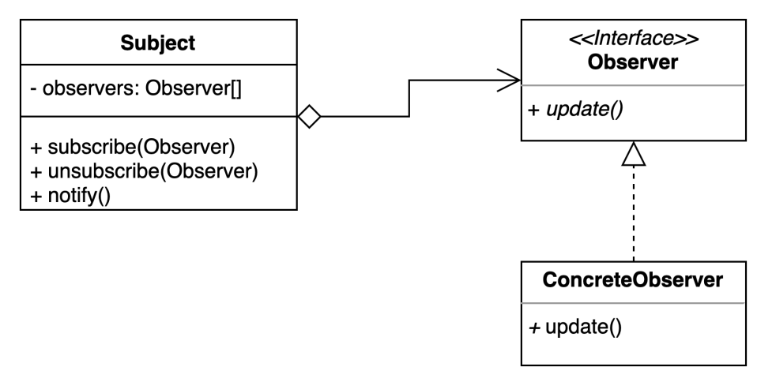

### 옵저버 패턴 예시

```java
public class Observer {
    public String msg;

    public void receive(String msg){
        System.out.println(this.msg + "에서 메시지를 받음 : " + msg);
    }
}
```

```java
public class User1 extends Observer{

    public User1(String msg){
        this.msg = msg;
    }
}
```

```java
public class User2 extends Observer{

    public User2(String msg) {
        this.msg = msg;
    }
}
```

```java
public class Notice {
    private List<Observer> observers = new ArrayList<Observer>();

    // 옵저버에 추가
    public void attach(Observer observer){
        observers.add(observer);
    }

    // 옵저버에서 제거
    public void detach(Observer observer){
        observers.remove(observer);
    }

    // 옵저버들에게 알림
    public void notifyObservers(String msg){
        for (Observer o:observers) {
            o.receive(msg);
        }
    }
}
```

```java
public class Main {
    public static void main(String[] args) {
        Notice notice = new Notice();
        User1 user1 = new User1("유저1");
        User2 user2 = new User2("유저2");

        notice.attach(user1);
        notice.attach(user2);

        String msg = "공지사항입니다~!";
        notice.notifyObservers(msg);

        notice.detach(user1); // user1 공지사항 받는 대상에서 제거
        msg = "안녕하세요~";
        notice.notifyObservers(msg);
    }
}
```

```plaintext
유저1에서 메시지를 받음 : 공지사항입니다~!
유저2에서 메시지를 받음 : 공지사항입니다~!
유저2에서 메시지를 받음 : 안녕하세요~
```

## 상태 패턴 (State Pattern)

- 객체 내부 상태 변경에 따라 객체의 행동이 달라지는 패턴
  - 상태에 특화된 행동들을 분리해 낼 수 있으며, 새로운 행동을 추가하더라도 다른 행동에 영향을 주지 않는다
- 장점
  - 상태에 따른 동작을 개별 클래스로 옮겨서 관리할 수 있다
  - 기존의 특정 상태에 따른 동작을 변경하지 않고 새로운 상태에 다른 동작을 추가할 수 있다
  - 상태에 따른 동작의 추가, 수정, 삭제가 간단해진다
  - 조건문이 줄어들어 코드가 간결해지고 가독성이 올라간다
- 단점
  - 상태에 따른 조건문 대신 상태 객체가 증가하여 관리해야할 클래스의 수가 증가하며 복잡도가 증가한다

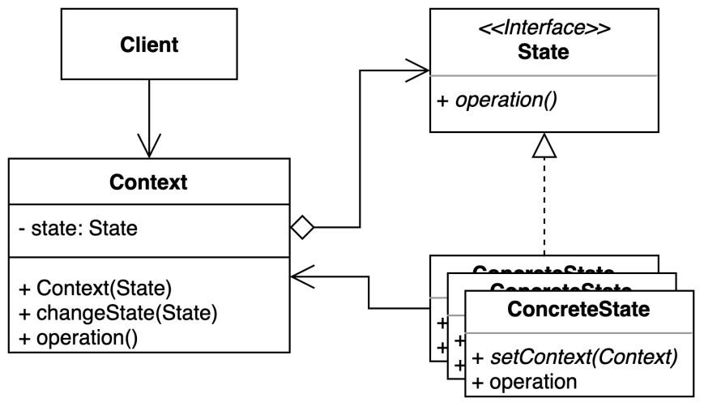

### 상태 패턴 예시

```java
interface MobileAlertState
{
    public void alert(AlertStateContext ctx);
}

class AlertStateContext
{
    private MobileAlertState currentState;

    public AlertStateContext()
    {
        currentState = new Vibration();
    }

    public void setState(MobileAlertState state)
    {
        currentState = state;
    }

    public void alert()
    {
        currentState.alert(this);
    }
}

class Vibration implements MobileAlertState
{
    @Override
    public void alert(AlertStateContext ctx)
    {
         System.out.println("vibration...");
    }

}

class Silent implements MobileAlertState
{
    @Override
    public void alert(AlertStateContext ctx)
    {
        System.out.println("silent...");
    }

}

class StatePattern
{
    public static void main(String[] args)
    {
        AlertStateContext stateContext = new AlertStateContext();
        stateContext.alert();
        stateContext.alert();
        stateContext.setState(new Silent());
        stateContext.alert();
        stateContext.alert();
        stateContext.alert();
    }
}
```

```plaintext
vibration...
vibration...
silent...
silent...
silent...
```

## 전략 패턴 (Strategy Pattern)

- 여러 알고리즘을 캡슐화하고 상호 교환 가능하게 만드는 패턴
  - 컨텍스트에서 사용할 알고리즘을 클라이언트에서 선택한다
- 장점
  - 새로운 전략을 추가하더라도 기존 코드를 변경하지 않는다
  - 알고리즘을 별도로 캡슐화하여 동일한 인터페이스를 준수하는 새로운 알고리즘을 쉽게 추가할 수 있다
  - 상속 대신 위임을 사용할 수 있다
  - 런타임에 전략을 변경할 수 있다
  - 전략을 통해 클라이언트는 조건문을 사용하지 않고 필요한 알고리즘을 선택할 수 있다
- 단점
  - 복잡도가 증가한다
  - 올바른 상황에 적합한 전략을 선택하기 위해 클라이언트 코드가 구체적인 모든 전략을 알고 있어야 한다

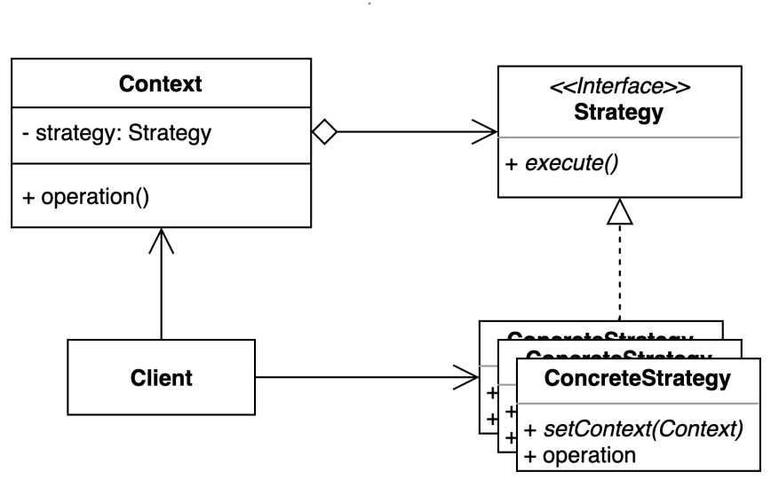

### 전략 패턴 예시

```java
abstract class Fighter
{
    KickBehavior kickBehavior;
    JumpBehavior jumpBehavior;

    public Fighter(KickBehavior kickBehavior,
                   JumpBehavior jumpBehavior)
    {
        this.jumpBehavior = jumpBehavior;
        this.kickBehavior = kickBehavior;
    }
    public void punch()
    {
        System.out.println("Default Punch");
    }
    public void kick()
    {
        // delegate to kick behavior
        kickBehavior.kick();
    }
    public void jump()
    {

        // delegate to jump behavior
        jumpBehavior.jump();
    }
    public void roll()
    {
        System.out.println("Default Roll");
    }
    public void setKickBehavior(KickBehavior kickBehavior)
    {
        this.kickBehavior = kickBehavior;
    }
    public void setJumpBehavior(JumpBehavior jumpBehavior)
    {
        this.jumpBehavior = jumpBehavior;
    }
    public abstract void display();
}

// Encapsulated kick behaviors
interface KickBehavior
{
    public void kick();
}
class LightningKick implements KickBehavior
{
    public void kick()
    {
        System.out.println("Lightning Kick");
    }
}
class TornadoKick implements KickBehavior
{
    public void kick()
    {
        System.out.println("Tornado Kick");
    }
}

// Encapsulated jump behaviors
interface JumpBehavior
{
    public void jump();
}
class ShortJump implements JumpBehavior
{
    public void jump()
    {
        System.out.println("Short Jump");
    }
}
class LongJump implements JumpBehavior
{
    public void jump()
    {
        System.out.println("Long Jump");
    }
}

// Characters
class Ryu extends Fighter
{
    public Ryu(KickBehavior kickBehavior,
               JumpBehavior jumpBehavior)
    {
        super(kickBehavior,jumpBehavior);
    }
    public void display()
    {
        System.out.println("Ryu");
    }
}
class Ken extends Fighter
{
    public Ken(KickBehavior kickBehavior,
               JumpBehavior jumpBehavior)
    {
        super(kickBehavior,jumpBehavior);
    }
    public void display()
    {
        System.out.println("Ken");
    }
}
class ChunLi extends Fighter
{
    public ChunLi(KickBehavior kickBehavior,
                  JumpBehavior jumpBehavior)
    {
        super(kickBehavior,jumpBehavior);
    }
    public void display()
    {
        System.out.println("ChunLi");
    }
}

// Driver class
class StreetFighter
{
    public static void main(String args[])
    {
        // let us make some behaviors first
        JumpBehavior shortJump = new ShortJump();
        JumpBehavior LongJump = new LongJump();
        KickBehavior tornadoKick = new TornadoKick();

        // Make a fighter with desired behaviors
        Fighter ken = new Ken(tornadoKick,shortJump);
        ken.display();

        // Test behaviors
        ken.punch();
        ken.kick();
        ken.jump();

        // Change behavior dynamically (algorithms are
        // interchangeable)
        ken.setJumpBehavior(LongJump);
        ken.jump();
    }
}
```

```plaintext
Ken
Default Punch
Tornado Kick
Short Jump
Long Jump
```

## 템플릿 메서드 패턴 (Template Method Pattern) / 템플릿 콜백 패턴 (Template-Callback Pattern)

### 템플릿 메서드 패턴

- 알고리즘 구조를 서브 클래스가 확장할 수 있도록 템플릿으로 제공하는 방법
  - 추상 클래스는 템플릿을 제공하고 하위 클래스는 구체적인 알고리즘을 제공한다

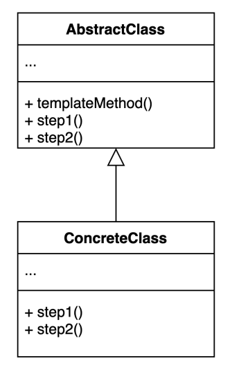

### 템플릿 콜백 패턴

- 콜백으로 상속 대신 위임을 사용하는 패턴
  - 상속 대신 익명 내부 클래스 또는 람다 표현식을 활용할 수 있다

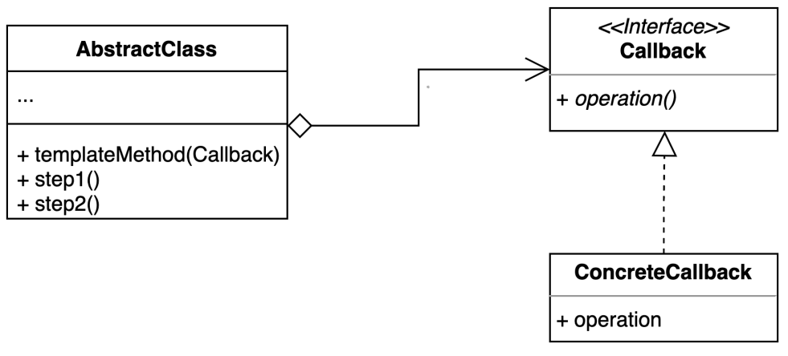

- 장점
  - 템플릿 코드를 재사용하지 않고 중복 코드를 줄일 수 있다
  - 템플릿 코드를 변경하지 않고 상속을 받아서 구체적인 알고리즘만 변경할 수 있따
- 단점
  - 리스코프 치환 원칙을 위반할 수 있다
  - 알고리즘 구조가 복잡할수록 템플릿을 유지하기가 어려워진다

### 템플릿 메서드 패턴 예시

```java
abstract class OrderProcessTemplate
{
    public boolean isGift;

    public abstract void doSelect();

    public abstract void doPayment();

    public final void giftWrap()
    {
        try
        {
            System.out.println("Gift wrap successful");
        }
        catch (Exception e)
        {
            System.out.println("Gift wrap unsuccessful");
        }
    }

    public abstract void doDelivery();

    public final void processOrder(boolean isGift)
    {
        doSelect();
        doPayment();
        if (isGift) {
            giftWrap();
        }
        doDelivery();
    }
}


class NetOrder extends OrderProcessTemplate
{
    @Override
    public void doSelect()
    {
        System.out.println("Item added to online shopping cart");
        System.out.println("Get gift wrap preference");
        System.out.println("Get delivery address.");
    }

    @Override
    public void doPayment()
    {
        System.out.println
                   ("Online Payment through Netbanking, card or Paytm");
    }

    @Override
    public void doDelivery()
    {
        System.out.println
                    ("Ship the item through post to delivery address");
    }

}

class StoreOrder extends OrderProcessTemplate
{

    @Override
    public void doSelect()
    {
        System.out.println("Customer chooses the item from shelf.");
    }

    @Override
    public void doPayment()
    {
        System.out.println("Pays at counter through cash/POS");
    }

    @Override
    public void doDelivery()
    {
        System.out.println("Item delivered to in delivery counter.");
    }

}

class TemplateMethodPatternClient
{
    public static void main(String[] args)
    {
        OrderProcessTemplate netOrder = new NetOrder();
        netOrder.processOrder(true);
        System.out.println();
        OrderProcessTemplate storeOrder = new StoreOrder();
        storeOrder.processOrder(true);
    }
}
```

```plaintext
Item added to online shopping cart
Get gift wrap preference
Get delivery address.
Online Payment through Netbanking, card or Paytm
Gift wrap successful
Ship the item through post to delivery address

Customer chooses the item from shelf.
Pays at counter through cash/POS
Gift wrap successful
Item delivered to in delivery counter.
```

## 방문자 패턴 (Visitor Pattern)

- 기존 코드를 변경하지 않고 새로운 기능을 추가하는 방법

  - 더블 디스패치(Double Dispatch)를 활용할 수 있다

- 장점
  - 기존 코드를 변경하지 않고 새로운 코드를 추가할 수 있다
  - 추가 기능을 한 곳에 모아둘 수 있다
- 단점
  - 복잡하다
  - 새로운 Element를 추가하거나 제거할 때 모든 Visitor 코드를 변경해야 한다

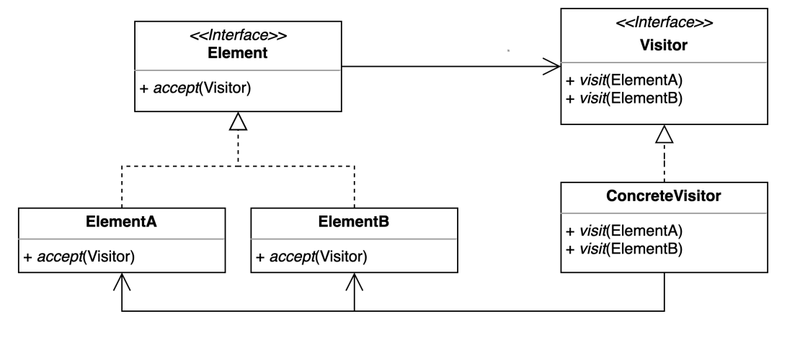

### 방문자 패턴 예시

```java
interface ItemElement
{
    public int accept(ShoppingCartVisitor visitor);
}

class Book implements ItemElement
{
    private int price;
    private String isbnNumber;

    public Book(int cost, String isbn)
    {
        this.price=cost;
        this.isbnNumber=isbn;
    }

    public int getPrice()
    {
        return price;
    }

    public String getIsbnNumber()
    {
        return isbnNumber;
    }

    @Override
    public int accept(ShoppingCartVisitor visitor)
    {
        return visitor.visit(this);
    }

}

class Fruit implements ItemElement
{
    private int pricePerKg;
    private int weight;
    private String name;

    public Fruit(int priceKg, int wt, String nm)
    {
        this.pricePerKg=priceKg;
        this.weight=wt;
        this.name = nm;
    }

    public int getPricePerKg()
    {
        return pricePerKg;
    }

    public int getWeight()
    {
        return weight;
    }

    public String getName()
    {
        return this.name;
    }

    @Override
    public int accept(ShoppingCartVisitor visitor)
    {
        return visitor.visit(this);
    }

}

interface ShoppingCartVisitor
{

    int visit(Book book);
    int visit(Fruit fruit);
}

class ShoppingCartVisitorImpl implements ShoppingCartVisitor
{

    @Override
    public int visit(Book book)
    {
        int cost=0;
        //apply 5$ discount if book price is greater than 50
        if(book.getPrice() > 50)
        {
            cost = book.getPrice()-5;
        }
        else
            cost = book.getPrice();

        System.out.println("Book ISBN::"+book.getIsbnNumber() + " cost ="+cost);
        return cost;
    }

    @Override
    public int visit(Fruit fruit)
    {
        int cost = fruit.getPricePerKg()*fruit.getWeight();
        System.out.println(fruit.getName() + " cost = "+cost);
        return cost;
    }

}

class ShoppingCartClient
{

    public static void main(String[] args)
    {
        ItemElement[] items = new ItemElement[]{new Book(20, "1234"),
                              new Book(100, "5678"), new Fruit(10, 2, "Banana"),
                              new Fruit(5, 5, "Apple")};

        int total = calculatePrice(items);
        System.out.println("Total Cost = "+total);
    }

    private static int calculatePrice(ItemElement[] items)
    {
        ShoppingCartVisitor visitor = new ShoppingCartVisitorImpl();
        int sum=0;
        for(ItemElement item : items)
        {
            sum = sum + item.accept(visitor);
        }
        return sum;
    }

}
```

```plaintext
Book ISBN::1234 cost =20
Book ISBN::5678 cost =95
Banana cost = 20
Apple cost = 25
Total Cost = 160
```
