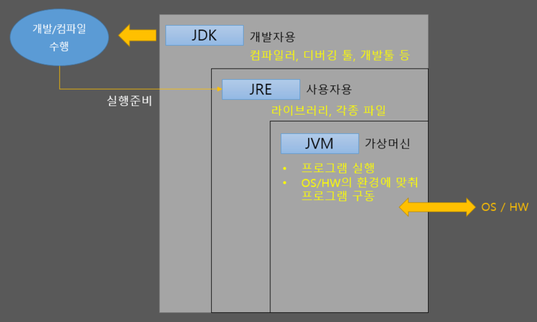

### JAVA JDK

- Java로 된 언어를 컴파일하고 개발할 수 있도록 해주는 개발 환경의 세트를 의미
- Java Development Kit의 약자, 개발자를 위한 JAVA라고 할 수 있다
- 개발자만을 위한 컴파일러, 디버깅 툴 등을 제공한다
- 개발자 및 사용자를 위한 JAVA인 JRE(+JVM) 을 포함한 종합 툴

- JAVA SE : C언어의 표준인 C9, C11처럼 JAVA의 표준 문법을 의미한다 (JAVA SE 11, 12등)
- JAVA EE : JAVA SE에 엔터프라이즈용 여러 기능(라이브러리 등)을 포함한 확장 버전이다
- JRE : Java Runtime Envirionment (Java버전에 따른 기본 라이브러리 포함)
- JVM : Java version Machine (자바코드를 해석해서 프로그램을 실행해주는 가상 머신)

### 각 프로그램 version 문제

- JAVA SE version이 가장 우선 (Java의 문법을 어느 version의 기준으로 할 것인가)
- JDK version은 이 JAVA SE version을 지원하는 버전이라고 볼 수 있다
- 예를 들어 현재 JDK 13.0.1은 JAVA SE 13.0.1 version에 맞춘 개발 툴이라고 보면 된다.

### 순서로 설명

1. JAVA 언어로 개발을 한다. 컴파일, 디버깅 등을 하려면 JDK가 필요하다
2. 개발을 하면서 자바에서 기본으로 제공하는 JRE 라이브러리를 사용한다
3. 여러 가지 환경 파일도 JRE가 가지고 있지만 개발자가 직접 다룰 일은 거의 없다
4. 실행하면 JVM에서 .class파일을 읽어서 바이너리코드를 검증하고 OS환경에 적합하게 실행해준다

**즉 어쨌든 JDK안에 모두 다 들어있다.** (JDK를 설치하면 JAVA 개발이 가능하다)

- JDK > JRE > JVM

개발이 아닌 Java실행만을 위해선 JVM, JRE만 있으면 된다.