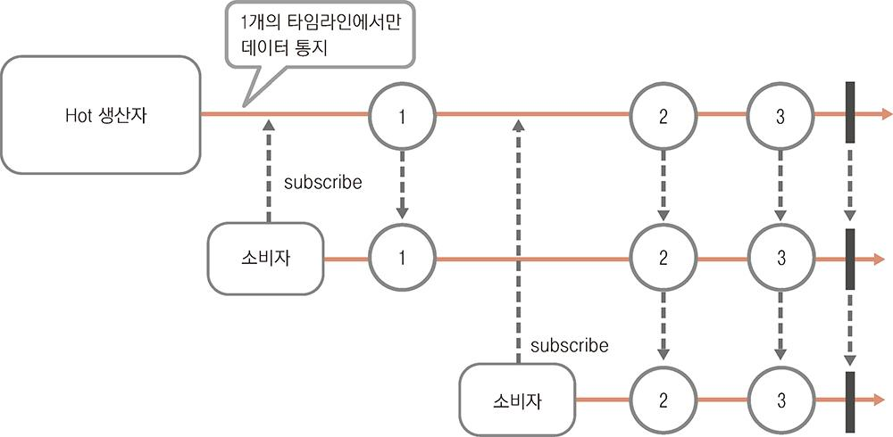

# RxJava와 리액티브 프로그래밍

## RxJava란

- RxJava는 자바에서 **리액티브 프로그래밍**을 구현하는데 사용하는 라이브러리다
- 이벤트처리와 같은 비동기 처리에 최적화되었다
- 2.0버전부터 Reactive Stream 사양을 구현한다
  - Reactive Stream 사양 : 어떤 라이브러리나 프레임워크라도 데이터스트림을 비동기로 처리하는 공통 메커니즘을 인터페이스로 제공한다
  - RxJava 2.0버전부터는 Reactive Streams API를 의존하고 그 외에 다른 라이브러리는 의존하지 않는다
- RxJava는 엄밀히 말해 **함수형 리액티브 프로그래밍은 아니다**
  - 하지만 함수형 프로그래밍의 영향을 받아 함수형 인터페이스를 인자로 전달받는 메서드가 많다
  - 이러한 함수형 인터페이스를 사용하는 메서드들을 조합하면 함수형 프로그래밍을 하는 것처럼 데이터를 필터링하거나 변환하는 등의 처리를 유연하게 할 수 있다

> Simple RxJava Example
> ```java
> public static void main(String[] args){
>   // 데이터를 통지하는 생산자를 생성한다
>   Flowable<String> flowable = Flowable.just("Hello", "World"); // <- just 메서드 인자로 전달된 데이터를 통지하는 생산자 (Flowable)를 생성한다
>   // 통지받은 데이터를 출력한다
>   flowable.subscribe(data -> System.out.println(data)); // <- 생산자가 데이터를 통지하면 소비자가 받은 데이터를 출력한다
> }
> ```
> 
> 실행 결과
> ```
> Hello
> World
> ```

## 리액티브 프로그래밍이란

- 리액티브 프로그래밍 : 데이터가 통지될 때마다 관련 프로그램이 반응하여 데이터를 처리하는 프로그래밍 방식
- 리액티브 프로그래밍은 데이터 스트림으로 데이터를 전달받은 프로그램이 그때마다 적절히 처리할 수 있도록 구성되어있는 프로그래밍이다
  - 데이터 스트림 : 이미 생성된 집합인 리스트같은 컬렉션과는 다르게 앞으로 발생할 가능성이 있는 데이터까지도 포함하는 데이터 집합체
    - 이벤트도 발생할 때마다 데이터를 전송하는 데이터 스트림으로 다룰 수 있다
- 리액티브 프로그래밍에서 데이터를 생산하는 측은 데이터를 전달하는 것까지 책임지며, 데이터를 생산하는 측은 데이터를 소비하는 측이 전달받은 데이터로 무엇을 하는지는 몰라도 되며 데이터를 소비하는 측의 처리를 기다릴 필요가 없다
- 시스템 구축 관점에서 볼 때도 마이크로서비스와 같이 분산 시스템으로 프로그램을 구현하는데 적합하다

## RxJava의 개요

- .NET 프레임크의 실험적인 라이브러인 Reactive Extension(Rx)를 2009년 MS에서 공개하고, 2013년 넷플릭스에서 자바로 이식한 것이 RxJava의 시작
- Reactive Extensions를 다루는 라이브러리는 **ReactiveX**라는 오픈소스 프로젝트로 바뀌어 자바나 .NET뿐만 아니라 자바스크립트나 스위프트 등 여러 프로그래밍 언어를 지원하는 라이브러리를 제공한다
- RxJava1 때는 Reactive Extensions를 이식하는 개발이 진행되었고, 리액티브 프로그래밍 개념이 널리 알려지면서 Reactive Extensions와 별도로 여러 업체에서 데이터 스트림을 비동기로 다루는 라이브러리와 프레임워크를 출시했고, 라이브러리나 프레임워크 차이 때문에 서로 다르게 구현하는 문제가 발생했다. 그래서 관련 단체들이 데이터 스트림을 비동기로 다루는 최소한의 API를 정하고 제공했고, RxJava 2.0부터 이 API를 지원하게 되었다
- RxJava2.0은 1.x 버전보다 성능이 개선되었고, 배압 사양에 따라 사용하는 API가 변경됐다
  - 따라서 1.x버전에서 2.x버전으로 전환할 때는 단순하게 패키지나 클래스 이름을 바꾸는것 외에도 이러한 API 변경 사항도 바녕해야 한다
  - 2.x버전부터 Reactive Streams를 구현하므로 다른 라이브러리를 의존할 필요가 없던 1.x버전과는 다르게 Reactive Streams의 jar 반드시 필요하다


## RxJav의 특징

- RxJava는 디자인 패턴인 **옵저버 패턴**을 잘 확장했다
  - 옵저버 패턴은 감시 대상 객체의 상태가 변하면 이를 관찰하는 객체에 알려주는 구조다
  - 이 패턴의 특징을 살리면 데이터를 생성하는 측과 소비하는 측으로 나눌 수 있기 때문에 쉽게 데이터 스트림을 처리할 수 있다
  - RxJava는 옵저버 패턴에 완료와 에러를 통지할 수 있어서 모든 데이터 통지가 끝나거나 에러가 발생하는 시점에 별도로 대응할 수도 있다
- RxJava는 쉬운 비동기처리를 할 수 있다
  - Reactive Streams 규칙의 근간이 되는 **Observable 규약**이라는 RxJava 개발 가이드라인을 따른 구현이라면 직접 스레드를 관리하는 번거로움에서 해방될 뿐 아니라 구현도 간단하게 할 수 있다
- RxJava는 동기 처리나 비동기 처리나 구현 방법에 큰 차이가 없다
- RxJava는 함수형 프로그래밍의 영향을 받아 함수형 인터페이스를 인자로 전달하는 메서드를 사용해 대부분의 처리를 구현한다
  - 입력과 결과만 정해져 있다면 구체적인 처리는 개발자에게 맡길 수 있으므로 더욱 자유로운 구현이 가능함을 의미한다
  - 처리작업의 영향 범위를 좁힐 수 있고 동시에 복잡하지 않게 비동기 처리를 할 수 있다

---

# Reactive Streams

## Reactive Streams란

- Reactive Streams란 라이브러리나 프레임워크에 상관없이 데이터 스트림을 비동기로 다룰 수 있는 공통 메커니즘으로 이 메터니즘을 편리하게 사용할 수 있는 인터페이스를 제공한다
  - RxJava 버전이 1.x에서 2.x로 올라간 배경에는 Reactive Streams가 있다

## Reactive Streams 구성

- Reactive Streams는 데이터를 만들어 통지하는 Publisher(생산자)와 통지된 데이터를 받아 처리하는 Subscriber(소비자)로 구성된다
  - Publisher : 데이터를 통지하는 생산자
  - Subscriber : 데이터를 받아 처리하는 소비자
- Subscriber가 Publiser를 구독(subscribe)하면 Publisher가 통지한 데이터를 Subscriber가 받을 수 있다
- Publiser가 데이터를 통지한 후 Subscriber가 이 데이터를 받을 때까지의 데이터 흐름
  - 
  1. 먼저 Publisher는 통지 준비가 끝나면 이를 Subscriber에 통지(onSubscription) 한다
  2. 해당 통지를 받은 Subscriber는 받고자 하는 데이터 개수를 요청한다
     - 이 때 Subscriber가 자신이 통지받을 데이터 개수를 요청하지 않으면 Publisher는 통지해야 할 데이터 개수 요청을 기다리게 되므로 통지를 시작할 수 없다 
  3. Publisher는 데이터를 만들어 Subscriber에 통지(onNext)한다
     - Publisher는 요청 받은 만큼의 데이터를 통지한 뒤 Subscriber로부터 다음 요청이 올 때까지 데이터 통지를 중단한다
  5. 이 데이터를 받은 Subscriber는 받은 데이터를 사용해 처리 작업을 수행한다
  6. Subscriber가 처리 작업을 완료하면 다음 받을 데이터 개수를 Publihser에 요청한다
     - 이 요청을 보내지 않으면 pUBLISHER는 요청 대기상태가 되어 Subscriber에 데이터를 통지할 수 없다
  7. Publisher는 Subscriber에 모든 데이터를 통지하고 마지막으로 데이터 전송이 완료돼 정상 종료 됐다고 통지(onComplete)한다
  8. 완료 통지를 하고 나면 Publisher는 이 구독 건에 대해 어떤 통지도 하지 않는다. 또한 Publisher는 처리 도중에 에러가 발생하면 Subscriber에 발생한 에러 객체와 함께 애러를 통지(onError)한다
- Subscriber가 Publisher에 통지받을 데이터 개수를 요청하는 것은 Publisher가 통지하는 데이터 개수를 제어하기 위함이다
  - 이를 배압(Back pressure)이라고 한다
  - 


### Reactive Streams가 제공하는 프로토콜 및 인터페이스

- Reactive Streams가 제공하는 프로토콜
  |프로토콜|설명|
  |---|---|
  |onSubscribe|데이터 통지가 준비됐음을 통지|
  |onNext|데이터 통지|
  |onError|에러(이상 종료)통지|
  |onComplete|완료(정상 종료)통지|

- Reactibe Streams 인터페이스
  |인터페이스|설명|
  |---|---|
  |Publisher|데이터를 생성하고 통지하는 인터페이스|
  |Subscriber|통지된 데이터를 전달받아 처리하는 인터페이스|
  |Subscription|데이터 개수를 요청하고 구독을 해지하는 인터페이스|
  |Processor|Publisher와 Subscriber의 기능이 모두 있는 인터페이스|

## Reactive Streams의 규칙

- Reactive Streams는 앞서 소개한 인터페이스로 데이터를 통지하는 구조를 제공하지만, 이 구조가 제대로 작동하려면 Reactive Streams의 규칙을 따라야 한다
  - RxJava를 사용할 때는 각 통지 메서드와 Subscription의 메서드를 호출할 때 동기화가 이뤄지므로 처리 자체가 스레드 안전한지 신경써야 하며, 이 부분이 제대로 처리되지 않으면 정확한 통지가 안 될 가능성이 크다
- Reactive Streams의 기본 규칙
  - 구독 시작 통지(onSubscriber)는 해당 구독에서 한 번만 발생한다
  - 통지는 순차적으로 이루어진다
  - null을 통지하지 않는다
  - Publisher의 처리는 완료(onComplete)또는 에러(onError)를 통지해 종료한다
  - Subscription은 데이터 개수 요청에 `Long.MAX_VALUE`를 설정하면 데이터 개수에 의한 통지 제한은 없어진다
  - Subscription의 메서드는 동기화된 상태로 호출해야 한다

**구독 시작 통지(onSubscriber)는 해당 구독에서 한 번만 발생한다**
- Subscriber의 onSubscribe 메서드는 구독을 시작해 통지 준비가 끝났을 때 한번만 실행된다

**통지는 순차적으로 이루어진다**
- 여러 통지를 동시에 할 수 없다
- 이는 Reactive Stremas 사양에 큰 영향을 미친 RxJava의 `Observable 규약`이라는 규칙에 따른 것으로, 데이터가 동시에 통지돼 불일치가 발생하는것을 방지한다

**null을 통지하지 않는다**
- null을 통지하면 Reactive Stremas에서 NPE를 발생시킨다
  - 이는 데이터를 통지할 때만 아니라 에러를 통지할 때도 마찬가지다

**Publisher의 처리는 완료(onComplete)또는 에러(onError)를 통지해 종료한다**
- 완료나 에러를 통지하면 Publisher가 처리를 끝마친것으로 판단한다
- 완료나 에러 통지를 마친 구독은 더 이상 통지하지 않는다는 의미다
  - 완료를 통지한 뒤 에러를 발생했다면 이 에러는 통지하지 않으므로 정상종료됐다고 생각할 위험성이 있다

**Subscription은 데이터 개수 요청에 `Long.MAX_VALUE`를 설정하면 데이터 개수에 의한 통지 제한은 없어진다**
- 이 요청을 전송한 후에는 데이터 개수 요청을 보내지 않아도 데이터 통지를 계속해서 받을 수 있다
  - 즉, 데이터 개수 요청을 받을 때마다 기존 개수에 더해져 통지 가능한 데이터 개수가 증가한다
  - 그래서 이 더해진 결과가 `Long.MAX_VALUE`에 도달하면 통지 가능한 데이터 개수 제한이 없어진다

**Subscription의 메서드는 동기화된 상태로 호출해야 한다**
- Subscription의 메서드를 동시에 호출해서는 안된다

# RxJava의 기본구조

### 기본 구조

- RxJava는 데이터를 만들고 통지하는 생산자와 통지된 데이터를 받아 처리하는 소비자로 구성된다
  - 이 생산자를 구독해 생산자가 통지한 데이터를 소비자가 받게 된다
- RxJava에서 이 생산자와 소비자의 관계는 Reactive Streams 지원 여부에 따라 크게 둘로 나뉜다

|구분|생산자|소비자|
|---|---|---|
|Reactive Streams 지원|Flowable|Subscriber|
|Reactive Streams 미지원|Observable|Observer|

- Flowable/Subscriber
  - Flowable은 Reactive Streams의 생산자인 Publisher를 구현한 클래스고, Subscriber는 Reactibe Streams의 클래스다
    - 그래서 기본 메커니즘은 Reactive Streams와 같다
    - 생산자인 Flowable로 구독 시작(onSubscribe), 데이터 통지(onNext), 에러 통지(onError), 완료 통지(onComplete)를 하고 각 통지를 받은 시점에 소비자인 Subscriber로 처리하며, Subscription으로 데이터 개수 요청과 구독 해지를 한다

- Observable/Observer
  - RxJava2.x버전의 Observable과 Observer 구성은 Reactive Streams를 구현하지 않아서 Reactive Streams인터페이스를 사용하지 않는다. 하지만 기본적인 메커니즘은 거의 같다
    - 생산자인 Observable에서 구독 시작(onSubscribe), 데이터 통지(onNext), 에러 통지(onError), 완료 통지(onComplete)를 하면 Observer에서 이 통지를 받는다
  - Observable과 Observer구성은 통지하는 데이터 개수를 제어하는 배압 기능이 없기 때문에 데이터 개수를 요청하지 않고 데이터가 생성되자마자 Observer에 통지된다
    - 그래서 Subscription을 사용하지 않고 Disposable이라는 구독 해지 메서드가 있는 인터페이스를 사용하며, 이 Disposable은 구독을 시작하는 시점에 onSubscribe 메서드의 인자로 Observer에 전달된다
    - |메서드|설명|
      |---|---|
      |dispose|구독을 해지한다|
      |isDisposed|구독을 해지하면 true, 해지하지 않으면 false를 반환한다|

### 연산자

- RxJava에는 생산자(Flowable/Observable)가 통지한 데이터가 소비자(Subscriber/Observer)에 도착하기 전에 불필요한 데이터를 삭제하거나 소비자가 사용하기 쉽게 데이터를 변환하는 등 통지하는 데이터를 변경해야 할 때가 있는데 이 때 사용하는 메서드는 생산자의 메서드에서 새로운 생산자를 반환하며, 이 메서드를 연결해나감으로써 최종 데이터를 통지하는 생산자를 생성한다
  - 
  - 자바의 Stream과 유사한 개념이다
  - 이처럼 데이터 생산, 필터링, 변환하는 메서드를 **연산자**라고 한다
  - 연산자를 연결해나가는 과정을 메서드 체인이라고 한다

> 메서드 체인 예제
> ```java
> public static void main(String[] args) {
>    Flowable<Integer> flowable =
>             // 인자의 데이터를 순서대로 통지하는 Flowable을 생성한다
>             Flowable.just(1, 2, 3, 4, 5, 6, 7, 8, 9, 10)
>                     // 짝수에 해당하는 데이터만 통지한다 
>                     .filter(data -> data % 2 == 0)
>                     // 데이터를 100배로 변환한다
>                     .map(data -> data * 100);
> 
>     // 구독하고 받은 데이터를 출력한다
>     flowable.subscribe(data -> System.out.println("data=" + data));
> }
> ```
> 실행 결과
> ```
> data=200
> data=400
> data=600
> data=800
> data=1000
> ```

- 이처럼 데이터를 메서드 체인에 통과하개 하여 원본 생산자가 통지하는 데이터를 최종적으로 어떤 데이터로 통지할지 제어할 수 있다
- 전달받은 데이터의 상태를 변경하거나, 처리 작업의 외부에 어떤 변화를 주는 작업은 메서드 체인이 도중이 아니라 최종적으로 데이터를 받아 처리하는 소비자 측에서 이루어지는 것이 좋다
  - Side Effect를 피하기 위해서

### 비동기 처리

- RxJava는 각각의 처리를 서로 다른 스레드에서 실행할 수 있다
  - 데이터를 통지하는 측의 처리 범위와 받는 측의 처리 범위를 분리할 수 있게 설계되었기 때문
- RxJava는 개발자가 직접 스레드를 관리하지 않게 각 처리 목적에 맞춰 스레드를 관리하는 스케줄러를 제공한다
  - 스케줄러는 데이터 생산자와 소비자에 지정할 수 있다
  - 하지만 RxJava로 비동기 처리할 때 문제가 발생하지 않게 주의해야 한다
    - 예를 들어 생산자와 소비자 사이에 이뤄지는 처리를 외부 변수를 참조해 바꾸면 비동기 처리에 영향을 준다

> **외부 접근으로부터 안전한 비동기 처리 방식**
> 
> 


### Cold/Hot 생산자

- RxJava는 Cold 생산자, Hot 생산자 두 종류의 생산자가 있다

**Cold 생산자**
- 1개의 소비자와 구독 관계를 맺는다
- 데이터의 타임라인은 구독할 때마다 생성된다
- 구독시 생산자 처리가 시작된다
- 

**Hot 생산자**
- 여러 개의 소비자와 구독 관계를 맺을 수 있다
- 이미 생성상 통지 데이터의 타임라인에 나중에 소비자가 참가하는 것을 허용한다
- 구독해도 생산자 처리가 시작되지 않을 수 있다
- 구독 시점부터 데이터를 받게 되고, 같은 데이터를 여러 소비자가 받을 수도 있다
- 

### ConnectableFlowable/ConnectableObservable

- ConnectableFlowable/ConnectableObservable는 Hot 생산자이다
  - 여러 소비자가 구독 가능하다
  - subcirber 메서드를 호출해도 처리를 시작하지 않고 `connect` 메서드를 호출해야 처리를 시작한다
    - `connect` 메서드를 호출하기 전까지 처리가 시작되지 않기 때문에 ConnectableFlowable/ConnectableObservable은 처리를 시작하는 `connect` 메서드를 반드시 호출해야 한다

### Hot 생산자에서 Cold 생산자로 변환하는 연산자

**`refCount()`**

- Hot 생산자에서 새로운 Flowable/Observable을 생성한다
  - 이 Flowable/Observable은 이미 다른 소비자가 구독하고 있다면 도중에 구독하더라도 같은 타임라인에서 생성되는 데이터를 통지한다
  - 이 Flowable/Observable은 Cold 생산자이므로 `connect`가 필요없다
  - 이 Flowable/Observable은 처리가 왼료된 뒤 혹은 모든 구독이 해지된 뒤에 `subscribe`메서드를 호출하면 새로운 처리를 다시 시작한다

**`autoConnect()`/`autoConnect(int numberOfSubscribers)`**

- Hot 생산자에서 지정한 개수의 구독이 시작된 시점에 처리를 하는 Flowable/Observable을 생성한다
  - 이 Flowable/Observable은 처리가 왼료된 뒤 혹은 모든 구독이 해지된 뒤에는 `subscirbe`메서드를 호출해도 처리가 다시 시작되지 않는다
- `autoConnect`메서드에서 인자 없이 생성한다면 처음 `subscribe` 메서드가 호출된 시점에 처리를 시작하고, `autoConnect` 메서드에서 인자로 구독 개수를 지정한다면 지정한 개수에 도달한 시점에서 처리를 시작한다

### Cold 생산자에서 Hot 생산자로 변환하는 연산자

**`publish()`**

- `publish`메서드 호출 시 ConnectableFlowable/ConnectableObservable을 생성한다
  - 이 ConnectableFlowable/ConnectableObservable은 처리를 시작한 뒤에 구독하면 구독한 이후에 생성된 데이터부터 새로운 소비자에게 통지한다

**`replay()`/`replay(int bufferSize)`/`replay(long time, Timeunit unit)`**

- `replay`메서드 호출 시 ConnectableFlowable/ConnectableObservable을 생성한다
  - 이 ConnectableFlowable/ConnectableObservable은 통지한 데이터를 캐시하고, 처리를 시작한 뒤에 구독하면 캐시된 데이터를 먼저 새로 구독한 소비자에게 통지한다
    - 그 뒤에는 모든 소비자에게 같은 데이터를 통지한다
      - `replay()` : 모든 데이터를 캐시한다
      - `replay(int bufferSize)` : 지정한 개수만큼 데이터를 캐시한다
      - `replay(long time, Timeunit unit)` : 지정한 시간만큼 데이터를 캐시한다

**`share()`**

- 여러 소비자가 구독할 수 있는 Flowable/Observable을 생성한다
  - ConnectableFlowable/ConnectableObservable을 생성하는 것이 아니므로 주의
  - `flowable.publish().refCount()`와 같다 
  - 이 Flowable/Observable은 구독하는 소비자가 있는 동안은 새로 구독해도 같은 타임라인에서 생성되는 데이터를 통지한다

# 마블 다이어그램

- 마블 다이어그램 : 리액티브 프로그래밍에서 시간 경과에 따라 어떻게 데이터가 전달되고 변화되는지를 도형을 통해 알려주는 다이어그램
- 주로 Flowable/Observable에서 메서드를 호출할 때 시간의 경과에 따라 데이터가 어떻게 변화하는지 설명하는데 사용된다
- 마블다이어그램은 왼쪽에서 오른쪽으로 흘러가는 시간을 표현하고, 위에서 아래로 데이터가 메서드를 통해 어떻게 변환되는지를 표현한다
  - 처리가 정상적으로 끝내지 않고 에러를 통지하면 `X`표시를 하고, 특정 에러가 통지된다


---

# RxJava 예제

- RxJava는 2.x 버전부터 Reactive Streams와 의존관계가 있어서 RxJava의 라이브러리 뿐만 아니라 Reactive Streams의 라이브러리도 라이브러리 경로에 설정해야 RxJava를 사용할 수 있다

## Flowable/Subscriber 사용 예제

- `Hello, World!`, `안녕, RxJava!` 두 데이터를 통지하고, Subscriber가 해당 데이터를 받아 출력
- Flowable이 모든 데이터를 통지한 뒤에 완료를 통지하고 통지를 받은 Subscriber가 `완료`문자열을 출력
  - Flowable은 Cold 생산자이므로 Subscriber가 Flowable을 구독하면 바로 처리를 시작한다

```java
  public static void main(String[] args) throws Exception {
    // 인사말을 통지하는 Flowable을 생성한다
    Flowable<String> flowable =
        Flowable.create(new FlowableOnSubscribe<String>() {
          @Override
          public void subscribe(FlowableEmitter<String> emitter)
              throws Exception {
            
            String[] datas = {"Hello, World!", "안녕, RxJava!"};
            
            for (String data : datas) {
              // 구독이 해지되면 처리를 중단한다
              if (emitter.isCancelled()) {
                return;
              }
              // 데이터를 통지한다
              emitter.onNext(data);
            }
            
            // 완료를 통지한다
            emitter.onComplete();
          }
        }, BackpressureStrategy.BUFFER);// 초과한 데이터는 버퍼링한다
    
    flowable
        // Subscriber 처리를 개별 스레도에서 실행한다
        .observeOn(Schedulers.computation())
        // 구독한다
        .subscribe(new Subscriber<String>() {
          // 데이터 개수 요청과 구독 해지를 하는 객체
          private Subscription subscription;
          
          // 구독 시작 시 처리
          @Override
          public void onSubscribe(Subscription subscription) {
            // Subscription을 Subscriber에 보관한다
            this.subscription = subscription;
            // 받은 데이터 개수를 요청한다
            this.subscription.request(1L);
          }
          
          // 데이터를 받을 때 처리
          @Override
          public void onNext(String data) {
            // 실행 중인 스레드 이름을 얻는다
            String threadName = Thread.currentThread().getName();
            // 받은 데이터 출력한다
            System.out.println(threadName + ": " + data);
            // 다음에 받을 데이터 개수를 요청한다
            this.subscription.request(1L);
          }
          
          // 완료 통지 시 처리
          @Override
          public void onComplete() {
            // 실행 중인 스레드 이름을 얻는다
            String threadName = Thread.currentThread().getName();
            System.out.println(threadName + ": 완료");
          }
          
          // 에러 통지 시 처리
          @Override
          public void onError(Throwable error) {
            error.printStackTrace();
          }
        });
    
    // 잠시 기다린다
    Thread.sleep(500L);
  }
```

```
RxComputationThreadPool-1: Hello, World!
RxComputationThreadPool-1: 안녕, RxJava!
RxComputationThreadPool-1: 완료
```

**Backpressure Strategy**

- Flowable의 create메서드에서 BackpressureStrategy로 배압 옵션을 지정할 수 있다

> BackpressuerStratege의 종류
> |옵션|설명|
> |---|---|
> |BUFFER|통지할 수 있을 때까지 모든 데이터를 버퍼링한다|
> |DROP|통지할 수 있을 때까지 새로 생성한 데이터를 삭제한다|
> |LATEST|생성한 최신 데이터만 버퍼링하고 생성할 때마다 버퍼링하는 데이터를 교환한다|
> |ERROR|통지 대기 데이터가 버퍼 크기를 초과하면 MissingBackpressureException에러를 통지한다|
> |NONE|특정 처리를 수행하지 않는다. 주로 onBackPressure로 시작하는 메서드로 배압 모드를 설정할 때 사용한다|


**observeOn 메서드**

- RxJava에서는 메서드를 통지하는 측과 전달받는 측의 처리를 별도의 스레드에서 실행할 때 스레드 관리를 하는 Scheduler객체를 observeOn 메서드의 인자로 설정해서 데이터를 받는 측의 처리를 어떤 스레드에서 실행할지 지정할 수 있다

**subscribe 메서드**

- Reactive Streams에 정의된 Publisher(Flowable이 구현한 인터페이스)의 subscribe 메서드는 반환값을 돌려주지 않는다
  - Publisher와 Subscriber 사이의 상호 작용이 외부로부터 영향을 받지 않게 설계되었기 때문
- Subscriber는 데이터 개수 요청이나 구독을 해지하는 Subscription을 전달받아 Subscriber 내부에서 처리하므로 외부에서 데이터 개수 요청이나 구독 해지가 일어나지 않게 한다

> 구독을 중도 해제하는 예제
> 
> ```java
>   public static void main(String[] args) throws Exception {
>     
>     // 200밀리초마다 값을 통지하는 Flowable
>     Flowable.interval(200L, TimeUnit.MILLISECONDS)
>         .subscribe(new Subscriber<Long>() {
>           
>           private Subscription subscription;
>           private long startTime;
>           
>           @Override
>           public void onSubscribe(Subscription subscription) {
>             this.subscription = subscription;
>             this.startTime = System.currentTimeMillis();
>             this.subscription.request(Long.MAX_VALUE);
>           }
>           
>           @Override
>           public void onNext(Long data) {
>             // 구독 시작부터 500밀리초가 지나면 구독을 해지하고 처리를 중지한다
>             if ((System.currentTimeMillis() - startTime) > 500) {
>               subscription.cancel(); // 구독을 해지한다
>               System.out.println("구독 해지");
>               return;
>             }
>             
>             System.out.println("data=" + data);
>           }
>           
>           @Override
>           public void onComplete() {
>             System.out.println("완료");
>           }
>           
>           @Override
>           public void onError(Throwable error) {
>             error.printStackTrace();
>           }
>         });
>     
>     // 잠시 기다린다
>     Thread.sleep(2000L);
>   }
> ```
> 
> ```
> data=0
> data=1
> 구독 해지
> ```

## Observable/Observer 사용 예제

- Observable과 Observer의 관계는 Flowable과 Subscriber의 관계와 거의 같지만, Reactive Streams 사양을 구현하지 않았다는 점과 배압 기능이 없는 점이 다르다
- 클래스 구성이나 제공되는 메서드 등도 배압에 관련된 기능을 제외하고 Flowable과 거의 같아서 Flowable 사용법을 알고 있으면 Observable도 사용할 수 있다

```java
  public static void main(String[] args) throws Exception {
    // 인사말을 통지하는 Observable을 생성한다
    Observable<String> observable =
        Observable.create(new ObservableOnSubscribe<String>() {
          @Override
          public void subscribe(ObservableEmitter<String> emitter)
              throws Exception {
            
            // 통지 데이터
            String[] datas = { "Hello, World!", "안녕, RxJava!" };
            for (String data : datas) {
              // 구독이 해지되면 처리를 중단한다
              if (emitter.isDisposed()) {
                return;
              }
              // 데이터를 통지한다
              emitter.onNext(data);
            }
            // 완료를 통지한다
            emitter.onComplete();
          }
        });
    observable
        // 소비하는 측의 처리를 개별 스레드로 실행한다
        .observeOn(Schedulers.computation())
        // 구독한다
        .subscribe(new Observer<String>() {
          // subscribe 메서드 호출 시의 처리
          @Override
          public void onSubscribe(Disposable disposable) {
            // 아무것도 하지 않는다
          }
          
          // 데이터를 받은 때의 처리
          @Override
          public void onNext(String item) {
            // 실행 중인 Thread 이름을 얻는다
            String threadName = Thread.currentThread().getName();
            // 받은 데이터 출력한다
            System.out.println(threadName + ": " + item);
          }
          
          // 완료 통지 시의 처리
          @Override
          public void onComplete() {
            // 실행 중인 Thread 이름을 얻는다
            String threadName = Thread.currentThread().getName();
            System.out.println(threadName + ": 완료");
          }
          
          // 에러 통지 시의 처리
          @Override
          public void onError(Throwable error) {
            error.printStackTrace();
          }
        });
    // 잠시 기다린다
    Thread.sleep(500L);
  }
```

```
RxComputationThreadPool-1: Hello, World!
RxComputationThreadPool-1: 안녕, RxJava!
RxComputationThreadPool-1: 완료
```


## Flowable vs Observable

- **Flowable의 사용**
  - 대량의 데이터 (예를 들어 10,000건 이상)를 처리할 때
  - 네트워크 통신이나 데이터베이스 등의 I/O를 처리할 때

- **Observable 사용**
  - GUI 이벤트
  - 소량 데이터 (예를 들어 1,000건 이하)를 처리할 때
  - 데이터 처리가 기본으로 동기 방식이며, 자바 표준의 Stream 대신 사용할 때
