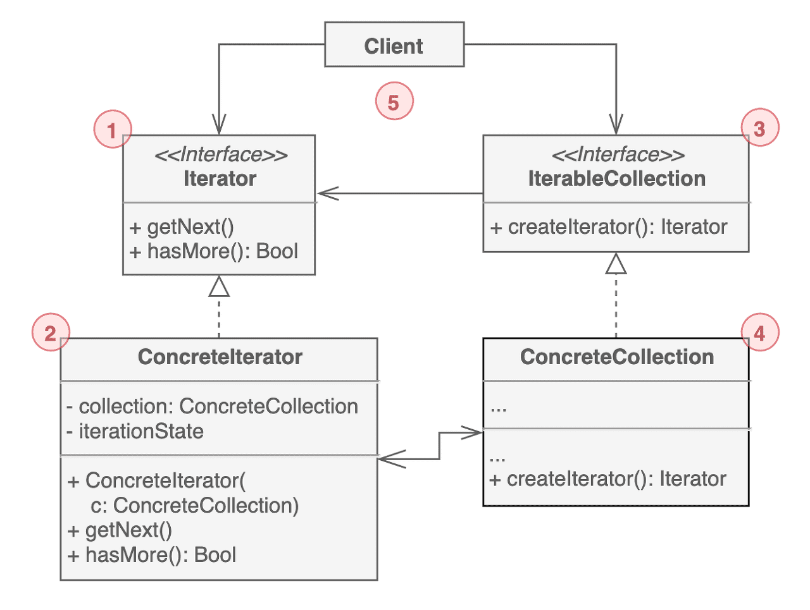

# 옵저버 패턴

- RxJava는 옵저버 패턴을 확장한 구조다
- 옵저버 패턴은 관찰 대상 객체의 상태에 변화가 발생하면 해당 객체를 관찰하는 객체가 변화에 따른 처리 작업을 하는 디자인 패턴이다
- 옵저버 패턴에서는 관찰대상 이 되는 Subject에 이를 관찰하는 Observer를 등록하고, Subject의 상태가 변하면 Subject는 등록된 모든 Observer에 변화가 발생한 사실을 통지하며, Observer는 Subject로부터 통지를 받은 후 변화에 따른 적절한 처리를 한다


> 
> 
> 1. 다른 객체가 구독 중인 `이벤트를 발행`한다. 이러한 이벤트는 발행자가 상태를 변경하거나 특정 동작을 수행할 때 발행한다. 발행자는 현재 구독자 정보, 신규 구독 및 구독 해제를 관리한다. 
> 2. 이벤트가 발생하면 발행자는 `모든 구독자`에게 `알림 메시지를 전달`한다.
> 3. `이벤트 정보 수신`을 위한 `인터페이스`를 정의한다. 대부분의 경우엔 update 메서드 하나만 있고, 파라미터로 이벤트의 상세 정보를 전달하는 방식이다.
> 4. 발행자의 이벤트를 받는 대상이다. `이벤트를 처리`한다.
> 5. 일반적으로 구독자가 이벤트를 제대로 처리하려면 컨텍스트 정보를 필요로 할 때가 있다. 그렇기 때문에 발행자 쪽에서 이벤트를 전달할 때 컨텍스트 정보를 종종 같이 전달한다.
> 6. 발행자와 구독자 객체를 만든 다음에 발행 이벤트에 대한 구독자를 등록한다.

- 옵저버 패턴의 가장 중요한 특징은 관찰 대상인 Subject에 상태 변화가 발생했을 때 Subject 스스로 자신에게 변화가 발생했다고 Observer에 통지한다는 점이다
  - 옵저버 패턴을 사용하지 않는다면 객체가 변화했는지 주기적으로 확인해야한다
- 옵저버 패턴의 또 다른 특징은 관찰 대상인 Subject와 관찰하는 Observer가 분리됐다는 점이다. 이는 Subject의 상태와 상태 변화로 발생하는 처리 작업을 분리할 수 있으며 이에 따라 Subject는 자신의 상태가 변경될 때 어떤 객체가 무엇을 하는지 구체적으로 알 필요가 없다
- RxJava에서 생산자와 소비자 관계에는 당연히 옵저버 패턴이 적용되었다
  - 옵저버 패턴의 Subject를 생산자로, Observer를 소비자로 볼 수 있다
  - RxJava에서는 이벤트나 상태 변화 또한 데이터 스트림으로 표현해 각각의 이벤트와 상태 변화를 시간과 함께 흘러가는 데이터로 다룬다
  - 이렇게 생산자가 일으킨 상태 변화를 데이터로 다루어 소비자에게 통지하면 변화가 발생했을 때 신속한 처리가 가능하다
  - RxJava에서는 상태 변화를 알리는 통지 외에도 처리를 시작할 준비가 됐음을 알리는 통지와 모든 처리가 끝났음을 알리는 완료 통지, 에러가 발생했음을 알리는 에러 통지가 가능하다

# 이터레이터 패턴

- RxJava의 실제 구현은 이터레이터 패턴과 완전히 다른 구조를 가지고 있으나 개념은 이터레이터 패턴이 많은 영향을 주었다
- 이터레이터 패턴은 데이터 집합체에서 순서대로 데이터를 꺼내기 위한 패턴이다
- 이터레이터 패턴은 데이터 집합체에서 데이터를 꺼내는 `Iterator`를 생성하고, 이 Iterator로 데이터를 하나씩 순서대로 얻을 수 있게 한다
  - 이 때 데이터 집합체가 어떤 형태로 데이터를 가지고 있는지는 `Iterator`를 사용하는 측에서 알 필요가 없다
  - `Iterator`를 사용하는 측은 단순히 가져갈 데이터가 더 있는지를 판단하는 `hasNext`메서드를 호출해 데이터가 있다면 `next`메서드로 데이터를 얻고 이 데이터를 사용해 처리 작업을 반복한다

> 
> 
> 1. 컬렉션 `탐색에 필요한 메서드를 선언`한다.
> 2. 컬렉션 `순회`를 위한 특정 알고리즘을 구현한다. 반복자 객체는 자체적으로 순회 진행상태에 대한 정보를 관리해야 한다.
> 3. 컬렉션 인터페이스는 반복자와 상호작용을 위한 메서드를 정의한다. 구체 컬렉션이 다양한 반복자를 반환할 수 있도록 리턴 타입을 인터페이스로 선언한다.
> 4. 구체 컬렉션은 클라이언트가 요청할 때 마다` 특정 반복자 인스턴스를 반환`한다. 
> 5. 반복자와 컬렉션 인터페이스를 사용한다. 구체 클래스와 연결되지 않으므로 동일한 클라이언트 코드로 다양한 컬렉션이나 반복자에 동일하게 사용할 수 있다.

- 이터레이터 패턴에서는 `Iterator`의 `next`메서드를 호출해 현재 `Iterator`가 가리키는 인덱스에 있는 번호를 얻고 인덱스는 다음으로 이동하게 된다. 그리고 `Iteratator`의 `next`를 호출한 측에서는 얻은 데이터로 원하는 처리 작업을 수행한다.
  - 또한 데이터 집합체에 `next` 메서드로 얻을 수 있는 객체가 남아있는지, 즉 모든 데이터를 받았는지를 `Iterator`의 `hasNext` 메서드로 확인한다
- RxJava에서는 생산자 자체가 데이터 집합체이므로 데이터를 순서대로 공흡하는 역할(`Iterator`)이기도 하다
  - 단, RxJava는 이터레이터 패턴처럼 소비자가 데이터를 가져가는 형태 (pull 방식)이 아니라 소비자에게 데이터를 통지하는 형태 (push 방식)이다
  - 이러한 차이가 있으나 데이터를 하나씩 순서대로 처리하는 메커니즘이라는 공통점이 있다
- 이처럼 순서대로 데이터를 통지받는 것은 소비자 내부에서 상태를 다루기 쉽다는 이점이 있다

# 비동기 처리

- 비동기 처리란 어떤 작업을 처리하는 도중에 다른 작업도 처리할 수 있는 방법을 말하며, RxJava는 비동기 처리를 수행하는데 필요한 API를 제공하므로 기존에 구축한 비즈니스 로직에 영향을 주지 않고도 생산자나 소비자의 작업을 비동기로 처리하게 교체할 수 있다
  - 게다가 용도별로 적절히 스레드를 관리하는 클래스를 제공해 직접 스레드를 관리해야 하는 번거로움에서 개발자를 해방하게 한다

## RxJava에서 비동기 처리

- RxJava에서는 개발자가 직접 비동기 처리를 하도록 설정하거나 연산자 내에서 시간을 다루는 작업을 하지 않는 한 생산자의 처리 작업을 실행하는 스레드에서 각 연산자의 처리 작업과 소비자의 처리 작업이 실행된다
  - 즉 생산자가 메인 스레드에서 처리 작업을 하고 있다면 연산자와 소비자의 처리 작업도 메인 스레드에서 실행된다
  - 개발자가 직접 비동기 처리를 하도록 설정하면 생산자와 연산자, 소비자가 처리 작업을 실행할 스레드를 분리할 수 있다
- RxJava에서의 각각의 처리 작업을 같은 스레드에서 처리하면 데이터를 통지하는 측은 데이터를 받아 처리하는 측의 처리 속도에 영향을 받게 된다
  - 특히 데이터를 받는 측의 처리 속도가 느릴 때 데이터를 통지하는 측의 처리 속도에도 영향을 미친다

### 스케줄러

- 스케줄러는 RxJava에서 제공하는 스레드를 관리하는 클래스다. Rxjava에서는 직접 자바 표준 API를 사용하지 않고도 기본으로 스케줄러로 비동기 처리를 할 수 있다
  - 그리고 용도에 따라 몇 가지 스케줄러를 제공하며 Scheduler 클래스의 메서드를 호출해 목적에 맞는 스케줄러를 가져올 수 있다

> 스케줄러를 가져오는 Scheduler의 메서드
> 
> |메서드|반환하는 스케줄러|
> |---|---|
> |computation|연산 처리를 할 때 사용하는 스케줄러로, 논리 프로세서 수와 같은 수만큼 스레드를 캐시한다. I/O처리 작업에는 사용할 수 없다|
> |io|I/O처리 작업을 할 때 사용하는 스케줄러로, 스레드 풀에서 스레드를 가져오며 필요에 따라 새로운 스래드를 만든다|
> |single|싱글 스레드에서 처리 작업을 할 때 사용하는 스케줄러|
> |newThread|매번 새로운 스레드를 생성하는 스캐줄러|
> |from(Executor executor)|지정한 Executor가 생성한 스레드에서 처리 작업을 수행하는 스캐줄러|
> |trampoline|현재 스레드의 큐에 처리 작업을 넣는 스케줄러로, 이미 다른 처리 작업이 큐에 들어 있다면 큐에 들어 있는 작업의 처리가 끝난 뒤에 새로 등록한 처리 작업을 수행한다|
 
- 이 중 computation메서드와 io 메서드로 얻은 스케줄러는 거의 같은 역할을 하며, 호출할 때 스레드 풀에서 서로 다른 스레드를 가져온다
  - 다만 사용 용도가 연산 처리 작업과 I/O처리 작업으로 나뉜다

- RxJava에서는 스케줄러를 별도 설정하지 않고 연산자 내에서도 시간을 다루는 처리 작업을 하지 않는 한 생성된 생산자가 처리 작업을 하는 기본 스레드에서 모든 처리 작업을 수행한다.

### subscribeOn 메서드

- `subscribeOn` 메서드는 생산자의 처리 작업을 어떤 스케줄러에서 실행할지를 설정하는 메서드다
  - 이 때 생산자란 최초로 데이터를 생성해 통지하는 원본이 되는 Flowable/Observable이다
- `subscribeOn` 메서드는 생산자가 처리 작업을 할 스케줄러를 설정할 때 사용하므로 최초 1회만 설정할 수 있다
  - `subscribeOn` 메서드로 스케줄러를 설정하고 나면 그보다 뒤에 설정한 `subscribeOn`의 스케줄러는 무시된다

```java
public static void main(String[] args) throws Exception {
    Flowable.just(1, 2, 3, 4, 5) // Flowable 설정
        .subscribeOn(Schedulers.computation()) // RxComputationThreadPool
        .subscribeOn(Schedulers.io()) // RxCachedThreadScheduler
        .subscribeOn(Schedulers.single()) // RxSingleScheduler
        .subscribe(data -> {
        String threadName = Thread.currentThread().getName();
        System.out.println(threadName + ": " + data);
        });

    // 잠시 기다린다
    Thread.sleep(500);
}
```

### observeOn 메서드

- `observeOn` 메서드는 데이터를 받는 측의 처리 작업을 어떤 스케줄러에서 실행할지를 설정하는 메서드며, `observeOn` 메서드로 지정한 스케줄러가 설정한 스레드에서 이후 처리 작업을 수행한다
  - `observeOn` 메서드로가 데이터를 받는 측의 스케줄러를 지정하기 때문에 연산자마다 서로 다른 스케줄러를 지정할 수 있다

- `observeOn` 메서드는 스케줄러만을 인자로 받기도 하며, 그 외에도 에러 발생 통지 옵션이나 버퍼 크기를 설정할 수 있다.
  - 따로 설정하지 않을 시 기본값이 들어간다
  - `observeOn(Scheduler scheduler)`
  - `observeOn(Scheduler scheduler, Boolean delayError)`
  - `observeOn(Scheduler scheduler, Boolean delayError, int bufferSize)`

> `observeOn` 메서드의 인자
> 
> |인자 타입|설명|
> |---|---|
> |Scheudler|스레드를 관리하는 스케줄러 클래스|
> |boolean|true일때는 에러가 발생해도 이를 즉시 통지하지 않고 버퍼에 담긴 데이터를 모두 통지한 후에 에러를 통지한다. false일 경우는 에러가 발생하면 바로 통지한다. 기본값은 false다|
> |int|통지를 기다리는 데이터를 버퍼에 담는 크기. 기본값은 128이다|
> 
> - RxJava에서 배압을 적용할 때 세번째 인자가 중요한데, 이는 버퍼를 담긴 통지 대기 데이터에서 인자 크기만큼 소비자에게 통지할 데이터를 꺼내기 때문이다.
>   - 실제로는 자동으로 생산자에게 인자에 지정한 수치를 데이터 개수로 요청하며, 이 요청으로 받은 데이터를 버퍼에 쌓아둔다.
>   - 즉 '2'를 지정하면 내부에서 request(2)가 실행된다

## 연산자 내에서 생성되는 비동기 Flowable/Observable

- RxJava의 메서드 중에는 `flatMap` 메서드처럼 연산자 내부에서 `Flowable/Observable`을 생성하고 이를 시작한 뒤 데이터를 통지하는 메서드가 있다
  - 이때 생성힌 `Flowable/Observable`을 별도의 스레드에서 실행하면 데이터를 받아 생성한 `Flowable/Observable`이 시작될 때까지는 `flatMap` 메서드가 데이터를 받은 순서대로 실행되지만, 일단 `Flowable/Observable`이 시작되면 그 뒤로는 각자 다른 스레드에서 처리 작업을 수행한다
  - 즉 사용하는 메서드에 따라 여러 `Flowable/Observable`을 서로 다른 스레드에서 동시에 실행한다는 뜻이다.

### `flatMap` 메서드

- 데이터를 받으면 새로운 `Flowable/Observable`을 생성하고 이를 실행해 여기에서 통지되는 데이터를 결과물로 통지하는 연산자다
- 데이터가 연속적으로들어오고 이를 통해 생성되는 `Flowable/Observable`이 별도의 스레드에서 처리되고 최종적으로 통지되는 데이터는 데이터를 받은 순서와는 달라질 수 있다

### `concatMap` 메서드

- `concatMap` 메서드는 받은 데이터로 메서드 내부에 `Flowable/Observable`을 생성하고, 이 `Flowable/Observable`을 하나씩 순서대로 싱행해 통지된 데이터를 그 결과물로 통지하는 연산자다
- 이 과정에서 생성되는 `Flowable/Observable`은  각각 다른 스레드에서 처리해도 이에 영항을 받지 않고 새로 생성한 `Flowable/Observable`의 처리 데이터를 받은 순서대로 통지한다

### `concatMapEager` 메서드

- concatMapEager 메서드는 데이터를 받으면 새로운 Flowable/Observable을 생성하고 이를 즉시 실행해 그 결과로 받은 데이터를 원본 데이터 순서대로 통지하는 연산자다
  - 이때 생성한 `Flowable/Observable`이 서로 다른 스레드에서 실행된다면 생성한 `Flowable/Observable`은 `flatMap`메서드 때처럼 동시에 실행된다. 하지만 결과로 통지되는 데이터는 `concatMap` 메서드와 같이 원본 데이터 순서대로 통지된다

---

## 다른 스레드 간 공유되는 객체

- RxJava는 Reactive Streams 규칙과 Obsrvable 규약에 따라 구현하는 한 쉽게 비동기처리를 할 수 있다. 하지만 생산자와 소비자가 아닌 외부에서도 공유되는 객체를 다룰 때는 RxJava가 보장하는 순차성을 잃게될 수 있다

--- 

# 에러 처리

- 에러 중에서는 더 이상 처리 작업을 하지 않게 멈춰야 하는 에러가 있기도 하며, 회복 가능한 에러도 있고, 에러 통지에 따라 정상적으로 프로그램을 종료해야 할 때도 있다. 에러가 발생했을 때 RxJava가 제공하는 에러 처리는 크게 세가지가 있다
  - 소비자 (`Subscriber/Observer`)에게 에러 통지하기
  - 처리 작업 재시도 (retry)
  - 대체 데이터 통지

## 소비자에게 에러 통지하기

- RxJava는 지금까지 알아본 것처럼 통지 처리 중에 에러가 발생하면 소비자에게 에러를 통지해 이 에러 통지를 받은 소비자가 에러에 대응하는 메커니즘을 제공한다. 또한 명시적으로 에러 통지 기능을 구현하지 않아도 처리 도중에 에러가 발생하면 에러를 던지고 처리를 중단하는 것이 아니라 기본적으로 소비자에게 발생한 에러를 통지하게 이루어져 있다. 이는 특히 비동기 처리 중에 발생한 에러가 주 처리 작업을 수행하는 스레드에 반드시 전달되도록 에러 객체가 담긴 에러 메시지를 소비자에게 통지해 적절한 에러 처리를 하게 한다
- 참고로 에러 통지 시 어떤 처리를 할지 설정하지 않은 subscribe 메서드(`subscribe(onNex)`로 구독할 때는 에러가 발생해도 이 에러의 스택 트레이스만 출력할 뿐 별도의 에러 처리를 하지 않는다. 그래서 에러가 발생했다는 것을 인식하지 못해 아무런 에러 처리를 없이 그대로 구독 후의 처리 작업을 진행하게 되므로 주의해야 한다

## 처리 재시도

- 에러에 따라서는 순간적인 네트워크 중단과 같이 재실행하면 정상적인 처리를 할 수 있을 때도 있다 이와 같은 에러를 처리하고자 RxJava는 에러가 발생하면 생산자의 처리 작업을 처음부터 다시 시도함으로써 에러 상황에서 회복해 정상적인 결과를 얻는 방법을 제공한다. 이때는 소비자에게 에러를 통지하지 않는다
- 이러한 대응 작업을 위해 RxJava는 retry 라는 에러 발생 시 재실행하는 메서드를 제공한다. 이 재시도를 통한 에러 처리는 네트워크가 순산적으로 중단돼 처리 작업이 실패해도 다시 실행하면 올바른 결과를 얻을 수 있을 때 유용하다

> **주요 재시도 연산자**
> 
> - `retry(long times)`
> - `retry(Predicate<? super Throwable> predicate)`
> - `retry(long times, Predicate<? super Throwable> predicate)`
> - `retryUtil(BooleanSupplier stop)`
> - `retryWhen(Function<? super Flowable/Observable<Throwable>, ? extends Publisher/ObservableSource<?>> handler)`

- retry : 재시도 횟수, 재시도 할지 여부 판단하는 함수형 인터페이스 등의 인자를 받는다
- retryUntil : 재시도를 반정하는 함수형 인터페이스를 인자로 받아 이 함수형 인터페이스가 false를 반환할 때만 재시도하는 연산자
  - true를 반환하면 재시도를 하지 않고, 에러를 통지한다
- retryWhen : 재시도하기 위한 `Flowable/Observable`을 생성하는 함수형 인터페이스를 인자로 받아 재시도할지를 제어하는 연산자

## 대체 데이터 통지

- 에러가 발생하면 대체 데이터를 통지해 처리 작업을 에러로 끝내지 않고 완료하게 하는 에러 처리 방법도 있다. RxJava는 이를 위한 메서드를 제공하는데 `onError`나 `onException`으로 시작하는 메서드가 이에 해당한다.
  - 이러한 메서드를 사용하면 에러가 발생했을 때 소비자에게 에러를 통지하지 않고 대체 데이터나 `Flwoable/Observable`에 있는 데이터를 통지해 처리 작업을 실행하고 마지막으로 완료를 통지해 작업을 정상적으로 종료할 수 있다


> **에러가 발생했을 때 대체 데이터를 통지하는 주요 연산자**
>
> - `onErrorReturnItem(T item)`
> - `onErrorReturn(Function<? super Throwable, ? extends T> valueSupplier)`
> - `onErrorResumeNext(Publisher/ObservableSource<? extends T> next)`
> - `onErrorResumeNext(Function<? super Throwable, ? extends Publisher/ObservableSource<? extends T>> resumeFunction)`
> - `onExceptionResumeNext(Publisher/ObservableSource<? extends T> next)`

- onErrorReturnItem, onErrorReturn : 에러 발생 시 에러를 통지하지 않고 대체 데이터를 통지해 완료하는 연산자
- onErrorResumeNext : 에러 발생 시 에러를 통지하지 않는 대신 `Flowable/Observable`을 생성해 데이터를 통지하는 연산자. 이 메서드는 생성한 `Flowable/Observable`이 데이터를 통지한 뒤로 완료 통지 대신 에러를 통지해 에러로 종료하게 한다
- onExceptionResumeNext : Exception이나 Exception을 상속받은 예외일 때만 대체 `Flowable/Observable` 데이터를 통지하는 연산자. Error등 Exception이 아닌 에러는 그대로 에러로 통지한다