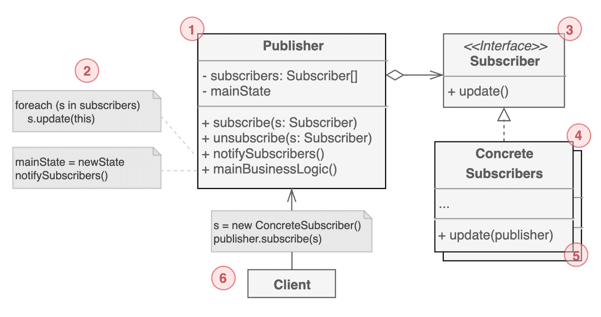

# 옵저버 패턴

- RxJava는 옵저버 패턴을 확장한 구조다
- 옵저버 패턴은 관찰 대상 객체의 상태에 변화가 발생하면 해당 객체를 관찰하는 객체가 변화에 따른 처리 작업을 하는 디자인 패턴이다
- 옵저버 패턴에서는 관찰대상 이 되는 Subject에 이를 관찰하는 Observer를 등록하고, Subject의 상태가 변하면 Subject는 등록된 모든 Observer에 변화가 발생한 사실을 통지하며, Observer는 Subject로부터 통지를 받은 후 변화에 따른 적절한 처리를 한다

> 
> 
> 1. 다른 객체가 구독 중인 `이벤트를 발행`한다. 이러한 이벤트는 발행자가 상태를 변경하거나 특정 동작을 수행할 때 발행한다. 발행자는 현재 구독자 정보, 신규 구독 및 구독 해제를 관리한다. 
> 2. 이벤트가 발생하면 발행자는 `모든 구독자`에게 `알림 메시지를 전달`한다.
> 3. `이벤트 정보 수신`을 위한 `인터페이스`를 정의한다. 대부분의 경우엔 update 메서드 하나만 있고, 파라미터로 이벤트의 상세 정보를 전달하는 방식이다.
> 4. 발행자의 이벤트를 받는 대상이다. `이벤트를 처리`한다.
> 5. 일반적으로 구독자가 이벤트를 제대로 처리하려면 컨텍스트 정보를 필요로 할 때가 있다. 그렇기 때문에 발행자 쪽에서 이벤트를 전달할 때 컨텍스트 정보를 종종 같이 전달한다.
> 6. 발행자와 구독자 객체를 만든 다음에 발행 이벤트에 대한 구독자를 등록한다.

- 옵저버 패턴의 가장 중요한 특징은 관찰 대상인 Subject에 상태 변화가 발생했을 때 Subject 스스로 자신에게 변화가 발생했다고 Observer에 통지한다는 점이다
  - 옵저버 패턴을 사용하지 않는다면 객체가 변화했는지 주기적으로 확인해야한다
- 옵저버 패턴의 또 다른 특징은 관찰 대상인 Subject와 관찰하는 Observer가 분리됐다는 점이다. 이는 Subject의 상태와 상태 변화로 발생하는 처리 작업을 분리할 수 있으며 이에 따라 Subject는 자신의 상태가 변경될 때 어떤 객체가 무엇을 하는지 구체적으로 알 필요가 없다
- RxJava에서 생산자와 소비자 관계에는 당연히 옵저버 패턴이 적용되었다
  - 옵저버 패턴의 Subject를 생산자로, Observer를 소비자로 볼 수 있다
  - RxJava에서는 이벤트나 상태 변화 또한 데이터 스트림으로 표현해 각각의 이벤트와 상태 변화를 시간과 함께 흘러가는 데이터로 다룬다
  - 이렇게 생산자가 일으킨 상태 변화를 데이터로 다루어 소비자에게 통지하면 변화가 발생했을 때 신속한 처리가 가능하다
  - RxJava에서는 상태 변화를 알리는 통지 외에도 처리를 시작할 준비가 됐음을 알리는 통지와 모든 처리가 끝났음을 알리는 완료 통지, 에러가 발생했음을 알리는 에러 통지가 가능하다

# 이터레이터 패턴

- RxJava의 실제 구현은 이터레이터 패턴과 완전히 다른 구조를 가지고 있으나 개념은 이터레이터 패턴이 많은 영향을 주었다
- 이터레이터 패턴은 데이터 집합체에서 순서대로 데이터를 꺼내기 위한 패턴이다
- 이터레이터 패턴은 데이터 집합체에서 데이터를 꺼내는 `Iterator`를 생성하고, 이 Iterator로 데이터를 하나씩 순서대로 얻을 수 있게 한다
  - 이 때 데이터 집합체가 어떤 형태로 데이터를 가지고 있는지는 `Iterator`를 사용하는 측에서 알 필요가 없다
  - `Iterator`를 사용하는 측은 단순히 가져갈 데이터가 더 있는지를 판단하는 `hasNext`메서드를 호출해 데이터가 있다면 `next`메서드로 데이터를 얻고 이 데이터를 사용해 처리 작업을 반복한다

> 
> 
> 1. 컬렉션 `탐색에 필요한 메서드를 선언`한다.
> 2. 컬렉션 `순회`를 위한 특정 알고리즘을 구현한다. 반복자 객체는 자체적으로 순회 진행상태에 대한 정보를 관리해야 한다.
> 3. 컬렉션 인터페이스는 반복자와 상호작용을 위한 메서드를 정의한다. 구체 컬렉션이 다양한 반복자를 반환할 수 있도록 리턴 타입을 인터페이스로 선언한다.
> 4. 구체 컬렉션은 클라이언트가 요청할 때 마다` 특정 반복자 인스턴스를 반환`한다. 
> 5. 반복자와 컬렉션 인터페이스를 사용한다. 구체 클래스와 연결되지 않으므로 동일한 클라이언트 코드로 다양한 컬렉션이나 반복자에 동일하게 사용할 수 있다.

- 이터레이터 패턴에서는 `Iterator`의 `next`메서드를 호출해 현재 `Iterator`가 가리키는 인덱스에 있는 번호를 얻고 인덱스는 다음으로 이동하게 된다. 그리고 `Iteratator`의 `next`를 호출한 측에서는 얻은 데이터로 원하는 처리 작업을 수행한다.
  - 또한 데이터 집합체에 `next` 메서드로 얻을 수 있는 객체가 남아있는지, 즉 모든 데이터를 받았는지를 `Iterator`의 `hasNext` 메서드로 확인한다
- RxJava에서는 생산자 자체가 데이터 집합체이므로 데이터를 순서대로 공흡하는 역할(`Iterator`)이기도 하다
  - 단, RxJava는 이터레이터 패턴처럼 소비자가 데이터를 가져가는 형태 (pull 방식)이 아니라 소비자에게 데이터를 통지하는 형태 (push 방식)이다
  - 이러한 차이가 있으나 데이터를 하나씩 순서대로 처리하는 메커니즘이라는 공통점이 있다
- 이처럼 순서대로 데이터를 통지받는 것은 소비자 내부에서 상태를 다루기 쉽다는 이점이 있다

