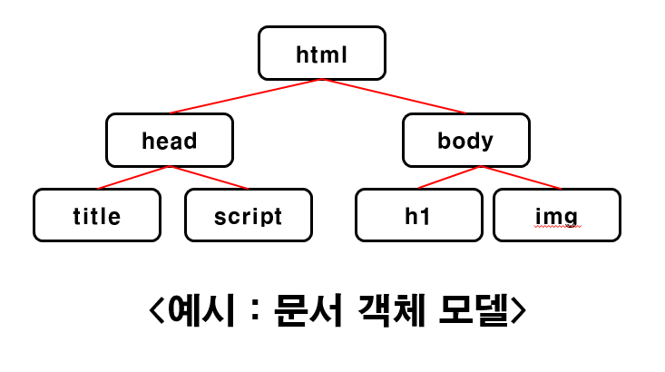
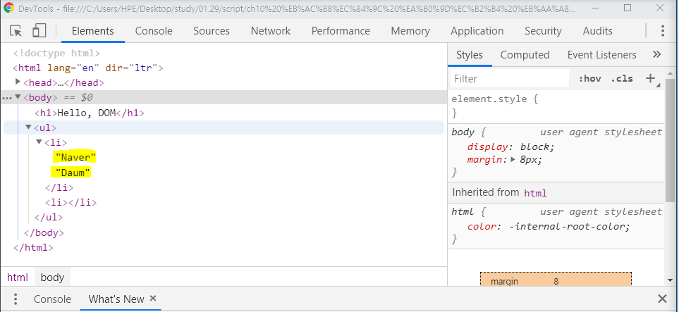
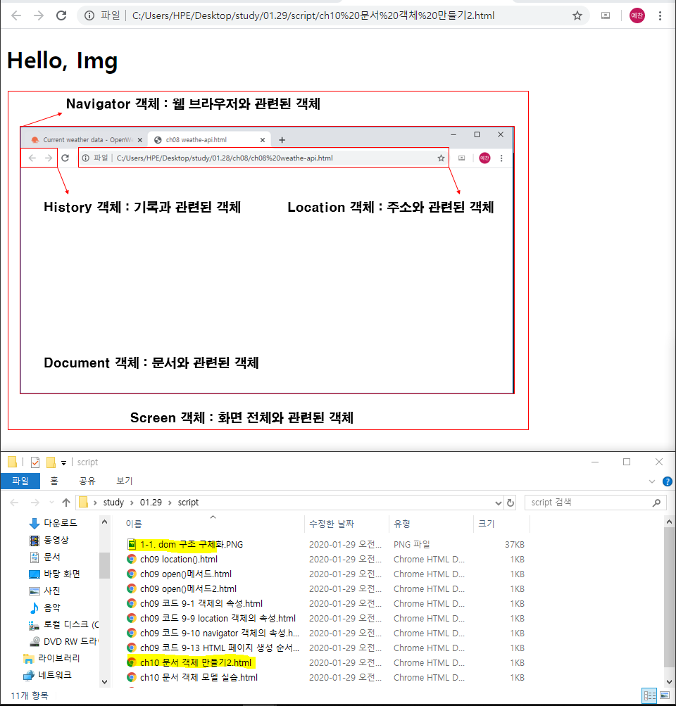

# Javascript - chapter 10 문서 객체 모델


## 10.1 문서 객체 모델과 관련된 용어 정리

* 문서 객체 : HTML 페이지에 존재하는 태그를 자바스크립트에서 이용할 수 있는 객체로 만든 것이 문서 객체이다 



## 10.2 문서 객체 만들기 1

* body 태그 구성

```html
<body>
    
</body>
```

* document 객체의 노드 생성 메서드

```html
1. createElement(tagName) : 요소 노드를 생성
2. createTextNode(text) : 텍스트 노드를 생성
```

* 문서 객체의 연결 메서드

```html
1. aapendChild(node) : 객체에 노드를 연결
```

#### 예제 : document

```html
<!DOCTYPE html>
<html lang="en" dir="ltr">
  <head>
    <meta charset="utf-8">
    <script type="text/javascript">
     
        let h1_tag = document.createElement("h1");
        let greeting_text = document.createTextNode("Hi, there");
        h1_tag.appendChild(greeting_text);
        document.body.appendChild(h1_tag);

    </script>
  </head>
  <body>
    <h1>Hello, DOM</h1>
  </body>
</html>

```


#### 해결 - 예제 : document

* 방법 1

```html
<!DOCTYPE html>
<html lang="en" dir="ltr">
  <head>
    <meta charset="utf-8">
    <script type="text/javascript">
      window.onload = function(){
        let h1_tag = document.createElement("h1");
        let greeting_text = document.createTextNode("Hi, there");
        h1_tag.appendChild(greeting_text);
        document.body.appendChild(h1_tag);
      };

    </script>
  </head>
  <body>
    <h1>Hello, DOM</h1>
  </body>
</html>

```

* 결과 - 방법1


* 방법 2

```html
<!DOCTYPE html>
<html lang="en" dir="ltr">
  <head>
    <meta charset="utf-8">
  </head>
  <body>
    <h1>Hello, DOM</h1>
    <script type="text/javascript">
      let h1_tag = document.createElement("h1");
      let greeting_text = document.createTextNode("Hi, there");
      h1_tag.appendChild(greeting_text);
      document.body.appendChild(h1_tag);
    </script>
  </body>
</html>

```

* 결과 - 방법 2


#### 실습 : document

```html
<body>
    <h1>Hello, DOM</h1>
</body>

body 부분에 daum과 naver가 추가되어 나타날 수 있도록 코드 작성
```


#### 결과 - 실습 : document

```html
<!DOCTYPE html>
<html lang="en" dir="ltr">
  <head>
    <meta charset="utf-8">
    <script type="text/javascript">
      window.onload = function(){
      let _ul = document.createElement("ul");
      let _li1 = document.createElement("li");
      let _li2 = document.createElement("li");
      let _naver = document.createTextNode("Naver");
      let _daum = document.createTextNode("Daum");

      _li1.appendChild(_naver);
      _li1.appendChild(_daum);

      _ul.appendChild(_li1);
      _ul.appendChild(_li2);

      document.body.appendChild(_ul);
    };
    </script>
  </head>
  <body>
    <h1>Hello, DOM</h1>

  </body>
</html>

```




## 10.3 문서 객체 만들기 2

#### 예제 : 문서 객체 만들기2

```html
<!DOCTYPE html>
<html lang="en" dir="ltr">
  <head>
    <meta charset="utf-8">
    <script type="text/javascript">
      window.onload = function(){
      let myImg = document.createElement("img");
      myImg.src ="1-1. dom 구조 구체화.PNG";
      myImg.width = 745;
      myImg.height = 487;
      document.body.appendChild(myImg);
    };
    </script>
  </head>
  <body>
    <h1>Hello, Img</h1>

  </body>
</html>
```

#### 결과 - 예제 : 문서 객체 만들기2




* 문서 객체의 속성 메서드

```html
1. setAttribute(name,value) : 객체의 속성을 지정한다
2. getAttribute(name) : 객체의 속성을 가져온다
```

#### 예제 : 문서 객체 속성 메서드

```html
<!DOCTYPE html>
<html lang="en" dir="ltr">
  <head>
    <meta charset="utf-8">
    <script type="text/javascript">
     window.onload = function(){
       let _ul = document.reateElement("ul");
       let _li1 = document.createElement("li");
       let _li2 = document.createElement("li");
       let _naver = document.createTextNode("Naver");
       let _daum = document.createTextNode("Daum");

       _li1.appendChild(_naver);
       _li1.appendChild(_daum);

       _ul.appendChild(_li1);
       _ul.appendChild(_li2);

       document.body.appendChild(_ul);

       let myImg = document.createElement("img");
       myImg.src ="1-1. dom 구조 구체화.PNG";
       myImg.width = 745;
       myImg.height = 487;


       document.body.appendChild(myImg);

       let div1 = document.getElementById("myDiv1");
       div1.innerHTML = "<h1 style='color: blue;'> Hello, PARK. Hi, Document</h1>"
   
     }
    </script>
  </head>
  <body>
    <h1>Hello, DOM</h1>
    <div id="myDiv1">

    </div>
  </body>
</html>

```

#### 결과 - 예제 : 문서 객체 속성 메서드


* 


## 10.4 문서 객체 만들기 3

* 문서 객체의 innerHTML 속성

```html
<h 여는 태그 no.> innerHTML 속성</h 닫는 태그 no.>
```


## 10.5 문서 객체 가져오기 1

* document 객체의 문서 객체 선택 메서드(1)

```html
1. getElementById(id) : 태그의 id 속성이 id 매개변수와 일치하는 문서 객체를 가져온다.
```


* `innerHTML` 과 `innerText` 비교 

#### 예제 : innerHTML 과 innerText 비교

```html
<!DOCTYPE html>
<html lang="en" dir="ltr">
  <head>
    <meta charset="utf-8">
    <script type="text/javascript">
     window.onload = function(){
       let div1 = document.getElementById("myDiv1");
       div1.innerHTML = "<h1 style='color: blue;'> Hello, PARK. Hi, Document</h1>"


       let div2 = document.getElementById("myDiv2");

       div2.innerText = "<h1 style='color: blue;'> Hello, PARK. Hi, Document</h1>"
     }
    </script>
  </head>
  <body>
    <h1>Hello, innerHTML 과 innerText 비교</h1>
    <div id="myDiv1"></div>
    <div id="myDiv2"></div>
  </body>
</html>

```

#### 결과 - 예제 : innerHTML과 innerText 비교


## 10.6 문서 객체 가져오기 2

* document 객체의 문서 객체 선택 메서드(2)

```html
1. getElementsByName(name) : 태그의 name 속성이 name 매개변수와 일치하는 문서 객체를 배열로 가져온다.
2. getElementsByTagName(tagName) : tagName 매개변수와 일치하는 문서 객체를 배열로 가져온다.
```

* 문서 객체 배열에 `for in` 반복문을 사용하면 안되는 이유 : for in 반복문을 사용하면 문서 객체 이외의 속성에도 접근하기 때문이다

## 10.7 문서 객체 가져오기 3

* document 객체의 문서 객체 선택 메서드(3)

```html
1. querySelector(선택자) ; 선택자로 가장 처음 선택되는 문서 객체를 가져온다
2. querySelectorAll(선택자) : 선택자를 통해 선택되는 문서 객체를 배열로 가져온다
```


## 10.8 문서 객체의 스타일 조작

* `style`속성 : style 속성을 사용해 해당 문서 객체의 스타일을 변경할 수 있다.

```html
<body>
   	<h1 id="header">
        header
    </h1>
</body>
```

* 자바스크립트와 특수 기호  `-` 의 관계 : 자바스크립트는 특수 기호 `-`를 식별자에 사용할 수 없다. 따라서 특수 기호 `-`으로 끊긴 단어의 첫 글자를 대문자로 변경하여 사용한다

```html
예시) 
background-image : backgroundImage
box-sizing : boxSizing
```


## 10.9 문서 객체 제거

* 문서 객체의 제거 메서드

```html
1. removeChild(child) : 문서 객체의 자식 노드를 제거한다
```

* 문서 객체의 제거 메서드 body 태그 구성

``` html
<body>
    <h1 id="will-remove">
        Header
    </h1>
</body>
```


## 10.10 조금 더 나아가기

### (1) 문서 객체를 사용한 시계

* 시계 태그 구성

```html
<body>
    <h1 id="clock">
        
    </h1>
</body>
```

#### 코드 10-27 현재 시각 표시

```html
<!DOCTYPE html>
<html lang="en" dir="ltr">
  <head>
    <meta charset="utf-8">
    <title></title>
    <script>
      window.onload = () => {
        let clock = document.getElementById('clock');

        setInterval(function () {
          clock.innerHTML = new Date().toString();
        } ,1000);

        clock.onclick = function() {
          clock.style = "color : white;"
          clock.style.backgroundColor = "black";
        };
      };
    </script>
  </head>
  <body>
    <h1 id="clock">

    </h1>
  </body>
</html>

```

#### 결과 - 코드 10-27 : 현재 시각 표시


### (2) 문서 객체를 사용한 움직임 구현


### (3) 문서 객체와 객체지향을 사용한 움직임 구현


## 연습문제

```
https://home.openweathermap.org/api_keys 865c62f6861d5ab52acc61f98076a9dd
```