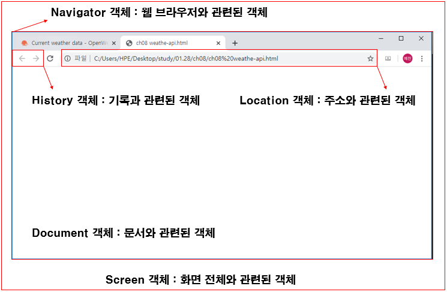
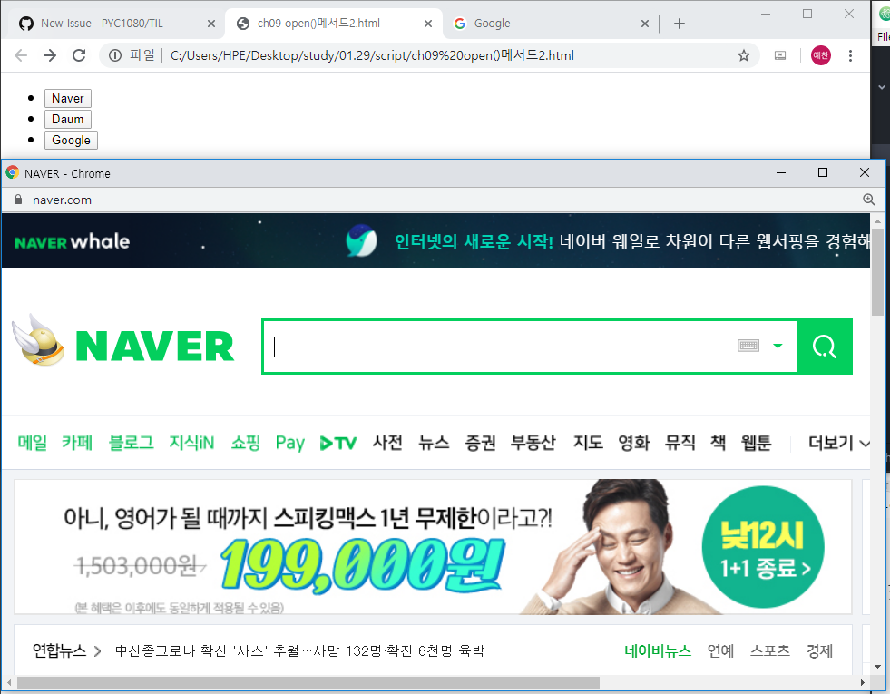
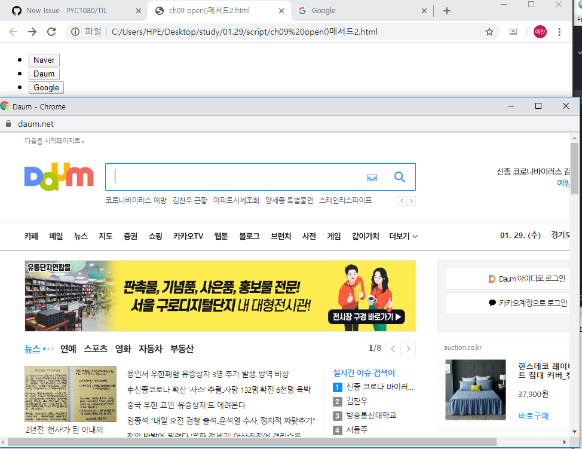
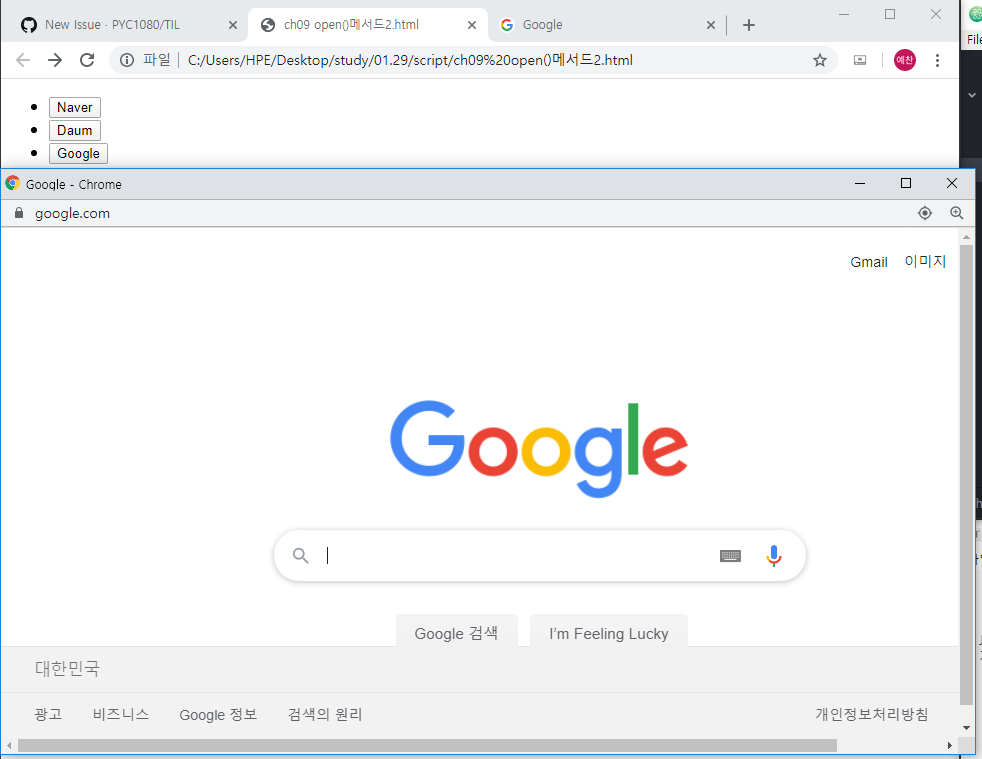
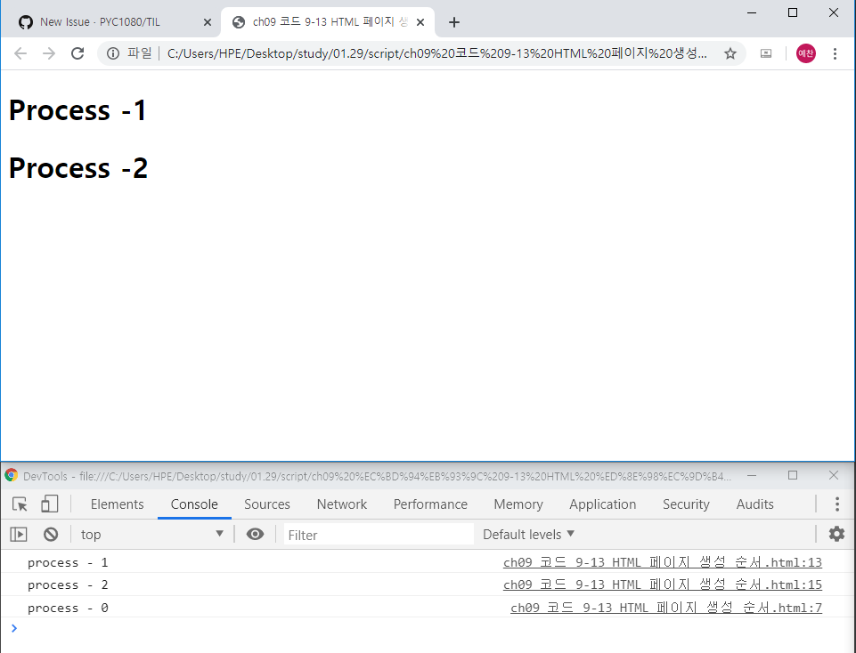

# Javascript - chapter 09 브라우저 객체 모델


## 9.1 브라우저 관련 객체

* 브라우저 객체 모델(BOM, Browser Object Model) : 웹 브라우저와 관련된 객체의 집합



## 9.2 window 객체

#### 코드 9-1 window 객체의 속성

```html
<!DOCTYPE html>
<html lang="en" dir="ltr">
  <head>
    <meta charset="utf-8">
    <script type="text/javascript">
      let output = '';
      for (let key in window){
        output += '★ '+ key + ': '+ window[key] + '\n';
      }
      console.log(output);
    </script>
  </head>
  <body>

  </body>
</html>

```

#### 결과 - 코드 9-1 window 객체의 속성

```html
ch09 코드 9-1 객체의 속성.html:8 [Deprecation] 'window.webkitStorageInfo' is deprecated. Please use 'navigator.webkitTemporaryStorage' or 'navigator.webkitPersistentStorage' instead.
(anonymous) @ ch09 코드 9-1 객체의 속성.html:8
ch09 코드 9-1 객체의 속성.html:10 ★ parent: [object Window]
★ opener: null
★ top: [object Window]
★ length: 0
★ frames: [object Window]
★ closed: false
★ location: file:///C:/Users/HPE/Desktop/study/01.29/script/ch09%20%EC%BD%94%EB%93%9C%209-1%20%EA%B0%9D%EC%B2%B4%EC%9D%98%20%EC%86%8D%EC%84%B1.html
★ self: [object Window]
★ window: [object Window]
★ document: [object HTMLDocument]
★ name: 
★ customElements: [object CustomElementRegistry]
★ history: [object History]
★ locationbar: [object BarProp]
★ menubar: [object BarProp]
★ personalbar: [object BarProp]
★ scrollbars: [object BarProp]
★ statusbar: [object BarProp]
★ toolbar: [object BarProp]
★ status: 
★ frameElement: null
★ navigator: [object Navigator]
★ origin: null
★ external: [object External]
★ screen: [object Screen]
★ innerWidth: 958
★ innerHeight: 439
★ scrollX: 0
★ pageXOffset: 0
★ scrollY: 0
★ pageYOffset: 0
★ visualViewport: [object VisualViewport]
★ screenX: -7
★ screenY: 0
★ outerWidth: 974
★ outerHeight: 527
★ devicePixelRatio: 1
★ clientInformation: [object Navigator]
★ screenLeft: -7
★ screenTop: 0
★ defaultStatus: 
★ defaultstatus: 
★ styleMedia: [object StyleMedia]
★ onsearch: null
★ onwebkitanimationend: null
★ onwebkitanimationiteration: null
★ onwebkitanimationstart: null
★ onwebkittransitionend: null
★ isSecureContext: true
★ onabort: null
★ onblur: null
★ oncancel: null
★ oncanplay: null
★ oncanplaythrough: null
★ onchange: null
★ onclick: null
★ onclose: null
★ oncontextmenu: null
★ oncuechange: null
★ ondblclick: null
★ ondrag: null
★ ondragend: null
★ ondragenter: null
★ ondragleave: null
★ ondragover: null
★ ondragstart: null
★ ondrop: null
★ ondurationchange: null
★ onemptied: null
★ onended: null
★ onerror: null
★ onfocus: null
★ oninput: null
★ oninvalid: null
★ onkeydown: null
★ onkeypress: null
★ onkeyup: null
★ onload: null
★ onloadeddata: null
★ onloadedmetadata: null
★ onloadstart: null
★ onmousedown: null
★ onmouseenter: null
★ onmouseleave: null
★ onmousemove: null
★ onmouseout: null
★ onmouseover: null
★ onmouseup: null
★ onmousewheel: null
★ onpause: null
★ onplay: null
★ onplaying: null
★ onprogress: null
★ onratechange: null
★ onreset: null
★ onresize: null
★ onscroll: null
★ onseeked: null
★ onseeking: null
★ onselect: null
★ onstalled: null
★ onsubmit: null
★ onsuspend: null
★ ontimeupdate: null
★ ontoggle: null
★ onvolumechange: null
★ onwaiting: null
★ onwheel: null
★ onauxclick: null
★ ongotpointercapture: null
★ onlostpointercapture: null
★ onpointerdown: null
★ onpointermove: null
★ onpointerup: null
★ onpointercancel: null
★ onpointerover: null
★ onpointerout: null
★ onpointerenter: null
★ onpointerleave: null
★ onselectstart: null
★ onselectionchange: null
★ onanimationend: null
★ onanimationiteration: null
★ onanimationstart: null
★ ontransitionend: null
★ onafterprint: null
★ onbeforeprint: null
★ onbeforeunload: null
★ onhashchange: null
★ onlanguagechange: null
★ onmessage: null
★ onmessageerror: null
★ onoffline: null
★ ononline: null
★ onpagehide: null
★ onpageshow: null
★ onpopstate: null
★ onrejectionhandled: null
★ onstorage: null
★ onunhandledrejection: null
★ onunload: null
★ performance: [object Performance]
★ stop: function stop() { [native code] }
★ open: function open() { [native code] }
★ alert: function alert() { [native code] }
★ confirm: function confirm() { [native code] }
★ prompt: function prompt() { [native code] }
★ print: function print() { [native code] }
★ queueMicrotask: function queueMicrotask() { [native code] }
★ requestAnimationFrame: function requestAnimationFrame() { [native code] }
★ cancelAnimationFrame: function cancelAnimationFrame() { [native code] }
★ captureEvents: function captureEvents() { [native code] }
★ releaseEvents: function releaseEvents() { [native code] }
★ requestIdleCallback: function requestIdleCallback() { [native code] }
★ cancelIdleCallback: function cancelIdleCallback() { [native code] }
★ getComputedStyle: function getComputedStyle() { [native code] }
★ matchMedia: function matchMedia() { [native code] }
★ moveTo: function moveTo() { [native code] }
★ moveBy: function moveBy() { [native code] }
★ resizeTo: function resizeTo() { [native code] }
★ resizeBy: function resizeBy() { [native code] }
★ scroll: function scroll() { [native code] }
★ scrollTo: function scrollTo() { [native code] }
★ scrollBy: function scrollBy() { [native code] }
★ getSelection: function getSelection() { [native code] }
★ find: function find() { [native code] }
★ webkitRequestAnimationFrame: function webkitRequestAnimationFrame() { [native code] }
★ webkitCancelAnimationFrame: function webkitCancelAnimationFrame() { [native code] }
★ fetch: function fetch() { [native code] }
★ btoa: function btoa() { [native code] }
★ atob: function atob() { [native code] }
★ setTimeout: function setTimeout() { [native code] }
★ clearTimeout: function clearTimeout() { [native code] }
★ setInterval: function setInterval() { [native code] }
★ clearInterval: function clearInterval() { [native code] }
★ createImageBitmap: function createImageBitmap() { [native code] }
★ close: function close() { [native code] }
★ focus: function focus() { [native code] }
★ blur: function blur() { [native code] }
★ postMessage: function postMessage() { [native code] }
★ onappinstalled: null
★ onbeforeinstallprompt: null
★ crypto: [object Crypto]
★ indexedDB: [object IDBFactory]
★ webkitStorageInfo: [object DeprecatedStorageInfo]
★ sessionStorage: [object Storage]
★ localStorage: [object Storage]
★ chrome: [object Object]
★ onformdata: null
★ onpointerrawupdate: null
★ speechSynthesis: [object SpeechSynthesis]
★ webkitRequestFileSystem: function () { [native code] }
★ webkitResolveLocalFileSystemURL: function () { [native code] }
★ openDatabase: function () { [native code] }
★ applicationCache: [object ApplicationCache]
★ caches: [object CacheStorage]
★ ondevicemotion: null
★ ondeviceorientation: null
★ ondeviceorientationabsolute: null
★ TEMPORARY: 0
★ PERSISTENT: 1
★ addEventListener: function addEventListener() { [native code] }
★ removeEventListener: function removeEventListener() { [native code] }
★ dispatchEvent: function dispatchEvent() { [native code] }

```


## 9.3 새로운 window 객체 생성

* window 객체의 윈도우 생성 메서드

```html
1. open(URL, name, features, replace) : 새로운 window 객체를 생성한다.
<!--
open() 메서드의 모든 매개변수는 옵션이다.
-->
```

* window 형태 옵션

```html
1. height : 새 윈도우의 높이 / 픽셀 값을 입력
2. width : 새 윈도우의 너비 / 픽셀 값을 입력
3. location : 주소 입력창의 유무 / yes,no,1,0
4. menubar  : 메뉴의 유무 / yes,no,1,0
5. resizable : 화면 크기 조절 가능 여부 / yes,no,1,0
6. status : 상태 표시줄의 유무 / yes,no,1,0
7. toolbar : 툴바의 유무 / yes,no,1,0
```

#### 코드 9-3 : open() 메서드의 옵션

```html
<!DOCTYPE html>
<html lang="en" dir="ltr">
  <head>
    <meta charset="utf-8">
    <script type="text/javascript">
      window.open("https://www.naver.com", "myNaver", "width=600", "height=800", true);
    </script>
  </head>
  <body>

  </body>
</html>

```

#### 결과 - 코드 9-3 : open() 메서드의 옵션


#### 실습 : open() 메서드

```html
open() 메서드를 사용하여 네이버 / 다음 / 구글 사이트로 연결되는 링크 만들기
1. 링크를 누를 시 해당 페이지로 이동하는 것이 아닌 새로운 윈도우 창이 열려 해당 페이지가 뜰 수 있도록한다.
2. 윈도우 형태 옵션
	1) 높이 1000
	2) 너비 1000
	3) 새창 : o
```

#### 결과 - 실습 : open()메서드

```html
<!DOCTYPE html>
<html lang="en" dir="ltr">
  <head>
    <meta charset="utf-8">
    <script type="text/javascript">
      function myOpen(url, name, feature1, feature2, feature3){
        window.open(url, name, feature1, feature2, feature3);
      }
    </script>
  </head>
  <body>
    <ul>
    <li><button onclick="myOpen('https://www.naver.com', 'myGoogle', 'height=1000', 'width=1000', true)">Naver</li>
    <li><button onclick="myOpen('https://www.daum.net/', 'myDaum', 'height=1000', 'width=1000', true)">Daum</li>
    <li><button onclick="myOpen('https://www.google.com', 'myGoogle', 'height=1000', 'width=1000', true)">Google</li
    </ul>
  </body>
</html>

```






## 9.4 window 객체의 기본 메서드(下)


## 9.5 screen 객체(下)


## 9.6 location 객체

* location 객체 : 웹 브라우저의 주소 표시줄과 관련된 객체
* location 객체의 속성

```html
1. href : 문서의 URL 주소
2. host : 호스트 이름과 포트 번호
3. hostname : 호스트 이름
4. port : 포트 번호
5. pathname : 디렉터리 경로
6. hash : 앵커이름(#~)
7. search : 요청 매개변수
8. protocol : 프로토콜 종류
```

#### 코드 9-9 : location 객체의 속성

```html
<!DOCTYPE html>
<html lang="en" dir="ltr">
  <head>
    <meta charset="utf-8">
    <script type="text/javascript">
      let output = '';
      for (let key in location){
        output += '★ '+ key + ': '+ location[key] + '\n';
      }
      console.log(output);
    </script>
  </head>
  <body>

  </body>
</html>

```

#### 결과 - 코드 9-9 : location 객체의 속성

```html
ch09 코드 9-9 location 객체의 속성.html:10 
★ href: file:///C:/Users/HPE/Desktop/study/01.29/script/ch09%20%EC%BD%94%EB%93%9C%209-9%20location%20%EA%B0%9D%EC%B2%B4%EC%9D%98%20%EC%86%8D%EC%84%B1.html
★ ancestorOrigins: [object DOMStringList]
★ origin: file://
★ protocol: file:
★ host: 
★ hostname: 
★ port: 
★ pathname: /C:/Users/HPE/Desktop/study/01.29/script/ch09%20%EC%BD%94%EB%93%9C%209-9%20location%20%EA%B0%9D%EC%B2%B4%EC%9D%98%20%EC%86%8D%EC%84%B1.html
★ search: 
★ hash: 
★ assign: function assign() { [native code] }
★ reload: function reload() { [native code] }
★ toString: function toString() { [native code] }
★ replace: function replace() { [native code] }

```

* location 객체의 메서드

```html
1. assign(link) : 현재 위치로 이동한다
2. reload() : 새로고침한다
3. replace(link) : 현재 위치로 이동한다. assign() 과 다르게 뒤로가기를 사용할 수 없다.
```

#### 예제 : location()

```html
<!DOCTYPE html>
<html lang="en" dir="ltr">
  <head>
    <meta charset="utf-8">
    <script type="text/javascript">
      function myLocation(){
        location.href="https://www.multicampus.com/main";
      }
    </script>
  </head>
  <body>
    <ul
    <li><button onclick="myLocation()">Multicampus</button></li>
    </ul>
  </body>
</html>

```


## 9.7 navigator 객체

* navigator 객체 : 웹 페이지를 실행하고 있는 브라우저에 대한 정보
* navigator 객체의 속성

```html
1. appCodeName : 브라우저 코드 이름
2. appName : 브라우저 이름
3. appVersion : 브라우저 버전
4. platform : 사용 중인 운영체제의 시스템 환경
5. userAgent : 웹 브라우저의 전체 정보
```

#### 코드 9-10 : navigator 객체의 속성

```html
<!DOCTYPE html>
<html lang="en" dir="ltr">
  <head>
    <meta charset="utf-8">
    <script type="text/javascript">
      let output = '';
      for (let key in navigator){
        output += '★ '+ key + ': '+ navigator[key] + '\n';
      }
      console.log(output);
    </script>
  </head>
  <body>

  </body>
</html>

```

#### 결과 - 코드 9-10 : navigator 객체의 속성

```html
ch09 코드 9-10 navigator 객체의 속성.html:10 
★ vendorSub: 
★ productSub: 20030107
★ vendor: Google Inc.
★ maxTouchPoints: 0
★ hardwareConcurrency: 4
★ cookieEnabled: true
★ appCodeName: Mozilla
★ appName: Netscape
★ appVersion: 5.0 (Windows NT 10.0; Win64; x64) AppleWebKit/537.36 (KHTML, like Gecko) Chrome/79.0.3945.130 Safari/537.36
★ platform: Win32
★ product: Gecko
★ userAgent: Mozilla/5.0 (Windows NT 10.0; Win64; x64) AppleWebKit/537.36 (KHTML, like Gecko) Chrome/79.0.3945.130 Safari/537.36
★ language: ko-KR
★ languages: ko-KR,ko,en-US,en
★ onLine: true
★ doNotTrack: null
★ geolocation: [object Geolocation]
★ mediaCapabilities: [object MediaCapabilities]
★ connection: [object NetworkInformation]
★ plugins: [object PluginArray]
★ mimeTypes: [object MimeTypeArray]
★ webkitTemporaryStorage: [object DeprecatedStorageQuota]
★ webkitPersistentStorage: [object DeprecatedStorageQuota]
★ getBattery: function getBattery() { [native code] }
★ sendBeacon: function sendBeacon() { [native code] }
★ getGamepads: function getGamepads() { [native code] }
★ javaEnabled: function javaEnabled() { [native code] }
★ vibrate: function vibrate() { [native code] }
★ userActivation: [object UserActivation]
★ mediaSession: [object MediaSession]
★ permissions: [object Permissions]
★ registerProtocolHandler: function registerProtocolHandler() { [native code] }
★ unregisterProtocolHandler: function unregisterProtocolHandler() { [native code] }
★ deviceMemory: 8
★ clipboard: [object Clipboard]
★ credentials: [object CredentialsContainer]
★ keyboard: [object Keyboard]
★ locks: [object LockManager]
★ mediaDevices: [object MediaDevices]
★ serviceWorker: [object ServiceWorkerContainer]
★ storage: [object StorageManager]
★ presentation: [object Presentation]
★ bluetooth: [object Bluetooth]
★ usb: [object USB]
★ xr: [object XR]
★ requestMediaKeySystemAccess: function () { [native code] }
★ getUserMedia: function () { [native code] }
★ webkitGetUserMedia: function () { [native code] }
★ requestMIDIAccess: function () { [native code] }

```

## 9.8 window 객체의 onload 이벤트 속성

* onload 이벤트 : 문서 객체의 속성 중 `on`으로 시작하는 속성을 이벤트 속성이라고 한다. 이벤트 속성은 함수를 할당해야 하며 HTML페이지에 존재하는 모든 태그가 화면에 올라가는 순간이 window 객체가 로드 완료되는 순간이다.

#### 코드 9-13 : HTML 페이지 생성 순서

```html
<!DOCTYPE html>
<html lang="en" dir="ltr">
  <head>
    <meta charset="utf-8">
    <script type="text/javascript">
      window.onload = function(){
        console.log('process - 0');
      }
    </script>
  </head>
  <body>
    <h1>Process -1</h1>
    <script> console.log('process - 1');</script>
    <h1>Process -2</h1>
    <script> console.log('process - 2');</script>
  </body>
</html>

```

#### 결과 - 코드 9-13 : HTML 페이지 생성 순서



## 9.9 조금 더 나아가기


## 연습문제

### 01. 다음 객체 중 브라우저 객체 모델에 속하지 않는 객체를 골라라

```html
1. global 객체	2. screen 객체	3. navigator 객체		4. window 객체
```

### 02. window.open() 메서드를 사용해 페이스북 공유 링크 팝업을 출력하라

```html
https://www.facebook.com/share.php?u=<주소>
```