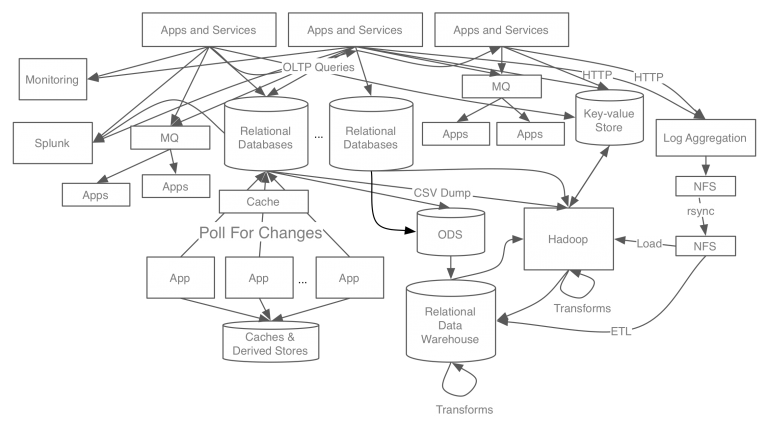
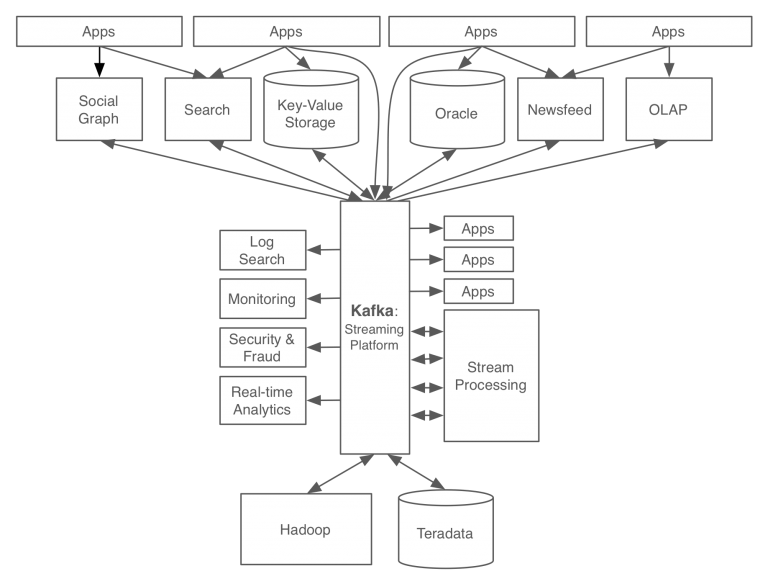
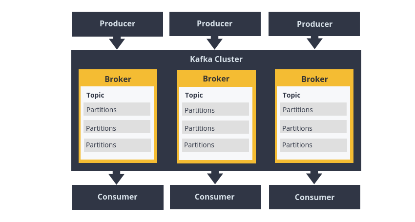
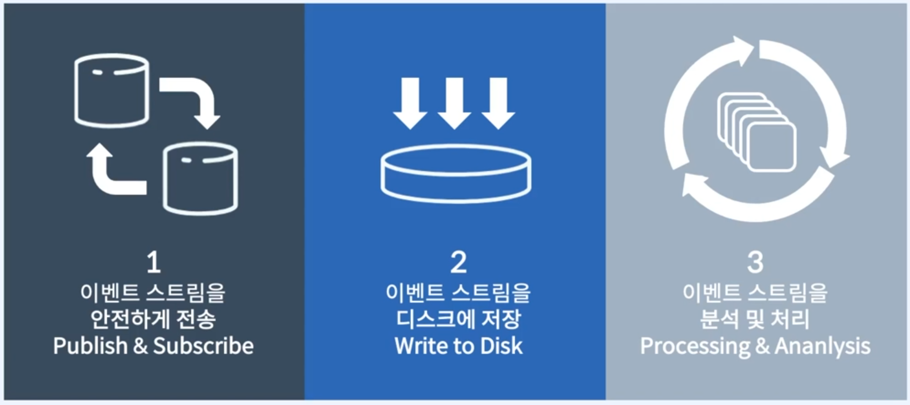

# Kafka

## Kafka란?

- Data in Motion Platform & Event Streaming Platform
  - 움직이는 데이터를 처리하는 플랫폼
- 2011년 링크드인에서 개발된 빠르고 확장 가능한 작업을 위해 데이터 피드의 분산 스트리밍, 파이프 라이닝 및 재생을 위한 실시간 스트리밍 데이터를 처리하기 위한 목적으로 설계된 오픈 소스 분산형 게시/구독 메시징 플랫폼

### Kafka의 개발배경

**카프카 개발 전 링크드인의 데이터 처리 시스템**

- 기존 링크드인의 데이터 처리 시스템은 각 파이프라인이 파편화되고 시스템 복잡도가 높아 새로운 시스템을 확장하기 어려움
- 기존엔 메시징 큐 시스템인 ActiveMQ를 사용했지만, 링크드인의 수많은 트래픽과 데이터를 처리하기에는 한계가 존재
- 이로 인해 새로운 시스템의 개발 필요성이 높아졌고, 링크드인의 몇몇 개발자가 다음과 같은 목표를 가지고 새로운 시스템을 개발
  - 프로듀서와 컨슈머의 분리
  - 메시징 시스템과 같이 영구 메시지 데이터를 여러 컨슈머에게 허용
  - 높은 데이터 처리량을 위한 메시지 최적화
  - 데이터가 증가함에 따라 스케일아웃이 가능한 시스템

**카프카 개발 후 링크드인의 데이터 처리 시스템**

- 카프카를 적용함으로써 모든 이벤트/데이터의 흐름을 중앙에서 관리할 수 있게 됨
- 서비스 아키텍처가 기존에 비해 관리하기 심플해짐

> |Rabbitmq|Kafka|
> |---|---|
> | | |

### Kafka의 특징

- 고성능, 고가용성, 확장성
- 분산 처리 시스템으로서, 확장성 및 고가용성이 높고 노드장애에 대한 대응성이 높음
- 배치 처리가 가능해 네트워크 왕복 오버헤드를 줄임
- 디스크 파일 시스템에 데이터를 저장하여 영속성을 보장(오류 시 복구 가능)
- Producer 중심적이며, 메시지 전달 보장이 Optional
  - 메시지 전달 보장을 할 경우 처리속도가 느려져서 카프카의 처리속도 측면의 장점이 상쇄
- 라우팅 기능이 없음 (Producer가 직접 적절한 topic과 partition으로 보내줘야 함)
- 100k+/sec 처리 보장

> MQ와의 자별점
> - Kafka는 Pub/Sub 방식, MQ는 메시지 브로커 방식
> - Kafka는 전달된 메시지가 비휘발성, MQsms gnlqkftjd
> - Kafka는 방대한 양의 데이터 처리할때 장점이 부각되며, MQ는 관리적인 측면이나 다양한 기능 구현을 위한 서비스를 구축할 때 장점 부각

### Kafka의 3대 주요 특징

> 이벤트 스트림을 디스크에 저장하는 기능이 가장 큰 차별화된 특징이다

