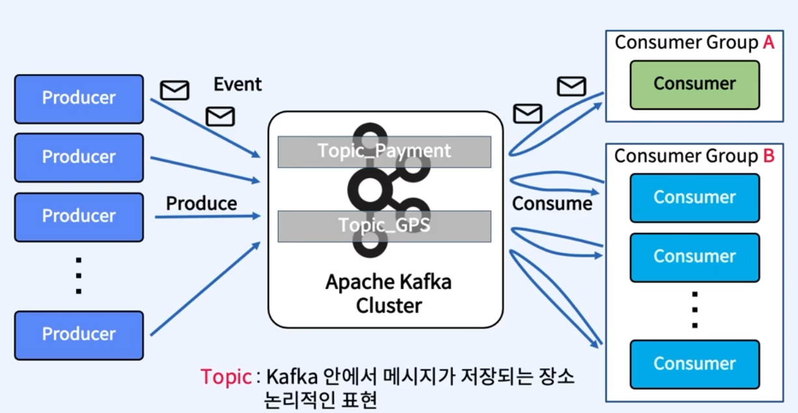

# Kafka 기초

- Kafka의 주요 요소

## Apache Kafka Clients

- Producer : 메시지를 생산해서 Kafka의 Topic으로 메시지를 보내는 애플리케이션
- Consumer : Topic의 메시지를 가져와서 소비하는 애플리케이션
- Consumer Group : Topic의 메시지를 사용하기 위해 협력하는 Consumer들의 집합
  - 하나의 Consumer는 하나의 Consumer Group에 포함되며, Consumer Group 내의 Consumer들은 협력하여 Topic의 메시지를 분산 병렬 처리한다

### Producer와 Consumer의 분리 (Decoupling)

**Producer와 Consumer의 기본 동작 방식**

- Producer와 Consumer는 서로 알지 못하며, Producer와 Consumer는 각각 고유의 속도로 Commit Log에 Write 및 Read를 수행

## 