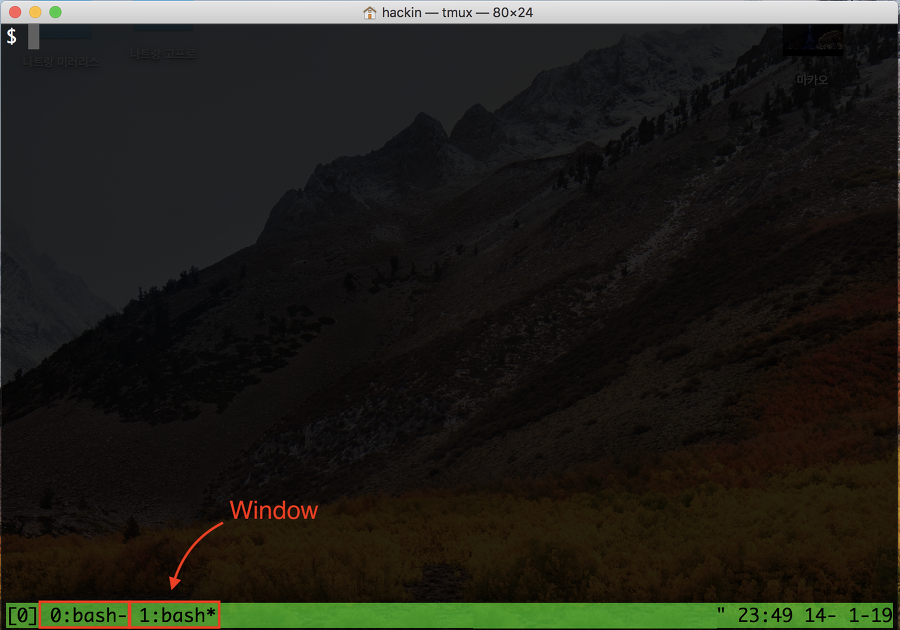
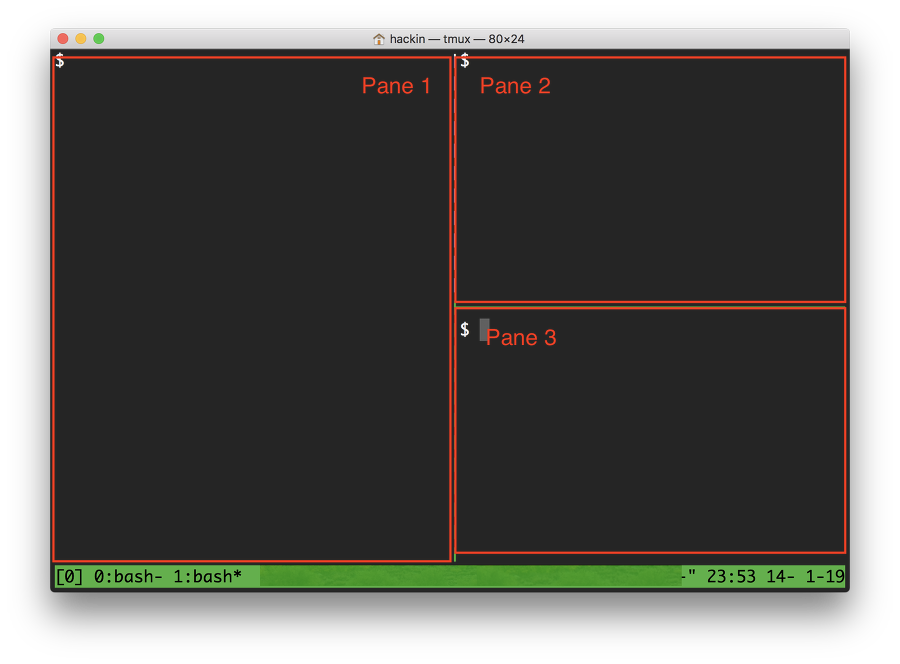

## tmux

tmux는 리눅스에서 하나의 창이 아닌 여러 창을 함께 사용할 때 유용한다. 리눅스 원격 연결이 꺼져도 서버가 꺼지지 않는 이상 tmux로 돌려놓은 코드는 다운되지 않는다.

### tmux 구성요소

- session : tmux가 관리하는 가장 큰 실행 단위. tmux는 세션에 attach/detach 할 수 있다. tmux가 detach한 세션은 종료되지 않고 백그라운드에서 실행을 계속 할 수 있다. 세션은 여러 윈도우로 구성된다.

- window : 사용자가 보는 터미널 화면, 세션에서 여러 개의 윈도우가 탭처럼 존재한다. 세션에서 윈도우를 전환하면 새로운 윈도우로 화면이 전환된다.

  

- pane : 하나의 윈도우를 분할한 단위. 윈도우 하나를 여러번 분할해서 여러개의 팬을 갖게 할 수 있다. 가로 혹은 세로로 화면을 분할해가면서 팬을 생성한다. 윈도우를 전환하면 팬 구성도 새로운 윈도우의 구성으로 전환된다.

  

### 세션 관련 명령어

**세션 생성**
- `tmux`

**이름을 지정하여 새션 셍성**
- `tmux new -s <session_name>`
- `tmux new-session -s <session_name>`

**세션 이름 수정**
- `[Ctrl] + b, $`

**세션 detach**
- `[Ctrl] + b, d`

**세션 리스트 확인**
- tmux attach -t <session number 혹은 session name>`

**세션 종료, 세션의 마지막 윈도우, 마지막 팬에서 실행**
- `exit`

**세션 종료, 세션 밖에서 실행**

- `tmux kill-session -t session_name`

**윈도우 관련 tmux 명령어**

**세션 생성과 함께 윈도우 생성**

- $ tmux new -s <session-name> -n <window-name>

**윈도우 이름 변경**

- [Ctrl] + b, ,

**윈도우 종료**

- [Ctrl] + b, &
- [Ctrl] + d

**다음 윈도우(Next Window)로 이동**

- [Ctrl] + b, n

**이전 윈도우(Previous Window)로 이동**

- [Ctrl] + b, p

**마지막 윈도우(Last Window)로 이동**

- [Ctrl] + b, l

**특정 윈도우로 이동 (몇 번째 윈도우인지)**

- [Ctrl] + b, 0-9

**특정 윈도우로 이동 (이름으로 이동)**

- [Ctrl] + b, f

**윈도우 리스트 보기**

- [Ctrl] + b, w

### pane관련 명령어

**윈도우 생성**

- [Ctrl] + b, c

**세로 화면 분할**

- [Ctrl] + b, %

**가로 화면 분할**

- [Ctrl] + b, "

**팬 이동 - 화면에 나오는 숫자로 이동**

- [Ctrl] + b, q

**팬 이동 - 순서대로 이동**

- [Ctrl] + b, o

**팬 이동 - 방향키로 이동**

- [Ctrl] + b, <방향키>

**팬 삭제**

- [Ctrl] + d
- [Ctrl] + b, x

**팬 사이즈 조절 - 현재 포커스된 팬 전체화면(한번 더 실행하면 윈상복구)**

- [Ctrl] + b, z

**팬 사이즈 조절 [Ctrl] + b 를 누른 후 :**

- [Ctrl] + b, :
- resize-pane -L <Size> or -R <Size> or -U <Size> -D <Size>

**팬 레이아웃 변경 (다양한 레이아웃으로 자동 전환)**

- [Ctrl] + b, spacebar

