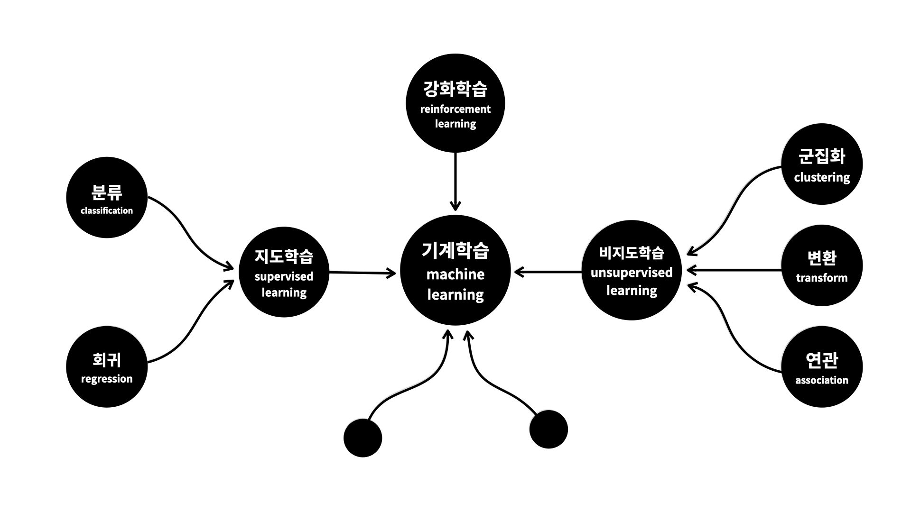
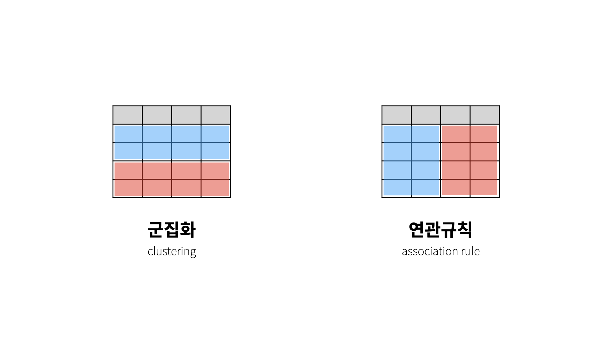

## 머신러닝

컴퓨터를 인간처럼 학습시킴으로써 인간의 도움 없이 커퓨터가 스스로 새로운 규칙을 생성할 수 있게 하는 작업.

- 인공지능 > 머신러닝 > 딥러닝

머신러닝은 인공지능의 한 분야로 컴퓨터가 학습할 수 있도록 알고리즘과 기술을 개발하는 분야를 말한다. 가령 기계학습을 통해 수신한 이메일이 스팸인지 아닌지룰 구분할 수 있도록 훈련할 수 있다.

기계학습의 핵심은 표현과 일반화에 있다. 표현이란 데이터의 평가이며, 일반화란 아직은 알 수 없는 데이터에 대한 처리이다. 이는 전산 학습 이론 분야이기도 하다. 다양한 기계 학습의 응용이 존재한다. 문자 인식은 이를 이용한 가장 잘 알려진 사례다.

기계가 일일이 코드로 명시하지 않은 동작을 데이터로부터 학습하여 실행할 수 있도록 하는 알고리즘을 개발하는 연구 분야이며, 어떤 작업에 대해 꾸준한 경험을 통해 작업에 대한 성능을 높이는 것이 주요 이슈다

## 머신러닝의 분류

### 지도학습

결과를 모르는 원인이 발생했을 때 원인을 파악하는 것이 목적이며, 원인인 독립변수와 결과인 종속변수가 꼭 필요하다. (역사적 성격)

- 회귀 : 가지고 있는 데이터에 **독립변수**와 **종속변수**가 있고 **종속변수**가 **숫자**인 경우 사용

- 분류 : 가지고 있는 데이터에 **독립변수**와 **종속변수**가 있고 **종속변수**가 **이름**인 경우 사용

### 비지도학습

데이터들의 성격을 파악하는 것이 목적이며, 독립변수와 종속변수의 구분이 중요하지 않다. (탐험적)

- 군집화 : 비슷한 관측지(행)을 그룹핑하는 것 (ex 비슷한 것들끼리 모아서 적당한 그룹을 만드는 일)
- 연관 : 비슷한 특성(열)을 그루핑해주는 것 (ex 데이터 간의 연관성을 찾는 일)
- 변환 : 데이터를 새롭게 표현해서 분석가 또는 다른 머신러닝 알고리즘이 원본 데이터에 비해 쉽게 데이터를 해석할 수 있도록 만드는 과정 (ex 차원 축소)

### 강화학습

지도학습은 배움으로부터 실력을 키우는 것이라면 강화학습은 경혐을 통해서 실력을 키워나가는 것이 목적. (ex 점수를 높이는 일)

