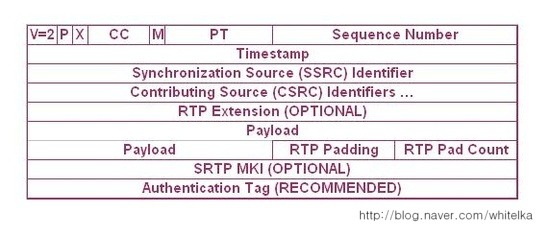

## SRTP

- Secure RTP
- RTP에 보안이 더해진 통신이다.
- TCP를 보완해주는 TLS를 본딴 DTLS로 암호화방식을 교환하고 교환된 방식으로 소통한다.

## 암호화 방식

- SRTP는 실시간 데이터를 암호화 또는 복호화하기 위해 기본적으로 AES 암호화 방식을 이용한다.

## 특징

- SRTP는 높은 처리량과 낮은 패킷 확장성을 가지며, 다양한 환경에서의 안정적인 보안을 보장한다.

## 목적과 기능

- RTP와 RTCP의 기밀 유지 및 데이터 무결성 유지
- 적은 전산량
- 적은 대역폭  (RTP Header를 효율적으로 압축하기 때문에)

## 구조

Payload 항목까지는 RTP와 동일하며, SRTP MKI, Authentication Tag 항목이 추가되었다.

이 때 Payload는 물론 암호화 되어 있어서, Payload길이의 계산 방식은 RTP 패킷과 다르다. Payload 고정 사이즈와 블럭 알고리즘 크기의 최소 공배수가 Paylod길이가 된다.

- `MKI` : SDP에 설정된 마스터 키가 다수일 경우 사용되는 마스터 인덱스로 옵션 항목이다. SDP의 a 필드에 이 항목 유무가 명시된다. 있을 경우 1:ㅡㅏㅑ길이 없을경우 필드에 내용이 없다.
- `Authentication Tag` : SRTP 패킷을 인증하는 헤더. (무결성) 역시 SDP의 a 항목에 이 내용이 표시된다. 인증 알고리즘이 없거나, 있어도 세션 파라미터에 UNAUTHENTICATED_SRTP 태그가 존재하는 경우에는 Authensication tag가 없다.

`Authentication Tag` 는 SRTP의 무결성을 보장하기 위해 사용되며, SRTP의ㅣ 헤더부터 암호화된 페이로드까지의 무결성을 체크하게 된다. 이 때는 인증키 및 인증 알고리즘 (해시알고리즘)이 사용된다.