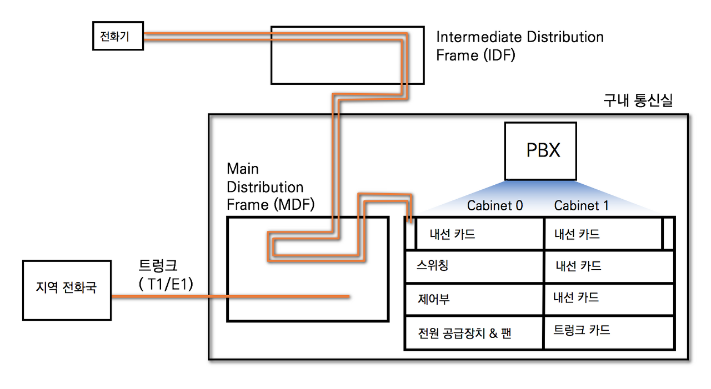
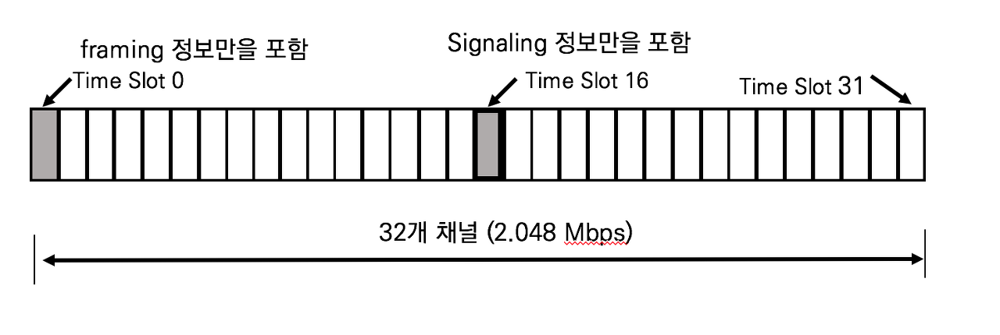
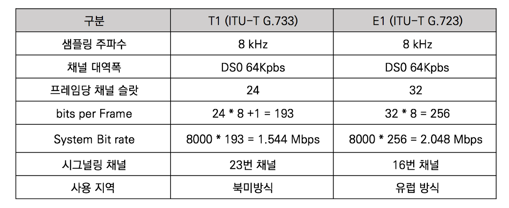

## 전화망의 이해

- IDF : Intermediate Distribution Frame. 

- MDF : Main Distribution Frame

- PSTN : Public Switched Telephone Network. 대형 회로 스위치로 가정과 기업의 전화기를 연결하는 거대한 전화 네트워크

- CO : Central Office. 가입자 선 교환기
- PBX : Private Branch Exchange

### PBX

일반적으로 전화 교환기를 의미하며 크게 4가지로 나눌 수 있다.

- 내선 카드 : 가입자 회선을 수용하는 역할을 하므로, 전화선이 직접 연결되는 카드.
- 국선 카드 : PBX와 PBX를 연결하거나 전화국과의 연결. '9'번을 누르고 사내번호를 다이얼링할 때 바로 '9'번이 트렁크 카드에 있는 각 포트를 선택하게 됨
- 스위칭 & 제어부 : PBX의 핵심기능으로 전화기와 전화기를 연결한다. 보통 내선전화는 3자리 또는 4자리를 사용하므로 4자리만 누르면 스위칭 기능을 통해 전화가 연결된다. PBX를 벗어나 외부와 통신할 때는 사용자가 '9'번을 누르면자동으로 트렁크 카드의 특정 포트로 호를 보낸다.

### 트렁크 (Trunk)

PBX는 외부와의 통신을 위해 트렁크 카드로 전화국과 연결된다.

PBX와 PBX간의 연결 또는 PBX와 전화국과의 연결을 트렁크 연동이라 한다. 가장 많이 사용하는 공통 선을 E1 트렁크라고 한다. 우리나라는 E1트렁크가 표준으로 자리잡고 있다. (유럽은 E1, 북미는 T1을 사용한다)

E1은 32개의 채널로 이루어져 있으며 세부 채널 정보는 다음과 같다

- Time slot 0 : Framing 정보

  프레임의 시작 및 동기 신호를 교환한다.

- Time slot 16 : Signaling 정보

  전화번호나 상태 정보를 교환하기 위한 시그널링 정보를 교환한다.

- Time slot 1-15, 17-31 : Media (음성)교환

### E.164 주소체계

모든 전화국이 체계적으로 연결되기 위해 규정된 주소체계. (계층구조로 되어있다)

국제 통신에 사용하는 번호의 최대 자릿수를 12자리로 규정한 E.163권고안에 추가적인 주소 공간을 확보하기 위해서 국제 통신에 사용되는 번호를 최대 16자리로 확장.

- CC : Country Code. 국가코드. 2자리
- AN : Area Number. 지역번호. 2자리 or 3자리
- LN : Local Number. 국번호. 3자리 or 4자리
- SN : Subscriber Number. 가입자 번호. 4자리

ex) 전화를 걸 때 사무실에서는 4자리의 SN넘버로만 통화하고 같은 지역에서는 LN+SN으로 통화한다. 시외로 전화를 걸 때는 AN+LN+SN번호를 사용하고, 국제전화의 경우에는 CC번호를 사용한다. (계층구조)