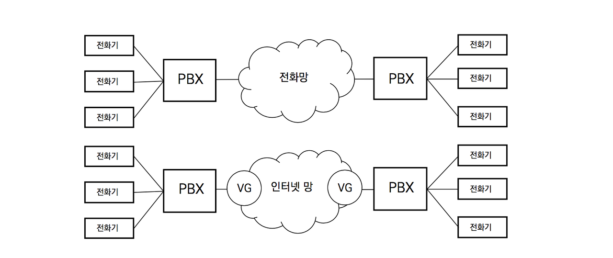

## VoIP

인터넷 IP를 이용한 음성 연결을 의미

VoIP는 본사와 지사 간 통화를 이넡넷 또는 전용 IKP망을 이용한다.

기업에 설치된 전화기와 PBX는 그대로 두고 중계망을 전화망이 아닌 인터넷망을 사용하도록 하기 위한 시스템인 음성 게이트웨이(VG, Voice Gateway)다.

### Voice Gateway

- 이기종 망을 연동하는 당비로써 이더넨 인터페이스와 PSTN 인터페이스를 가지고 있다.

- 음성 / 영상 <--> 패킷 변환장치인 DSP (Digital Signal Processor)를 가지고 있다.
- DSP칩을 집적한 모듈을 PVDM (Packet Voice DSP Modules)이라 부르며 메모리 카드와 비슷하다. PVDM은 다자간 은성 회의 시스템 (MCU, Multipoint Control Unit)등에 다량으로 사용된다

