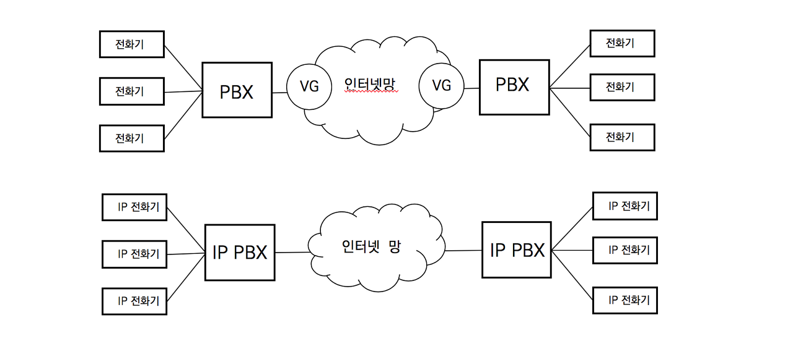
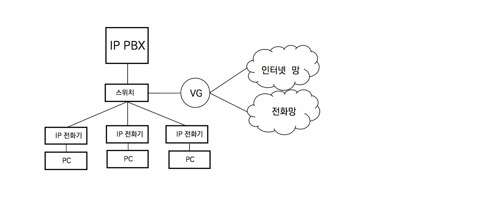

## IP Telephony

IP Telephony는 초창기 VoIP서비스는 통화 실패나 낮은 통화품질의 단점을 보완한다.

**IP Telephony 시스템의 구조**

**IP Telephony의 주요 장비**

- IP Phone : 아날로그 전화기의 역할
- In-line Power Switch : IP전화기를 수용하고, 전화기에 전원을 공급
- IP PBX : PBX의 기능 중 호처리 기능을 수용하는 소프트웨어로 서버에서 구동
- Voice Gateway : 전화망과 연결

