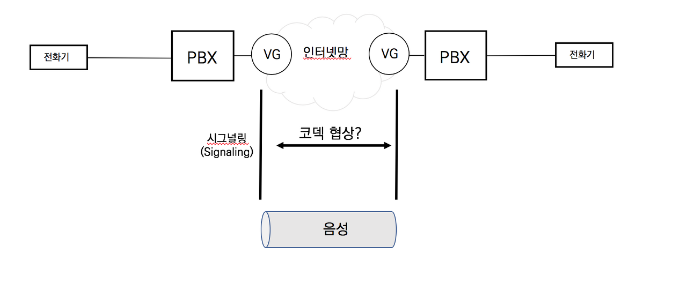
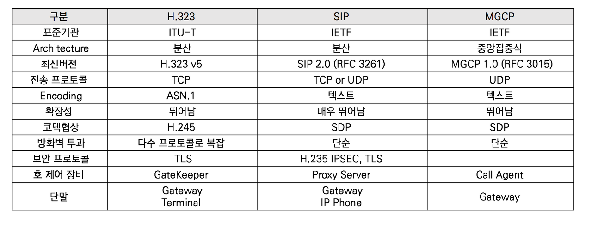

## 시그널링

- 호의 접속과 해제 또는 호의 제어 및 관리에 관련된 정보의 교환하는 과정

인터넷과 IP망에서 사용되는 시그널링은 3가지의 역할을 한다.

- 주소 번역

  - 32비트 IP주소 <--> E.164주소
  - ex) 10.10.10.1 <--> 02-1234-5678

- 코덱 협상

  - 실제 전달할 음성을 어떤 방식으로 압축해서 보낼지 결정
  - G.711, G.729, G.723, G.722등의 코덱 중 적당한 코덱 선택
  - 기존의 PSTN전화망은 회선교환이므로 64Kbps가 확보되어 G.711코덱만을 사용하지만, IP네트워크는 패킷교환이므로 네트워크의 대역폭의 상황에 따라 적절한 코덱을 사용한다.

- 정책 결정

  - 허가받은 사용자 혹은 상대방이 전화를 받을 수 있는 권한이 있는지 등에 대한 정책을 결정

  

**IP망에서 시그널링이 완료된 후에 실제 음성을 전달하기 위한 프로토콜은 RTP이다.**

### SIP와 H.323

H.323은 급하게 표준화되면서 많은 문제점이 있었다

- 대규모 사용자 지원의 어려움
- 대형 VoIP 네트워크 구성의 한계점
- 기존의 아날로그 PBX가 지원하던 전화 부가기능의 지원 미흡
- 복잡한 프로토콜 구조

H.323의 문제점을 극복하기 위해 SIP를 급하게 표준화했다. SIP는 확장성, 유연성, 그리고 단순한 시그널링을 강조했다. 초반에는 SIP도 문제가 많았지만 RFC 3261이 표준화되며 안정화되었다.

### MGCP와 Megaco

MGCP와 Megaco는 Master/Slave구조로 Peer to Peer방식의 H.323이나 SIP와는 근본적으로 다른 시그널링 프로토콜이다.

- Master/Slave 구조

  Slave인 게이트웨이 및 단말은 단순 기능만을 수행하고, 호 제어 및 호 라우팅과 같은 지적인 기능은 중앙의 Master가 수행. 중앙의 호제어 장비를 MGC(Media Gateway Contoller) 혹은 DSP칩과 PSTN과 IP망의 연동 인터페이스만을 가지는 더미가 되며 음성 게이트웨이나 단말은 단족으로 호 라우팅을 수행할 수 없다. 대표적인 프로토콜은 MGCP, Megaco /H.248이다.

- Peer to Peer 구조

  게이트웨이 및 단말이 호 제어 및 호 라우팅과 같은 지능적인 기능을 수행. 대표적인 프로토콜은 H.323 / SIP이며 중앙에서 호 제어 및 호 라우팅을 수행할 수 있는 SIP Proxy Server나 H.323 Gatekeeper는 필수 장비가 아닌 옵션 장비이다. (일반적으로는 관리적인 이유로 필수 장비처럼 사용한다.)

