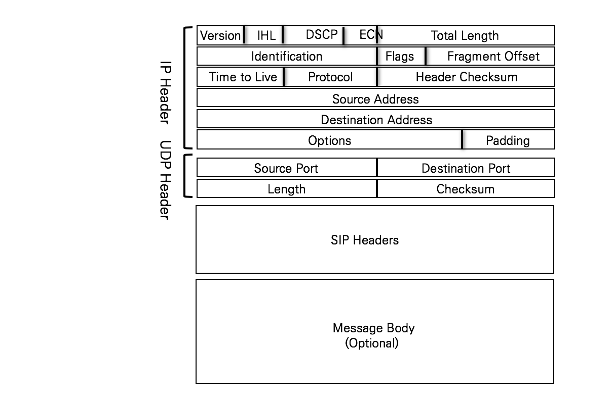
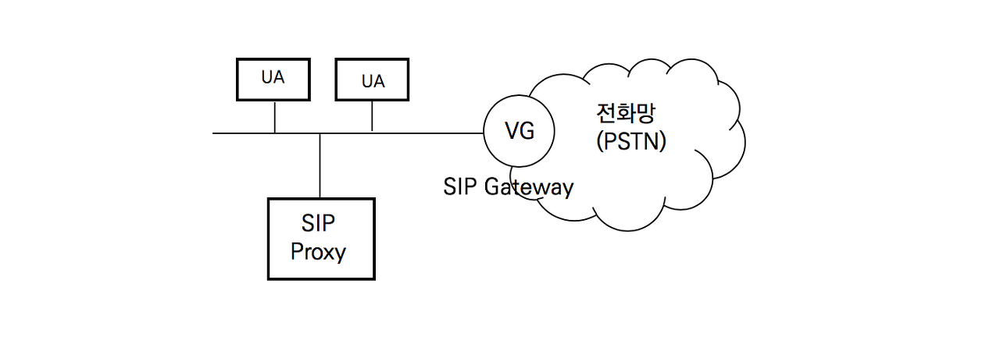

## SIP의 시작

SIP프로토콜은 2000년대 초반에 H.323.의 단점을 극복하기 위해 만들어졌다. 2020년 현재 SIP는 가장 인기있는 VoIP프로토콜이며, 모든 장비 제조사들이 SIP를 기본으로 제품을 생산한다.

SIP에서의 세션은 다음과 같다.

- 다자간 회의
- 음성 전화
- 영상 전화
- 이벤트 신청 및 통지
- 상태 정보 배포

## SIP 패킷 구조

SIP 메시지는 가변 길이의 텍스트로 만들어지며 SIP헤더와 메시지 바디로 구성된다.

SIP헤더는 편지의 봉투와 같은 내용을 담고 있으며 뒤에 올 바디의 종류를 표시한다. 메시지 바디는 옵션 필드로 있을 수도 있고 없을 수도 있다.

SIP가 사용하는 전송 프로토콜은 TCP또는 UDP이며, 보통은 UDP를 주로 사용하지만 현재는 TCP를 더 많이 사용한다. SIP는 5060과 5061 포트를 이용한다

## SIP 주요 컴포넌트

SIP 프로토콜이 멀티미디어 통신을 위한 호를 생성 및 종료하기 위해서는 다음의 5가지 기능이 필요하다

- 사용자 위치 : 통신에 참가할 단말을 결정
- 사용자 이용 가능성 : 통신에 참여할 착신 측의 통화 여부를 결정
- 사용자 능력 : 통신간에 사용될 미디어 및 미디어 파라미터를 결정
- 세션 설정 : 착신 측 및 송신 측에 세션 파라미터 생성
- 세션 관리 : 세션의 종료 및 전환, 세션 파라미터 변경, 부가 서비스 연동

**RFC 3261에 정의된 SIP 주요 컴포넌트**

- UA (User Agent)

> UA는 UAC(UA Client)와 UAS(UA Server)의 기능을 수행하는 단말이다.
>
> UAC는 세션을 시작하는 역할로 통화를 시도하는 기능이다
>
> UAS는 세션을 종단하는 역할로 통화를 받는 기능이다
>
> UA는 다른 UA와 직접 연결을 설정하거나 Proxy/Redirect Server의 도움으로 다른 UA와 연결을 설정할 수 있다. UA는 간단히 말해 SIP전화기이거나 SIP소프트 폰이다

- SIP Gateway

> Gateway는 관문이라는 뜻으로 서로 다른 이기종망을 연결하는 장비이다. SIP Gateway는 PSTN전화망과 IP네트워크를 서로 연결해주는 역할을 한다.

